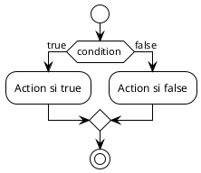

# Markdown guidelines

## General formatting

- Always separate headings, paragraphs, and lists with a blank line.
- When using apostrophes, always use typings apostrophes (`'`, `"`) instead of
  typographic apostrophes (`’`, `“`, `”`).
- Wrap long paragraphs to a maximum of 80 characters per line for better
  readability in plain text editors. Reformat as needed when editing.
- Never use emojis in the text.
- When referencing files, folders, or documents in the repository, always use
  relative paths/links.
- Avoid highlighting text using bold or italics.
- When using colon (`:`) in sentences, start with a lowercase letter unless it
  is a quote or a proper noun (e.g. _Note: this is an example._ instead of
  _Note: This is an example._, _I said : "This is an example."_ instead of _"I
  said: "this is an example."_).

### Headings

- Do not use title case for headings; use sentence case instead (e.g., _"General
  guidelines"_ instead of _"General Guidelines"_).

### Lists

- Always use a period at the end of each list item, except for tables of
  contents where the items are links to sections in the same document.
- Use consistent indentation (2 spaces) for nested lists.

### Code blocks

- Use code blocks (triple backticks ` ``` `) for code examples, specifying the
  language for syntax highlighting (e.g., `java`).

### Tables

- Always ensure proper alignment of columns using colons (`:`) for left, right,
  or center alignment. When using numbers in tables, align them to the right for
  better readability.

## Admonitions in course materials

Course materials (README.md files in {COURSE_CONTENTS_FOLDER}) can use
GitHub-flavored admonitions to highlight important information. These are
rendered as colored boxes on GitHub.

**Available admonition types:**

```markdown
> [!NOTE]
>
> Highlights information that users should take into account, even when
> skimming.

> [!TIP]
>
> Optional information to help a user be more successful.

> [!IMPORTANT]
>
> Crucial information necessary for users to succeed.

> [!WARNING]
>
> Critical content demanding immediate user attention due to potential risks.

> [!CAUTION]
>
> Negative potential consequences of an action.
```

- Use sparingly - too many admonitions reduce their impact
- Place them strategically near relevant content
- Keep the text inside concise and action-oriented
- Use NOTE for general information students should remember
- Use TIP for optional enhancements or shortcuts
- Use IMPORTANT for critical concepts required for success
- Use WARNING for common mistakes or misunderstandings
- Use CAUTION for dangerous operations or irreversible actions

## Accessibility guidelines

All course materials must be accessible to all students, including those with
disabilities or using assistive technologies.

### Links and references

- Use descriptive link text that makes sense out of context (avoid "click here"
  or "here").
- When referencing files or code, provide context about what the link points to.

**Good:**

```markdown
Consultez le [guide de débogage](./debugging-guide.md) pour plus de détails.
```

**Bad:**

```markdown
Pour plus de détails, cliquez [ici](./debugging-guide.md).
```

### Code examples

- Provide explanatory text before and after code blocks.
- Use comments within code to explain complex sections.
- Ensure code examples can be understood without relying on syntax highlighting.

### Code block descriptions in course materials

In course materials (README.md files in course content folders), always follow
each Java code block with a description in French explaining what the code does,
wrapped in HTML `<details>` tags for accessibility.

This helps students who use screen readers or who need additional context to
understand the code.

**Format:**

````markdown
```java
// Code example
```

<details>
<summary>Description du code</summary>

Description littérale et technique des constructions syntaxiques : déclarations,
initialisations, opérateurs, structures de contrôle, appels de méthode, etc.

</details>
````

**Example:**

````markdown
```java
boolean isReady = true;
boolean isFinished = false;
```

<details>
<summary>Description du code</summary>

Déclaration et initialisation d'une variable de type booléen `isReady` à `true`.

Déclaration et initialisation d'une variable de type booléen `isFinished` à
`false`.

</details>
````

**Guidelines:**

- **Be literal and technical:** Describe the syntactic constructions
  (declarations, initializations, operators, control structures, method calls,
  etc.), NOT the semantic meaning or business purpose.
- Use precise professional vocabulary in French: "déclaration",
  "initialisation", "affectation", "comparaison", "conjonction", "négation",
  "appel de méthode", "structure conditionnelle", etc.
- **Example of what to do:** "Déclaration et initialisation d'une variable de
  type `int` nommée `batteryLevel` avec la valeur `15`. Structure conditionnelle
  `if` avec une expression booléenne : comparaison (opérateur `<`) entre la
  variable `batteryLevel` et la valeur `20`."
- **Example of what NOT to do:** "Vérifie si la batterie est faible et affiche
  un message." (This is semantic/business explanation, not literal description)
- Reference variable names, method names, operators, and values using backticks.
- For longer code blocks, group related lines by syntactic function.
- Keep descriptions concise but technically complete.

### PlantUML diagrams for control structures

For code examples containing control structures (conditional statements like
`if`, `if-else`, `switch` or iterative statements like `for`, `while`,
`do-while`), always create a corresponding PlantUML activity diagram and include
it at the end of the code description.

**Process:**

1. Create a `.puml` file in the `images/` subfolder with a descriptive name
   (e.g., `condition-if-else-batterylow.puml`).
2. Generate the diagram using `./build-all-diagrams.sh` script.
3. Add the diagram reference at the end of the `<details>` section using:
   ``.

**PlantUML structure for control flow diagrams:**



**Important rules:**

- Always use `!theme plain` for consistent styling.
- Use French for action labels: "Afficher", "Déclarer", "Calculer", etc.
- Use `true` and `false` (not "oui"/"non") for condition branches.
- Keep diagrams simple and focused on the control flow.
- Use descriptive file names that reflect the code example.

### Code examples organization

When creating code examples for course content in the `01-exemples-de-code/`
folder, follow this structure:

**Directory naming convention:**

- `0*-titre/` : correct code examples showing best practices (simple to
  complex).
- `1*-a-eviter-titre/` : incorrect code examples showing common mistakes.

**Important rules:**

- Start with good practice examples numbered `01-`, `02-`, `03-`, etc. in
  increasing complexity.
- Add counter-examples numbered `11-a-eviter-`, `12-a-eviter-`, etc. to show
  what to avoid.
- Each directory must contain:
  - `README.md` explaining the example/error.
  - `Example.java` (for 0*) or `ErrorExample.java` (for 1*-a-eviter).

**Example structure:**

```
01-exemples-de-code/
├── README.md
├── 01-exemple-basic/
│   ├── README.md
│   └── Example.java
├── 02-exemple-intermediaire/
│   ├── README.md
│   └── Example.java
├── 11-a-eviter-erreur-courante/
│   ├── README.md
│   └── ErrorExample.java
└── 12-a-eviter-autre-erreur/
    ├── README.md
    └── ErrorExample.java
```

**Template files:**

- Use templates from
  `/workspace/03-autres-ressources/01-templates/contenu-du-cours/01-exemples-de-code/`
  for consistency.
