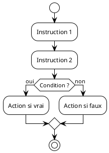

# PlantUML guidelines

- Always use the `.puml` file extension for PlantUML files.

## Technical specifications

- Location: store in `images/` subfolder of course content directories.
- Rendering: render using local server at <http://localhost:9090>.
- Build process: generate diagrams manually using `./generate-diagrams.sh`
  script.

## File organization

Each course module with diagrams should follow this structure:

```
XX-topic-name/
├── README.md
├── PRESENTATION.md
├── QUIZ.md
└── images/
   ├── illustration.jpg
   ├── diagram-name.puml
   └── diagram-name.png
```

## Diagram creation process

1. Create the `.puml` source file in the `images/` directory.
2. Run the build script to generate PNG images: `./generate-diagrams.sh`.
3. Reference the generated PNG in [README.md](README.md) and
   [PRESENTATION.md](PRESENTATION.md).
4. Commit both the `.puml` source and the generated `.png` file.

## PlantUML best practices

- Keep diagrams simple: focus on pedagogical clarity over technical
  completeness.
- Use French labels: all text in diagrams should be in French to match course
  language.
- Consistent styling: follow the visual style established in existing diagrams.
- Clear naming: use descriptive file names that reflect the diagram content
  (e.g., `iteration.puml`, `sequence.puml`, `compilation.puml`).

## Common diagram types

For this programming course, commonly used PlantUML diagram types include:

- Activity diagrams: for illustrating algorithms and control flow.
- Sequence diagrams: for showing interactions and execution order.
- Component diagrams: for explaining program structure and modules.
- State diagrams: for demonstrating state transitions.

## Example PlantUML structure



Key elements:

- Always use `!theme plain` for consistent styling.
- Use French for all labels and conditions.
- Keep the diagram focused on the main concept.
- Use clear, concise labels.

## Integration with course materials

- Reference diagrams in [README.md](README.md) using:
  ``.
- Reference diagrams in [PRESENTATION.md](PRESENTATION.md) using the same
  syntax.
- Always provide alt text for accessibility.
- Ensure diagrams complement the textual explanations.

## Maintenance

- When updating a diagram, modify the `.puml` source file.
- Re-run the build script to regenerate the PNG.
- Commit both the updated source and the new PNG.
- Verify that all references to the diagram still work correctly.
