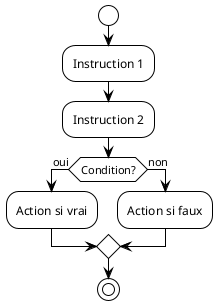

# PlantUML guidelines

- Always use the `.puml` file extension for PlantUML files.

## Technical Specifications

- Location: Store in `images/` subfolder of `01-supports-de-cours/`
- Rendering: Render using local server at http://localhost:9090
- Build Process: Generate diagrams manually using `./generate-diagrams.sh`
  script

## File Organization

Each course module with diagrams should follow this structure:

```
XX.XX-topic/
├── README.md
├── PRESENTATION.md
└── images/
   ├── home.jpg
   ├── diagram-name.puml
   └── diagram-name.png
```

## Diagram Creation Process

1. Create the `.puml` source file in the `images/` directory
2. Run the build script to generate PNG images:
   `./build-all-plantuml-diagram.sh`
3. Reference the generated PNG in README.md and PRESENTATION.md
4. Commit both the `.puml` source and the generated `.png` file

## PlantUML Best Practices

1. **Keep diagrams simple**: Focus on pedagogical clarity over technical
   completeness
2. **Use French labels**: All text in diagrams should be in French to match
   course language
3. **Consistent styling**: Follow the visual style established in existing
   diagrams
4. **Clear naming**: Use descriptive file names that reflect the diagram content
   - Example: `iteration.puml`, `sequence.puml`, `compilation.puml`

## Common Diagram Types

For this programming course, commonly used PlantUML diagram types include:

- **Activity diagrams**: For illustrating algorithms and control flow
- **Sequence diagrams**: For showing interactions and execution order
- **Component diagrams**: For explaining program structure and modules
- **State diagrams**: For demonstrating state transitions

## Example PlantUML Structure



## Integration with Course Materials

- Reference diagrams in README.md using:
  ``
- Reference diagrams in PRESENTATION.md using the same syntax
- Always provide alt text for accessibility
- Ensure diagrams complement the textual explanations

## Maintenance

- When updating a diagram, modify the `.puml` source file
- Re-run the build script to regenerate the PNG
- Commit both the updated source and the new PNG
- Verify that all references to the diagram still work correctly
