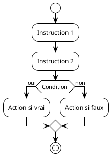

# PlantUML guidelines

- Always use the `.puml` file extension for PlantUML files.

## Technical specifications

- Location: store in `images/` subfolder of course content directories.
- Rendering: render using local server at <http://localhost:9090>.
- Build process: generate diagrams manually using `./build-all-diagrams.sh`
  script.

## File organization

Each course module with diagrams should follow this structure:

```
XX-topic-name/
├── PRESENTATION.md
├── QUIZ.md
├── README.md
└── images/
   ├── illustration.jpg
   ├── diagram-name.puml
   └── diagram-name.svg
```

PlantUML source files (`.puml`) are converted to SVG format for display in
course materials.

## PlantUML best practices

- Keep diagrams simple: focus on pedagogical clarity over technical
  completeness.
- Use French labels: all text in diagrams should be in French to match course
  language.
- Consistent styling: follow the visual style established in existing diagrams.
- Clear naming: use descriptive file names that reflect the diagram content
  (e.g., `iteration.puml`, `sequence.puml`, `compilation.puml`).

## Common diagram types

For this programming course, commonly used PlantUML diagram types include:

- Activity diagrams: for illustrating algorithms and control flow.
- Sequence diagrams: for showing interactions and execution order.
- Component diagrams: for explaining program structure and modules.
- State diagrams: for demonstrating state transitions.

## Standard PlantUML file format

All PlantUML files must follow this standard format for consistency:


```plantuml
@startuml filename
!theme plain

skinparam classAttributeIconSize 0
skinparam classFontStyle bold

' Diagram content in French
start
:Instruction 1;
:Instruction 2;
if (Condition ) then (oui)
  :Action si vrai;
else (non)
  :Action si faux;
endif
stop

@enduml
```

**Required header elements (in order):**

1. `@startuml filename` : Include the filename (without .puml extension) for
   proper diagram identification
2. `!theme plain` : Use plain theme for consistent styling across all diagrams
3. Empty line
4. `skinparam classAttributeIconSize 0` : Remove icons from class attributes for
   cleaner diagrams
5. `skinparam classFontStyle bold` : Make class names bold for better visibility
6. Empty line
7. Diagram content

**Key elements:**

- Always include the filename in `@startuml` directive
- Apply both skinparam settings for visual consistency
- Use French for all labels and conditions
- Keep the diagram focused on the main concept
- Use clear, concise labels

## Integration with course materials

- Reference diagrams in `README.md` using:
  ``.
- Reference diagrams in `PRESENTATION.md` using the same syntax.
- Always provide alt text for accessibility (use French descriptions).
- Ensure diagrams complement the textual explanations.
- The build script generates SVG files from `.puml` sources.

## Maintenance

- When updating a diagram, modify the `.puml` source file.
- Ensure the file header follows the standard format (see above).
- Re-run `./build-all-diagrams.sh` to regenerate the SVG.
- Commit both the updated source (`.puml`) and the new SVG file.
- Verify that all references to the diagram still work correctly.

## Creating new diagrams

When creating a new PlantUML diagram:

1. Create the `.puml` file in the `images/` subfolder with a descriptive name
2. Start with the standard header format (including filename in `@startuml`)
3. Add your diagram content in French
4. End with `@enduml`
5. Run `./build-all-diagrams.sh` to generate the SVG
6. Reference the SVG file in your markdown documents
