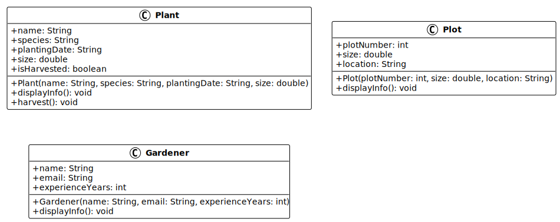

# Programmation orientée objet : Classes et objets - Mini-projet (partie 1)

Ce mini-projet est conçu pour vous permettre de mettre en pratique les concepts
théoriques vus dans le contenu
_["Programmation orientée objet : Classes et objets"](../)_.

## Table des matières

- [Programmation orientée objet : Classes et objets - Mini-projet (partie 1)](#programmation-orientée-objet--classes-et-objets---mini-projet-partie-1)
  - [Table des matières](#table-des-matières)
  - [Introduction au mini-projet fil rouge](#introduction-au-mini-projet-fil-rouge)
  - [Présentation du mini-projet](#présentation-du-mini-projet)
  - [Objectifs de cette session](#objectifs-de-cette-session)
  - [Structure du projet](#structure-du-projet)
  - [Création des classes](#création-des-classes)
    - [Étape 1 : créer la classe Plant](#étape-1--créer-la-classe-plant)
    - [Étape 2 : créer la classe Plot](#étape-2--créer-la-classe-plot)
    - [Étape 3 : créer la classe Gardener](#étape-3--créer-la-classe-gardener)
  - [Création de la classe principale](#création-de-la-classe-principale)
    - [Étape 4 : créer la classe GardenManagementSystem](#étape-4--créer-la-classe-gardenmanagementsystem)
    - [Étape 5 : ajouter la fonctionnalité de récolte](#étape-5--ajouter-la-fonctionnalité-de-récolte)
  - [Test du projet](#test-du-projet)
    - [Compilation et exécution en ligne de commande](#compilation-et-exécution-en-ligne-de-commande)
    - [Sortie attendue](#sortie-attendue)
  - [Diagramme de classes](#diagramme-de-classes)
  - [Solution](#solution)
  - [Conclusion](#conclusion)
  - [Aller plus loin](#aller-plus-loin)

## Introduction au mini-projet fil rouge

Bienvenue dans la première partie du mini-projet qui va vous accompagner durant
plusieurs séances du cours _"Programmation 2 (ProgIM2)"_ !

Ce mini-projet est conçu pour vous permettre de mettre en pratique les concepts
théoriques vus dans le cours
_["Programmation orientée objet : Classes et objets"](../)_. N'hésitez pas à
vous y référer si vous avez besoin de rafraîchir votre mémoire.

En lisant les contenus préparés pour les sessions de mini-projet, vous trouverez
peut-être ce que l'on appelle des _"avertissements"_ ou des _"alertes"_.

Elles se présentent comme suit :

> [!NOTE]
>
> Hé ! Je suis une note ! Merci de m'avoir lue !

Elles sont là pour mettre en évidence des informations importantes dont vous
devez tenir compte.

Voici les différents types de remontrances que vous pourriez trouver et leur
signification :

> [!NOTE]
>
> Met en évidence les informations que vous devriez prendre en compte.

> [!TIP]
>
> Informations facultatives pour vous aider à mieux réussir avec des conseils,
> des astuces, ou encore des suggestions.

> [!IMPORTANT]
>
> Informations cruciales nécessaires à la réussite des actions que vous devriez
> effectuer.

> [!WARNING]
>
> Contenu critique exigeant votre attention immédiate en raison des risques
> potentiels.

> [!CAUTION]
>
> Conséquences négatives potentielles d'une action que vous devriez éviter.

Nous pourrions vous rediriger vers de la documentation officielle ou des
ressources externes à suivre pour configurer votre environnement ou en savoir
plus sur un sujet spécifique.

Ces ressources externes sont là pour vous aider. Nous vous redirigeons vers
elles pour éviter de répéter ce qui est déjà bien maintenu et expliqué ailleurs.

Ce que vous voyez et faites dans une session actuelle peut être utilisé dans une
session future.

C'est pourquoi il est important de suivre les étapes et de comprendre ce que
vous faites. Vous devez conserver le code que vous écrivez pour les sessions
futures.

Cependant, si _quoi que ce soit_ n'est pas clair, ne fonctionne pas ou nécessite
une amélioration, n'hésitez pas à poser des questions ou nous le signaler.

L'équipe pédagogique considère qu'il n'y a pas de question bête : vous êtes ici
pour apprendre et nous sommes là pour vous aider ! Travaillons en équipe pour
que vous puissiez réussir !

C'est parti !

> [!TIP]
>
> Le [support de cours](../) est disponible pour vous aider à comprendre les
> concepts théoriques abordés dans ce mini-projet si besoin !

## Présentation du mini-projet

Le mini-projet est une application de gestion de jardin communautaire qui
permettra de gérer les plantes, les parcelles et les jardinières.

L'application permettra de :

- Gérer les plantes (nom, espèce, date de plantation, taille).
- Gérer les parcelles (numéro, taille, localisation).
- Gérer les jardinières (nom, email, années d'expérience).
- Afficher les informations de chaque entité.
- Créer des relations entre les jardinières, les parcelles et les plantes.

Au fil des prochaines séances, nous enrichirons progressivement cette
application :

- **Partie 1 (cette session)** : création des classes de base avec attributs et
  constructeurs.
- **Partie 2** : ajout de l'encapsulation et de l'héritage avec différents types
  de plantes.
- **Partie 3** : introduction du polymorphisme avec des interfaces.
- **Partie 4** : tri des plantes selon différents critères.
- **Partie 5** : utilisation des collections Java pour gérer les données.

Dans cette première partie, nous allons créer les classes de base du système en
utilisant les concepts de programmation orientée objet : classes, objets,
attributs et méthodes.

## Objectifs de cette session

À l'issue de cette session, les personnes qui étudient devraient avoir pu :

- Créer des classes Java avec des attributs.
- Définir des constructeurs pour initialiser les objets.
- Instancier des objets à partir de classes.
- Ajouter des méthodes pour afficher les informations des objets.
- Tester le fonctionnement des classes créées.

## Structure du projet

Pour ce mini-projet, nous allons créer la structure de répertoires suivante :

```text
04-programmation-orientee-objet-classes-et-objets/
└── 01-mini-projet/
    └── src/
        ├── Plant.java
        ├── Plot.java
        ├── Gardener.java
        └── GardenManagementSystem.java
```

> [!TIP]
>
> Vous pouvez créer ce projet dans votre environnement de développement
> habituel. Si vous utilisez IntelliJ IDEA ou VS Code, créez un nouveau projet
> Java et ajoutez-y les fichiers au fur et à mesure.

## Création des classes

Nous allons créer trois classes de base pour notre système de gestion de jardin
: `Plant`, `Plot` et `Gardener`.

> [!IMPORTANT]
>
> Pour cette première partie, nous utiliserons des attributs `public` pour
> simplifier le code. Dans la prochaine session sur l'encapsulation, nous
> verrons comment protéger ces données avec des modificateurs d'accès appropriés
> et des getters/setters.

### Étape 1 : créer la classe Plant

La classe `Plant` représente une plante dans le jardin. Elle contient les
attributs suivants :

- `name` : le nom de la plante (type `String`).
- `species` : l'espèce de la plante (type `String`).
- `plantingDate` : la date de plantation au format `yyyy-MM-dd` (type `String`).
- `size` : la taille de la plante en centimètres (type `double`).
- `isHarvested` : indique si la plante a été récoltée (type `boolean`).

Créez un fichier `Plant.java` dans le dossier `src/` et ajoutez le code suivant
:

```java
public class Plant {
    // Attributs publics (pour le moment)
    public String name;
    public String species;
    public String plantingDate;
    public double size;
    public boolean isHarvested;

    // Constructeur pour initialiser tous les attributs
    public Plant(String name, String species, String plantingDate, double size) {
        this.name = name;
        this.species = species;
        this.plantingDate = plantingDate;
        this.size = size;
        this.isHarvested = false; // Par défaut, la plante n'est pas récoltée
    }

    // Méthode pour afficher les informations de la plante
    public void displayInfo() {
        System.out.println("=== Informations de la plante ===");
        System.out.println("Nom: " + name);
        System.out.println("Espèce: " + species);
        System.out.println("Date de plantation: " + plantingDate);
        System.out.println("Taille: " + size + " cm");
        System.out.println("Récoltée: " + (isHarvested ? "Oui" : "Non"));
        System.out.println();
    }

    // Méthode pour récolter la plante
    public void harvest() {
        if (isHarvested) {
            System.out.println("La plante " + name + " a déjà été récoltée.");
        } else {
            isHarvested = true;
            System.out.println("La plante " + name + " a été récoltée avec succès !");
        }
    }
}
```

> [!NOTE]
>
> Le mot-clé `this` permet de différencier les attributs de la classe des
> paramètres du constructeur qui portent le même nom.

> [!TIP]
>
> Pour le moment, nous utilisons `String` pour représenter la date. Dans de
> futures sessions, nous verrons comment utiliser la classe `LocalDate` pour une
> meilleure gestion des dates.

### Étape 2 : créer la classe Plot

La classe `Plot` représente une parcelle dans le jardin communautaire. Elle
contient les attributs suivants :

- `plotNumber` : le numéro de la parcelle (type `int`).
- `size` : la taille de la parcelle en mètres carrés (type `double`).
- `location` : la localisation de la parcelle (type `String`).

Créez un fichier `Plot.java` dans le dossier `src/` et ajoutez le code suivant :

```java
public class Plot {
    // Attributs publics (pour le moment)
    public int plotNumber;
    public double size;
    public String location;

    // Constructeur pour initialiser tous les attributs
    public Plot(int plotNumber, double size, String location) {
        this.plotNumber = plotNumber;
        this.size = size;
        this.location = location;
    }

    // Méthode pour afficher les informations de la parcelle
    public void displayInfo() {
        System.out.println("=== Informations de la parcelle ===");
        System.out.println("Numéro: " + plotNumber);
        System.out.println("Taille: " + size + " m²");
        System.out.println("Localisation: " + location);
        System.out.println();
    }
}
```

> [!NOTE]
>
> Les attributs de différents types (`int`, `double`, `String`) montrent la
> diversité des données qu'une classe peut contenir.

### Étape 3 : créer la classe Gardener

La classe `Gardener` représente une jardinière qui cultive une parcelle. Elle
contient les attributs suivants :

- `name` : le nom de la jardinière (type `String`).
- `email` : l'adresse email de la jardinière (type `String`).
- `experienceYears` : le nombre d'années d'expérience (type `int`).

Créez un fichier `Gardener.java` dans le dossier `src/` et ajoutez le code
suivant :

```java
public class Gardener {
    // Attributs publics (pour le moment)
    public String name;
    public String email;
    public int experienceYears;

    // Constructeur pour initialiser tous les attributs
    public Gardener(String name, String email, int experienceYears) {
        this.name = name;
        this.email = email;
        this.experienceYears = experienceYears;
    }

    // Méthode pour afficher les informations de la jardinière
    public void displayInfo() {
        System.out.println("=== Informations de la jardinière ===");
        System.out.println("Nom: " + name);
        System.out.println("Email: " + email);
        System.out.println("Expérience: " + experienceYears + " ans");
        System.out.println();
    }
}
```

> [!TIP]
>
> Notez la structure similaire des trois classes : attributs, constructeur et
> méthode `displayInfo()`. C'est un patron courant en programmation orientée
> objet.

## Création de la classe principale

Maintenant que nous avons nos trois classes de base, créons une classe
principale pour tester leur fonctionnement.

### Étape 4 : créer la classe GardenManagementSystem

La classe `GardenManagementSystem` contient la méthode `main()` qui permet de
créer des objets et de tester leur fonctionnement.

Créez un fichier `GardenManagementSystem.java` dans le dossier `src/` et ajoutez
le code suivant :

```java
public class GardenManagementSystem {
    public static void main(String[] args) {
        System.out.println("=== Système de gestion de jardin communautaire ===");
        System.out.println();

        // Création de plantes
        Plant tomato = new Plant("Tomate cerise", "Solanum lycopersicum",
                                 "2025-04-15", 45.5);
        Plant carrot = new Plant("Carotte", "Daucus carota",
                                 "2025-03-20", 12.0);
        Plant basil = new Plant("Basilic", "Ocimum basilicum",
                                "2025-05-01", 25.3);

        // Création de parcelles
        Plot plot1 = new Plot(1, 10.5, "Zone Nord");
        Plot plot2 = new Plot(2, 15.0, "Zone Sud");

        // Création de jardinières
        Gardener alice = new Gardener("Alice Dupont", "alice.dupont@example.com", 3);
        Gardener bob = new Gardener("Bob Martin", "bob.martin@example.com", 5);

        // Affichage des informations
        System.out.println("--- Plantes du jardin ---");
        tomato.displayInfo();
        carrot.displayInfo();
        basil.displayInfo();

        System.out.println("--- Parcelles du jardin ---");
        plot1.displayInfo();
        plot2.displayInfo();

        System.out.println("--- jardinières du jardin ---");
        alice.displayInfo();
        bob.displayInfo();

        // Modification directe des attributs (possible car ils sont publics)
        System.out.println("--- Mise à jour de la taille de la tomate ---");
        tomato.size = 52.7;
        tomato.displayInfo();
    }
}
```

> [!NOTE]
>
> Le mot-clé `new` est utilisé pour créer une nouvelle instance (un objet) à
> partir d'une classe. C'est ce qui transforme le modèle (la classe) en quelque
> chose de concret en mémoire (l'objet).

> [!WARNING]
>
> Dans cet exemple, les attributs sont publics, ce qui permet de les modifier
> directement depuis l'extérieur de la classe (comme `tomato.size = 52.7`).
> C'est une mauvaise pratique que nous corrigerons dans la prochaine session sur
> l'encapsulation.

### Étape 5 : ajouter la fonctionnalité de récolte

Maintenant que nous avons créé la méthode `harvest()` dans la classe `Plant`,
testons-la en ajoutant du code à la fin de la méthode `main()` de
`GardenManagementSystem`.

Ajoutez le code suivant après la modification de la taille de la tomate :

```java
        // Test de la méthode harvest()
        System.out.println("--- Récolte des plantes ---");
        tomato.harvest();
        carrot.harvest();

        // Affichage des informations après récolte
        System.out.println();
        System.out.println("--- État des plantes après récolte ---");
        tomato.displayInfo();
        carrot.displayInfo();

        // Tentative de récolte d'une plante déjà récoltée
        System.out.println("--- Tentative de récolte de la tomate à nouveau ---");
        tomato.harvest();
```

> [!NOTE]
>
> La méthode `harvest()` illustre un concept important : une méthode peut
> modifier l'état interne d'un objet (ici, l'attribut `isHarvested`) et afficher
> un message en fonction de cet état.

> [!TIP]
>
> Notez comment la méthode `harvest()` vérifie si la plante a déjà été récoltée
> avant de modifier l'attribut. C'est une bonne pratique pour éviter des actions
> incohérentes.

## Test du projet

Pour tester votre projet, compilez et exécutez la classe
`GardenManagementSystem`.

### Compilation et exécution en ligne de commande

Si vous utilisez la ligne de commande, placez-vous dans le dossier `src/` et
exécutez :

```bash
# Compilation de tous les fichiers Java
javac *.java

# Exécution de la classe principale
java GardenManagementSystem
```

### Sortie attendue

Vous devriez obtenir une sortie similaire à celle-ci :

```text
=== Système de gestion de jardin communautaire ===

--- Plantes du jardin ---
=== Informations de la plante ===
Nom: Tomate cerise
Espèce: Solanum lycopersicum
Date de plantation: 2025-04-15
Taille: 45.5 cm

=== Informations de la plante ===
Nom: Carotte
Espèce: Daucus carota
Date de plantation: 2025-03-20
Taille: 12.0 cm

=== Informations de la plante ===
Nom: Basilic
Espèce: Ocimum basilicum
Date de plantation: 2025-05-01
Taille: 25.3 cm

--- Parcelles du jardin ---
=== Informations de la parcelle ===
Numéro: 1
Taille: 10.5 m²
Localisation: Zone Nord

=== Informations de la parcelle ===
Numéro: 2
Taille: 15.0 m²
Localisation: Zone Sud

--- jardinières du jardin ---
=== Informations de la jardinière ===
Nom: Alice Dupont
Email: alice.dupont@example.com
Expérience: 3 ans

=== Informations de la jardinière ===
Nom: Bob Martin
Email: bob.martin@example.com
Expérience: 5 ans

--- Mise à jour de la taille de la tomate ---
=== Informations de la plante ===
Nom: Tomate cerise
Espèce: Solanum lycopersicum
Date de plantation: 2025-04-15
Taille: 52.7 cm
Récoltée: Non

--- Récolte des plantes ---
La plante Tomate cerise a été récoltée avec succès !
La plante Carotte a été récoltée avec succès !

--- État des plantes après récolte ---
=== Informations de la plante ===
Nom: Tomate cerise
Espèce: Solanum lycopersicum
Date de plantation: 2025-04-15
Taille: 52.7 cm
Récoltée: Oui

=== Informations de la plante ===
Nom: Carotte
Espèce: Daucus carota
Date de plantation: 2025-03-20
Taille: 12.0 cm
Récoltée: Oui

--- Tentative de récolte de la tomate à nouveau ---
La plante Tomate cerise a déjà été récoltée.
```

> [!TIP]
>
> Si vous obtenez des erreurs de compilation, vérifiez que tous vos fichiers
> sont dans le même dossier et que vous avez bien respecté les noms de classes
> (sensibles à la casse en Java).

## Diagramme de classes

Voici le diagramme de classes UML représentant la structure actuelle de notre
système :



Ce diagramme montre les trois classes avec leurs attributs et méthodes. Dans les
prochaines sessions, ce diagramme évoluera pour inclure des relations entre les
classes (association, héritage, implémentation d'interfaces).

> [!NOTE]
>
> Le symbole `+` devant les attributs et méthodes indique qu'ils sont publics.
> Dans la prochaine session, nous verrons comment utiliser le symbole `-` pour
> les attributs privés.

## Solution

Vous pouvez trouver la solution complète du mini-projet à l'adresse suivante :
[`solution`](./solution/).

> [!NOTE]
>
> La solution est fournie à titre indicatif uniquement. Il est fortement
> recommandé de développer votre propre version du mini-projet avant de
> consulter la solution.
>
> Il existe souvent plusieurs façons de résoudre un même problème. Cette
> solution illustre une approche possible, mais ce n'est pas nécessairement la
> seule solution correcte.

## Conclusion

Dans cette première partie du mini-projet, vous avez appris à :

- Créer des classes Java avec des attributs de différents types.
- Définir des constructeurs pour initialiser les objets lors de leur création.
- Utiliser le mot-clé `new` pour instancier des objets à partir de classes.
- Ajouter des méthodes pour afficher les informations des objets.
- Manipuler directement les attributs publics d'un objet.

Dans la prochaine partie, nous améliorerons ce code en appliquant les principes
d'encapsulation (attributs privés, getters, setters) et en introduisant
l'héritage pour créer différents types de plantes (légumes, fruits, herbes
aromatiques).

> [!TIP]
>
> Conservez votre code ! Vous en aurez besoin pour les prochaines sessions du
> mini-projet.

## Aller plus loin

> [!TIP]
>
> Cette section est optionnelle.
>
> Vous pouvez y revenir si vous avez du temps ou si vous souhaitez approfondir
> vos connaissances après avoir terminé le mini-projet.

Voici quelques pistes pour enrichir votre projet :

- Ajoutez un attribut `isHarvested` (booléen) à la classe `Plant` pour indiquer
  si la plante a été récoltée.
- Ajoutez un constructeur supplémentaire dans chaque classe qui initialise
  seulement certains attributs avec des valeurs par défaut pour les autres.
- Créez une classe `Season` (saison) avec les attributs `name` et
  `averageTemperature`, et ajoutez-la au système.
- Modifiez la méthode `displayInfo()` pour qu'elle retourne une `String` au lieu
  d'afficher directement.
