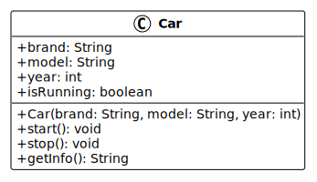

# Programmation orientée objet : Classes et objets

<!--
_class: lead
_paginate: false
-->

<https://github.com/heig-vd-progim-course/heig-vd-progim2-course>

Visualiser le contenu complet sur GitHub [à cette
adresse][contenu-complet-sur-github].

<small>V. Guidoux, avec l'aide de
[GitHub Copilot](https://github.com/features/copilot).</small>

<small>Ce travail est sous licence [CC BY-SA 4.0][licence].</small>

![bg opacity:0.1][illustration-principale]

## Plus de détails sur GitHub

<!-- _class: lead -->

_Cette présentation est un résumé du contenu complet disponible sur GitHub._

_Pour plus de détails, consulter le [contenu complet sur
GitHub][contenu-complet-sur-github] ou en cliquant sur l'en-tête de ce
document._

## Objectifs (1/3)

- Définir ce qu'est une classe et un objet en programmation orientée objet.
- Différencier une classe d'un objet (modèle vs instance).
- Créer une classe Java avec des attributs et des méthodes.

![bg right:40%][illustration-objectifs]

## Objectifs (2/3)

- Instancier des objets à partir d'une classe.
- Utiliser le mot-clé `new` pour créer des instances.
- Déclarer des attributs de différents types dans une classe.

## Objectifs (3/3)

- Implémenter des méthodes pour manipuler les attributs d'une classe.
- Utiliser le mot-clé `this` pour référencer l'instance courante.
- Créer des constructeurs pour initialiser les objets.

## Qu'est-ce que la POO ?

La programmation orientée objet (POO) est un paradigme qui organise le code
autour d'objets plutôt que de fonctions et de logique.

Un **objet** regroupe des **données** (attributs) et des **comportements**
(méthodes) dans une même entité.

En Java, tout est associé à des classes et des objets.

![bg right:40%][illustration-poo]

## Limites de la programmation procédurale

```java
String name = "Alice";
int age = 25;
String email = "alice@example.com";

void displayPerson(String name, int age, String email) {
    System.out.println("Nom: " + name);
    System.out.println("Âge: " + age);
    System.out.println("Email: " + email);
}
```

**Problèmes** : données dispersées, nombreux paramètres, difficile à maintenir.

## Solution avec la POO

```java
class Person {
    String name;
    int age;
    String email;

    void displayInfo() {
        System.out.println("Nom: " + name);
        System.out.println("Âge: " + age);
        System.out.println("Email: " + email);
    }
}
```

**Avantages** : données et comportements regroupés, code plus clair

## Avantages de la POO

- **Plus rapide et facile à exécuter** : structure efficace.
- **Structure claire** : organisation logique du code.
- **Code DRY** : "Don't Repeat Yourself", moins de duplication.
- **Réutilisabilité** : créer des applications avec moins de code.

![bg right:40%][illustration-avantages]

## Qu'est-ce qu'une classe ?

Une **classe** est un modèle ou un plan pour créer des objets.

Elle définit :

- **Attributs** : les données que les objets auront.
- **Méthodes** : les comportements que les objets pourront effectuer.

**Analogie** : une classe est comme un plan d'architecte pour une maison.

## Exemple de classe Car

```java
class Car {
    // Attributs (données)
    String brand;
    String model;
    int year;

    // Méthodes (comportements)
    void start() {
        System.out.println("La voiture démarre");
    }
}
```

## Qu'est-ce qu'un objet ?

Un **objet** est une instance d'une classe.

C'est une entité concrète créée à partir du modèle défini par la classe.

**Analogie** : si la classe est le plan, l'objet est la maison réelle construite
à partir de ce plan.

On peut créer plusieurs objets à partir d'une même classe.

## Créer des objets

```java
Car myCar = new Car();
myCar.brand = "Toyota";
myCar.model = "Corolla";
myCar.year = 2020;
myCar.start();  // Affiche "La voiture démarre"

Car yourCar = new Car();
yourCar.brand = "Honda";

Car neighborCar = new Car();
neighborCar.brand = "Ford";
```

## Différence classe vs objet

| Classe                                 | Objet                                        |
| -------------------------------------- | -------------------------------------------- |
| Modèle, plan, template                 | Instance concrète                            |
| Définit les attributs et méthodes      | Contient des valeurs spécifiques             |
| Ne prend pas de mémoire (sauf le plan) | Prend de la mémoire pour stocker les données |
| Une seule définition                   | Plusieurs instances possibles                |

## Lire un diagramme UML (1/2)

Un **diagramme de classe** visualise la structure d'une classe.

Il se divise en trois parties :

1. **Nom de la classe** : en haut, en gras.
2. **Attributs** : au milieu, les données.
3. **Méthodes** : en bas, les comportements.

Les symboles de visibilité : `+` (public), `-` (private), `#` (protected).

## Lire un diagramme UML (2/2)

**Classe Car** :

- attributs `brand`, `model`, `year`, `isRunning`.
- méthodes `start()`, `stop()`, `getInfo()`.



## Créer sa première classe

```java
public class Person {
    // Attributs
    String name;
    int age;
    String email;
}
```

Par convention : noms de classes en **PascalCase** (première lettre en
majuscule).

Le mot-clé `public` rend la classe accessible depuis n'importe où.

## Les méthodes (1/2)

Une **méthode** est une fonction définie dans une classe.

```java
void displayInfo() {
    System.out.println("Nom: " + name);
}
```

## Les méthodes (2/2)

Méthode avec paramètres et retour :

```java
int add(int a, int b) {
    return a + b;
}
```

Méthode qui modifie l'état :

```java
void incrementAge() {
    age = age + 1;
}
```

## Le mot-clé this (1/2)

Le mot-clé `this` fait référence à l'instance courante.

Il est utilisé pour différencier les attributs des paramètres :

```java
class Person {
    String name;

    void setName(String name) {
        this.name = name;  // this.name = attribut
    }
}
```

## Le mot-clé this (2/2)

`this` permet aussi d'appeler une autre méthode de la classe :

```java
void updateAndDisplay(String name) {
    this.setName(name);      // Appel de setName
    this.displayName();      // Appel de displayName
}
```

## Les constructeurs (1/2)

Un **constructeur** est une méthode spéciale appelée automatiquement lors de la
création d'un objet avec `new`.

**Caractéristiques** :

- Même nom que la classe.
- Pas de type de retour (même pas `void`).
- Initialise les attributs.

## Les constructeurs (2/2)

```java
public class Person {
    String name;
    int age;

    // Constructeur
    public Person(String name, int age) {
        this.name = name;
        this.age = age;
    }
}
```

## Utiliser un constructeur

```java
Person alice = new Person("Alice", 25);
Person bob = new Person("Bob", 30);
```

**Avantage** : garantit que les objets sont créés dans un état valide, pas
besoin d'initialiser les attributs un par un.

## Le mot-clé new (1/2)

Le mot-clé `new` crée une nouvelle instance d'une classe.

Il effectue trois opérations :

1. Alloue de la mémoire pour le nouvel objet.
2. Appelle le constructeur de la classe.
3. Retourne une référence vers l'objet créé.

## Le mot-clé new (2/2)

```java
Person alice = new Person("Alice", 25);
//     ^           ^
//     |           |
//     |           +-- Crée un nouvel objet Person
//     +-- Variable qui contient la référence
```

## Accéder aux attributs et méthodes

```java
// Création
Person alice = new Person("Alice", 25);

// Accès aux attributs
System.out.println(alice.name);  // "Alice"

// Modification
alice.age = 26;

// Appel de méthode
alice.displayInfo();
```

Utiliser l'opérateur point (`.`) pour accéder aux membres d'un objet.

## Exemple complet (1/2)

```java
public class Book {
    String title;
    String author;
    int pages;

    public Book(String title, String author, int pages) {
        this.title = title;
        this.author = author;
        this.pages = pages;
    }
}
```

## Exemple complet (2/2)

```java
void displayInfo() {
    System.out.println("Titre: " + title);
    System.out.println("Auteur: " + author);
    System.out.println("Pages: " + pages);
}

// Utilisation
Book myBook = new Book("Java Guide", "Alice", 350);
myBook.displayInfo();
```

## Principe DRY

**Don't Repeat Yourself** : réduire la répétition de code.

La POO facilite ce principe :

- Créer des classes réutilisables.
- Éviter de dupliquer du code.
- Centraliser les modifications.

Modifier à un seul endroit au lieu de partout dans le code.

![bg right:40%][illustration-dry]

## Mini-projet : système de jardin

**Objectif** : créer un système de gestion de jardin communautaire.

Vous allez créer :

- Trois classes : `Plant`, `Plot`, `Gardener`.
- Des attributs et constructeurs.
- Des méthodes pour afficher les informations.
- Une méthode qui modifie l'état (`harvest()`).

➡️ [Accéder au mini-projet][mini-projet]

## Questions

<!-- _class: lead -->

Est-ce que vous avez des questions ?

## À vous de jouer !

- (Re)lire le contenu de cours.
- Lire les exemples de code et les descriptions.
- Faire les exercices.
- Faire le mini-projet.
- Poser des questions si nécessaire.

➡️ [Visualiser le contenu complet sur GitHub.][contenu-complet-sur-github]

**N'hésitez pas à vous entraidez si vous avez des difficultés !**

![bg right:40%][illustration-a-vous-de-jouer]

## Sources (1/2)

- [Illustration principale][illustration-principale] par
  [Luca Bravo](https://unsplash.com/@lucabravo) sur
  [Unsplash](https://unsplash.com/photos/black-flat-screen-computer-monitor-XJXWbfSo2f0)
- [Illustration][illustration-objectifs] par
  [Brands&People](https://unsplash.com/@brandsandpeople) sur
  [Unsplash](https://unsplash.com/photos/person-holding-compass-in-forest-M94kn8Rp61Q)

## Sources (2/2)

- [Illustration][illustration-poo] par
  [Shubham Dhage](https://unsplash.com/@theshubhamdhage) sur
  [Unsplash](https://unsplash.com/photos/blue-and-purple-abstract-art-m4RqNjph00Q)
- [Illustration][illustration-avantages] par
  [Alvaro Reyes](https://unsplash.com/@alvarordesign) sur
  [Unsplash](https://unsplash.com/photos/person-using-macbook-pro-qWwpHwip31M)
- [Illustration][illustration-dry] par
  [Ferenc Almasi](https://unsplash.com/@flowforfrank) sur
  [Unsplash](https://unsplash.com/photos/macbook-pro-on-brown-wooden-table-EWLHA4T-mso)
- [Illustration][illustration-a-vous-de-jouer] par
  [Lala Azizli](https://unsplash.com/@lazizli) sur
  [Unsplash](https://unsplash.com/photos/person-using-laptop-computer-tfNyTfJpKvc)

<!-- URLs -->

[contenu-complet-sur-github]:
	https://github.com/heig-vd-progim-course/heig-vd-progim2-course/tree/main/01-contenus-du-cours/04-programmation-orientee-objet-classes-et-objets/
[licence]:
	https://github.com/heig-vd-progim-course/heig-vd-progim2-course/blob/main/LICENSE.md
[mini-projet]:
	https://github.com/heig-vd-progim-course/heig-vd-progim2-course/tree/main/01-contenus-du-cours/04-programmation-orientee-objet-classes-et-objets/03-mini-projet/

<!-- Illustrations -->

[illustration-principale]:
	https://images.unsplash.com/photo-1461749280684-dccba630e2f6?q=80&w=2069&auto=format&fit=crop
[illustration-objectifs]:
	https://images.unsplash.com/photo-1476480862126-209bfaa8edc8?q=80&w=2070&auto=format&fit=crop
[illustration-poo]:
	https://images.unsplash.com/photo-1635322966219-b75ed372eb01?q=80&w=2064&auto=format&fit=crop
[illustration-avantages]:
	https://images.unsplash.com/photo-1484480974693-6ca0a78fb36b?q=80&w=2072&auto=format&fit=crop
[illustration-dry]:
	https://images.unsplash.com/photo-1555066931-4365d14bab8c?q=80&w=2070&auto=format&fit=crop
[illustration-a-vous-de-jouer]:
	https://images.unsplash.com/photo-1499951360447-b19be8fe80f5?q=80&w=2070&auto=format&fit=crop
