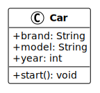
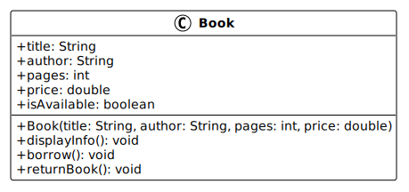
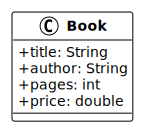

# Programmation orientée objet : Classes et objets

V. Guidoux, avec l'aide de
[GitHub Copilot](https://github.com/features/copilot).

Ce travail est sous licence [CC BY-SA 4.0][licence].

> [!TIP]
>
> Voici quelques informations relatives à ce contenu.
>
> **Ressources annexes**
>
> - Autres formats du support de cours : [Présentation (web)][presentation-web]
>   · [Présentation (PDF)][presentation-pdf]
> - Exemples de code : [Accéder au contenu](./01-exemples-de-code/README.md)
> - Exercices : [Accéder au contenu](./02-exercices/README.md)
> - Mini-projet : [Accéder au contenu](./03-mini-projet/README.md)
>
> **Objectifs**
>
> À l'issue de cette séance, les personnes qui étudient devraient être capables
> de :
>
> - Définir ce qu'est une classe et un objet en programmation orientée objet.
> - Différencier une classe d'un objet (modèle vs instance).
> - Créer une classe Java avec des attributs et des méthodes.
> - Instancier des objets à partir d'une classe.
> - Utiliser le mot-clé `new` pour créer des instances.
> - Déclarer des attributs de différents types dans une classe.
> - Implémenter des méthodes pour manipuler les attributs d'une classe.
> - Utiliser le mot-clé `this` pour référencer l'instance courante.
> - Créer des constructeurs pour initialiser les objets.
>
> **Méthodes d'enseignement et d'apprentissage**
>
> Les méthodes d'enseignement et d'apprentissage utilisées pour animer la séance
> sont les suivantes :
>
> - Présentation magistrale.
> - Discussions collectives.
> - Travail en autonomie.
>
> **Méthodes d'évaluation**
>
> L'évaluation prend la forme d'exercices et d'un mini-projet à réaliser en
> autonomie en classe ou à la maison.
>
> L'évaluation se fait en utilisant les critères suivants :
>
> - Capacité à répondre avec justesse.
> - Capacité à argumenter.
> - Capacité à réaliser les tâches demandées.
> - Capacité à s'approprier les exemples de code.
> - Capacité à appliquer les exemples de code à des situations similaires.
>
> Les retours se font de la manière suivante :
>
> - Corrigé des exercices.
> - Corrigé du mini-projet.
>
> L'évaluation ne donne pas lieu à une note.

## Table des matières

- [Table des matières](#table-des-matières)
- [Introduction](#introduction)
- [Pourquoi la programmation orientée objet ?](#pourquoi-la-programmation-orientée-objet-)
  - [Limites de la programmation procédurale](#limites-de-la-programmation-procédurale)
  - [Avantages de la POO](#avantages-de-la-poo)
  - [Le principe DRY (Don't Repeat Yourself)](#le-principe-dry-dont-repeat-yourself)
- [Classes et objets : les concepts fondamentaux](#classes-et-objets--les-concepts-fondamentaux)
  - [Qu'est-ce qu'une classe ?](#quest-ce-quune-classe-)
  - [Qu'est-ce qu'un objet ?](#quest-ce-quun-objet-)
  - [Différence entre classe et objet](#différence-entre-classe-et-objet)
- [Représentation UML des classes avec PlantUML](#représentation-uml-des-classes-avec-plantuml)
  - [Lire un diagramme de classe](#lire-un-diagramme-de-classe)
  - [Symboles de visibilité](#symboles-de-visibilité)
  - [Exemple 1 : classe Car](#exemple-1--classe-car)
  - [Exemple 2 : classe Book](#exemple-2--classe-book)
  - [Points clés pour lire un diagramme](#points-clés-pour-lire-un-diagramme)
- [Créer sa première classe en Java](#créer-sa-première-classe-en-java)
  - [Syntaxe de base](#syntaxe-de-base)
  - [Déclarer des attributs](#déclarer-des-attributs)
  - [Exemple pratique](#exemple-pratique)
- [Les méthodes](#les-méthodes)
  - [Déclarer et implémenter des méthodes](#déclarer-et-implémenter-des-méthodes)
  - [Méthodes avec paramètres et valeurs de retour](#méthodes-avec-paramètres-et-valeurs-de-retour)
  - [Le mot-clé `this`](#le-mot-clé-this)
- [Les constructeurs](#les-constructeurs)
  - [Rôle et utilité](#rôle-et-utilité)
  - [Créer un constructeur](#créer-un-constructeur)
  - [Initialisation des attributs](#initialisation-des-attributs)
- [Instanciation d'objets](#instanciation-dobjets)
  - [Le mot-clé `new`](#le-mot-clé-new)
  - [Créer et utiliser des objets](#créer-et-utiliser-des-objets)
  - [Appeler des méthodes sur un objet](#appeler-des-méthodes-sur-un-objet)
- [Ressources annexes](#ressources-annexes)
  - [Documentation officielle](#documentation-officielle)
  - [Tutoriels et guides](#tutoriels-et-guides)
  - [Outils](#outils)
- [Exemples de code](#exemples-de-code)
- [Exercices](#exercices)
- [Mini-projet](#mini-projet)

## Introduction

La programmation orientée objet (POO) est un paradigme de programmation qui
organise le code autour d'objets plutôt que de fonctions et de logique. Un objet
regroupe des données (attributs) et des comportements (méthodes) dans une même
entité.

Java est un langage de programmation orienté objet. Cela signifie que tout dans
Java est associé à des classes et des objets, avec leurs attributs et méthodes.
Par exemple, dans la vie réelle, une voiture est un objet. La voiture a des
attributs, comme le poids et la couleur, et des méthodes, comme démarrer et
freiner.

Dans ce chapitre, nous allons découvrir les concepts fondamentaux de la POO :
les classes et les objets. Ces concepts sont la base de la programmation en Java
et vous permettront de structurer votre code de manière plus claire et
maintenable.

## Pourquoi la programmation orientée objet ?

### Limites de la programmation procédurale

La programmation procédurale consiste à écrire des procédures ou des méthodes
qui effectuent des opérations sur des données. Les données et les fonctions sont
séparées, ce qui peut rendre le code difficile à maintenir et à faire évoluer.

Prenons l'exemple d'un programme qui gère des informations sur des personnes. En
programmation procédurale, vous pourriez avoir :

```java
String name = "Alice";
int age = 25;
String email = "alice@example.com";

void displayPerson(String name, int age, String email) {
    System.out.println("Nom: " + name);
    System.out.println("Âge: " + age);
    System.out.println("Email: " + email);
}
```

<details>
<summary>Description du code</summary>

Déclaration et initialisation de trois variables : `name` de type `String` à
`"Alice"`, `age` de type `int` à `25`, et `email` de type `String` à
`"alice@example.com"`.

Déclaration d'une méthode `displayPerson` avec trois paramètres (`name` de type
`String`, `age` de type `int`, `email` de type `String`) et un type de retour
`void`.

Dans le corps de la méthode : trois appels de la méthode statique
`System.out.println()` avec concaténation (opérateur `+`) de chaînes de
caractères et des valeurs des paramètres.

</details>

Cela fonctionne, mais :

- Les données sont dispersées (plusieurs variables).
- Il faut passer toutes les données en paramètres à chaque fonction.
- Il est difficile de gérer plusieurs personnes simultanément.
- Le code devient rapidement complexe et difficile à maintenir.

### Avantages de la POO

La programmation orientée objet résout ces problèmes en regroupant les données
et les comportements dans des objets. Comme expliqué sur
[W3Schools](https://www.w3schools.com/java/java_oop.asp), la POO présente
plusieurs avantages par rapport à la programmation procédurale :

- **Plus rapide et plus facile à exécuter** : la POO permet de structurer le
  code de manière plus efficace.
- **Structure claire** : la POO fournit une structure claire pour les
  programmes.
- **Code DRY** : la POO aide à garder le code Java DRY ("Don't Repeat
  Yourself"), et rend le code plus facile à maintenir, modifier et déboguer.
- **Réutilisabilité** : la POO permet de créer des applications complètement
  réutilisables avec moins de code et un temps de développement plus court.

Avec la POO, l'exemple précédent devient :

```java
class Person {
    String name;
    int age;
    String email;

    void displayInfo() {
        System.out.println("Nom: " + name);
        System.out.println("Âge: " + age);
        System.out.println("Email: " + email);
    }
}

// Utilisation
Person alice = new Person();
alice.name = "Alice";
alice.age = 25;
alice.email = "alice@example.com";
alice.displayInfo();
```

<details>
<summary>Description du code</summary>

Déclaration d'une classe `Person` avec trois attributs : `name` de type
`String`, `age` de type `int`, et `email` de type `String`.

Déclaration d'une méthode `displayInfo` avec un type de retour `void`. Dans le
corps de la méthode : trois appels de la méthode statique `System.out.println()`
avec concaténation (opérateur `+`) de chaînes de caractères et des valeurs des
attributs de l'instance courante.

Dans la section utilisation : déclaration et initialisation d'une variable
`alice` de type `Person` par appel du constructeur avec l'opérateur `new`.

Affectation (opérateur `=`) des attributs de l'objet `alice` : `name` à
`"Alice"`, `age` à `25`, `email` à `"alice@example.com"`.

Appel de la méthode `displayInfo()` sur l'objet `alice`.

</details>

Les données et les comportements sont maintenant regroupés dans une seule entité
: la classe `Person`.

### Le principe DRY (Don't Repeat Yourself)

Le principe "Don't Repeat Yourself" (DRY) consiste à réduire la répétition de
code. Vous devriez extraire les codes communs à l'application et les placer à un
seul endroit pour les réutiliser au lieu de les répéter.

La POO facilite l'application de ce principe en permettant de :

- Créer des classes réutilisables.
- Éviter de dupliquer du code.
- Centraliser les modifications (si vous devez changer quelque chose, vous ne le
  changez qu'à un seul endroit).

## Classes et objets : les concepts fondamentaux

### Qu'est-ce qu'une classe ?

Une **classe** est un modèle ou un plan pour créer des objets. Elle définit les
attributs (données) et les méthodes (comportements) que les objets de cette
classe auront.

On peut comparer une classe à un plan d'architecte pour une maison : le plan
décrit ce que la maison aura (nombre de pièces, taille, etc.), mais ce n'est pas
la maison elle-même.

En Java, une classe est déclarée avec le mot-clé `class` :

```java
class Car {
    // Attributs (données)
    String brand;
    String model;
    int year;

    // Méthodes (comportements)
    void start() {
        System.out.println("La voiture démarre");
    }
}
```

<details>
<summary>Description du code</summary>

Déclaration d'une classe `Car` avec trois attributs : `brand` de type `String`,
`model` de type `String`, et `year` de type `int`.

Déclaration d'une méthode `start` avec un type de retour `void`. Dans le corps
de la méthode : appel de la méthode statique `System.out.println()` avec la
chaîne de caractères `"La voiture démarre"` en argument.



</details>

### Qu'est-ce qu'un objet ?

Un **objet** est une instance d'une classe. C'est une entité concrète créée à
partir du modèle défini par la classe.

Si la classe est le plan d'architecte, l'objet est la maison réelle construite à
partir de ce plan. Vous pouvez créer plusieurs objets (maisons) à partir du même
plan (classe).

En Java, on crée un objet avec le mot-clé `new` :

```java
Car myCar = new Car();
myCar.brand = "Toyota";
myCar.model = "Corolla";
myCar.year = 2020;
myCar.start(); // Affiche "La voiture démarre"
Car yourCar = new Car();
yourCar.brand = "Honda";

Car neighborCar = new Car();
neighborCar.brand = "Ford";
```

<details>
<summary>Description du code</summary>

Déclaration et initialisation d'une variable `myCar` de type `Car` par appel du
constructeur avec l'opérateur `new`.

Affectation (opérateur `=`) des attributs de l'objet `myCar` : `brand` à
`"Toyota"`, `model` à `"Corolla"`, `year` à `2020`.

Appel de la méthode `start()` sur l'objet `myCar`.

Déclaration et initialisation de deux autres variables `yourCar` et
`neighborCar` de type `Car` par appel du constructeur avec l'opérateur `new`.

Affectation de l'attribut `brand` pour chaque objet : `"Honda"` pour `yourCar`
et `"Ford"` pour `neighborCar`.

</details>

### Différence entre classe et objet

| Classe                                 | Objet                                        |
| -------------------------------------- | -------------------------------------------- |
| Modèle, plan, template                 | Instance concrète                            |
| Définit les attributs et méthodes      | Contient des valeurs spécifiques             |
| Ne prend pas de mémoire (sauf le plan) | Prend de la mémoire pour stocker les données |
| Une seule définition                   | Plusieurs instances possibles                |

**Analogie** : si `Car` est la classe, alors `myCar`, `yourCar` et `neighborCar`
sont des objets différents de type `Car`, chacun avec ses propres valeurs
d'attributs.

## Représentation UML des classes avec PlantUML

Dans ce cours, nous utiliserons des diagrammes UML pour visualiser les classes
et leurs relations. Ces diagrammes sont générés automatiquement avec PlantUML,
un outil qui permet de créer des diagrammes à partir de texte.

Il est important de savoir **lire et interpréter** ces diagrammes pour
comprendre la structure d'une classe sans avoir à lire tout le code Java.

### Lire un diagramme de classe

Un diagramme de classe se présente comme un rectangle divisé en trois parties :

1. **Nom de la classe** : en haut, en gras
2. **Attributs** : au milieu, les données de la classe
3. **Méthodes** : en bas, les comportements de la classe

Les attributs et méthodes sont séparés par une ligne horizontale.

### Symboles de visibilité

Chaque attribut et méthode commence par un symbole qui indique sa visibilité :

| Symbole | Signification | Description                                      |
| ------- | ------------- | ------------------------------------------------ |
| `+`     | public        | Accessible de partout dans le programme          |
| `-`     | private       | Accessible uniquement à l'intérieur de la classe |
| `#`     | protected     | Accessible dans la classe et ses sous-classes    |

Dans ce chapitre, nous utiliserons principalement des attributs et méthodes
publics (`+`).

### Exemple 1 : classe Car

Voici le diagramme d'une classe `Car` (voiture) :


**Lecture du diagramme** :

- **Nom** : `Car` (voiture)
- **Attributs publics** (`+`) :
  - `brand: String` → marque de la voiture (texte)
  - `model: String` → modèle de la voiture (texte)
  - `year: int` → année de fabrication (nombre entier)
  - `isRunning: boolean` → indique si la voiture est en marche (vrai/faux)
- **Méthodes publiques** (`+`) :
  - `Car(brand: String, model: String, year: int)` → constructeur qui crée une
    voiture avec une marque, un modèle et une année
  - `start(): void` → méthode pour démarrer la voiture (ne retourne rien)
  - `stop(): void` → méthode pour arrêter la voiture (ne retourne rien)
  - `getInfo(): String` → méthode qui retourne les informations de la voiture
    sous forme de texte

### Exemple 2 : classe Book

Voici le diagramme d'une classe `Book` (livre) :



**Lecture du diagramme** :

- **Nom** : `Book` (livre)
- **Attributs publics** (`+`) :
  - `title: String` → titre du livre
  - `author: String` → auteur du livre
  - `pages: int` → nombre de pages
  - `price: double` → prix du livre (nombre décimal)
  - `isAvailable: boolean` → indique si le livre est disponible
- **Méthodes publiques** (`+`) :
  - `Book(title: String, author: String, pages: int, price: double)` →
    constructeur
  - `displayInfo(): void` → affiche les informations du livre
  - `borrow(): void` → emprunte le livre (modifie `isAvailable`)
  - `returnBook(): void` → retourne le livre (modifie `isAvailable`)

### Points clés pour lire un diagramme

Quand vous voyez un diagramme de classe, posez-vous ces questions :

1. **Quelles données** la classe stocke-t-elle ? (regardez les attributs)
2. **Quels comportements** la classe offre-t-elle ? (regardez les méthodes)
3. **Comment crée-t-on** un objet de cette classe ? (regardez le constructeur)
4. **Quelles méthodes modifient** l'état de l'objet ? (cherchez les méthodes
   `void` qui agissent sur les attributs)
5. **Quelles méthodes retournent** de l'information ? (cherchez les méthodes
   avec un type de retour autre que `void`)

Ces diagrammes sont un outil précieux pour comprendre rapidement la structure
d'une classe et planifier votre code avant de l'écrire.

## Créer sa première classe en Java

### Syntaxe de base

Pour créer une classe en Java, utilisez le mot-clé `class` suivi du nom de la
classe. Par convention, les noms de classes commencent par une majuscule et
utilisent la notation PascalCase (chaque mot commence par une majuscule).

```java
public class Person {
    // Corps de la classe
}
```

<details>
<summary>Description du code</summary>

Déclaration d'une classe publique (mot-clé `public`) nommée `Person`.

</details>

Le mot-clé `public` indique que la classe est accessible depuis n'importe où
dans le programme.

### Déclarer des attributs

Les **attributs** (aussi appelés champs ou variables d'instance) sont des
variables déclarées dans une classe. Ils représentent les données que chaque
objet de cette classe contiendra.

```java
public class Person {
    // Attributs
    String name;
    int age;
    String email;
}
```

<details>
<summary>Description du code</summary>

Déclaration d'une classe publique `Person` avec trois attributs : `name` de type
`String`, `age` de type `int`, et `email` de type `String`.

</details>

Chaque objet de type `Person` aura ses propres valeurs pour `name`, `age` et
`email`.

### Exemple pratique

Créons une classe `Book` qui représente un livre :

```java
public class Book {
    // Attributs
    String title;
    String author;
    int pages;
    double price;
}
```

<details>
<summary>Description du code</summary>

Déclaration d'une classe publique `Book` avec quatre attributs : `title` de type
`String`, `author` de type `String`, `pages` de type `int`, et `price` de type
`double`.



</details>

Cette classe définit qu'un livre a un titre, un auteur, un nombre de pages et un
prix.

## Les méthodes

### Déclarer et implémenter des méthodes

Une **méthode** est une fonction définie dans une classe. Elle représente un
comportement que les objets de cette classe peuvent effectuer.

La syntaxe générale d'une méthode est :

```java
visibilité typeRetour nomMethode(paramètres) {
    // Corps de la méthode
}
```

Exemple :

```java
public class Person {
    String name;
    int age;

    void displayInfo() {
        System.out.println("Nom: " + name);
        System.out.println("Âge: " + age);
    }
}
```

<details>
<summary>Description du code</summary>

Déclaration d'une classe publique `Person` avec deux attributs : `name` de type
`String` et `age` de type `int`.

Déclaration d'une méthode `displayInfo` avec un type de retour `void`. Dans le
corps de la méthode : deux appels de la méthode statique `System.out.println()`
avec concaténation (opérateur `+`) de chaînes de caractères et des valeurs des
attributs `name` et `age` de l'instance courante.

</details>

La méthode `displayInfo()` ne prend pas de paramètres et ne retourne rien
(`void`). Elle affiche simplement les informations de la personne.

### Méthodes avec paramètres et valeurs de retour

Une méthode peut prendre des paramètres en entrée et retourner une valeur :

```java
public class Calculator {
    int add(int a, int b) {
        return a + b;
    }

    int multiply(int a, int b) {
        return a * b;
    }
}
```

<details>
<summary>Description du code</summary>

Déclaration d'une classe publique `Calculator` avec deux méthodes.

Déclaration d'une méthode `add` avec deux paramètres (`a` et `b` de type `int`)
et un type de retour `int`. Dans le corps : instruction `return` avec addition
(opérateur `+`) de `a` et `b`.

Déclaration d'une méthode `multiply` avec deux paramètres (`a` et `b` de type
`int`) et un type de retour `int`. Dans le corps : instruction `return` avec
multiplication (opérateur `*`) de `a` et `b`.

</details>

La méthode `add()` prend deux entiers en paramètres et retourne leur somme.

Une méthode peut aussi modifier l'état de l'objet :

```java
public class Counter {
    int value;

    void increment() {
        value = value + 1;
    }

    void reset() {
        value = 0;
    }

    int getValue() {
        return value;
    }
}
```

<details>
<summary>Description du code</summary>

Déclaration d'une classe publique `Counter` avec un attribut `value` de type
`int`.

Déclaration d'une méthode `increment` avec un type de retour `void`. Dans le
corps : affectation (opérateur `=`) à `value` du résultat de l'addition
(opérateur `+`) de `value` et `1`.

Déclaration d'une méthode `reset` avec un type de retour `void`. Dans le corps :
affectation de `value` à `0`.

Déclaration d'une méthode `getValue` avec un type de retour `int`. Dans le corps
: instruction `return` avec la valeur de `value`.

</details>

### Le mot-clé `this`

Le mot-clé `this` fait référence à l'instance courante de la classe. Il est
utilisé pour différencier les attributs de la classe des paramètres de méthode
qui portent le même nom.

```java
public class Person {
    String name;
    int age;

    void setInfo(String name, int age) {
        this.name = name;  // this.name est l'attribut, name est le paramètre
        this.age = age;    // this.age est l'attribut, age est le paramètre
    }
}
```

<details>
<summary>Description du code</summary>

Déclaration d'une classe publique `Person` avec deux attributs : `name` de type
`String` et `age` de type `int`.

Déclaration d'une méthode `setInfo` avec deux paramètres (`name` de type
`String` et `age` de type `int`) et un type de retour `void`.

Dans le corps : deux affectations (opérateur `=`) utilisant le mot-clé `this`
pour distinguer les attributs de l'instance (`this.name`, `this.age`) des
paramètres de la méthode (`name`, `age`).

</details>

Sans `this`, Java ne pourrait pas distinguer l'attribut du paramètre, et le code
ne fonctionnerait pas comme prévu.

`this` peut aussi être utilisé pour appeler une autre méthode de la même classe
:

```java
public class Person {
    String name;

    void setName(String name) {
        this.name = name;
    }

    void displayName() {
        System.out.println("Nom: " + this.name);
    }

    void updateAndDisplay(String name) {
        this.setName(name);      // Appel de la méthode setName
        this.displayName();      // Appel de la méthode displayName
    }
}
```

<details>
<summary>Description du code</summary>

Déclaration d'une classe publique `Person` avec un attribut `name` de type
`String`.

Déclaration d'une méthode `setName` avec un paramètre `name` de type `String` et
un type de retour `void`. Dans le corps : affectation de `this.name` avec la
valeur du paramètre `name`.

Déclaration d'une méthode `displayName` avec un type de retour `void`. Dans le
corps : appel de `System.out.println()` avec concaténation de la chaîne
`"Nom: "` et `this.name`.

Déclaration d'une méthode `updateAndDisplay` avec un paramètre `name` de type
`String` et un type de retour `void`. Dans le corps : appel de la méthode
`setName()` sur l'instance courante (`this.setName(name)`) puis appel de la
méthode `displayName()` sur l'instance courante (`this.displayName()`).

</details>

## Les constructeurs

### Rôle et utilité

Un **constructeur** est une méthode spéciale qui est appelée automatiquement
lorsqu'un objet est créé avec le mot-clé `new`. Son rôle principal est
d'initialiser les attributs de l'objet.

Caractéristiques d'un constructeur :

- Il porte le même nom que la classe.
- Il n'a pas de type de retour (même pas `void`).
- Il est appelé automatiquement lors de la création d'un objet.

### Créer un constructeur

Voici comment créer un constructeur :

```java
public class Person {
    String name;
    int age;

    // Constructeur
    public Person(String name, int age) {
        this.name = name;
        this.age = age;
    }
}
```

<details>
<summary>Description du code</summary>

Déclaration d'une classe publique `Person` avec deux attributs : `name` de type
`String` et `age` de type `int`.

Déclaration d'un constructeur public `Person` avec deux paramètres (`name` de
type `String` et `age` de type `int`). Dans le corps : deux affectations des
attributs de l'instance courante (`this.name` et `this.age`) avec les valeurs
des paramètres.

</details>

Maintenant, lors de la création d'un objet `Person`, vous devez fournir un nom
et un âge :

```java
Person alice = new Person("Alice", 25);
Person bob = new Person("Bob", 30);
```

<details>
<summary>Description du code</summary>

Déclaration et initialisation de deux variables de type `Person` : `alice` et
`bob`, créées par appel du constructeur `Person` avec l'opérateur `new` et deux
arguments (une chaîne de caractères et un entier).

</details>

### Initialisation des attributs

Le constructeur garantit que les objets sont toujours créés dans un état valide.
Au lieu de créer un objet puis de définir ses attributs un par un :

```java
Person alice = new Person();
alice.name = "Alice";  // Risque d'oublier ceci
alice.age = 25;        // Risque d'oublier cela
```

<details>
<summary>Description du code</summary>

Déclaration et initialisation d'une variable `alice` de type `Person` par appel
du constructeur sans paramètre avec l'opérateur `new`.

Affectation individuelle de chaque attribut : `alice.name` à `"Alice"` et
`alice.age` à `25`.

</details>

Le constructeur force l'initialisation :

```java
Person alice = new Person("Alice", 25);  // Toutes les données sont fournies
```

<details>
<summary>Description du code</summary>

Déclaration et initialisation d'une variable `alice` de type `Person` par appel
du constructeur avec l'opérateur `new` et deux arguments, garantissant
l'initialisation complète de l'objet.

</details>

Vous pouvez aussi initialiser certains attributs avec des valeurs par défaut :

```java
public class Person {
    String name;
    int age;
    boolean isActive;

    public Person(String name, int age) {
        this.name = name;
        this.age = age;
        this.isActive = true;  // Valeur par défaut
    }
}
```

<details>
<summary>Description du code</summary>

Déclaration d'une classe publique `Person` avec trois attributs : `name` de type
`String`, `age` de type `int`, et `isActive` de type `boolean`.

Déclaration d'un constructeur public `Person` avec deux paramètres (`name` et
`age`). Dans le corps : affectation des attributs `this.name` et `this.age` avec
les valeurs des paramètres, et affectation de `this.isActive` à `true` (valeur
par défaut).

</details>

## Instanciation d'objets

### Le mot-clé `new`

Le mot-clé `new` est utilisé pour créer une nouvelle instance d'une classe
(c'est-à-dire un objet). Il effectue trois opérations :

1. Alloue de la mémoire pour le nouvel objet.
2. Appelle le constructeur de la classe.
3. Retourne une référence vers l'objet créé.

Syntaxe :

```java
ClassName objectName = new ClassName(arguments);
```

<details>
<summary>Description du code</summary>

Syntaxe de l'instanciation d'un objet : déclaration d'une variable `objectName`
de type `ClassName`, initialisée par appel du constructeur `ClassName` avec
l'opérateur `new` et des arguments.

</details>

Exemple :

```java
Person alice = new Person("Alice", 25);
//     ^           ^
//     |           |
//     |           +-- Crée un nouvel objet Person
//     +-- Variable qui contient la référence vers l'objet
```

<details>
<summary>Description du code</summary>

Déclaration et initialisation d'une variable `alice` de type `Person` par appel
du constructeur `Person` avec l'opérateur `new` et deux arguments (`"Alice"` et
`25`).

La variable `alice` contient une référence vers l'objet `Person` créé en
mémoire.

</details>

### Créer et utiliser des objets

Une fois un objet créé, vous pouvez accéder à ses attributs et méthodes avec
l'opérateur point (`.`) :

```java
public class Person {
    String name;
    int age;

    public Person(String name, int age) {
        this.name = name;
        this.age = age;
    }

    void displayInfo() {
        System.out.println("Nom: " + name + ", Âge: " + age);
    }
}

// Utilisation
public class Main {
    public static void main(String[] args) {
        // Création de deux objets Person
        Person alice = new Person("Alice", 25);
        Person bob = new Person("Bob", 30);

        // Accès aux attributs
        System.out.println(alice.name);  // Affiche "Alice"
        System.out.println(bob.age);     // Affiche 30

        // Modification d'un attribut
        alice.age = 26;

        // Appel de méthodes
        alice.displayInfo();  // Affiche "Nom: Alice, Âge: 26"
        bob.displayInfo();    // Affiche "Nom: Bob, Âge: 30"
    }
}
```

<details>
<summary>Description du code</summary>

Déclaration d'une classe publique `Person` avec deux attributs (`name` et
`age`), un constructeur, et une méthode `displayInfo()`.

Déclaration d'une classe publique `Main` avec une méthode statique `main`.

Dans le corps de `main` : création de deux objets `Person` nommés `alice` et
`bob` par appel du constructeur avec l'opérateur `new`.

Accès aux attributs des objets avec l'opérateur point (`.`) pour lire les
valeurs : `alice.name` et `bob.age`.

Modification de l'attribut `age` de l'objet `alice` par affectation (opérateur
`=`) de la valeur `26`.

Appel des méthodes `displayInfo()` sur les objets `alice` et `bob` avec
l'opérateur point.

</details>

### Appeler des méthodes sur un objet

Pour appeler une méthode sur un objet, utilisez la notation pointée :

```java
objectName.methodName(arguments);
```

<details>
<summary>Description du code</summary>

Syntaxe d'appel de méthode : nom de l'objet (`objectName`), opérateur point
(`.`), nom de la méthode (`methodName`), et arguments entre parenthèses.

</details>

Les méthodes peuvent :

- Ne rien retourner (`void`) : elles effectuent une action

```java
alice.displayInfo();  // Affiche des informations
```

- Retourner une valeur : vous pouvez utiliser la valeur retournée

```java
int age = alice.getAge();  // Récupère l'âge
System.out.println("Âge: " + age);
```

- Modifier l'état de l'objet

```java
alice.incrementAge();  // Incrémente l'âge de Alice
```

## Ressources annexes

Voici quelques ressources pour approfondir vos connaissances sur la
programmation orientée objet en Java :

### Documentation officielle

- [Object-Oriented Programming Concepts (Oracle)](https://dev.java/learn/oop/) :
  documentation officielle de Java sur les concepts de la POO.
- [Java Classes and Objects (W3Schools)](https://www.w3schools.com/java/java_oop.asp)
  : tutoriel interactif sur les classes et objets en Java.

### Tutoriels et guides

- [Java OOP (W3Schools)](https://www.w3schools.com/java/java_oop.asp) : série
  complète de tutoriels sur la POO en Java.
- [Classes (Oracle Java Tutorials)](https://docs.oracle.com/javase/tutorial/java/javaOO/classes.html)
  : guide détaillé sur les classes en Java.

### Outils

- [PlantUML](https://plantuml.com/) : outil pour créer des diagrammes UML à
  partir de texte.
- [PlantUML Class Diagram](https://plantuml.com/class-diagram) : documentation
  sur les diagrammes de classes avec PlantUML.

## Exemples de code

Nous vous invitons à consulter les exemples de code associés à ce contenu de
cours pour mieux comprendre les concepts abordés.

Vous trouverez les exemples de code ici :
[Exemples de code](./01-exemples-de-code/README.md).

## Exercices

Nous vous invitons maintenant à réaliser les exercices de la séance afin de
mettre en pratique les concepts abordés.

Vous trouverez les exercices et leur corrigé ici :
[Exercices](./02-exercices/README.md).

## Mini-projet

Pour mettre en pratique les concepts vus dans ce chapitre, vous allez réaliser
un mini-projet qui consiste à créer un système de gestion de jardin
communautaire.

Le mini-projet est disponible ici :
[Mini-projet (partie 1)](./03-mini-projet/README.md).

À la fin de ce mini-projet, vous aurez créé :

- Trois classes avec attributs et constructeurs (`Plant`, `Plot`, `Gardener`).
- Des méthodes pour afficher les informations des objets.
- Une méthode qui modifie l'état d'un objet (`harvest()`).
- Un programme principal qui crée et utilise plusieurs objets.

<!-- URLs -->

[licence]:
	https://github.com/heig-vd-progim-course/heig-vd-progim2-course/blob/main/LICENSE.md
[presentation-web]:
	https://heig-vd-progim-course.github.io/heig-vd-progim2-course/01-contenus-du-cours/04-programmation-orientee-objet-classes-et-objets/presentation.html
[presentation-pdf]:
	https://heig-vd-progim-course.github.io/heig-vd-progim2-course/01-contenus-du-cours/04-programmation-orientee-objet-classes-et-objets/04-programmation-orientee-objet-classes-et-objets-presentation.pdf
