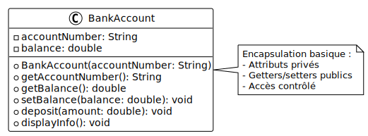

# Encapsulation basique

## Objectif

Comprendre les bases de l'encapsulation : rendre les attributs privés et fournir
des getters et setters pour y accéder de manière contrôlée.

## Concept illustré

L'**encapsulation** est le principe de cacher les détails internes d'une classe
et de fournir une interface publique pour interagir avec ses données. Cela
permet de :

- Protéger les données contre les modifications non contrôlées
- Contrôler l'accès aux attributs
- Faciliter la maintenance du code

## Diagramme UML



## Code complet

Créez un fichier `Main.java` avec le code suivant :

```java
class BankAccount {
    // Attributs privés : accessibles uniquement depuis la classe
    private String accountNumber;
    private double balance;

    // Constructeur
    public BankAccount(String accountNumber) {
        this.accountNumber = accountNumber;
        this.balance = 0.0;
    }

    // Getter pour accountNumber
    public String getAccountNumber() {
        return accountNumber;
    }

    // Getter pour balance
    public double getBalance() {
        return balance;
    }

    // Setter pour balance (permet de modifier le solde)
    public void setBalance(double balance) {
        this.balance = balance;
    }

    // Méthodes métier
    public void deposit(double amount) {
        balance += amount;
    }

    public void displayInfo() {
        System.out.println("Compte: " + accountNumber);
        System.out.println("Solde: " + balance + " CHF");
    }
}

public class Main {
    public static void main(String[] args) {
        // Créer un compte bancaire
        BankAccount account = new BankAccount("CH-1234567890");

        // Accéder aux attributs via les getters
        System.out.println("Numéro de compte: " + account.getAccountNumber());
        System.out.println("Solde initial: " + account.getBalance() + " CHF");

        // Modifier le solde via un setter
        account.setBalance(1000.0);
        System.out.println("\nAprès setBalance(1000.0):");
        account.displayInfo();

        // Utiliser une méthode métier
        account.deposit(500.0);
        System.out.println("\nAprès deposit(500.0):");
        account.displayInfo();

        // L'accès direct est impossible (décommentez pour voir l'erreur)
        // account.balance = 10000.0;  // ERREUR : balance est private
    }
}
```

<details>
<summary>Description du code</summary>

Déclaration de la classe `BankAccount` avec deux attributs privés :
`accountNumber` de type `String` et `balance` de type `double`.

Définition d'un constructeur qui initialise `accountNumber` avec le paramètre
reçu et `balance` à `0.0`.

Déclaration de la méthode publique `getAccountNumber()` qui retourne la valeur
de l'attribut privé `accountNumber`.

Déclaration de la méthode publique `getBalance()` qui retourne la valeur de
l'attribut privé `balance`.

Déclaration de la méthode publique `setBalance(double balance)` qui permet de
modifier la valeur de l'attribut privé `balance`.

Déclaration de la méthode publique `deposit(double amount)` qui utilise
l'opérateur `+=` pour ajouter `amount` au `balance`.

Déclaration de la méthode publique `displayInfo()` qui affiche les informations
du compte avec `System.out.println()`.

Dans la méthode `main`, création d'une instance de `BankAccount` avec le numéro
de compte `"CH-1234567890"`.

Appel de `getAccountNumber()` et `getBalance()` pour afficher les valeurs des
attributs privés.

Appel de `setBalance(1000.0)` pour modifier le solde, puis appel de
`displayInfo()` pour vérifier le changement.

Appel de `deposit(500.0)` pour ajouter 500 au solde, puis affichage avec
`displayInfo()`.

La ligne commentée montre qu'un accès direct à `balance` générerait une erreur
de compilation car l'attribut est privé.

</details>

## Exécution

Compilez et exécutez le programme :

```bash
javac Main.java
java Main
```

**Résultat attendu :**

```
Numéro de compte: CH-1234567890
Solde initial: 0.0 CHF

Après setBalance(1000.0):
Compte: CH-1234567890
Solde: 1000.0 CHF

Après deposit(500.0):
Compte: CH-1234567890
Solde: 1500.0 CHF
```

## Points clés

- Les attributs sont déclarés `private` pour empêcher l'accès direct
- Les getters permettent de **lire** les valeurs des attributs privés
- Les setters permettent de **modifier** les valeurs des attributs privés
- L'encapsulation crée une interface publique contrôlée (getters/setters)
- Le code externe ne peut plus accéder directement aux attributs

## Limite de cet exemple

Cet exemple montre l'encapsulation basique, mais le setter `setBalance()` permet
de définir n'importe quelle valeur, même négative ! Consultez l'exemple suivant
([02-encapsulation-validation](../02-encapsulation-validation/)) pour voir
comment ajouter de la validation.
