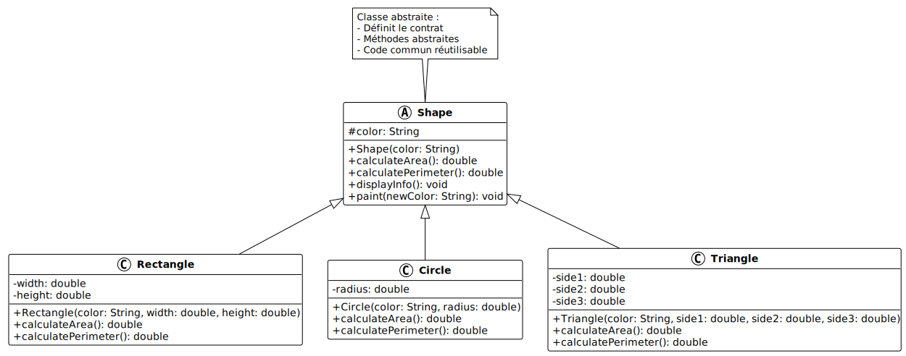

# Héritage avec classe abstraite

## Objectif

Comprendre les classes abstraites : définir un "contrat" que les sous-classes
doivent respecter, tout en fournissant du code commun.

## Concept illustré

Une **classe abstraite** permet de :

- Définir des méthodes abstraites (sans implémentation) que les sous-classes
  **doivent** implémenter
- Fournir des méthodes concrètes (avec implémentation) réutilisables
- Créer une hiérarchie cohérente avec un comportement garanti
- Empêcher l'instanciation directe de la classe parent

## Diagramme UML



## Code complet

Créez un fichier `Main.java` avec le code suivant :

```java
// Classe abstraite : ne peut pas être instanciée directement
abstract class Shape {
    protected String color;

    public Shape(String color) {
        this.color = color;
    }

    // Méthode abstraite : doit être implémentée par les sous-classes
    public abstract double calculateArea();

    // Méthode abstraite pour le périmètre
    public abstract double calculatePerimeter();

    // Méthode concrète : code commun à toutes les formes
    public void displayInfo() {
        System.out.println("Forme: " + getClass().getSimpleName());
        System.out.println("Couleur: " + color);
        System.out.println("Aire: " + calculateArea() + " cm²");
        System.out.println("Périmètre: " + calculatePerimeter() + " cm");
    }

    // Méthode concrète avec logique commune
    public void paint(String newColor) {
        System.out.println("Changement de couleur: " + color + " → " + newColor);
        this.color = newColor;
    }
}

// Classe concrète : Rectangle
class Rectangle extends Shape {
    private double width;
    private double height;

    public Rectangle(String color, double width, double height) {
        super(color);
        this.width = width;
        this.height = height;
    }

    // Implémentation obligatoire de calculateArea()
    @Override
    public double calculateArea() {
        return width * height;
    }

    // Implémentation obligatoire de calculatePerimeter()
    @Override
    public double calculatePerimeter() {
        return 2 * (width + height);
    }
}

// Classe concrète : Circle
class Circle extends Shape {
    private double radius;

    public Circle(String color, double radius) {
        super(color);
        this.radius = radius;
    }

    @Override
    public double calculateArea() {
        return Math.PI * radius * radius;
    }

    @Override
    public double calculatePerimeter() {
        return 2 * Math.PI * radius;
    }
}

// Classe concrète : Triangle
class Triangle extends Shape {
    private double side1;
    private double side2;
    private double side3;

    public Triangle(String color, double side1, double side2, double side3) {
        super(color);
        this.side1 = side1;
        this.side2 = side2;
        this.side3 = side3;
    }

    @Override
    public double calculateArea() {
        // Formule de Héron
        double s = calculatePerimeter() / 2;
        return Math.sqrt(s * (s - side1) * (s - side2) * (s - side3));
    }

    @Override
    public double calculatePerimeter() {
        return side1 + side2 + side3;
    }
}

public class Main {
    public static void main(String[] args) {
        // Impossible de créer une instance de Shape :
        // Shape shape = new Shape("rouge");  // ERREUR: Shape est abstraite

        // Créer des formes concrètes
        Rectangle rect = new Rectangle("bleu", 5.0, 3.0);
        Circle circle = new Circle("rouge", 4.0);
        Triangle triangle = new Triangle("vert", 3.0, 4.0, 5.0);

        // Afficher les informations
        System.out.println("=== Rectangle ===");
        rect.displayInfo();
        System.out.println();

        System.out.println("=== Cercle ===");
        circle.displayInfo();
        System.out.println();

        System.out.println("=== Triangle ===");
        triangle.displayInfo();
        System.out.println();

        // Utiliser une méthode concrète héritée
        System.out.println("=== Changement de couleur ===");
        rect.paint("jaune");
        rect.displayInfo();
        System.out.println();

        // Polymorphisme : traitement uniforme
        System.out.println("=== Catalogue de formes ===");
        Shape[] shapes = {rect, circle, triangle};

        double totalArea = 0;
        for (Shape shape : shapes) {
            totalArea += shape.calculateArea();
        }
        System.out.println("Aire totale: " + totalArea + " cm²");
    }
}
```

<details>
<summary>Description du code</summary>

Déclaration de la classe `Shape` avec le modificateur `abstract`, qui indique
qu'elle ne peut pas être instanciée directement.

Déclaration de l'attribut `protected` `color` et du constructeur qui
l'initialise.

Déclaration des méthodes abstraites `calculateArea()` et `calculatePerimeter()`
avec le mot-clé `abstract`. Ces méthodes n'ont pas de corps (pas
d'implémentation), seulement une signature suivie d'un point-virgule.

Déclaration de la méthode concrète `displayInfo()` qui utilise les méthodes
abstraites `calculateArea()` et `calculatePerimeter()`. Java sait que ces
méthodes seront implémentées dans les sous-classes.

Déclaration de la méthode concrète `paint()` qui modifie l'attribut `color` avec
affichage d'un message.

Déclaration de la classe `Rectangle` avec `extends Shape`. Cette classe doit
obligatoirement implémenter les méthodes abstraites.

Ajout des attributs privés `width` et `height`, et constructeur appelant
`super(color)`.

Implémentation de `calculateArea()` avec l'annotation `@Override` et calcul
`width * height`.

Implémentation de `calculatePerimeter()` avec `@Override` et calcul `2 \* (width

- height)`.

Déclaration de la classe `Circle` héritant de `Shape` avec attribut `radius`.

Implémentation de `calculateArea()` utilisant `Math.PI` et `radius * radius`.

Implémentation de `calculatePerimeter()` avec formule `2 * Math.PI * radius`.

Déclaration de la classe `Triangle` avec trois attributs pour les côtés.

Implémentation de `calculatePerimeter()` : somme des trois côtés.

Implémentation de `calculateArea()` utilisant la formule de Héron avec
`Math.sqrt()`.

Dans `main`, ligne commentée montrant qu'on ne peut pas instancier `Shape`
directement.

Création d'instances de `Rectangle`, `Circle`, et `Triangle` avec leurs
paramètres spécifiques.

Appel de `displayInfo()` sur chaque forme. Cette méthode héritée utilise les
implémentations spécifiques de `calculateArea()` et `calculatePerimeter()`.

Appel de `paint()` (méthode concrète héritée) pour changer la couleur du
rectangle.

Déclaration d'un tableau de type `Shape[]` contenant les trois formes,
démontrant le polymorphisme.

Boucle `for-each` parcourant le tableau et appelant `calculateArea()` sur chaque
forme. Java appelle automatiquement l'implémentation correcte selon le type réel
de l'objet.

</details>

## Exécution

Compilez et exécutez le programme :

```bash
javac Main.java
java Main
```

**Résultat attendu :**

```text
=== Rectangle ===
Forme: Rectangle
Couleur: bleu
Aire: 15.0 cm²
Périmètre: 16.0 cm

=== Cercle ===
Forme: Circle
Couleur: rouge
Aire: 50.26548245743669 cm²
Périmètre: 25.132741228718345 cm

=== Triangle ===
Forme: Triangle
Couleur: vert
Aire: 6.0 cm²
Périmètre: 12.0 cm

=== Changement de couleur ===
Changement de couleur: bleu → jaune
Forme: Rectangle
Couleur: jaune
Aire: 15.0 cm²
Périmètre: 16.0 cm

=== Catalogue de formes ===
Aire totale: 71.26548245743669 cm²
```

## Points clés

- Une classe abstraite est déclarée avec le mot-clé `abstract`
- On ne peut pas créer d'instance d'une classe abstraite
- Les méthodes abstraites n'ont pas de corps (juste la signature)
- Les sous-classes **doivent** implémenter toutes les méthodes abstraites
- Une classe abstraite peut contenir des méthodes concrètes
- `@Override` indique qu'on implémente/redéfinit une méthode du parent
- Le polymorphisme permet de traiter toutes les formes uniformément

## Avantages

- **Contrat garanti** : impossible de créer une sous-classe sans implémenter les
  méthodes abstraites
- **Code commun** : les méthodes concrètes sont réutilisées par toutes les
  sous-classes
- **Flexibilité** : chaque sous-classe implémente les méthodes à sa manière
- **Maintenabilité** : structure claire et cohérente

## Pour aller plus loin

Consultez l'exemple suivant
([05-modificateur-protected](../05-modificateur-protected/)) pour comprendre en
détail le modificateur `protected` et ses implications sur l'héritage.
