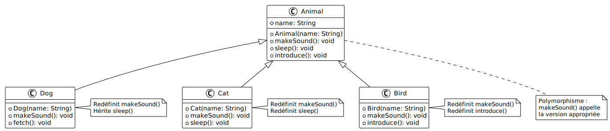

# Redéfinition de méthodes (Override)

## Objectif

Comprendre la redéfinition de méthodes : personnaliser le comportement hérité en
fournissant une nouvelle implémentation dans la sous-classe.

## Concept illustré

La **redéfinition** (override) permet de :

- Modifier le comportement d'une méthode héritée
- Adapter une méthode générale à un contexte spécifique
- Maintenir la même signature (nom, paramètres, type de retour)
- Utiliser `@Override` pour indiquer l'intention et détecter les erreurs

## Redéfinition vs Surcharge

| Aspect         | Redéfinition (Override)         | Surcharge (Overload) |
| :------------- | :------------------------------ | :------------------- |
| Relation       | Entre classe parent et enfant   | Dans la même classe  |
| Signature      | Même signature                  | Signature différente |
| But            | Modifier le comportement hérité | Plusieurs versions   |
| Annotation     | `@Override`                     | Pas d'annotation     |
| Type de retour | Identique (ou covariant)        | Peut être différent  |
| Paramètres     | Identiques                      | Différents           |

## Diagramme UML



## Code complet

Créez un fichier `Main.java` avec le code suivant :

```java
// Classe parent
class Animal {
    protected String name;

    public Animal(String name) {
        this.name = name;
    }

    // Méthode qui sera redéfinie
    public void makeSound() {
        System.out.println(name + " fait un bruit");
    }

    public void sleep() {
        System.out.println(name + " dort");
    }

    // Méthode qui utilise makeSound()
    public void introduce() {
        System.out.print(name + " se présente: ");
        makeSound();  // Appelle la version appropriée (polymorphisme)
    }
}

// Sous-classe : Dog
class Dog extends Animal {
    public Dog(String name) {
        super(name);
    }

    // Redéfinition de makeSound()
    @Override
    public void makeSound() {
        System.out.println(name + " aboie: Wouaf! Wouaf!");
    }

    // Méthode spécifique à Dog
    public void fetch() {
        System.out.println(name + " rapporte la balle");
    }
}

// Sous-classe : Cat
class Cat extends Animal {
    public Cat(String name) {
        super(name);
    }

    // Redéfinition de makeSound()
    @Override
    public void makeSound() {
        System.out.println(name + " miaule: Miaou!");
    }

    // Redéfinition de sleep() avec comportement personnalisé
    @Override
    public void sleep() {
        System.out.println(name + " dort en ronronnant... zzz");
    }
}

// Sous-classe : Bird
class Bird extends Animal {
    public Bird(String name) {
        super(name);
    }

    // Redéfinition de makeSound()
    @Override
    public void makeSound() {
        System.out.println(name + " chante: Cui! Cui!");
    }

    // Redéfinition de introduce() avec appel à super
    @Override
    public void introduce() {
        System.out.print("🐦 ");
        super.introduce();  // Appelle la version du parent
    }
}

// Classe pour démontrer la surcharge (overload)
class Calculator {
    // Trois méthodes avec le même nom mais des signatures différentes
    public int add(int a, int b) {
        return a + b;
    }

    public double add(double a, double b) {
        return a + b;
    }

    public int add(int a, int b, int c) {
        return a + b + c;
    }
}

public class Main {
    public static void main(String[] args) {
        System.out.println("=== Redéfinition (Override) ===\n");

        Dog dog = new Dog("Rex");
        Cat cat = new Cat("Whiskers");
        Bird bird = new Bird("Tweety");

        // Chaque animal fait son propre son
        dog.makeSound();   // Appelle Dog.makeSound()
        cat.makeSound();   // Appelle Cat.makeSound()
        bird.makeSound();  // Appelle Bird.makeSound()
        System.out.println();

        // sleep() : Dog utilise la version du parent, Cat sa propre version
        dog.sleep();       // Appelle Animal.sleep()
        cat.sleep();       // Appelle Cat.sleep() (redéfinie)
        System.out.println();

        // introduce() utilise le polymorphisme
        dog.introduce();   // Appelle Animal.introduce() qui appelle Dog.makeSound()
        cat.introduce();   // Appelle Animal.introduce() qui appelle Cat.makeSound()
        bird.introduce();  // Appelle Bird.introduce() qui appelle super.introduce()
        System.out.println();

        // Polymorphisme : traitement uniforme
        System.out.println("=== Polymorphisme ===\n");
        Animal[] animals = {dog, cat, bird};

        for (Animal animal : animals) {
            animal.makeSound();  // Java appelle la bonne version automatiquement
        }
        System.out.println();

        // Surcharge (Overload) - pour comparaison
        System.out.println("=== Surcharge (Overload) - pour comparaison ===\n");
        Calculator calc = new Calculator();

        System.out.println("add(5, 3) = " + calc.add(5, 3));              // int, int
        System.out.println("add(5.5, 3.2) = " + calc.add(5.5, 3.2));      // double, double
        System.out.println("add(1, 2, 3) = " + calc.add(1, 2, 3));        // int, int, int
    }
}
```

<details>
<summary>Description du code</summary>

Déclaration de la classe `Animal` avec attribut `protected String name`.

Définition de la méthode `makeSound()` avec implémentation générique affichant
un message simple.

Définition de la méthode `sleep()` avec comportement par défaut.

Définition de la méthode `introduce()` qui appelle `makeSound()`. Cet appel
utilisera la version appropriée selon le type réel de l'objet (polymorphisme).

Déclaration de la classe `Dog` avec `extends Animal`.

Redéfinition de `makeSound()` avec l'annotation `@Override`, fournissant une
implémentation spécifique pour le chien (aboiement).

Ajout de la méthode `fetch()` spécifique à `Dog`.

Déclaration de la classe `Cat` héritant de `Animal`.

Redéfinition de `makeSound()` avec `@Override` pour le miaulement du chat.

Redéfinition de `sleep()` avec `@Override` pour ajouter le ronronnement.

Déclaration de la classe `Bird` héritant de `Animal`.

Redéfinition de `makeSound()` avec `@Override` pour le chant de l'oiseau.

Redéfinition de `introduce()` avec `@Override`. Cette méthode appelle
`super.introduce()` pour réutiliser le comportement du parent tout en ajoutant
un préfixe emoji.

Déclaration de la classe `Calculator` pour démontrer la surcharge (concept
différent).

Trois méthodes nommées `add` avec des signatures différentes : `(int, int)`,
`(double, double)`, `(int, int, int)`. C'est de la surcharge, pas de la
redéfinition.

Dans `main`, création d'instances de `Dog`, `Cat` et `Bird`.

Appel de `makeSound()` sur chaque animal. Java appelle automatiquement la
version appropriée selon le type réel de l'objet.

Appel de `sleep()` : `dog` utilise la version héritée de `Animal`, `cat` utilise
sa propre version redéfinie.

Appel de `introduce()` sur chaque animal, démontrant que le polymorphisme
fonctionne même quand une méthode du parent appelle une méthode redéfinie.

Création d'un tableau `Animal[]` contenant les trois animaux. Boucle `for-each`
appelant `makeSound()` sur chaque élément. Java résout dynamiquement quel
`makeSound()` appeler selon le type réel.

Démonstration de la surcharge avec `Calculator` : trois appels à `add()` avec
des paramètres différents. Java choisit la méthode appropriée selon les types
des paramètres à la compilation.

</details>

## Exécution

Compilez et exécutez le programme :

```bash
javac Main.java
java Main
```

**Résultat attendu :**

```text
=== Redéfinition (Override) ===

Rex aboie: Wouaf! Wouaf!
Whiskers miaule: Miaou!
Tweety chante: Cui! Cui!

Rex dort
Whiskers dort en ronronnant... zzz

Rex se présente: Rex aboie: Wouaf! Wouaf!
Whiskers se présente: Whiskers miaule: Miaou!
🐦 Tweety se présente: Tweety chante: Cui! Cui!

=== Polymorphisme ===

Rex aboie: Wouaf! Wouaf!
Whiskers miaule: Miaou!
Tweety chante: Cui! Cui!

=== Surcharge (Overload) - pour comparaison ===

add(5, 3) = 8
add(5.5, 3.2) = 8.7
add(1, 2, 3) = 6
```

## Points clés

- La redéfinition change le comportement d'une méthode héritée
- `@Override` est fortement recommandé : il détecte les erreurs de signature
- La signature (nom, paramètres, type de retour) doit être identique
- `super.methode()` appelle la version du parent
- Le polymorphisme utilise la version appropriée selon le type réel
- La redéfinition est différente de la surcharge (différentes signatures dans la
  même classe)

## Avantages de @Override

- **Détection d'erreurs** : erreur de compilation si la signature ne correspond
  pas
- **Documentation** : indique clairement l'intention
- **Maintenance** : si le parent change, l'erreur est détectée immédiatement

## Pour aller plus loin

Consultez l'exemple suivant
([07-organisation-fichiers](../07-organisation-fichiers/)) pour découvrir la
meilleure pratique professionnelle : organiser votre code avec un fichier par
classe.
