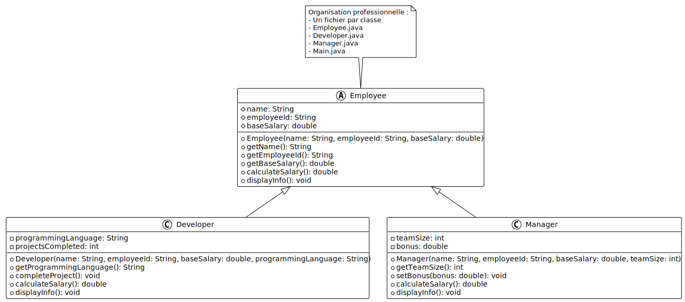

# Organisation professionnelle : un fichier par classe

## Objectif

Découvrir la bonne pratique professionnelle d'organisation du code : utiliser un
fichier séparé pour chaque classe.

## Concept illustré

L'**organisation en fichiers séparés** permet de :

- Améliorer la lisibilité du code
- Faciliter la maintenance et la collaboration
- Respecter les conventions professionnelles Java
- Permettre de localiser rapidement chaque classe
- Faciliter la réutilisation des classes dans d'autres projets

## Conventions Java

En Java professionnel :

- **Une classe publique = un fichier**
- Le nom du fichier doit correspondre exactement au nom de la classe publique
- Le fichier d'une classe publique `MyClass` doit s'appeler `MyClass.java`
- Toutes les classes publiques d'un projet sont au même niveau de visibilité

## Structure de l'exemple

Cet exemple contient **5 fichiers** :

```
07-organisation-fichiers/
├── README.md
├── Employee.java       (classe abstraite)
├── Developer.java      (sous-classe)
├── Manager.java        (sous-classe)
└── Main.java           (point d'entrée)
```

## Diagramme UML



## Code complet

### Fichier : Employee.java

```java
public abstract class Employee {
    protected String name;
    protected String employeeId;
    protected double baseSalary;

    public Employee(String name, String employeeId, double baseSalary) {
        this.name = name;
        this.employeeId = employeeId;
        this.baseSalary = baseSalary;
    }

    // Getters
    public String getName() {
        return name;
    }

    public String getEmployeeId() {
        return employeeId;
    }

    public double getBaseSalary() {
        return baseSalary;
    }

    // Méthode abstraite : chaque type d'employé calcule son salaire différemment
    public abstract double calculateSalary();

    // Méthode concrète commune
    public void displayInfo() {
        System.out.println("Employé: " + name);
        System.out.println("ID: " + employeeId);
        System.out.println("Salaire de base: " + baseSalary + " CHF");
        System.out.println("Salaire total: " + calculateSalary() + " CHF");
    }
}
```

### Fichier : Developer.java

```java
public class Developer extends Employee {
    private String programmingLanguage;
    private int projectsCompleted;

    public Developer(String name, String employeeId, double baseSalary,
                     String programmingLanguage) {
        super(name, employeeId, baseSalary);
        this.programmingLanguage = programmingLanguage;
        this.projectsCompleted = 0;
    }

    public String getProgrammingLanguage() {
        return programmingLanguage;
    }

    public void completeProject() {
        projectsCompleted++;
        System.out.println(name + " a terminé un projet (" +
                         programmingLanguage + "). Total: " + projectsCompleted);
    }

    @Override
    public double calculateSalary() {
        // Bonus de 500 CHF par projet complété
        return baseSalary + (projectsCompleted * 500);
    }

    @Override
    public void displayInfo() {
        super.displayInfo();
        System.out.println("Langage: " + programmingLanguage);
        System.out.println("Projets complétés: " + projectsCompleted);
    }
}
```

### Fichier : Manager.java

```java
public class Manager extends Employee {
    private int teamSize;
    private double bonus;

    public Manager(String name, String employeeId, double baseSalary, int teamSize) {
        super(name, employeeId, baseSalary);
        this.teamSize = teamSize;
        this.bonus = 0.0;
    }

    public int getTeamSize() {
        return teamSize;
    }

    public void setBonus(double bonus) {
        if (bonus >= 0) {
            this.bonus = bonus;
            System.out.println("Bonus de " + bonus + " CHF attribué à " + name);
        }
    }

    @Override
    public double calculateSalary() {
        // Salaire de base + bonus + prime d'équipe (100 CHF par membre)
        return baseSalary + bonus + (teamSize * 100);
    }

    @Override
    public void displayInfo() {
        super.displayInfo();
        System.out.println("Taille de l'équipe: " + teamSize);
        System.out.println("Bonus: " + bonus + " CHF");
    }
}
```

### Fichier : Main.java

```java
public class Main {
    public static void main(String[] args) {
        System.out.println("=== Système de gestion des employés ===\n");

        // Créer des développeurs
        Developer dev1 = new Developer("Alice Dupont", "DEV001", 80000, "Java");
        Developer dev2 = new Developer("Bob Martin", "DEV002", 75000, "Python");

        // Créer un manager
        Manager manager = new Manager("Carol Smith", "MGR001", 90000, 5);

        // Simuler du travail
        System.out.println("=== Activités ===");
        dev1.completeProject();
        dev1.completeProject();
        dev2.completeProject();
        manager.setBonus(5000);
        System.out.println();

        // Afficher les informations
        System.out.println("=== Développeur 1 ===");
        dev1.displayInfo();
        System.out.println();

        System.out.println("=== Développeur 2 ===");
        dev2.displayInfo();
        System.out.println();

        System.out.println("=== Manager ===");
        manager.displayInfo();
        System.out.println();

        // Traitement polymorphe
        System.out.println("=== Masse salariale totale ===");
        Employee[] employees = {dev1, dev2, manager};

        double totalSalary = 0;
        for (Employee emp : employees) {
            totalSalary += emp.calculateSalary();
        }
        System.out.println("Total: " + totalSalary + " CHF");
    }
}
```

## Compilation et exécution

### Compilation

Compilez tous les fichiers en une seule commande :

```bash
javac *.java
```

Ou compilez-les individuellement :

```bash
javac Employee.java
javac Developer.java
javac Manager.java
javac Main.java
```

### Exécution

Exécutez le programme :

```bash
java Main
```

**Résultat attendu :**

```
=== Système de gestion des employés ===

=== Activités ===
Alice Dupont a terminé un projet (Java). Total: 1
Alice Dupont a terminé un projet (Java). Total: 2
Bob Martin a terminé un projet (Python). Total: 1
Bonus de 5000.0 CHF attribué à Carol Smith

=== Développeur 1 ===
Employé: Alice Dupont
ID: DEV001
Salaire de base: 80000.0 CHF
Salaire total: 81000.0 CHF
Langage: Java
Projets complétés: 2

=== Développeur 2 ===
Employé: Bob Martin
ID: DEV002
Salaire de base: 75000.0 CHF
Salaire total: 75500.0 CHF
Langage: Python
Projets complétés: 1

=== Manager ===
Employé: Carol Smith
ID: MGR001
Salaire de base: 90000.0 CHF
Salaire total: 95500.0 CHF
Taille de l'équipe: 5
Bonus: 5000.0 CHF

=== Masse salariale totale ===
Total: 252000.0 CHF
```

## Points clés

- **Un fichier par classe publique** est la norme professionnelle en Java
- Le nom du fichier doit correspondre exactement au nom de la classe
- Cette organisation améliore la lisibilité et la maintenance
- Le compilateur Java gère automatiquement les dépendances entre fichiers
- Les classes peuvent se référencer entre elles sans import (même package)

## Avantages de l'organisation en fichiers séparés

- **Lisibilité** : chaque fichier est court et focalisé
- **Navigation** : facile de trouver une classe spécifique
- **Collaboration** : plusieurs personnes peuvent travailler sans conflits
- **Réutilisation** : facile de copier une classe dans un autre projet
- **Maintenance** : modifications localisées dans un seul fichier
- **Contrôle de version** : historique clair par classe

## Quand utiliser un fichier unique ?

Un fichier `Main.java` unique est acceptable pour :

- **Apprentissage** : exemples pédagogiques simples
- **Prototypage rapide** : tests et expérimentations
- **Scripts courts** : utilitaires simples

**En production, utilisez toujours des fichiers séparés.**

## Prochaines étapes

Maintenant que vous maîtrisez l'encapsulation et l'héritage, vous êtes prêt à :

- Pratiquer avec les **[exercices](../../02-exercices/)**
- Réaliser le **[mini-projet](../../03-mini-projet/)**
- Explorer le module suivant sur le polymorphisme avancé
