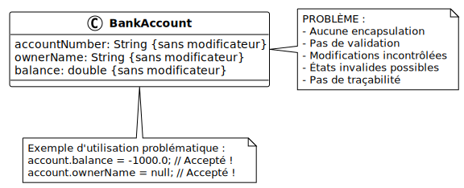

# À éviter : Pas d'encapsulation

## Objectif

Comprendre les problèmes causés par l'absence d'encapsulation : attributs
directement accessibles sans protection.

## Problème illustré

Sans encapsulation :

- Aucun contrôle sur les valeurs affectées
- États invalides possibles
- Pas de validation des données
- Difficile de changer l'implémentation plus tard
- Pas de trace des modifications

## Diagramme UML



## Code problématique

Créez un fichier `ErrorExample.java` avec le code suivant :

```java
// MAUVAISE PRATIQUE : attributs directement accessibles
class BankAccount {
    String accountNumber;    // Pas de protection !
    String ownerName;        // Pas de protection !
    double balance;          // Pas de protection !

    // Pas de constructeur avec validation
    // Pas de getters/setters avec validation
}

public class ErrorExample {
    public static void main(String[] args) {
        System.out.println("=== Démonstration des problèmes ===\n");

        BankAccount account = new BankAccount();

        // PROBLÈME 1 : Aucune validation
        account.accountNumber = "";           // Vide !
        account.ownerName = null;             // Null !
        account.balance = -1000.0;            // Négatif !

        System.out.println("Problème 1 - Aucune validation:");
        System.out.println("Compte: '" + account.accountNumber + "'");
        System.out.println("Propriétaire: " + account.ownerName);
        System.out.println("Solde: " + account.balance + " CHF");
        System.out.println("^ Toutes ces valeurs sont invalides mais acceptées !\n");

        // PROBLÈME 2 : Modifications incontrôlées
        account.balance = 1000.0;
        System.out.println("Problème 2 - Modifications incontrôlées:");
        System.out.println("Solde initial: " + account.balance + " CHF");

        // N'importe qui peut modifier le solde directement
        account.balance += 1000000.0;  // Ajout frauduleux !
        System.out.println("Après modification directe: " + account.balance + " CHF");
        System.out.println("^ Qui a fait ce changement ? Aucune trace !\n");

        // PROBLÈME 3 : Pas de contrôle des opérations
        System.out.println("Problème 3 - Pas de contrôle des opérations:");
        account.balance = 500.0;
        System.out.println("Solde: " + account.balance + " CHF");

        // Retrait qui dépasse le solde : pas d'erreur !
        account.balance -= 1000.0;
        System.out.println("Après retrait de 1000 CHF: " + account.balance + " CHF");
        System.out.println("^ Découvert non autorisé mais accepté !\n");

        // PROBLÈME 4 : Erreurs de logique faciles
        System.out.println("Problème 4 - Erreurs de logique faciles:");
        BankAccount account2 = new BankAccount();
        account2.balance = 1000.0;

        // Erreur de logique : division au lieu de soustraction
        // Le compilateur ne peut pas détecter ce genre d'erreur
        account2.balance = account2.balance / 2;  // Oups, erreur !
        System.out.println("Après erreur de logique: " + account2.balance + " CHF");
        System.out.println("^ Devrait être withdraw(500), pas division !\n");

        // PROBLÈME 5 : Impossible de changer l'implémentation
        System.out.println("Problème 5 - Couplage fort:");
        System.out.println("Si on veut changer 'balance' de double à BigDecimal,");
        System.out.println("il faut modifier TOUT le code qui accède directement !");
        System.out.println("Avec des getters/setters, seule la classe change.");
    }
}
```

<details>
<summary>Description du code</summary>

Déclaration de la classe `BankAccount` avec trois attributs sans modificateur
d'accès : `accountNumber`, `ownerName`, `balance`. Par défaut, ils sont
accessibles depuis le même package (package-private).

Absence de constructeur avec validation, absence de getters et setters.

Dans `main`, création d'une instance de `BankAccount`.

Affectation directe de valeurs invalides aux attributs : chaîne vide, `null`,
valeur négative. Aucune erreur n'est levée, ces valeurs sont acceptées.

Affichage des valeurs invalides pour démontrer le problème.

Modification directe du `balance` avec opération `+=` pour simuler un ajout
frauduleux. Aucune trace de qui a fait cette modification.

Affectation de `balance` à 500, puis soustraction de 1000 avec opération `-=`,
résultant en un solde négatif non autorisé.

Création d'un second compte et erreur de logique : utilisation de l'opérateur
`/` (division) au lieu d'une méthode `withdraw()` appropriée.

Commentaire expliquant qu'un changement de type de `balance` nécessiterait de
modifier tout le code qui y accède directement.

</details>

## Exécution

Compilez et exécutez le programme :

```bash
javac ErrorExample.java
java ErrorExample
```

**Résultat :**

```
=== Démonstration des problèmes ===

Problème 1 - Aucune validation:
Compte: ''
Propriétaire: null
Solde: -1000.0 CHF
^ Toutes ces valeurs sont invalides mais acceptées !

Problème 2 - Modifications incontrôlées:
Solde initial: 1000.0 CHF
Après modification directe: 1001000.0 CHF
^ Qui a fait ce changement ? Aucune trace !

Problème 3 - Pas de contrôle des opérations:
Solde: 500.0 CHF
Après retrait de 1000 CHF: -500.0 CHF
^ Découvert non autorisé mais accepté !

Problème 4 - Erreurs de logique faciles:
Après erreur de logique: 500.0 CHF
^ Devrait être withdraw(500), pas division !

Problème 5 - Couplage fort:
Si on veut changer 'balance' de double à BigDecimal,
il faut modifier TOUT le code qui accède directement !
Avec des getters/setters, seule la classe change.
```

## Pourquoi c'est problématique

- **Aucune validation** : impossible de garantir des données cohérentes
- **Modifications incontrôlées** : n'importe quel code peut changer les valeurs
- **Pas de traçabilité** : impossible de savoir qui a modifié quoi
- **Erreurs faciles** : opérateurs arithmétiques utilisés au lieu de méthodes
  métier
- **Couplage fort** : tout changement d'implémentation affecte tout le code
- **Pas de logique métier** : impossible d'ajouter des règles (découvert, frais,
  etc.)

## Solution correcte

Consultez l'exemple
[02-encapsulation-validation](../02-encapsulation-validation/) pour voir comment
l'encapsulation résout tous ces problèmes :

```java
class BankAccount {
    private String accountNumber;  // ✓ Protected
    private String ownerName;      // ✓ Protected
    private double balance;        // ✓ Protected

    // ✓ Constructeur avec validation
    // ✓ Getters/setters avec validation
    // ✓ Méthodes métier (deposit, withdraw)
}
```

## Points clés

- **Toujours** rendre les attributs `private`
- **Toujours** fournir des getters/setters avec validation
- **Toujours** utiliser des méthodes métier pour les opérations
- **Toujours** valider les données dans le constructeur
- L'encapsulation n'est pas optionnelle en programmation professionnelle

## Impact en production

Sans encapsulation, votre application peut :

- Corrompre ses données sans détection
- Permettre des fraudes (modifications de solde, etc.)
- Être impossible à maintenir
- Causer des bugs difficiles à tracer
- Nécessiter des refactorisations massives

**L'encapsulation est fondamentale pour un code robuste et maintenable.**
