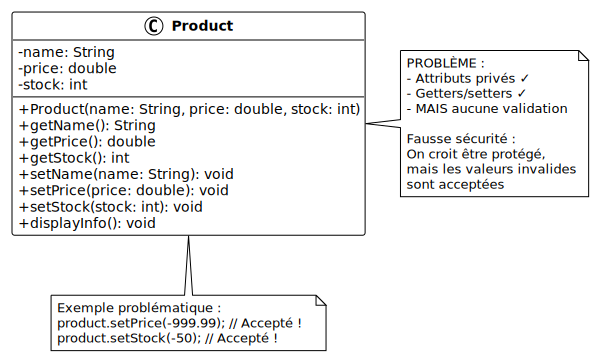

# À éviter : Encapsulation sans validation

## Objectif

Comprendre qu'avoir des getters et setters ne suffit pas : sans validation, on
n'a pas résolu les problèmes de l'encapsulation.

## Problème illustré

Encapsulation sans validation :

- ✓ Attributs privés (bon début)
- ✓ Getters et setters (bon début)
- Mais aucune validation !
- États invalides toujours possibles
- Fausse sécurité

## Diagramme UML



## Code problématique

Créez un fichier `ErrorExample.java` avec le code suivant :

```java
// MAUVAISE PRATIQUE : encapsulation sans validation
class Product {
    private String name;
    private double price;
    private int stock;

    // Constructeur SANS validation
    public Product(String name, double price, int stock) {
        this.name = name;
        this.price = price;
        this.stock = stock;
    }

    // Getters
    public String getName() { return name; }
    public double getPrice() { return price; }
    public int getStock() { return stock; }

    // Setters SANS validation
    public void setName(String name) {
        this.name = name;  // Aucune vérification !
    }

    public void setPrice(double price) {
        this.price = price;  // Aucune vérification !
    }

    public void setStock(int stock) {
        this.stock = stock;  // Aucune vérification !
    }

    public void displayInfo() {
        System.out.println("Produit: " + name);
        System.out.println("Prix: " + price + " CHF");
        System.out.println("Stock: " + stock + " unités");
    }
}

public class ErrorExample {
    public static void main(String[] args) {
        System.out.println("=== Démonstration des problèmes ===\n");

        // PROBLÈME 1 : Création avec valeurs invalides
        System.out.println("Problème 1 - Constructeur sans validation:");
        Product product1 = new Product("", -50.0, -100);
        product1.displayInfo();
        System.out.println("^ Nom vide, prix négatif, stock négatif : tous acceptés !\n");

        // PROBLÈME 2 : Setters acceptent n'importe quoi
        System.out.println("Problème 2 - Setters sans validation:");
        Product product2 = new Product("Ordinateur", 1000.0, 10);

        product2.setName(null);         // Null accepté !
        product2.setPrice(-999.99);     // Prix négatif accepté !
        product2.setStock(-50);         // Stock négatif accepté !

        product2.displayInfo();
        System.out.println("^ Toutes les modifications invalides ont été acceptées !\n");

        // PROBLÈME 3 : États incohérents
        System.out.println("Problème 3 - États incohérents:");
        Product product3 = new Product("Livre", 25.0, 5);

        product3.setName("");           // Produit sans nom
        product3.setPrice(0.0);         // Produit gratuit ?
        product3.setStock(Integer.MAX_VALUE);  // Stock irréaliste

        product3.displayInfo();
        System.out.println("^ L'objet est techniquement valide mais logiquement absurde !\n");

        // PROBLÈME 4 : Pas de protection des règles métier
        System.out.println("Problème 4 - Règles métier non respectées:");
        Product product4 = new Product("Téléphone", 800.0, 3);

        // Dans la vraie vie, on ne devrait pas pouvoir mettre un prix à 0.01
        product4.setPrice(0.01);

        // Ou un stock de 1 million alors qu'on est une petite boutique
        product4.setStock(1000000);

        product4.displayInfo();
        System.out.println("^ Les règles métier ne sont pas appliquées !\n");

        // PROBLÈME 5 : Fausse sécurité
        System.out.println("Problème 5 - Fausse sécurité:");
        System.out.println("Les développeurs pensent que l'encapsulation protège");
        System.out.println("les données, mais sans validation, c'est une illusion.");
        System.out.println("C'est pire que pas d'encapsulation : on croit être protégé !");
    }
}
```

<details>
<summary>Description du code</summary>

Déclaration de la classe `Product` avec trois attributs privés : `name`,
`price`, `stock`. Encapsulation de base présente.

Définition du constructeur qui accepte trois paramètres et les affecte
directement aux attributs sans aucune validation.

Déclaration des getters pour accéder aux attributs privés.

Déclaration des setters qui modifient directement les attributs sans aucune
validation : pas de vérification de `null`, pas de vérification de valeurs
négatives, pas de vérification de cohérence.

Déclaration de `displayInfo()` pour afficher les informations du produit.

Dans `main`, création d'un produit avec des valeurs invalides : nom vide, prix
négatif, stock négatif. Le constructeur accepte toutes ces valeurs.

Création d'un second produit avec des valeurs valides, puis utilisation des
setters pour affecter des valeurs invalides : `null`, prix négatif, stock
négatif. Tous acceptés.

Création d'un troisième produit et utilisation des setters pour créer un état
logiquement incohérent : nom vide, prix zéro, stock `Integer.MAX_VALUE`.

Création d'un quatrième produit et violation des règles métier : prix dérisoire
de 0.01 CHF, stock irréaliste de 1 million.

Commentaires expliquant que l'encapsulation sans validation donne une fausse
impression de sécurité.

</details>

## Exécution

Compilez et exécutez le programme :

```bash
javac ErrorExample.java
java ErrorExample
```

**Résultat :**

```
=== Démonstration des problèmes ===

Problème 1 - Constructeur sans validation:
Produit:
Prix: -50.0 CHF
Stock: -100 unités
^ Nom vide, prix négatif, stock négatif : tous acceptés !

Problème 2 - Setters sans validation:
Produit: null
Prix: -999.99 CHF
Stock: -50 unités
^ Toutes les modifications invalides ont été acceptées !

Problème 3 - États incohérents:
Produit:
Prix: 0.0 CHF
Stock: 2147483647 unités
^ L'objet est techniquement valide mais logiquement absurde !

Problème 4 - Règles métier non respectées:
Produit: Téléphone
Prix: 0.01 CHF
Stock: 1000000 unités
^ Les règles métier ne sont pas appliquées !

Problème 5 - Fausse sécurité:
Les développeurs pensent que l'encapsulation protège
les données, mais sans validation, c'est une illusion.
C'est pire que pas d'encapsulation : on croit être protégé !
```

## Pourquoi c'est problématique

- **Fausse sécurité** : on croit être protégé mais on ne l'est pas
- **États invalides** : objets dans des états illogiques ou impossibles
- **Pas de garanties** : impossible de faire confiance aux données
- **Bugs cachés** : les erreurs se propagent silencieusement
- **Maintenance difficile** : impossible de savoir si les données sont
  cohérentes

## Solution correcte

Consultez l'exemple
[02-encapsulation-validation](../02-encapsulation-validation/) pour voir comment
ajouter la validation :

```java
class Product {
    private String name;
    private double price;
    private int stock;

    public Product(String name, double price, int stock) {
        // ✓ Validation dans le constructeur
        if (name == null || name.trim().isEmpty()) {
            throw new IllegalArgumentException("Le nom ne peut pas être vide");
        }
        if (price < 0) {
            throw new IllegalArgumentException("Le prix ne peut pas être négatif");
        }
        if (stock < 0) {
            throw new IllegalArgumentException("Le stock ne peut pas être négatif");
        }
        this.name = name;
        this.price = price;
        this.stock = stock;
    }

    // ✓ Setters avec validation
    public void setPrice(double price) {
        if (price < 0) {
            System.out.println("Erreur: le prix ne peut pas être négatif");
            return;
        }
        this.price = price;
    }
    // ... autres setters avec validation
}
```

## Points clés

- L'encapsulation seule ne suffit pas
- **Toujours** valider dans le constructeur
- **Toujours** valider dans les setters
- **Toujours** définir des règles métier claires
- Rejeter les valeurs invalides avec des messages explicites
- L'encapsulation + validation = intégrité des données

## Règles de validation courantes

- **Chaînes** : pas `null`, pas vides
- **Nombres** : plages valides (ex : prix > 0, âge 0-150)
- **Relations** : cohérence entre attributs
- **Format** : emails, numéros de téléphone, etc.
- **Règles métier** : limites spécifiques au domaine

**La validation est aussi importante que l'encapsulation elle-même.**
