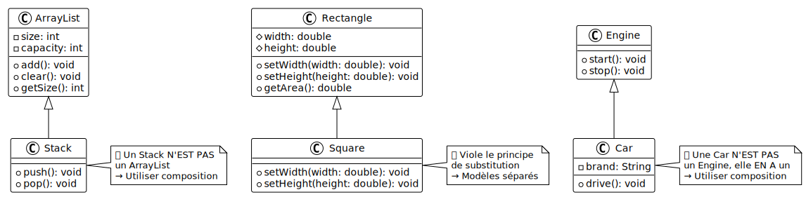

# À éviter : Héritage utilisé incorrectement

## Objectif

Comprendre quand l'héritage est mal utilisé et reconnaître les anti-patterns
courants.

## Problème illustré

Héritage mal utilisé :

- Héritage pour réutiliser du code sans relation logique
- Violation du principe "est-un" (is-a relationship)
- Hiérarchies trop profondes ou trop larges
- Héritage quand la composition serait meilleure
- Classes qui héritent de classes concrètes pour commodité

## Diagramme UML



## Code problématique

Créez un fichier `ErrorExample.java` avec le code suivant :

```java
// MAUVAISE PRATIQUE 1 : Héritage pour réutiliser du code (violation "est-un")
class ArrayList {
    private int size;
    private int capacity;

    public ArrayList() {
        size = 0;
        capacity = 10;
    }

    public int getSize() { return size; }
    public void add() { size++; }
    public void clear() { size = 0; }
}

// ERREUR : Un Stack n'EST PAS un ArrayList !
// On hérite juste pour réutiliser le code
class Stack extends ArrayList {
    public void push() {
        add();  // Réutilise add() mais sémantiquement incorrect
    }

    public void pop() {
        // Logique incorrecte
    }
}

// MAUVAISE PRATIQUE 2 : Hiérarchie non logique
class Rectangle {
    protected double width;
    protected double height;

    public Rectangle(double width, double height) {
        this.width = width;
        this.height = height;
    }

    public void setWidth(double width) { this.width = width; }
    public void setHeight(double height) { this.height = height; }

    public double getArea() {
        return width * height;
    }
}

// ERREUR : Un carré n'EST PAS vraiment un rectangle en POO
// (Problème du carré-rectangle classique)
class Square extends Rectangle {
    public Square(double side) {
        super(side, side);
    }

    // Doit maintenir width == height
    @Override
    public void setWidth(double width) {
        super.setWidth(width);
        super.setHeight(width);  // Casse le principe de substitution de Liskov
    }

    @Override
    public void setHeight(double height) {
        super.setWidth(height);
        super.setHeight(height);
    }
}

// MAUVAISE PRATIQUE 3 : Composition serait mieux
class Engine {
    public void start() {
        System.out.println("Moteur démarré");
    }

    public void stop() {
        System.out.println("Moteur arrêté");
    }
}

// ERREUR : Une voiture n'EST PAS un moteur !
// Elle A un moteur (composition, pas héritage)
class Car extends Engine {
    private String brand;

    public Car(String brand) {
        this.brand = brand;
    }

    public void drive() {
        start();  // Hérite de Engine
        System.out.println(brand + " roule");
    }
}

public class ErrorExample {
    public static void main(String[] args) {
        System.out.println("=== Démonstration des problèmes ===\n");

        // PROBLÈME 1 : Stack hérite de ArrayList
        System.out.println("Problème 1 - Héritage pour réutiliser du code:");
        Stack stack = new Stack();
        stack.push();
        stack.push();

        // On peut appeler des méthodes d'ArrayList qui n'ont pas de sens pour un Stack !
        stack.clear();  // Un Stack devrait avoir pop(), pas clear() !
        System.out.println("Taille du stack: " + stack.getSize());
        System.out.println("^ On peut accéder à des méthodes qui violent l'abstraction Stack !\n");

        // PROBLÈME 2 : Square hérite de Rectangle (problème classique)
        System.out.println("Problème 2 - Violation du principe de substitution:");
        Rectangle rect = new Rectangle(5, 3);
        System.out.println("Rectangle (5x3) - Aire: " + rect.getArea());

        Square square = new Square(4);
        System.out.println("Carré (4x4) - Aire: " + square.getArea());

        // Le problème apparaît ici :
        Rectangle rectRef = square;  // Un carré est traité comme un rectangle
        rectRef.setWidth(5);         // On change seulement la largeur...
        rectRef.setHeight(3);        // Puis la hauteur...

        // Comportement inattendu : les deux changent ensemble !
        System.out.println("Après setWidth(5) et setHeight(3):");
        System.out.println("Largeur: " + square.width + ", Hauteur: " + square.height);
        System.out.println("^ Le carré ne maintient pas width == height comme prévu !\n");

        // PROBLÈME 3 : Car hérite de Engine
        System.out.println("Problème 3 - Composition serait mieux:");
        Car car = new Car("Tesla");
        car.drive();

        // On peut traiter une Car comme un Engine !
        Engine engine = car;
        engine.start();
        System.out.println("^ Une voiture n'est pas un moteur, elle EN A un !\n");

        // CONCLUSION
        System.out.println("=== Conclusion ===");
        System.out.println("L'héritage doit respecter la relation 'est-un' (is-a):");
        System.out.println("✓ Un Dog EST un Animal → héritage approprié");
        System.out.println("✓ Un Developer EST un Employee → héritage approprié");
        System.out.println("Un Stack N'EST PAS un ArrayList → composition");
        System.out.println("Une Car N'EST PAS un Engine → composition");
        System.out.println("Un Square pose problème avec Rectangle → modèles séparés");
    }
}
```

<details>
<summary>Description du code</summary>

Déclaration de la classe `ArrayList` avec attributs `size` et `capacity` et
méthodes `add()` et `clear()`.

Déclaration de la classe `Stack` avec `extends ArrayList`. Violation du principe
"est-un" : un Stack n'est pas conceptuellement un ArrayList, mais hérite pour
réutiliser le code.

Déclaration des méthodes `push()` et `pop()` qui utilisent les méthodes héritées
de manière inappropriée.

Déclaration de la classe `Rectangle` avec attributs `width` et `height` et
méthodes `setWidth()`, `setHeight()`, `getArea()`.

Déclaration de la classe `Square` héritant de `Rectangle`. Redéfinition de
`setWidth()` et `setHeight()` pour maintenir `width == height`. Cela viole le
principe de substitution de Liskov : on ne peut pas substituer un Square à un
Rectangle sans changer le comportement attendu.

Déclaration de la classe `Engine` avec méthodes `start()` et `stop()`.

Déclaration de la classe `Car` héritant de `Engine`. Violation de "est-un" : une
voiture n'est pas un moteur, elle contient un moteur. La composition serait
appropriée.

Dans `main`, création d'un `Stack` et appel de `push()`. Ensuite, appel de
`clear()` qui est hérité d'ArrayList mais n'a pas de sens sémantique pour un
Stack.

Création d'un `Rectangle` et d'un `Square`, puis affectation du `Square` à une
référence de type `Rectangle`. Appels successifs à `setWidth(5)` et
`setHeight(3)`. Comportement inattendu car `Square` redéfinit ces méthodes pour
maintenir l'égalité des côtés.

Création d'une `Car` et affectation à une référence de type `Engine`, montrant
qu'on peut traiter incorrectement une voiture comme un moteur.

Section de conclusion expliquant les relations "est-un" appropriées et
inappropriées.

</details>

## Exécution

Compilez et exécutez le programme :

```bash
javac ErrorExample.java
java ErrorExample
```

**Résultat :**

```
=== Démonstration des problèmes ===

Problème 1 - Héritage pour réutiliser du code:
Taille du stack: 0
^ On peut accéder à des méthodes qui violent l'abstraction Stack !

Problème 2 - Violation du principe de substitution:
Rectangle (5x3) - Aire: 15.0
Carré (4x4) - Aire: 16.0
Après setWidth(5) et setHeight(3):
Largeur: 3.0, Hauteur: 3.0
^ Le carré ne maintient pas width == height comme prévu !

Problème 3 - Composition serait mieux:
Moteur démarré
Tesla roule
Moteur démarré
^ Une voiture n'est pas un moteur, elle EN A un !

=== Conclusion ===
L'héritage doit respecter la relation 'est-un' (is-a):
✓ Un Dog EST un Animal → héritage approprié
✓ Un Developer EST un Employee → héritage approprié
Un Stack N'EST PAS un ArrayList → composition
Une Car N'EST PAS un Engine → composition
Un Square pose problème avec Rectangle → modèles séparés
```

## Pourquoi c'est problématique

- **Violation de "est-un"** : héritage utilisé pour commodité, pas logique
- **Exposition de méthodes inappropriées** : interface publique incohérente
- **Principe de Liskov violé** : impossible de substituer la sous-classe
- **Couplage fort** : modifications du parent cassent l'enfant
- **Confusion sémantique** : le code est difficile à comprendre

## Solutions correctes

### Pour Stack : utiliser la composition

```java
class Stack {
    private ArrayList data;  // ✓ Composition : un Stack A un ArrayList

    public void push(Object item) { data.add(item); }
    public Object pop() { /* ... */ }
    // Pas d'exposition des méthodes d'ArrayList
}
```

### Pour Car : utiliser la composition

```java
class Car {
    private Engine engine;   // ✓ Composition : une Car A un Engine
    private String brand;

    public void start() { engine.start(); }
    public void drive() { /* ... */ }
}
```

### Pour Square/Rectangle : modèles séparés

```java
interface Shape {
    double getArea();
}

class Rectangle implements Shape { /* ... */ }
class Square implements Shape { /* ... */ }
// Pas de relation d'héritage
```

## Règles pour un héritage correct

**Utilisez l'héritage quand :**

- La relation "est-un" est vraiment vraie (Dog EST un Animal)
- Vous voulez du polymorphisme (traitement uniforme)
- La sous-classe **étend** le parent, pas juste réutilise

**Utilisez la composition quand :**

- La relation est "a-un" (Car A un Engine)
- Vous voulez réutiliser du code sans relation logique
- Vous voulez plus de flexibilité

## Points clés

- L'héritage crée un couplage fort : à utiliser avec précaution
- Toujours vérifier la relation "est-un" avant d'hériter
- "Favoriser la composition plutôt que l'héritage" est une bonne pratique
- Le principe de substitution de Liskov doit être respecté
- L'héritage est puissant mais souvent sur-utilisé

**L'héritage n'est pas un outil de réutilisation de code, c'est un outil de
modélisation conceptuelle.**
