# Programmation orientée objet : Encapsulation et héritage - Exercices

V. Guidoux, avec l'aide de
[GitHub Copilot](https://github.com/features/copilot).

Ce travail est sous licence [CC BY-SA 4.0][licence].

> [!TIP]
>
> Toutes les informations relatives à ce contenu sont décrites dans le
> [contenu principal](../).

## Table des matières

- [Table des matières](#table-des-matières)
- [Exercices](#exercices)
- [Exercices de complétion](#exercices-de-complétion)
  - [Exercice 1 - Encapsulation d'une classe simple](#exercice-1---encapsulation-dune-classe-simple)
  - [Exercice 2 - Validation dans les setters](#exercice-2---validation-dans-les-setters)
  - [Exercice 3 - Héritage simple avec véhicules](#exercice-3---héritage-simple-avec-véhicules)
  - [Exercice 4 - Redéfinition de méthodes](#exercice-4---redéfinition-de-méthodes)
  - [Exercice 5 - Utilisation du modificateur `protected`](#exercice-5---utilisation-du-modificateur-protected)
- [Exercices de prédiction](#exercices-de-prédiction)
  - [Exercice 6 - Polymorphisme avec formes géométriques](#exercice-6---polymorphisme-avec-formes-géométriques)
  - [Exercice 7 - Comportement de `super()` dans les constructeurs](#exercice-7---comportement-de-super-dans-les-constructeurs)
- [Exercices de comparaison](#exercices-de-comparaison)
  - [Exercice 8 - Composition vs héritage](#exercice-8---composition-vs-héritage)
  - [Exercice 9 - Validation dans constructeur vs setters](#exercice-9---validation-dans-constructeur-vs-setters)
- [Exercices de modification](#exercices-de-modification)
  - [Exercice 10 - Refactorisation pour améliorer l'encapsulation](#exercice-10---refactorisation-pour-améliorer-lencapsulation)
  - [Exercice 11 - Ajout d'une classe abstraite](#exercice-11---ajout-dune-classe-abstraite)
- [Exercices de transfert](#exercices-de-transfert)
  - [Exercice 12 - Système de gestion de zoo](#exercice-12---système-de-gestion-de-zoo)
  - [Exercice 13 - Système de paiement avec polymorphisme](#exercice-13---système-de-paiement-avec-polymorphisme)
- [Conclusion](#conclusion)

## Exercices

> [!NOTE]
>
> Bien que ces exercices puissent paraître simples et que leur solution est
> disponible dans ce même document, il est fortement recommandé de les réaliser
> sans consulter les solutions au préalable.
>
> Ils ont pour but de vous former et de pratiquer les concepts vus dans le
> contenu de cours.
>
> Il est donc important de les faire par vous-même avant de vérifier vos
> réponses avec les solutions fournies.

## Exercices de complétion

Ces exercices vous permettent de pratiquer la syntaxe et les concepts de base en
complétant du code existant. La difficulté augmente progressivement.

### Exercice 1 - Encapsulation d'une classe simple

Vous devez encapsuler correctement une classe `Person` qui contient des
informations sur une personne.

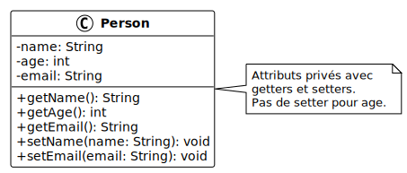

Complétez le code suivant en ajoutant l'encapsulation appropriée :

```java
public class Person {
    // TODO: Rendez les attributs privés et ajoutez les getters/setters appropriés
    String name;
    int age;
    String email;

}

public class Main {
    public static void main(String[] args) {
        Person person = new Person();
        // TODO: Utilisez les setters pour initialiser les attributs
        person.name = "Alice Dupont";
        person.age = 25;
        person.email = "alice.dupont@example.com";

        // TODO: Utilisez les getters pour afficher les informations
        System.out.println("Name: " + person.name);
        System.out.println("Age: " + person.age);
        System.out.println("Email: " + person.email);
    }
}
```

**Résultat attendu** : Une classe correctement encapsulée avec des attributs
privés et des méthodes d'accès publiques.

<details>
<summary>Indice</summary>

L'encapsulation consiste à marquer les attributs comme `private` et à fournir
des méthodes publiques `get` et `set` pour y accéder. Par exemple, pour un
attribut `name`, créez `getName()` et `setName(String name)`.

</details>

<details>
<summary>Afficher la solution</summary>

```java
public class Person {
    private String name;
    private int age;
    private String email;

    public String getName() {
        return name;
    }

    public void setName(String name) {
        this.name = name;
    }

    public int getAge() {
        return age;
    }

    public void setAge(int age) {
        this.age = age;
    }

    public String getEmail() {
        return email;
    }

    public void setEmail(String email) {
        this.email = email;
    }
}

public class Main {
    public static void main(String[] args) {
        Person person = new Person();
        person.setName("Alice Dupont");
        person.setAge(25);
        person.setEmail("alice.dupont@example.com");

        System.out.println("Name: " + person.getName());
        System.out.println("Age: " + person.getAge());
        System.out.println("Email: " + person.getEmail());
    }
}
```

**Explication** : Les attributs sont maintenant `private`, ce qui empêche
l'accès direct depuis l'extérieur de la classe. Les getters et setters
fournissent un accès contrôlé aux données. Cette approche permet de modifier
l'implémentation interne sans affecter le code qui utilise la classe.

</details>

### Exercice 2 - Validation dans les setters

Vous devez créer une classe `Product` avec validation pour garantir l'intégrité
des données.

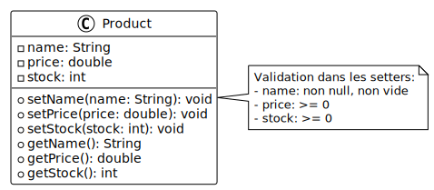

Complétez le code suivant en ajoutant la validation appropriée :

```java
public class Product {
    private String name;
    private double price;
    private int stock;

    // TODO: Créez un setter pour name qui refuse les chaînes vides ou null
    public void setName(String name) {

    }

    // TODO: Créez un setter pour price qui refuse les valeurs négatives
    public void setPrice(double price) {

    }

    // TODO: Créez un setter pour stock qui refuse les valeurs négatives
    public void setStock(int stock) {

    }

    // Getters
    public String getName() {
        return name;
    }

    public double getPrice() {
        return price;
    }

    public int getStock() {
        return stock;
    }
}

public class Main {
    public static void main(String[] args) {
        Product product = new Product();
        product.setName("Laptop");
        product.setPrice(1200.0);
        product.setStock(15);

        System.out.println("Product: " + product.getName());
        System.out.println("Price: " + product.getPrice() + " CHF");
        System.out.println("Stock: " + product.getStock());

        // Tests de validation
        product.setName("");  // Ne devrait pas modifier le nom
        product.setPrice(-100);  // Ne devrait pas modifier le prix
        product.setStock(-5);  // Ne devrait pas modifier le stock
    }
}
```

**Résultat attendu** : Des setters qui valident les données avant de les
assigner et affichent des messages d'erreur en cas de valeur invalide.

<details>
<summary>Indice</summary>

Dans chaque setter, vérifiez la validité de la valeur avant de l'assigner. Pour
le nom, utilisez `name == null || name.isEmpty()` pour détecter les valeurs
invalides. Pour les nombres, vérifiez qu'ils sont supérieurs ou égaux à 0.

</details>

<details>
<summary>Afficher la solution</summary>

```java
public class Product {
    private String name;
    private double price;
    private int stock;

    public void setName(String name) {
        if (name == null || name.isEmpty()) {
            System.out.println("Error: Product name cannot be empty");
            return;
        }
        this.name = name;
    }

    public void setPrice(double price) {
        if (price < 0) {
            System.out.println("Error: Price cannot be negative");
            return;
        }
        this.price = price;
    }

    public void setStock(int stock) {
        if (stock < 0) {
            System.out.println("Error: Stock cannot be negative");
            return;
        }
        this.stock = stock;
    }

    public String getName() {
        return name;
    }

    public double getPrice() {
        return price;
    }

    public int getStock() {
        return stock;
    }
}

public class Main {
    public static void main(String[] args) {
        Product product = new Product();
        product.setName("Laptop");
        product.setPrice(1200.0);
        product.setStock(15);

        System.out.println("Product: " + product.getName());
        System.out.println("Price: " + product.getPrice() + " CHF");
        System.out.println("Stock: " + product.getStock());

        System.out.println("\n--- Tests de validation ---");
        product.setName("");
        product.setPrice(-100);
        product.setStock(-5);

        System.out.println("\nProduct after invalid updates: " + product.getName());
        System.out.println("Price after invalid update: " + product.getPrice() + " CHF");
        System.out.println("Stock after invalid update: " + product.getStock());
    }
}
```

**Sortie attendue** :

```text
Product: Laptop
Price: 1200.0 CHF
Stock: 15

--- Tests de validation ---
Error: Product name cannot be empty
Error: Price cannot be negative
Error: Stock cannot be negative

Product after invalid updates: Laptop
Price after invalid update: 1200.0 CHF
Stock after invalid update: 15
```

**Explication** : Les setters vérifient la validité des données avant de les
assigner. Si une valeur est invalide, un message d'erreur est affiché et
l'attribut conserve sa valeur précédente. Cette validation protège l'intégrité
des données de l'objet.

</details>

### Exercice 3 - Héritage simple avec véhicules

Vous devez créer une hiérarchie de classes pour représenter différents types de
véhicules.


Complétez le code suivant :

```java
// Classe parent
public class Vehicle {
    private String brand;
    private String model;
    private int year;

    public Vehicle(String brand, String model, int year) {
        this.brand = brand;
        this.model = model;
        this.year = year;
    }

    public void displayInfo() {
        System.out.println(year + " " + brand + " " + model);
    }

    // Getters
    public String getBrand() {
        return brand;
    }

    public String getModel() {
        return model;
    }

    public int getYear() {
        return year;
    }
}

// TODO: Créez une classe Car qui hérite de Vehicle
// et ajoute un attribut numberOfDoors (int)


// TODO: Créez une classe Motorcycle qui hérite de Vehicle
// et ajoute un attribut hasSidecar (boolean)


public class Main {
    public static void main(String[] args) {
        Car car = new Car("Tesla", "Model 3", 2023, 4);
        Motorcycle motorcycle = new Motorcycle("Harley-Davidson", "Street 750", 2022, false);

        car.displayInfo();
        System.out.println("Number of doors: " + car.getNumberOfDoors());

        motorcycle.displayInfo();
        System.out.println("Has sidecar: " + motorcycle.hasSidecar());
    }
}
```

**Résultat attendu** : Deux classes dérivées qui héritent de `Vehicle` et
ajoutent leurs propres attributs spécifiques.

<details>
<summary>Indice</summary>

Utilisez le mot-clé `extends` pour créer une relation d'héritage. Dans le
constructeur de la classe dérivée, appelez `super()` pour initialiser les
attributs de la classe parent. Ajoutez ensuite les attributs spécifiques à la
classe dérivée.

</details>

<details>
<summary>Afficher la solution</summary>

```java
public class Vehicle {
    private String brand;
    private String model;
    private int year;

    public Vehicle(String brand, String model, int year) {
        this.brand = brand;
        this.model = model;
        this.year = year;
    }

    public void displayInfo() {
        System.out.println(year + " " + brand + " " + model);
    }

    public String getBrand() {
        return brand;
    }

    public String getModel() {
        return model;
    }

    public int getYear() {
        return year;
    }
}

public class Car extends Vehicle {
    private int numberOfDoors;

    public Car(String brand, String model, int year, int numberOfDoors) {
        super(brand, model, year);
        this.numberOfDoors = numberOfDoors;
    }

    public int getNumberOfDoors() {
        return numberOfDoors;
    }
}

public class Motorcycle extends Vehicle {
    private boolean hasSidecar;

    public Motorcycle(String brand, String model, int year, boolean hasSidecar) {
        super(brand, model, year);
        this.hasSidecar = hasSidecar;
    }

    public boolean hasSidecar() {
        return hasSidecar;
    }
}

public class Main {
    public static void main(String[] args) {
        Car car = new Car("Tesla", "Model 3", 2023, 4);
        Motorcycle motorcycle = new Motorcycle("Harley-Davidson", "Street 750", 2022, false);

        car.displayInfo();
        System.out.println("Number of doors: " + car.getNumberOfDoors());

        System.out.println();

        motorcycle.displayInfo();
        System.out.println("Has sidecar: " + motorcycle.hasSidecar());
    }
}
```

**Sortie attendue** :

```text
2023 Tesla Model 3
Number of doors: 4

2022 Harley-Davidson Street 750
Has sidecar: false
```

**Explication** : `Car` et `Motorcycle` héritent de `Vehicle`, ce qui leur
permet de réutiliser les attributs et méthodes de la classe parent. L'appel à
`super()` dans les constructeurs initialise les attributs hérités. Chaque classe
dérivée ajoute ses propres attributs spécifiques sans dupliquer le code commun.

</details>

### Exercice 4 - Redéfinition de méthodes

Vous devez créer une hiérarchie d'animaux où chaque type d'animal a son propre
cri.

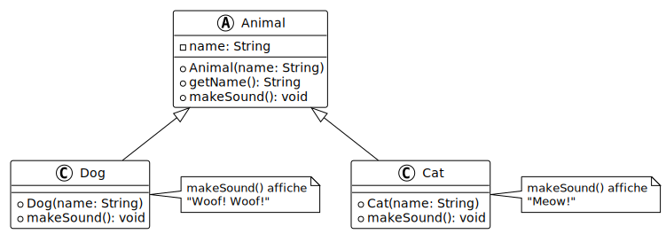

Complétez le code suivant :

```java
public class Animal {
    private String name;

    public Animal(String name) {
        this.name = name;
    }

    public void makeSound() {
        System.out.println(name + " makes a generic sound");
    }

    public String getName() {
        return name;
    }
}

// TODO: Créez une classe Dog qui hérite de Animal
// et redéfinit makeSound() pour afficher "barks: Woof! Woof!"


// TODO: Créez une classe Cat qui hérite de Animal
// et redéfinit makeSound() pour afficher "meows: Meow! Meow!"


public class Main {
    public static void main(String[] args) {
        Animal animal = new Animal("Generic Animal");
        Dog dog = new Dog("Rex");
        Cat cat = new Cat("Whiskers");

        animal.makeSound();
        dog.makeSound();
        cat.makeSound();
    }
}
```

**Résultat attendu** : Chaque type d'animal produit son propre cri spécifique.

<details>
<summary>Indice</summary>

Pour redéfinir une méthode, déclarez une méthode avec exactement la même
signature dans la classe dérivée. Utilisez l'annotation `@Override` pour
indiquer que vous redéfinissez une méthode. Dans la méthode redéfinie, vous
pouvez utiliser `getName()` pour accéder au nom de l'animal.

</details>

<details>
<summary>Afficher la solution</summary>

```java
public class Animal {
    private String name;

    public Animal(String name) {
        this.name = name;
    }

    public void makeSound() {
        System.out.println(name + " makes a generic sound");
    }

    public String getName() {
        return name;
    }
}

public class Dog extends Animal {
    public Dog(String name) {
        super(name);
    }

    @Override
    public void makeSound() {
        System.out.println(getName() + " barks: Woof! Woof!");
    }
}

public class Cat extends Animal {
    public Cat(String name) {
        super(name);
    }

    @Override
    public void makeSound() {
        System.out.println(getName() + " meows: Meow! Meow!");
    }
}

public class Main {
    public static void main(String[] args) {
        Animal animal = new Animal("Generic Animal");
        Dog dog = new Dog("Rex");
        Cat cat = new Cat("Whiskers");

        animal.makeSound();
        dog.makeSound();
        cat.makeSound();
    }
}
```

**Sortie attendue** :

```text
Generic Animal makes a generic sound
Rex barks: Woof! Woof!
Whiskers meows: Meow! Meow!
```

**Explication** : La redéfinition de méthode permet aux classes dérivées de
fournir leur propre implémentation d'une méthode héritée. L'annotation
`@Override` aide à détecter les erreurs de signature et améliore la lisibilité
du code. Chaque animal peut maintenant produire son cri caractéristique tout en
partageant la structure commune de la classe `Animal`.

</details>

### Exercice 5 - Utilisation du modificateur `protected`

Vous devez créer une classe de jeu où les classes dérivées peuvent accéder
directement à certains attributs de la classe parent.

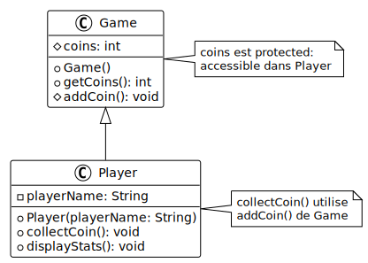

Complétez le code suivant :

```java
public class Game {
    private String title;
    // TODO: Rendez l'attribut coins "protected" au lieu de "private"
    // pour que les classes dérivées puissent y accéder
    private int coins;

    public Game(String title, int initialCoins) {
        this.title = title;
        this.coins = initialCoins;
    }

    public void displayStatus() {
        System.out.println("Game: " + title);
        System.out.println("Coins: " + coins);
    }

    public String getTitle() {
        return title;
    }

    public int getCoins() {
        return coins;
    }
}

// TODO: Créez une classe Player qui hérite de Game
// et ajoute une méthode collectCoin() qui incrémente directement coins


public class Main {
    public static void main(String[] args) {
        Player player = new Player("Adventure Quest", 10);
        player.displayStatus();

        System.out.println("\n--- Collecting coins ---");
        player.collectCoin();
        player.collectCoin();
        player.collectCoin();

        player.displayStatus();
    }
}
```

**Résultat attendu** : Une classe dérivée qui peut accéder directement à un
attribut `protected` de la classe parent.

<details>
<summary>Indice</summary>

Le modificateur `protected` permet aux classes dérivées d'accéder directement à
un attribut ou une méthode, contrairement à `private`. Dans la classe `Player`,
vous pouvez simplement incrémenter `coins++` car l'attribut est maintenant
`protected`.

</details>

<details>
<summary>Afficher la solution</summary>

```java
public class Game {
    private String title;
    protected int coins;

    public Game(String title, int initialCoins) {
        this.title = title;
        this.coins = initialCoins;
    }

    public void displayStatus() {
        System.out.println("Game: " + title);
        System.out.println("Coins: " + coins);
    }

    public String getTitle() {
        return title;
    }

    public int getCoins() {
        return coins;
    }
}

public class Player extends Game {
    public Player(String title, int initialCoins) {
        super(title, initialCoins);
    }

    public void collectCoin() {
        coins++;
        System.out.println("Coin collected! Total coins: " + coins);
    }
}

public class Main {
    public static void main(String[] args) {
        Player player = new Player("Adventure Quest", 10);
        player.displayStatus();

        System.out.println("\n--- Collecting coins ---");
        player.collectCoin();
        player.collectCoin();
        player.collectCoin();

        System.out.println();
        player.displayStatus();
    }
}
```

**Sortie attendue** :

```text
Game: Adventure Quest
Coins: 10

--- Collecting coins ---
Coin collected! Total coins: 11
Coin collected! Total coins: 12
Coin collected! Total coins: 13

Game: Adventure Quest
Coins: 13
```

**Explication** : Le modificateur `protected` offre un niveau d'accès
intermédiaire entre `private` et `public`. Les attributs `protected` sont
accessibles dans la classe elle-même, ses classes dérivées, et les classes du
même package. Cela permet aux classes dérivées de manipuler directement certains
attributs tout en les gardant inaccessibles depuis l'extérieur de la hiérarchie.

</details>

## Exercices de prédiction

Ces exercices vous permettent de développer votre compréhension des concepts en
prédisant le comportement du code avant de l'exécuter.

### Exercice 6 - Polymorphisme avec formes géométriques

Prédisez la sortie du programme suivant qui utilise le polymorphisme.

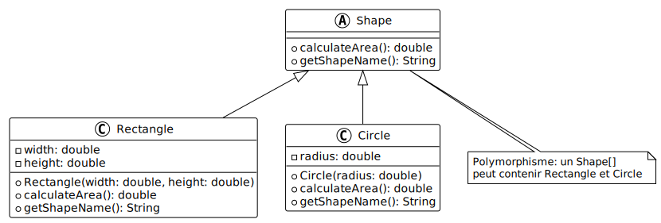

```java
public abstract class Shape {
    private String color;

    public Shape(String color) {
        this.color = color;
    }

    public abstract double calculateArea();

    public void displayInfo() {
        System.out.println("Shape: " + this.getClass().getSimpleName());
        System.out.println("Color: " + color);
        System.out.println("Area: " + calculateArea());
    }
}

public class Rectangle extends Shape {
    private double width;
    private double height;

    public Rectangle(String color, double width, double height) {
        super(color);
        this.width = width;
        this.height = height;
    }

    @Override
    public double calculateArea() {
        return width * height;
    }
}

public class Circle extends Shape {
    private double radius;

    public Circle(String color, double radius) {
        super(color);
        this.radius = radius;
    }

    @Override
    public double calculateArea() {
        return Math.PI * radius * radius;
    }
}

public class Main {
    public static void main(String[] args) {
        Shape[] shapes = new Shape[3];
        shapes[0] = new Rectangle("Red", 5.0, 3.0);
        shapes[1] = new Circle("Blue", 2.0);
        shapes[2] = new Rectangle("Green", 4.0, 4.0);

        for (Shape shape : shapes) {
            shape.displayInfo();
            System.out.println();
        }
    }
}
```

**Question** : Quelle sera la sortie de ce programme ? Expliquez comment le
polymorphisme permet d'appeler les bonnes méthodes.

<details>
<summary>Indice</summary>

Même si toutes les références sont de type `Shape`, chaque objet conserve son
type réel (`Rectangle` ou `Circle`). Lorsque `calculateArea()` est appelée,
c'est la version de la classe réelle de l'objet qui est exécutée, pas celle de
la classe de référence.

</details>

<details>
<summary>Afficher la solution</summary>

**Sortie attendue** :

```text
Shape: Rectangle
Color: Red
Area: 15.0

Shape: Circle
Color: Blue
Area: 12.566370614359172

Shape: Rectangle
Color: Green
Area: 16.0
```

**Explication** :

1. **Polymorphisme** : Le tableau `shapes` contient des références de type
   `Shape`, mais pointe vers des objets de types `Rectangle` et `Circle`.

2. **Liaison dynamique** : Lorsque `calculateArea()` est appelée sur chaque
   élément, Java détermine à l'exécution quelle version de la méthode utiliser
   en fonction du type réel de l'objet (pas du type de la référence).

3. **Méthode abstraite** : `Shape` déclare `calculateArea()` comme abstraite,
   forçant toutes les classes dérivées à fournir leur propre implémentation.

4. **`getClass().getSimpleName()`** : Cette méthode retourne le nom de la classe
   réelle de l'objet, confirmant que Java connaît le type exact à l'exécution.

Le polymorphisme permet d'écrire du code générique qui fonctionne avec
différents types d'objets de manière uniforme, tout en conservant leur
comportement spécifique.

</details>

### Exercice 7 - Comportement de `super()` dans les constructeurs

Prédisez la sortie du programme suivant qui illustre l'ordre d'exécution des
constructeurs dans une hiérarchie de classes.

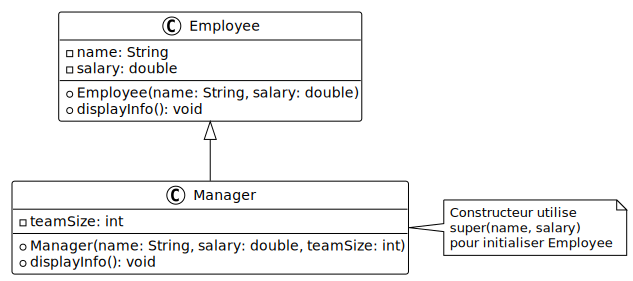

```java
public class Grandparent {
    public Grandparent() {
        System.out.println("1. Grandparent constructor");
    }
}

public class Parent extends Grandparent {
    public Parent() {
        System.out.println("2. Parent constructor");
    }

    public Parent(String message) {
        System.out.println("2. Parent constructor with message: " + message);
    }
}

public class Child extends Parent {
    public Child() {
        super("Hello from Child");
        System.out.println("3. Child constructor");
    }
}

public class Main {
    public static void main(String[] args) {
        System.out.println("=== Creating Child object ===");
        Child child = new Child();
    }
}
```

**Question** : Dans quel ordre les constructeurs sont-ils appelés ? Que se
passe-t-il si on ne spécifie pas explicitement `super()` ?

<details>
<summary>Indice</summary>

Les constructeurs sont toujours appelés de la classe parent vers la classe
dérivée. Si `super()` n'est pas explicitement appelé, Java appelle
automatiquement le constructeur sans paramètre de la classe parent.

</details>

<details>
<summary>Afficher la solution</summary>

**Sortie attendue** :

```text
=== Creating Child object ===
1. Grandparent constructor
2. Parent constructor with message: Hello from Child
3. Child constructor
```

**Explication** :

1. **Ordre d'exécution** :
   - Le constructeur de `Child` appelle `super("Hello from Child")`
   - Cela appelle le constructeur `Parent(String message)`
   - `Parent(String message)` appelle implicitement `super()` (constructeur de
     `Grandparent`)
   - `Grandparent` n'a pas de parent, son constructeur s'exécute en premier
   - Puis `Parent`, puis `Child`

2. **Règle importante** : Les constructeurs s'exécutent toujours de la racine de
   la hiérarchie vers les classes dérivées, même si l'appel semble se faire dans
   l'ordre inverse.

3. **`super()` implicite** : Si un constructeur ne commence pas par un appel
   explicite à `super()` ou `this()`, Java insère automatiquement `super()` au
   début.

4. **Choix du constructeur** : `Child` utilise `super("Hello from Child")` pour
   appeler le constructeur `Parent(String message)` au lieu du constructeur par
   défaut.

Cette chaîne de constructeurs garantit que chaque niveau de la hiérarchie est
correctement initialisé avant les niveaux suivants.

</details>

## Exercices de comparaison

Ces exercices vous permettent de comparer différentes approches de conception et
de comprendre leurs avantages et inconvénients.

### Exercice 8 - Composition vs héritage

Comparez deux approches pour modéliser une personne employée qui a une adresse.

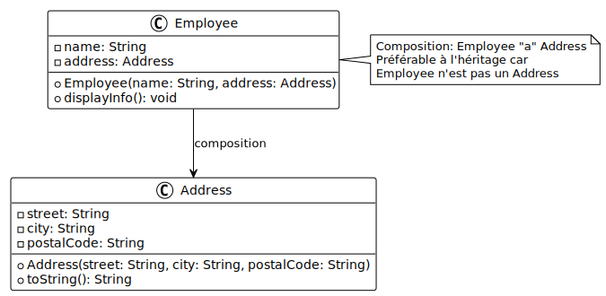

**Approche 1 - Héritage** :

```java
public class Address {
    private String street;
    private String city;
    private String postalCode;

    public Address(String street, String city, String postalCode) {
        this.street = street;
        this.city = city;
        this.postalCode = postalCode;
    }

    public String getFullAddress() {
        return street + ", " + postalCode + " " + city;
    }
}

public class Employee extends Address {
    private String name;
    private double salary;

    public Employee(String name, double salary, String street, String city, String postalCode) {
        super(street, city, postalCode);
        this.name = name;
        this.salary = salary;
    }

    public void displayInfo() {
        System.out.println("Employee: " + name);
        System.out.println("Salary: " + salary + " CHF");
        System.out.println("Address: " + getFullAddress());
    }
}
```

**Approche 2 - Composition** :

```java
public class Address {
    private String street;
    private String city;
    private String postalCode;

    public Address(String street, String city, String postalCode) {
        this.street = street;
        this.city = city;
        this.postalCode = postalCode;
    }

    public String getFullAddress() {
        return street + ", " + postalCode + " " + city;
    }
}

public class Employee {
    private String name;
    private double salary;
    private Address address;

    public Employee(String name, double salary, Address address) {
        this.name = name;
        this.salary = salary;
        this.address = address;
    }

    public void displayInfo() {
        System.out.println("Employee: " + name);
        System.out.println("Salary: " + salary + " CHF");
        System.out.println("Address: " + address.getFullAddress());
    }
}
```

**Question** : Quelle approche est préférable et pourquoi ?

<details>
<summary>Indice</summary>

Réfléchissez à la relation entre Employee et Address. Une personne employée
"est-elle" une adresse (relation "is-a") ou "a-t-elle" une adresse (relation
"has-a") ? Pensez également à la flexibilité et à la réutilisabilité du code.

</details>

<details>
<summary>Afficher la solution</summary>

**Approche recommandée** : La composition (Approche 2) est clairement
préférable.

**Raisons** :

1. **Relation sémantique incorrecte** :
   - Une personne employée n'**est pas** une adresse
   - Une personne employée **a** une adresse
   - L'héritage représente une relation "is-a", qui n'est pas appropriée ici

2. **Principe de substitution de Liskov** :
   - Avec l'héritage, on pourrait utiliser un `Employee` partout où une
     `Address` est attendue, ce qui n'a aucun sens logique
   - `Address address = new Employee(...)` serait possible mais absurde

3. **Flexibilité** :
   - Avec la composition, plusieurs personnes employées peuvent partager la même
     adresse
   - Une personne employée peut changer d'adresse facilement
   - On peut avoir une personne employée sans adresse (si `address` peut être
     `null`)

4. **Encapsulation** :
   - La composition cache mieux l'implémentation
   - On peut changer la classe `Address` sans affecter `Employee`

5. **Réutilisabilité** :
   - D'autres classes (`Customer`, `Supplier`, `Student`) peuvent aussi avoir
     une adresse sans créer une hiérarchie d'héritage complexe

**Règle générale** : Préférez la composition à l'héritage sauf si vous avez une
vraie relation "is-a" et que le principe de substitution est respecté. La
composition offre plus de flexibilité et évite les couplages forts.

**Exemple d'utilisation de la composition** :

```java
public class Main {
    public static void main(String[] args) {
        Address address = new Address("Rue de la Gare 5", "Yverdon-les-Bains", "1400");
        Employee employee1 = new Employee("Marie Curie", 85000, address);
        Employee employee2 = new Employee("Albert Einstein", 90000, address);

        employee1.displayInfo();
        System.out.println();
        employee2.displayInfo();
    }
}
```

Cet exemple montre comment deux personnes employées peuvent partager la même
adresse, ce qui serait impossible avec l'héritage.

</details>

### Exercice 9 - Validation dans constructeur vs setters

Comparez deux approches pour valider les données d'un compte bancaire.

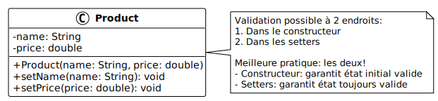

**Approche 1 - Validation uniquement dans les setters** :

```java
public class BankAccount {
    private String accountNumber;
    private double balance;

    public BankAccount(String accountNumber, double initialBalance) {
        this.accountNumber = accountNumber;
        this.balance = initialBalance;
    }

    public void setAccountNumber(String accountNumber) {
        if (accountNumber == null || accountNumber.length() != 10) {
            System.out.println("Error: Account number must be 10 characters");
            return;
        }
        this.accountNumber = accountNumber;
    }

    public void setBalance(double balance) {
        if (balance < 0) {
            System.out.println("Error: Balance cannot be negative");
            return;
        }
        this.balance = balance;
    }

    public String getAccountNumber() {
        return accountNumber;
    }

    public double getBalance() {
        return balance;
    }
}
```

**Approche 2 - Validation dans le constructeur et les setters** :

```java
public class BankAccount {
    private String accountNumber;
    private double balance;

    public BankAccount(String accountNumber, double initialBalance) {
        setAccountNumber(accountNumber);
        setBalance(initialBalance);
    }

    public void setAccountNumber(String accountNumber) {
        if (accountNumber == null || accountNumber.length() != 10) {
            System.out.println("Error: Account number must be 10 characters");
            return;
        }
        this.accountNumber = accountNumber;
    }

    public void setBalance(double balance) {
        if (balance < 0) {
            System.out.println("Error: Balance cannot be negative");
            return;
        }
        this.balance = balance;
    }

    public String getAccountNumber() {
        return accountNumber;
    }

    public double getBalance() {
        return balance;
    }
}
```

**Question** : Quelle approche est préférable ? Testez avec des données
invalides lors de la création.

<details>
<summary>Indice</summary>

Testez ce qui se passe quand vous créez un compte avec des données invalides
dans les deux approches. Quel est l'état de l'objet après sa création ?

</details>

<details>
<summary>Afficher la solution</summary>

**Approche recommandée** : L'Approche 2 (validation dans le constructeur et les
setters) est préférable.

**Test de l'Approche 1** :

```java
public class Main {
    public static void main(String[] args) {
        BankAccount account1 = new BankAccount("123", -500);
        System.out.println("Account number: " + account1.getAccountNumber());
        System.out.println("Balance: " + account1.getBalance());
    }
}
```

**Sortie Approche 1** :

```text
Account number: 123
Balance: -500.0
```

L'objet est créé dans un état invalide ! Le constructeur ne valide pas les
données.

**Test de l'Approche 2** :

```java
public class Main {
    public static void main(String[] args) {
        BankAccount account2 = new BankAccount("123", -500);
        System.out.println("Account number: " + account2.getAccountNumber());
        System.out.println("Balance: " + account2.getBalance());
    }
}
```

**Sortie Approche 2** :

```text
Error: Account number must be 10 characters
Error: Balance cannot be negative
Account number: null
Balance: 0.0
```

Les erreurs sont détectées immédiatement, mais l'objet contient toujours des
valeurs par défaut potentiellement problématiques.

**Meilleure solution** : Validation avec exception :

```java
public class BankAccount {
    private String accountNumber;
    private double balance;

    public BankAccount(String accountNumber, double initialBalance) {
        if (accountNumber == null || accountNumber.length() != 10) {
            throw new IllegalArgumentException("Account number must be 10 characters");
        }
        if (initialBalance < 0) {
            throw new IllegalArgumentException("Balance cannot be negative");
        }
        this.accountNumber = accountNumber;
        this.balance = initialBalance;
    }

    public void setBalance(double balance) {
        if (balance < 0) {
            throw new IllegalArgumentException("Balance cannot be negative");
        }
        this.balance = balance;
    }

    public String getAccountNumber() {
        return accountNumber;
    }

    public double getBalance() {
        return balance;
    }
}
```

**Avantages de cette approche** :

1. **Pas d'objet invalide** : Si la création échoue, aucun objet n'est créé
2. **Gestion d'erreur explicite** : Le code appelant doit gérer l'exception
3. **Immuabilité possible** : `accountNumber` peut être `final` car il est
   initialisé dans le constructeur
4. **Clarté** : Il est immédiatement évident si la création a réussi ou échoué

**Règle générale** : Validez toujours dans le constructeur pour garantir qu'un
objet ne peut jamais être dans un état invalide. Utilisez des exceptions pour
signaler les erreurs de construction plutôt que de retourner silencieusement.

</details>

## Exercices de modification

Ces exercices vous permettent de pratiquer la refactorisation et l'amélioration
de code existant.

### Exercice 10 - Refactorisation pour améliorer l'encapsulation

Vous devez refactoriser une classe `User` qui expose directement ses attributs
et ne respecte pas l'encapsulation.

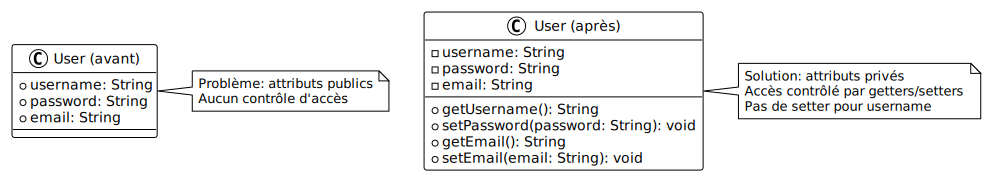

**Code initial** :

```java
public class User {
    public String username;
    public String email;
    public int age;
    public boolean isActive;

    public void displayUser() {
        System.out.println("Username: " + username);
        System.out.println("Email: " + email);
        System.out.println("Age: " + age);
        System.out.println("Active: " + isActive);
    }
}

public class Main {
    public static void main(String[] args) {
        User user = new User();
        user.username = "jdoe";
        user.email = "invalid-email";  // Pas de validation
        user.age = -5;  // Valeur impossible
        user.isActive = true;

        user.displayUser();

        // Modification directe sans contrôle
        user.age = 250;
        user.email = "";
    }
}
```

**Objectif** : Refactorez cette classe pour :

1. Rendre tous les attributs privés.
2. Ajouter un constructeur avec tous les paramètres.
3. Créer des getters pour tous les attributs.
4. Créer des setters avec validation pour :
   - `email` : doit contenir un `@`
   - `age` : doit être entre 0 et 150
   - `username` : ne doit pas être vide
5. Créer une méthode `deactivate()` pour changer le statut.

<details>
<summary>Indice</summary>

Commencez par rendre les attributs `private`, puis ajoutez un constructeur qui
utilise les setters pour assurer la validation dès la création. Dans chaque
setter, vérifiez la validité de la valeur avant de l'assigner.

</details>

<details>
<summary>Afficher la solution</summary>

```java
public class User {
    private String username;
    private String email;
    private int age;
    private boolean isActive;

    public User(String username, String email, int age) {
        setUsername(username);
        setEmail(email);
        setAge(age);
        this.isActive = true;  // Actif par défaut
    }

    public String getUsername() {
        return username;
    }

    public void setUsername(String username) {
        if (username == null || username.isEmpty()) {
            System.out.println("Error: Username cannot be empty");
            return;
        }
        this.username = username;
    }

    public String getEmail() {
        return email;
    }

    public void setEmail(String email) {
        if (email == null || !email.contains("@")) {
            System.out.println("Error: Invalid email format");
            return;
        }
        this.email = email;
    }

    public int getAge() {
        return age;
    }

    public void setAge(int age) {
        if (age < 0 || age > 150) {
            System.out.println("Error: Age must be between 0 and 150");
            return;
        }
        this.age = age;
    }

    public boolean isActive() {
        return isActive;
    }

    public void deactivate() {
        this.isActive = false;
        System.out.println("User " + username + " has been deactivated");
    }

    public void displayUser() {
        System.out.println("Username: " + username);
        System.out.println("Email: " + email);
        System.out.println("Age: " + age);
        System.out.println("Active: " + isActive);
    }
}

public class Main {
    public static void main(String[] args) {
        System.out.println("=== Creating user ===");
        User user = new User("jdoe", "john.doe@example.com", 30);
        user.displayUser();

        System.out.println("\n=== Testing validation ===");
        user.setEmail("invalid-email");
        user.setAge(-5);
        user.setAge(250);
        user.setUsername("");

        System.out.println("\n=== Valid modifications ===");
        user.setAge(31);
        user.setEmail("john.doe@newdomain.com");

        System.out.println();
        user.displayUser();

        System.out.println("\n=== Deactivation ===");
        user.deactivate();
        System.out.println("Active status: " + user.isActive());
    }
}
```

**Sortie attendue** :

```text
=== Creating user ===
Username: jdoe
Email: john.doe@example.com
Age: 30
Active: true

=== Testing validation ===
Error: Invalid email format
Error: Age must be between 0 and 150
Error: Age must be between 0 and 150
Error: Username cannot be empty

=== Valid modifications ===

Username: jdoe
Email: john.doe@newdomain.com
Age: 31
Active: true

=== Deactivation ===
User jdoe has been deactivated
Active status: false
```

**Améliorations apportées** :

1. **Encapsulation complète** : Tous les attributs sont maintenant `private`.

2. **Validation systématique** : Toutes les données sont validées avant d'être
   assignées, que ce soit lors de la création ou de la modification.

3. **Constructeur robuste** : Utilise les setters pour garantir la validation
   dès la création.

4. **Méthode métier** : `deactivate()` fournit une interface claire pour changer
   le statut au lieu de manipuler directement `isActive`.

5. **Cohérence** : Il est impossible de créer ou de mettre un objet `User` dans
   un état invalide.

6. **Convention de nommage** : Le getter pour `isActive` s'appelle `isActive()`
   au lieu de `getIsActive()`, ce qui est la convention pour les booléens.

</details>

### Exercice 11 - Ajout d'une classe abstraite

Vous devez améliorer une hiérarchie de classes de paiement en ajoutant une
classe abstraite pour factoriser le code commun.

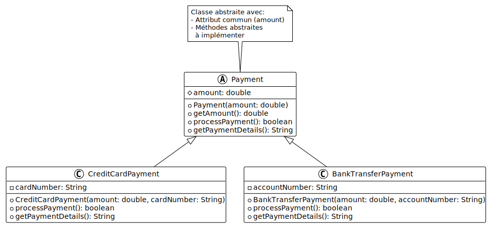

**Code initial** :

```java
public class CreditCardPayment {
    private double amount;
    private String transactionId;

    public CreditCardPayment(double amount) {
        this.amount = amount;
        this.transactionId = generateTransactionId();
    }

    private String generateTransactionId() {
        return "TXN-" + System.currentTimeMillis();
    }

    public void processPayment() {
        System.out.println("Processing credit card payment of " + amount + " CHF");
        System.out.println("Transaction ID: " + transactionId);
        System.out.println("Payment successful");
    }
}

public class PayPalPayment {
    private double amount;
    private String transactionId;

    public PayPalPayment(double amount) {
        this.amount = amount;
        this.transactionId = generateTransactionId();
    }

    private String generateTransactionId() {
        return "TXN-" + System.currentTimeMillis();
    }

    public void processPayment() {
        System.out.println("Processing PayPal payment of " + amount + " CHF");
        System.out.println("Transaction ID: " + transactionId);
        System.out.println("Payment successful");
    }
}
```

**Objectif** : Créez une classe abstraite `Payment` qui :

1. Contient les attributs communs `amount` et `transactionId`.
2. Fournit un constructeur qui initialise ces attributs.
3. Implémente `generateTransactionId()` (non abstraite).
4. Déclare une méthode abstraite `getPaymentMethod()`.
5. Implémente `processPayment()` qui utilise `getPaymentMethod()`.
6. Refactorisez `CreditCardPayment` et `PayPalPayment` pour hériter de
   `Payment`.

<details>
<summary>Indice</summary>

Identifiez ce qui est identique dans les deux classes et déplacez-le dans la
classe abstraite `Payment`. Seule la chaîne identifiant le type de paiement
diffère, ce qui justifie la méthode abstraite `getPaymentMethod()`.

</details>

<details>
<summary>Afficher la solution</summary>

```java
public abstract class Payment {
    private double amount;
    private String transactionId;

    public Payment(double amount) {
        this.amount = amount;
        this.transactionId = generateTransactionId();
    }

    private String generateTransactionId() {
        return "TXN-" + System.currentTimeMillis();
    }

    protected abstract String getPaymentMethod();

    public void processPayment() {
        System.out.println("Processing " + getPaymentMethod() + " payment of " + amount + " CHF");
        System.out.println("Transaction ID: " + transactionId);
        System.out.println("Payment successful");
    }

    public double getAmount() {
        return amount;
    }

    public String getTransactionId() {
        return transactionId;
    }
}

public class CreditCardPayment extends Payment {
    public CreditCardPayment(double amount) {
        super(amount);
    }

    @Override
    protected String getPaymentMethod() {
        return "credit card";
    }
}

public class PayPalPayment extends Payment {
    public PayPalPayment(double amount) {
        super(amount);
    }

    @Override
    protected String getPaymentMethod() {
        return "PayPal";
    }
}

public class BankTransferPayment extends Payment {
    public BankTransferPayment(double amount) {
        super(amount);
    }

    @Override
    protected String getPaymentMethod() {
        return "bank transfer";
    }
}

public class Main {
    public static void main(String[] args) {
        Payment[] payments = new Payment[3];
        payments[0] = new CreditCardPayment(150.0);
        payments[1] = new PayPalPayment(75.50);
        payments[2] = new BankTransferPayment(300.0);

        for (Payment payment : payments) {
            payment.processPayment();
            System.out.println();
        }
    }
}
```

**Sortie attendue** :

```text
Processing credit card payment of 150.0 CHF
Transaction ID: TXN-1709498765432
Payment successful

Processing PayPal payment of 75.5 CHF
Transaction ID: TXN-1709498765433
Payment successful

Processing bank transfer payment of 300.0 CHF
Transaction ID: TXN-1709498765434
Payment successful
```

**Avantages de cette refactorisation** :

1. **Élimination de la duplication** : Le code commun n'existe plus qu'à un seul
   endroit dans la classe `Payment`.

2. **Facilité de maintenance** : Modifier la génération des IDs de transaction
   ou le format des messages n'affecte qu'une seule classe.

3. **Extensibilité** : Ajouter un nouveau type de paiement (comme
   `BankTransferPayment`) ne nécessite que quelques lignes de code.

4. **Polymorphisme** : On peut traiter tous les paiements de manière uniforme
   avec un tableau de type `Payment[]`.

5. **Pattern Template Method** : `processPayment()` définit la structure de
   l'algorithme, et les classes dérivées fournissent les détails spécifiques via
   `getPaymentMethod()`.

6. **Encapsulation** : `getPaymentMethod()` est `protected` car elle n'a pas
   besoin d'être publique, seule `processPayment()` doit l'être.

Cette refactorisation illustre comment les classes abstraites permettent de
factoriser le code commun tout en laissant la liberté aux classes dérivées de
personnaliser certains aspects.

</details>

## Exercices de transfert

Ces exercices vous permettent d'appliquer tous les concepts appris dans des
contextes plus complexes et réalistes.

### Exercice 12 - Système de gestion de zoo

Créez un système complet de gestion d'animaux dans un zoo en appliquant
l'encapsulation, l'héritage et le polymorphisme.

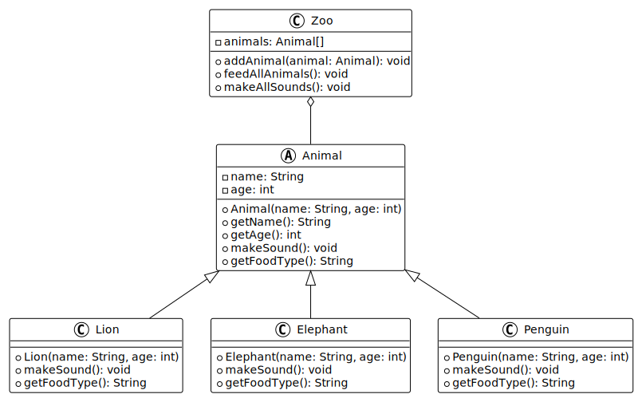

**Objectif** : Concevoir et implémenter :

1. **Classe abstraite `Animal`** :
   - Attributs : `name` (String), `age` (int), `weight` (double)
   - Constructeur avec tous les paramètres
   - Méthodes abstraites : `makeSound()`, `getSpecies()`
   - Méthode concrète : `displayInfo()` qui affiche toutes les informations

2. **Classes dérivées** (`Lion`, `Elephant`, `Penguin`) :
   - `Lion` : attribut supplémentaire `maneLength` (int en cm)
   - `Elephant` : attribut supplémentaire `trunkLength` (int en cm)
   - `Penguin` : attribut supplémentaire `canSwim` (boolean)
   - Chaque classe redéfinit `makeSound()` et `getSpecies()`
   - Chaque classe redéfinit `displayInfo()` pour afficher aussi ses attributs
     spécifiques

3. **Classe `Zoo`** :
   - Attribut : `animals` (tableau de `Animal[]`)
   - Méthode `addAnimal(Animal animal)` pour ajouter un animal
   - Méthode `displayAllAnimals()` pour afficher tous les animaux
   - Méthode `makeAllAnimalsSounds()` pour faire crier tous les animaux

**Sortie attendue** :

```text
=== Welcome to the Zoo ===

Adding animals to the zoo...

=== All Animals ===
Name: Simba
Species: Lion
Age: 5 years
Weight: 190.0 kg
Mane length: 35 cm

Name: Dumbo
Species: Elephant
Age: 12 years
Weight: 5400.0 kg
Trunk length: 180 cm

Name: Pingu
Species: Penguin
Age: 3 years
Weight: 15.5 kg
Can swim: true

=== Animal Sounds ===
Simba roars: ROAAAR!
Dumbo trumpets: TOOOOT!
Pingu calls: Squawk squawk!
```

<details>
<summary>Indice</summary>

Commencez par la classe abstraite `Animal` avec les attributs et méthodes
communs. Créez ensuite les trois classes dérivées en redéfinissant les méthodes
abstraites. Pour `displayInfo()`, utilisez `super.displayInfo()` dans les
classes dérivées avant d'afficher les attributs spécifiques. Pour `Zoo`,
utilisez un compteur pour gérer l'ajout d'animaux dans le tableau.

</details>

<details>
<summary>Afficher la solution</summary>

```java
public abstract class Animal {
    private String name;
    private int age;
    private double weight;

    public Animal(String name, int age, double weight) {
        this.name = name;
        this.age = age;
        this.weight = weight;
    }

    public abstract void makeSound();
    public abstract String getSpecies();

    public void displayInfo() {
        System.out.println("Name: " + name);
        System.out.println("Species: " + getSpecies());
        System.out.println("Age: " + age + " years");
        System.out.println("Weight: " + weight + " kg");
    }

    public String getName() {
        return name;
    }

    public int getAge() {
        return age;
    }

    public double getWeight() {
        return weight;
    }
}

public class Lion extends Animal {
    private int maneLength;

    public Lion(String name, int age, double weight, int maneLength) {
        super(name, age, weight);
        this.maneLength = maneLength;
    }

    @Override
    public void makeSound() {
        System.out.println(getName() + " roars: ROAAAR!");
    }

    @Override
    public String getSpecies() {
        return "Lion";
    }

    @Override
    public void displayInfo() {
        super.displayInfo();
        System.out.println("Mane length: " + maneLength + " cm");
    }

    public int getManeLength() {
        return maneLength;
    }
}

public class Elephant extends Animal {
    private int trunkLength;

    public Elephant(String name, int age, double weight, int trunkLength) {
        super(name, age, weight);
        this.trunkLength = trunkLength;
    }

    @Override
    public void makeSound() {
        System.out.println(getName() + " trumpets: TOOOOT!");
    }

    @Override
    public String getSpecies() {
        return "Elephant";
    }

    @Override
    public void displayInfo() {
        super.displayInfo();
        System.out.println("Trunk length: " + trunkLength + " cm");
    }

    public int getTrunkLength() {
        return trunkLength;
    }
}

public class Penguin extends Animal {
    private boolean canSwim;

    public Penguin(String name, int age, double weight, boolean canSwim) {
        super(name, age, weight);
        this.canSwim = canSwim;
    }

    @Override
    public void makeSound() {
        System.out.println(getName() + " calls: Squawk squawk!");
    }

    @Override
    public String getSpecies() {
        return "Penguin";
    }

    @Override
    public void displayInfo() {
        super.displayInfo();
        System.out.println("Can swim: " + canSwim);
    }

    public boolean canSwim() {
        return canSwim;
    }
}

public class Zoo {
    private Animal[] animals;
    private int animalCount;

    public Zoo(int capacity) {
        animals = new Animal[capacity];
        animalCount = 0;
    }

    public void addAnimal(Animal animal) {
        if (animalCount < animals.length) {
            animals[animalCount] = animal;
            animalCount++;
        } else {
            System.out.println("Zoo is full! Cannot add more animals.");
        }
    }

    public void displayAllAnimals() {
        System.out.println("=== All Animals ===");
        for (int i = 0; i < animalCount; i++) {
            animals[i].displayInfo();
            System.out.println();
        }
    }

    public void makeAllAnimalsSounds() {
        System.out.println("=== Animal Sounds ===");
        for (int i = 0; i < animalCount; i++) {
            animals[i].makeSound();
        }
    }
}

public class Main {
    public static void main(String[] args) {
        System.out.println("=== Welcome to the Zoo ===\n");

        Zoo zoo = new Zoo(10);

        Lion lion = new Lion("Simba", 5, 190.0, 35);
        Elephant elephant = new Elephant("Dumbo", 12, 5400.0, 180);
        Penguin penguin = new Penguin("Pingu", 3, 15.5, true);

        System.out.println("Adding animals to the zoo...\n");
        zoo.addAnimal(lion);
        zoo.addAnimal(elephant);
        zoo.addAnimal(penguin);

        zoo.displayAllAnimals();
        zoo.makeAllAnimalsSounds();
    }
}
```

**Points clés de la solution** :

1. **Classe abstraite `Animal`** :
   - Factorise les attributs et comportements communs
   - Déclare les méthodes que chaque animal doit implémenter
   - `displayInfo()` peut être appelée par `super.displayInfo()` dans les
     classes dérivées

2. **Classes dérivées** :
   - Ajoutent leurs attributs spécifiques
   - Redéfinissent les méthodes abstraites avec leur comportement propre
   - Étendent `displayInfo()` en appelant d'abord la version parent

3. **Classe `Zoo`** :
   - Utilise un tableau d'`Animal` pour stocker différents types d'animaux
   - Le polymorphisme permet de traiter tous les animaux uniformément
   - Vérifie la capacité avant d'ajouter un animal

4. **Polymorphisme en action** :
   - `makeAllAnimalsSounds()` appelle `makeSound()` sur chaque animal
   - La bonne méthode est automatiquement sélectionnée selon le type réel

**Extensions possibles** :

- Ajouter une méthode `feed(Animal animal)` dans `Zoo`
- Créer une méthode `getAverageAge()` ou `getHeaviestAnimal()`
- Ajouter d'autres types d'animaux (Giraffe, Monkey, etc.)
- Implémenter une méthode `removeAnimal(String name)`

</details>

### Exercice 13 - Système de paiement avec polymorphisme

Créez un système complet de traitement de paiement pour une boutique en ligne.

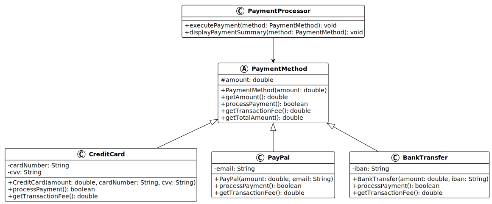

**Objectif** : Concevoir et implémenter :

1. **Classe abstraite `PaymentMethod`** :
   - Attributs : `amount` (double), `payerName` (String)
   - Constructeur avec tous les paramètres
   - Méthode abstraite : `processPayment()` qui retourne un boolean (succès ou
     échec)
   - Méthode abstraite : `getPaymentDetails()` qui retourne un String
   - Méthode concrète : `displaySummary()` qui affiche un résumé

2. **Classes dérivées** :
   - `CreditCardPayment` : attributs `cardNumber` (String), `cvv` (String)
   - `PayPalPayment` : attribut `email` (String)
   - `BankTransferPayment` : attributs `iban` (String), `bic` (String)
   - Chaque classe implémente `processPayment()` et `getPaymentDetails()`
   - Ajoutez une validation simple dans `processPayment()` : retourne `false` si
     `amount <= 0`

3. **Classe `PaymentProcessor`** :
   - Méthode statique `executePayment(PaymentMethod payment)` qui :
     - Affiche `getPaymentDetails()`
     - Appelle `processPayment()`
     - Affiche un message de succès ou d'échec
     - Retourne le résultat

4. **Programme principal** : Testez avec plusieurs paiements de différents types
   et affichez un rapport final.

**Sortie attendue** :

```text
=== Online Store Payment System ===

--- Processing Payment 1 ---
Payment details: Credit Card payment by Alice Dupont (Card: **** **** **** 1234)
Amount: 149.99 CHF
Processing payment...
✓ Payment successful

--- Processing Payment 2 ---
Payment details: PayPal payment by Bob Martin (Email: bob.martin@example.com)
Amount: 75.5 CHF
Processing payment...
✓ Payment successful

--- Processing Payment 3 ---
Payment details: Bank Transfer payment by Claire Blanc (IBAN: CH93 0076 2011 6238 5295 7)
Amount: 320.0 CHF
Processing payment...
✓ Payment successful

--- Processing Payment 4 ---
Payment details: Credit Card payment by David Rousseau (Card: **** **** **** 5678)
Amount: 0.0 CHF
Processing payment...
✗ Payment failed: Invalid amount

=== Payment Summary ===
Total payments processed: 4
Successful: 3
Failed: 1
Total amount: 545.49 CHF
```

<details>
<summary>Indice</summary>

Créez la classe abstraite `PaymentMethod` avec les attributs communs, puis
implémentez les trois types de paiement. Dans `processPayment()`, vérifiez que
`amount > 0`. Pour masquer le numéro de carte, utilisez une méthode qui remplace
les premiers chiffres par des `*`. Dans `Main`, utilisez un tableau de
`PaymentMethod[]` et comptez les succès et échecs.

</details>

<details>
<summary>Afficher la solution</summary>

```java
public abstract class PaymentMethod {
    private double amount;
    private String payerName;

    public PaymentMethod(double amount, String payerName) {
        this.amount = amount;
        this.payerName = payerName;
    }

    public abstract boolean processPayment();
    public abstract String getPaymentDetails();

    public void displaySummary() {
        System.out.println("Payer: " + payerName);
        System.out.println("Amount: " + amount + " CHF");
    }

    protected double getAmount() {
        return amount;
    }

    protected String getPayerName() {
        return payerName;
    }
}

public class CreditCardPayment extends PaymentMethod {
    private String cardNumber;
    private String cvv;

    public CreditCardPayment(double amount, String payerName, String cardNumber, String cvv) {
        super(amount, payerName);
        this.cardNumber = cardNumber;
        this.cvv = cvv;
    }

    @Override
    public boolean processPayment() {
        if (getAmount() <= 0) {
            return false;
        }
        // Simulation de traitement de paiement par carte
        return true;
    }

    @Override
    public String getPaymentDetails() {
        String maskedCard = "**** **** **** " + cardNumber.substring(cardNumber.length() - 4);
        return "Credit Card payment by " + getPayerName() + " (Card: " + maskedCard + ")";
    }
}

public class PayPalPayment extends PaymentMethod {
    private String email;

    public PayPalPayment(double amount, String payerName, String email) {
        super(amount, payerName);
        this.email = email;
    }

    @Override
    public boolean processPayment() {
        if (getAmount() <= 0) {
            return false;
        }
        // Simulation de traitement de paiement PayPal
        return true;
    }

    @Override
    public String getPaymentDetails() {
        return "PayPal payment by " + getPayerName() + " (Email: " + email + ")";
    }
}

public class BankTransferPayment extends PaymentMethod {
    private String iban;
    private String bic;

    public BankTransferPayment(double amount, String payerName, String iban, String bic) {
        super(amount, payerName);
        this.iban = iban;
        this.bic = bic;
    }

    @Override
    public boolean processPayment() {
        if (getAmount() <= 0) {
            return false;
        }
        // Simulation de traitement de virement bancaire
        return true;
    }

    @Override
    public String getPaymentDetails() {
        return "Bank Transfer payment by " + getPayerName() + " (IBAN: " + iban + ")";
    }
}

public class PaymentProcessor {
    public static boolean executePayment(PaymentMethod payment) {
        System.out.println("Payment details: " + payment.getPaymentDetails());
        System.out.println("Amount: " + payment.getAmount() + " CHF");
        System.out.println("Processing payment...");

        boolean success = payment.processPayment();

        if (success) {
            System.out.println("✓ Payment successful");
        } else {
            System.out.println("✗ Payment failed: Invalid amount");
        }

        return success;
    }
}

public class Main {
    public static void main(String[] args) {
        System.out.println("=== Online Store Payment System ===\n");

        PaymentMethod[] payments = new PaymentMethod[4];
        payments[0] = new CreditCardPayment(149.99, "Alice Dupont", "1234567812341234", "123");
        payments[1] = new PayPalPayment(75.50, "Bob Martin", "bob.martin@example.com");
        payments[2] = new BankTransferPayment(320.00, "Claire Blanc", "CH93 0076 2011 6238 5295 7", "UBSWCHZH80A");
        payments[3] = new CreditCardPayment(0.00, "David Rousseau", "5678901256785678", "456");

        int successCount = 0;
        int failureCount = 0;
        double totalAmount = 0;

        for (int i = 0; i < payments.length; i++) {
            System.out.println("--- Processing Payment " + (i + 1) + " ---");
            boolean success = PaymentProcessor.executePayment(payments[i]);

            if (success) {
                successCount++;
                totalAmount += payments[i].getAmount();
            } else {
                failureCount++;
            }

            System.out.println();
        }

        System.out.println("=== Payment Summary ===");
        System.out.println("Total payments processed: " + payments.length);
        System.out.println("Successful: " + successCount);
        System.out.println("Failed: " + failureCount);
        System.out.println("Total amount: " + totalAmount + " CHF");
    }
}
```

**Points clés de la solution** :

1. **Classe abstraite `PaymentMethod`** :
   - Encapsule les données communes à tous les paiements
   - Définit le contrat que toutes les méthodes de paiement doivent respecter
   - Les getters sont `protected` pour être accessibles aux classes dérivées

2. **Classes dérivées** :
   - Chacune ajoute les attributs spécifiques à son type de paiement
   - `getPaymentDetails()` retourne une chaîne formatée différemment selon le
     type
   - `processPayment()` contient la logique de validation et de traitement

3. **Classe `PaymentProcessor`** :
   - Méthode statique qui orchestre le traitement
   - Fonctionne avec n'importe quel type de `PaymentMethod` grâce au
     polymorphisme
   - Gère l'affichage et la logique de traitement

4. **Polymorphisme** :
   - Le tableau `PaymentMethod[]` contient différents types de paiements
   - `executePayment()` traite tous les paiements uniformément
   - Les méthodes appropriées sont appelées automatiquement en fonction du type
     réel

5. **Sécurité** :
   - Le numéro de carte est masqué dans `getPaymentDetails()`
   - Seuls les 4 derniers chiffres sont visibles

**Extensions possibles** :

- Ajouter une méthode `refund()` pour annuler un paiement
- Créer une classe `Transaction` qui enregistre l'historique
- Implémenter une vraie validation de numéro de carte (algorithme de Luhn)
- Ajouter des frais de transaction différents selon le type de paiement
- Créer une classe `PaymentGateway` qui simule la communication avec une banque

Cette solution démontre comment le polymorphisme permet de créer des systèmes
flexibles et extensibles qui peuvent facilement accueillir de nouveaux types de
paiements sans modifier le code existant.

</details>

---

## Conclusion

Ces exercices couvrent les concepts essentiels de l'encapsulation et de
l'héritage :

- Encapsulation avec attributs privés et méthodes d'accès
- Validation des données dans les setters
- Hiérarchies de classes avec héritage
- Redéfinition de méthodes
- Modificateur `protected` pour l'accès aux classes dérivées
- Polymorphisme et liaison dynamique
- Classes abstraites et méthodes abstraites
- Composition vs héritage
- Refactorisation et amélioration de code

Pour aller plus loin, pratiquez en créant vos propres hiérarchies de classes
pour modéliser des systèmes réalistes : bibliothèque, école, hôpital, etc.

N'hésitez pas à consulter le [contenu principal du cours](../) et le
[mini-projet](../03-mini-projet/) pour approfondir ces concepts.

<!-- URLs -->

[licence]:
	https://github.com/heig-vd-progim-course/heig-vd-progim2-course/blob/main/LICENSE.md
