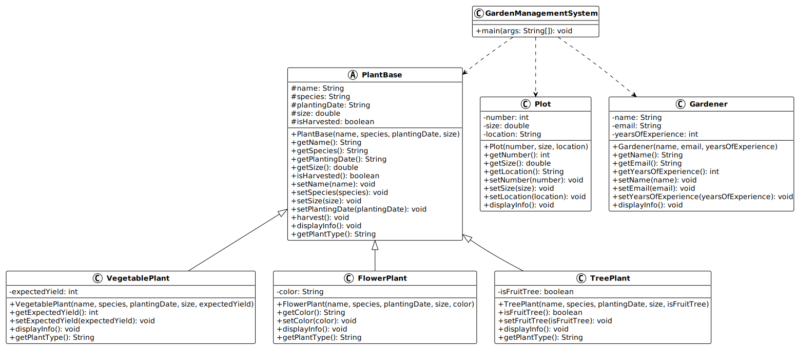

# Programmation orientée objet : Encapsulation et héritage - Mini-projet (partie 2)

Bienvenue dans la deuxième partie du mini-projet sur la gestion de jardin
communautaire !

> [!TIP]
>
> Toutes les informations relatives à ce contenu sont décrites dans le
> [support de cours principal](../).

## Table des matières

- [Table des matières](#table-des-matières)
- [Présentation du mini-projet](#présentation-du-mini-projet)
- [Objectifs de cette session](#objectifs-de-cette-session)
- [Structure du projet](#structure-du-projet)
- [Amélioration de l'encapsulation](#amélioration-de-lencapsulation)
  - [Étape 1 : rendre les attributs privés](#étape-1--rendre-les-attributs-privés)
  - [Étape 2 : créer les getters et setters](#étape-2--créer-les-getters-et-setters)
  - [Étape 3 : ajouter la validation dans les setters](#étape-3--ajouter-la-validation-dans-les-setters)
- [Introduction de l'héritage](#introduction-de-lhéritage)
  - [Étape 4 : créer une classe abstraite PlantBase](#étape-4--créer-une-classe-abstraite-plantbase)
  - [Étape 5 : créer des sous-classes de plantes](#étape-5--créer-des-sous-classes-de-plantes)
  - [Étape 6 : utiliser le mot-clé super](#étape-6--utiliser-le-mot-clé-super)
- [Surcharge (overloading)](#surcharge-overloading)
  - [Étape 7 : ajouter la surcharge de constructeurs](#étape-7--ajouter-la-surcharge-de-constructeurs)
  - [Étape 8 : ajouter la surcharge de méthodes](#étape-8--ajouter-la-surcharge-de-méthodes)
- [Mise à jour de la classe principale](#mise-à-jour-de-la-classe-principale)
  - [Étape 9 : adapter GardenManagementSystem](#étape-9--adapter-gardenmanagementsystem)
- [Test du projet](#test-du-projet)
  - [Compilation et exécution en ligne de commande](#compilation-et-exécution-en-ligne-de-commande)
  - [Sortie attendue](#sortie-attendue)
- [Diagramme de classes](#diagramme-de-classes)
- [Solution](#solution)
- [Conclusion](#conclusion)
  - [Prochaine étape](#prochaine-étape)

## Présentation du mini-projet

Dans cette deuxième partie du mini-projet, nous allons améliorer l'application
de gestion de jardin communautaire créée lors de la première session.

Lors de la première session, nous avons créé des classes simples avec des
attributs publics. Cela fonctionnait, mais posait plusieurs problèmes :

- N'importe qui peut modifier directement les attributs, même avec des valeurs
  invalides.
- Il n'y a pas de contrôle sur les données.
- Le code n'est pas réutilisable si nous voulons créer différents types de
  plantes.

Nous allons résoudre ces problèmes en appliquant deux principes fondamentaux de
la programmation orientée objet :

1. L'**encapsulation** : protéger les données et contrôler leur accès.
2. L'**héritage** : réutiliser du code et créer des hiérarchies de classes.

> [!TIP]
>
> Le [support de cours](../) est disponible pour vous aider à comprendre les
> concepts théoriques abordés dans ce mini-projet si besoin !

> [!NOTE]
>
> Cette session vous permettra de comprendre pourquoi l'encapsulation et
> l'héritage sont essentiels en programmation orientée objet. Vous verrez
> concrètement les avantages qu'ils apportent !

## Objectifs de cette session

À l'issue de cette session, les personnes qui étudient devraient avoir pu :

- Appliquer le principe d'encapsulation en rendant les attributs privés.
- Créer des getters et setters pour accéder aux attributs.
- Ajouter de la validation dans les setters pour garantir la cohérence des
  données.
- Créer une hiérarchie de classes avec une classe abstraite.
- Utiliser le mot-clé `extends` pour créer des sous-classes.
- Utiliser le mot-clé `super` pour appeler le constructeur parent.
- Définir des méthodes abstraites à implémenter dans les sous-classes.
- Utiliser le modificateur `protected` pour les membres accessibles aux
  sous-classes.
- Appliquer la surcharge de constructeurs pour offrir plusieurs façons de créer
  des objets.
- Appliquer la surcharge de méthodes pour fournir différentes versions d'une
  même fonctionnalité.

## Structure du projet

Avant de commencer, voyons comment nous allons organiser notre projet.

Pour cette partie du mini-projet, nous allons étendre la structure existante :

```text
05-programmation-orientee-objet-encapsulation-et-heritage/
└── 03-mini-projet/
    └── src/
        ├── PlantBase.java           (nouvelle classe abstraite)
        ├── VegetablePlant.java      (nouvelle sous-classe)
        ├── FlowerPlant.java         (nouvelle sous-classe)
        ├── TreePlant.java           (nouvelle sous-classe)
        ├── Plot.java                (modifiée avec encapsulation)
        ├── Gardener.java            (modifiée avec encapsulation)
        └── GardenManagementSystem.java (mise à jour)
```

> [!NOTE]
>
> Vous remarquerez que nous allons créer plusieurs nouveaux fichiers. Ne vous
> inquiétez pas, nous allons les créer ensemble, étape par étape !

> [!IMPORTANT]
>
> Cette partie fait suite à la première session. Si vous n'avez pas terminé la
> partie 1, récupérez le code de la solution avant de continuer.
>
> Assurez-vous d'avoir votre projet de la partie 1 ouvert dans votre éditeur de
> code préféré (VS Code, IntelliJ IDEA, etc.).

## Amélioration de l'encapsulation

Commencons par améliorer l'encapsulation de nos classes existantes (`Plot` et
`Gardener`).

Mais avant de commencer à modifier le code, prenons un moment pour comprendre ce
que nous allons faire et pourquoi.

> [!NOTE]
>
> L'**encapsulation** est l'un des quatre piliers de la programmation orientée
> objet (avec l'abstraction, l'héritage et le polymorphisme). Elle consiste à
> cacher les détails internes d'une classe et à contrôler l'accès aux données.

Actuellement, si vous regardez vos classes `Plot` et `Gardener`, les attributs
sont probablement déclarés comme `public`. Cela signifie que n'importe quelle
autre classe peut les modifier directement, sans contrôle.

Par exemple, quelqu'un pourrait écrire :

```java
Plot plot = new Plot(1, 25.5, "Section Nord");
plot.size = -100; // Oups ! Une taille négative !
```

Ce code compilerait sans erreur, mais cela n'a aucun sens d'avoir une parcelle
de taille négative. C'est exactement le type de problème que l'encapsulation
permet de résoudre.

Nous allons procéder en trois étapes :

1. Rendre les attributs privés (empecher l'accès direct).
2. Créer des getters et setters (permettre l'accès contrôlé).
3. Ajouter de la validation dans les setters (garantir la cohérence des
   données).

> [!TIP]
>
> Ces trois étapes forment la base de l'encapsulation. Vous les retrouverez dans
> presque tous les projets Java professionnels !

### Étape 1 : rendre les attributs privés

La première étape de l'encapsulation consiste à rendre les attributs privés.
Cela signifie que seule la classe elle-même pourra accéder directement à ces
attributs.

> [!NOTE]
>
> En Java, le mot-clé `private` rend un attribut ou une méthode accessible
> uniquement depuis l'intérieur de la classe où il est déclaré.

Commencez par ouvrir le fichier `Plot.java` dans votre éditeur.

Modifiez la classe `Plot` pour rendre tous les attributs privés en remplaçant
`public` par `private` devant chaque attribut :

```java
public class Plot {
    // Attributs privés
    private int number;
    private double size;
    private String location;

    // Constructeur
    public Plot(int number, double size, String location) {
        this.number = number;
        this.size = size;
        this.location = location;
    }

    // Les getters et setters viendront à l'étape suivante

    // Méthode pour afficher les informations
    public void displayInfo() {
        System.out.println("Parcelle #" + number);
        System.out.println("  Taille: " + size + " m²");
        System.out.println("  Localisation: " + location);
    }
}
```

> [!IMPORTANT]
>
> Après avoir rendu les attributs `private`, vous remarquerez probablement que
> votre code ne compile plus si vous essayez d'accéder directement aux attributs
> depuis d'autres classes (comme `GardenManagementSystem`). C'est normal et
> attendu ! Nous allons régler cela à l'étape suivante.

Prenez un moment pour observer ce changement. Qu'est-ce qui a changé ?

- Les attributs sont maintenant `private` au lieu de `public`.
- Le constructeur et la méthode `displayInfo()` restent `public` car nous
  voulons qu'ils soient accessibles de l'extérieur.
- À l'intérieur de la classe, nous pouvons toujours accéder aux attributs
  directement (c'est pourquoi `displayInfo()` fonctionne toujours).

> [!TIP]
>
> Une règle générale en Java : les attributs sont presque toujours `private`, et
> les méthodes sont `public` (sauf cas particuliers).

Maintenant, faites la même chose pour la classe `Gardener`.

Ouvrez maintenant le fichier `Gardener.java` et appliquez le même changement :

```java
public class Gardener {
    // Attributs privés
    private String name;
    private String email;
    private int yearsOfExperience;

    // Constructeur
    public Gardener(String name, String email, int yearsOfExperience) {
        this.name = name;
        this.email = email;
        this.yearsOfExperience = yearsOfExperience;
    }

    // Les getters et setters viendront à l'étape suivante

    // Méthode pour afficher les informations
    public void displayInfo() {
        System.out.println("Jardinière: " + name);
        System.out.println("  Email: " + email);
        System.out.println("  Expérience: " + yearsOfExperience + " ans");
    }
}
```

Parfait ! Vous venez de franchir la première étape de l'encapsulation. Les
données sont maintenant protégées.

Mais il y a un problème : comment peut-on maintenant lire ou modifier ces
attributs depuis l'extérieur de la classe ? C'est exactement ce que nous allons
résoudre à l'étape suivante !

### Étape 2 : créer les getters et setters

Maintenant que les attributs sont privés, nous devons créer des méthodes
publiques pour y accéder depuis l'extérieur de la classe. Ce sont les
**getters** (pour lire les valeurs) et les **setters** (pour les modifier).

> [!NOTE]
>
> Les **getters** et **setters** sont des méthodes publiques qui permettent
> d'accéder aux attributs privés de manière contrôlée.
>
> - Un **getter** retourne la valeur d'un attribut (commence généralement par
>   `get`).
> - Un **setter** modifie la valeur d'un attribut (commence généralement par
>   `set`).

Revenons à notre classe `Plot`. Nous allons ajouter un getter et un setter pour
chaque attribut.

Pour l'attribut `number`, voici comment faire :

- **Getter** : `public int getNumber()` qui retourne `number`.
- **Setter** : `public void setNumber(int number)` qui affecte une nouvelle
  valeur à `number`.

Ajoutez les getters et setters à la classe `Plot` :

```java
public class Plot {
    // Attributs privés
    private int number;
    private double size;
    private String location;

    // Constructeur
    public Plot(int number, double size, String location) {
        this.number = number;
        this.size = size;
        this.location = location;
    }

    // Getters
    public int getNumber() {
        return number;
    }

    public double getSize() {
        return size;
    }

    public String getLocation() {
        return location;
    }

    // Setters
    public void setNumber(int number) {
        this.number = number;
    }

    public void setSize(double size) {
        this.size = size;
    }

    public void setLocation(String location) {
        this.location = location;
    }

    // Méthode pour afficher les informations
    public void displayInfo() {
        System.out.println("Parcelle #" + number);
        System.out.println("  Taille: " + size + " m²");
        System.out.println("  Localisation: " + location);
    }
}
```

> [!TIP]
>
> La plupart des éditeurs de code peuvent générer automatiquement les getters et
> setters ! Dans IntelliJ IDEA : clic droit > Generate > Getters and Setters.
> Dans VS Code avec l'extension Java : clic droit > Source Action > Generate
> Getters and Setters.

Observez la structure des getters et setters :

- Les **getters** retournent simplement la valeur de l'attribut.
- Les **setters** prennent un paramètre et l'affectent à l'attribut.
- Ils utilisent le mot-clé `this` pour distinguer l'attribut du paramètre
  lorsqu'ils ont le même nom.

Mais attendez... ces setters ne valident rien ! On peut toujours passer des
valeurs invalides. Nous allons corriger cela à l'étape suivante, mais d'abord,
créons les getters et setters pour la classe `Gardener`.

Ajoutez maintenant les getters et setters à la classe `Gardener` :

Ajoutez maintenant les getters et setters à la classe `Gardener` :

```java
public class Gardener {
    // Attributs privés
    private String name;
    private String email;
    private int yearsOfExperience;

    // Constructeur
    public Gardener(String name, String email, int yearsOfExperience) {
        this.name = name;
        this.email = email;
        this.yearsOfExperience = yearsOfExperience;
    }

    // Getters
    public String getName() {
        return name;
    }

    public String getEmail() {
        return email;
    }

    public int getYearsOfExperience() {
        return yearsOfExperience;
    }

    // Setters
    public void setName(String name) {
        this.name = name;
    }

    public void setEmail(String email) {
        this.email = email;
    }

    public void setYearsOfExperience(int yearsOfExperience) {
        this.yearsOfExperience = yearsOfExperience;
    }

    // Méthode pour afficher les informations
    public void displayInfo() {
        System.out.println("Jardinière: " + name);
        System.out.println("  Email: " + email);
        System.out.println("  Expérience: " + yearsOfExperience + " ans");
    }
}
```

Excellent ! Maintenant, tout code extérieur à la classe peut accéder aux
attributs via les getters et setters :

```java
Gardener gardener = new Gardener("Marie", "marie@email.com", 5);
System.out.println(gardener.getName()); // Lire avec un getter
gardener.setYearsOfExperience(6);        // Modifier avec un setter
```

> [!NOTE]
>
> Vous venez de comprendre un concept fondamental : l'encapsulation ne consiste
> pas à _empêcher_ l'accès aux données, mais à le _contrôler_. Les getters et
> setters sont le point de contrôle !

Mais il reste un problème... nos setters acceptent n'importe quelle valeur, même
des valeurs absurdes. Corrigeons cela maintenant !

### Étape 3 : ajouter la validation dans les setters

Voici où l'encapsulation révèle toute sa puissance ! Nous allons maintenant
ajouter de la **validation** dans les setters pour garantir que les données
restent cohérentes.

> [!IMPORTANT]
>
> La validation dans les setters est l'un des avantages principaux de
> l'encapsulation. Elle permet de s'assurer qu'un objet ne peut jamais se
> retrouver dans un état invalide.

Pensez aux valeurs qui n'ont pas de sens pour une parcelle :

- Un numéro de parcelle négatif ou nul.
- Une taille négative ou trop grande (> 1000 m² semble irréaliste pour un jardin
  communautaire).
- Une localisation vide.

Nous allons ajouter des vérifications pour chacun de ces cas.

Améliorez les setters de la classe `Plot` avec la validation suivante :

Améliorez les setters de la classe `Plot` avec la validation suivante :

```java
// Setters avec validation
public void setNumber(int number) {
    if (number <= 0) {
        System.out.println("Erreur: le numéro de parcelle doit être positif.");
        return;
    }
    this.number = number;
}

public void setSize(double size) {
    if (size <= 0) {
        System.out.println("Erreur: la taille de la parcelle doit être positive.");
        return;
    }
    if (size > 1000) {
        System.out.println("Erreur: la taille de la parcelle est trop grande.");
        return;
    }
    this.size = size;
}

public void setLocation(String location) {
    if (location == null || location.trim().isEmpty()) {
        System.out.println("Erreur: la localisation ne peut pas être vide.");
        return;
    }
    this.location = location;
}
```

Observez attentivement ce code. Que fait chaque setter ?

1. **setNumber** : vérifie que le numéro est positif. Si ce n'est pas le cas,
   affiche une erreur et sort de la méthode sans modifier l'attribut.
2. **setSize** : vérifie que la taille est positive ET inférieure à 1000. Deux
   vérifications pour garantir une valeur réaliste.
3. **setLocation** : vérifie que la localisation n'est ni `null`, ni vide (après
   suppression des espaces avec `trim()`).

> [!NOTE]
>
> Le mot-clé `return` permet de sortir immédiatement de la méthode. Si la
> validation échoue, on affiche une erreur et on ne modifie **pas** l'attribut.
> L'objet conserve sa valeur précédente (ou initiale).

> [!TIP]
>
> Dans un projet professionnel, on pourrait lancer une exception plutôt que
> d'afficher un message. Nous verrons les exceptions dans une session future !
> Pour l'instant, un simple message d'erreur suffit.

Maintenant, faites de même pour la classe `Gardener`. Quelles validations
pourraient avoir du sens pour un.e jardinière ?

Prenez un moment pour réfléchir avant de regarder la solution ci-dessous.

<details>
<summary>Indices pour les validations de Gardener</summary>

- **name** : ne doit pas être vide ou null.
- **email** : devrait au minimum contenir un `@`.
- **yearsOfExperience** : ne peut pas être négatif, et probablement pas
  supérieur à 100 ans.

</details>

Améliorez maintenant les setters de la classe `Gardener` :

Améliorez maintenant les setters de la classe `Gardener` :

```java
// Setters avec validation
public void setName(String name) {
    if (name == null || name.trim().isEmpty()) {
        System.out.println("Erreur: le nom ne peut pas être vide.");
        return;
    }
    this.name = name;
}

public void setEmail(String email) {
    if (email == null || !email.contains("@")) {
        System.out.println("Erreur: l'email doit contenir un @.");
        return;
    }
    this.email = email;
}

public void setYearsOfExperience(int yearsOfExperience) {
    if (yearsOfExperience < 0) {
        System.out.println("Erreur: l'expérience ne peut pas être négative.");
        return;
    }
    if (yearsOfExperience > 100) {
        System.out.println("Erreur: l'expérience semble irréaliste.");
        return;
    }
    this.yearsOfExperience = yearsOfExperience;
}
```

Félicitations ! Vous venez de compléter l'encapsulation de vos classes.

Récapitulons ce que nous avons fait :

1. ✅ Rendu les attributs privés (protection des données).
2. ✅ Créé des getters et setters (accès contrôlé).
3. ✅ Ajouté de la validation (garantie de cohérence).

> [!TIP]
>
> Essayez maintenant de créer un objet `Plot` ou `Gardener` dans votre méthode
> `main` et testez les setters avec des valeurs invalides. Vous verrez les
> messages d'erreur s'afficher et les valeurs ne seront pas modifiées !

> [!NOTE]
>
> L'encapsulation que vous venez d'appliquer est une pratique standard dans tous
> les projets Java. Vous la retrouverez dans presque toutes les classes que vous
> rencontrerez ou créerez professionnellement.

## Introduction de l'héritage

Maintenant que nous avons sécurisé nos classes avec l'encapsulation, passons au
deuxième grand concept : l'**héritage**.

Actuellement, si nous voulons représenter différents types de plantes (légumes,
fleurs, arbres), nous serions tentés de créer trois classes complètement
indépendantes. Mais cela poserait un problème : beaucoup de code dupliqué !

Toutes les plantes ont des caractéristiques communes :

- Un nom.
- Une espèce.
- Une date de plantation.
- Une taille.
- Un statut (récoltée ou non).

Mais elles ont aussi des caractéristiques spécifiques :

- Les **légumes** ont un rendement attendu (en kg).
- Les **fleurs** ont une couleur.
- Les **arbres** peuvent être fruitiers ou ornementaux.

C'est exactement le type de problème que l'héritage résout !

> [!NOTE]
>
> L'**héritage** permet de créer une hiérarchie de classes où une classe
> "enfant" (sous-classe) hérite des attributs et méthodes d'une classe "parent"
> (superclasse).

Nous allons créer :

1. Une **classe abstraite** `PlantBase` qui contient tout ce qui est commun à
   toutes les plantes.
2. Trois **sous-classes** concrètes : `VegetablePlant`, `FlowerPlant` et
   `TreePlant` qui héritent de `PlantBase` et ajoutent leurs spécificités.

> [!TIP]
>
> Une classe abstraite est une classe qui ne peut pas être instanciée
> directement (on ne peut pas faire `new PlantBase()`). Elle sert uniquement de
> modèle pour ses sous-classes.

Commençons !

### Étape 4 : créer une classe abstraite PlantBase

Au lieu d'avoir une seule classe `Plant`, nous allons créer une classe abstraite
`PlantBase` qui servira de base (d'où son nom !) pour différents types de
plantes.

> [!NOTE]
>
> Le mot-clé `abstract` devant une classe signifie qu'on ne pourra pas créer
> d'instances directement (`new PlantBase()` ne fonctionnera pas). Cette classe
> sert de **modèle** pour ses sous-classes.

Créez un nouveau fichier nommé `PlantBase.java` dans le dossier `src/` de votre
projet.

Voici le code complet de la classe `PlantBase`. Nous allons l'analyser ensemble
après :

```java
public abstract class PlantBase {
    // Attributs protégés (accessibles aux sous-classes)
    protected String name;
    protected String species;
    protected String plantingDate;
    protected double size;
    protected boolean isHarvested;

    // Constructeur
    public PlantBase(String name, String species, String plantingDate, double size) {
        this.name = name;
        this.species = species;
        this.plantingDate = plantingDate;
        this.size = size;
        this.isHarvested = false;
    }

    // Getters
    public String getName() {
        return name;
    }

    public String getSpecies() {
        return species;
    }

    public String getPlantingDate() {
        return plantingDate;
    }

    public double getSize() {
        return size;
    }

    public boolean isHarvested() {
        return isHarvested;
    }

    // Setters avec validation
    public void setName(String name) {
        if (name == null || name.trim().isEmpty()) {
            System.out.println("Erreur: le nom ne peut pas être vide.");
            return;
        }
        this.name = name;
    }

    public void setSpecies(String species) {
        if (species == null || species.trim().isEmpty()) {
            System.out.println("Erreur: l'espèce ne peut pas être vide.");
            return;
        }
        this.species = species;
    }

    public void setSize(double size) {
        if (size < 0) {
            System.out.println("Erreur: la taille ne peut pas être négative.");
            return;
        }
        this.size = size;
    }

    public void setPlantingDate(String plantingDate) {
        // Validation simplifiée
        if (plantingDate == null || plantingDate.trim().isEmpty()) {
            System.out.println("Erreur: la date de plantation ne peut pas être vide.");
            return;
        }
        this.plantingDate = plantingDate;
    }

    // Méthode pour récolter
    public void harvest() {
        if (isHarvested) {
            System.out.println(name + " a déjà été récoltée.");
        } else {
            isHarvested = true;
            System.out.println(name + " a été récoltée avec succès !");
        }
    }

    // Méthode abstraite à implémenter dans les sous-classes
    public abstract void displayInfo();

    // Méthode abstraite pour obtenir le type de plante
    public abstract String getPlantType();
}
```

Prenez un moment pour observer cette classe. Elle est longue, mais sa structure
devrait vous sembler familière : elle ressemble beaucoup aux classes `Plot` et
`Gardener` que nous venons d'améliorer !

Analysons les éléments importants :

**1. Le mot-clé `abstract`**

```java
public abstract class PlantBase {
```

Cela indique qu'on ne pourra pas créer directement un objet `PlantBase`. On
devra obligatoirement passer par une sous-classe.

**2. Les attributs `protected`**

```java
protected String name;
protected String species;
// ...
```

Le modificateur `protected` est un compromis entre `private` et `public` :

- Les attributs ne sont **pas** accessibles de l'extérieur (comme`private`).
- Mais ils **sont** accessibles dans les sous-classes (contrairement à
  `private`).

> [!NOTE]
>
> On utilise `protected` quand on veut que les sous-classes puissent accéder
> directement aux attributs sans passer par les getters. C'est pratique pour
> l'héritage !

**3. Les méthodes abstraites**

```java
public abstract void displayInfo();
public abstract String getPlantType();
```

Une méthode abstraite n'a **pas de corps** (pas de `{...}`). Elle se termine par
un point-virgule.

> [!IMPORTANT]
>
> Toute classe qui hérite de `PlantBase` **devra obligatoirement** implémenter
> ces méthodes abstraites. C'est une sorte de "contrat" : "Si tu veux être une
> plante, tu dois savoir t'afficher et dire ton type !

**4. Les méthodes concrètes**

```java
public void harvest() {
    if (isHarvested) {
        System.out.println(name + " a déjà été récoltée.");
    } else {
        isHarvested = true;
        System.out.println(name + " a été récoltée avec succès !");
    }
}
```

Certaines méthodes ont un corps complet. Toutes les sous-classes hériteront de
ce comportement automatiquement, sans avoir à le réécrire !

> [!TIP]
>
> Si vous avez des erreurs de compilation pour l'instant, c'est normal ! Nous
> n'avons pas encore créé les sous-classes. Continuons, et tout se mettra en
> place.

### Étape 5 : créer des sous-classes de plantes

Maintenant vient la partie excitante : nous allons créer trois types de plantes
qui **héritent** de `PlantBase`.

Nous allons créer :

- `VegetablePlant` : pour les légumes (avec un rendement attendu).
- `FlowerPlant` : pour les fleurs (avec une couleur).
- `TreePlant` : pour les arbres (fruitiers ou ornementaux).

Chacune de ces classes va :

1. **Hériter** tous les attributs et méthodes de `PlantBase`.
2. **Ajouter** ses propres attributs spécifiques.
3. **Implémenter** les méthodes abstraites obligatoires.

> [!TIP]
>
> Le mot-clé `extends` est utilisé pour indiquer qu'une classe hérite d'une
> autre : `public class VegetablePlant extends PlantBase`.

Commençons avec les légumes !

#### Classe VegetablePlant

Créez un nouveau fichier nommé `VegetablePlant.java` dans le dossier `src/` :

```java
public class VegetablePlant extends PlantBase {
    // Attribut spécifique aux légumes
    private int expectedYield; // Rendement attendu en kg

    // Constructeur
    public VegetablePlant(String name, String species, String plantingDate,
                          double size, int expectedYield) {
        super(name, species, plantingDate, size);
        this.expectedYield = expectedYield;
    }

    // Getter et setter spécifiques
    public int getExpectedYield() {
        return expectedYield;
    }

    public void setExpectedYield(int expectedYield) {
        if (expectedYield < 0) {
            System.out.println("Erreur: le rendement ne peut pas être négatif.");
            return;
        }
        this.expectedYield = expectedYield;
    }

    // Implémentation de la méthode abstraite
    @Override
    public String getPlantType() {
        return "Légume";
    }

    // Implémentation de la méthode abstraite
    @Override
    public void displayInfo() {
        System.out.println("=== " + getPlantType() + " ===");
        System.out.println("Nom: " + name);
        System.out.println("Espèce: " + species);
        System.out.println("Date de plantation: " + plantingDate);
        System.out.println("Taille: " + size + " cm");
        System.out.println("Rendement attendu: " + expectedYield + " kg");
        System.out.println("Statut: " + (isHarvested ? "Récoltée" : "En croissance"));
    }
}
```

#### Classe FlowerPlant

Maintenant que vous avez compris le principe avec `VegetablePlant`, créons la
classe pour les fleurs.

Créez un nouveau fichier nommé `FlowerPlant.java` :

```java
public class FlowerPlant extends PlantBase {
    // Attribut spécifique aux fleurs
    private String color;

    // Constructeur
    public FlowerPlant(String name, String species, String plantingDate,
                       double size, String color) {
        super(name, species, plantingDate, size);
        this.color = color;
    }

    // Getter et setter spécifiques
    public String getColor() {
        return color;
    }

    public void setColor(String color) {
        if (color == null || color.trim().isEmpty()) {
            System.out.println("Erreur: la couleur ne peut pas être vide.");
            return;
        }
        this.color = color;
    }

    // Implémentation de la méthode abstraite
    @Override
    public String getPlantType() {
        return "Fleur";
    }

    // Implémentation de la méthode abstraite
    @Override
    public void displayInfo() {
        System.out.println("=== " + getPlantType() + " ===");
        System.out.println("Nom: " + name);
        System.out.println("Espèce: " + species);
        System.out.println("Date de plantation: " + plantingDate);
        System.out.println("Taille: " + size + " cm");
        System.out.println("Couleur: " + color);
        System.out.println("Statut: " + (isHarvested ? "Fanée" : "En floraison"));
    }
}
```

Vous remarquez la similitude avec `VegetablePlant` ? C'est le pouvoir de
l'héritage !

- Même structure générale.
- Hérite de `PlantBase` avec `extends`.
- Attribut spécifique : `color` (une couleur au lieu d'un rendement).
- Implémente les deux méthodes abstraites obligatoires.

La différence principale est dans les détails spécifiques : une fleur a une
couleur, et son statut est "Fanée" ou "En floraison" au lieu de "Récoltée" ou
"En croissance".

> [!TIP]
>
> Remarquez comme il est facile de créer un nouveau type de plante une fois que
> la classe de base existe ! C'est la puissance de l'héritage : réutilisation du
> code et extension facile.

Créons maintenant notre dernière classe : les arbres.

#### Classe TreePlant

Créez un fichier `TreePlant.java` :

```java
public class TreePlant extends PlantBase {
    // Attribut spécifique aux arbres
    private boolean isFruitTree;

    // Constructeur
    public TreePlant(String name, String species, String plantingDate,
                     double size, boolean isFruitTree) {
        super(name, species, plantingDate, size);
        this.isFruitTree = isFruitTree;
    }

    // Getter et setter spécifiques
    public boolean isFruitTree() {
        return isFruitTree;
    }

    public void setFruitTree(boolean isFruitTree) {
        this.isFruitTree = isFruitTree;
    }

    // Implémentation de la méthode abstraite
    @Override
    public String getPlantType() {
        return "Arbre";
    }

    // Implémentation de la méthode abstraite
    @Override
    public void displayInfo() {
        System.out.println("=== " + getPlantType() + " ===");
        System.out.println("Nom: " + name);
        System.out.println("Espèce: " + species);
        System.out.println("Date de plantation: " + plantingDate);
        System.out.println("Taille: " + size + " cm");
        System.out.println("Type: " + (isFruitTree ? "Fruitier" : "Ornemental"));
        System.out.println("Statut: " + (isHarvested ? "Récolté" : "En croissance"));
    }
}
```

### Étape 6 : utiliser le mot-clé super

Le mot-clé `super` est utilisé dans les constructeurs des sous-classes pour
appeler le constructeur de la classe parent.

> [!NOTE]
>
> Dans les exemples ci-dessus, `super(name, species, plantingDate, size)`
> appelle le constructeur de `PlantBase` pour initialiser les attributs communs
> à toutes les plantes.

## Surcharge (overloading)

Nous avons maintenant une belle hiérarchie de classes avec l'héritage. Mais il y
a encore un aspect qui peut rendre notre code plus flexible et plus facile à
utiliser : la **surcharge** (overloading en anglais).

> [!NOTE]
>
> La **surcharge** permet de créer plusieurs versions d'un constructeur ou d'une
> méthode avec le **même nom** mais des **paramètres différents** (nombre ou
> type).

Imaginez la situation suivante : vous voulez créer une tomate, mais vous ne
connaissez pas encore le rendement attendu. Avec notre code actuel, vous êtes
obligé de fournir **tous** les paramètres :

```java
VegetablePlant tomato = new VegetablePlant(
    "Tomate",
    "Solanum lycopersicum",
    "2024-03-15",
    45.0,
    0  // Je dois mettre 0 même si je ne connais pas le rendement
);
```

Ce serait plus pratique de pouvoir écrire simplement :

```java
VegetablePlant tomato = new VegetablePlant(
    "Tomate",
    "Solanum lycopersicum",
    "2024-03-15",
    45.0
    // Pas besoin de spécifier le rendement
);
```

C'est exactement ce que la surcharge permet de faire ! Nous allons créer
plusieurs constructeurs avec le même nom mais des listes de paramètres
différentes.

> [!TIP]
>
> La surcharge améliore l'ergonomie de votre code. Elle permet aux utilisateurs
> de vos classes de choisir le niveau de détail qu'ils souhaitent fournir.

### Étape 7 : ajouter la surcharge de constructeurs

Commençons par ajouter des constructeurs surchargés à notre classe
`VegetablePlant`. L'idée est d'offrir plusieurs façons de créer un légume, selon
les informations disponibles.

Nous allons créer trois constructeurs :

1. **Constructeur complet** : tous les paramètres (celui qui existe déjà).
2. **Constructeur sans rendement** : on ne spécifie pas le rendement (valeur par
   défaut : 0).
3. **Constructeur minimal** : juste le nom et l'espèce (valeurs par défaut pour
   le reste).

#### Surcharge dans VegetablePlant

Ouvrez votre fichier `VegetablePlant.java` et ajoutons les nouveaux
constructeurs.

Modifiez la classe `VegetablePlant` pour ajouter des constructeurs surchargés :

```java
public class VegetablePlant extends PlantBase {
    // Attribut spécifique aux légumes
    private int expectedYield; // Rendement attendu en kg

    // Constructeur complet (déjà existant)
    public VegetablePlant(String name, String species, String plantingDate,
                          double size, int expectedYield) {
        super(name, species, plantingDate, size);
        this.expectedYield = expectedYield;
    }

    // Constructeur surchargé : sans rendement (valeur par défaut à 0)
    public VegetablePlant(String name, String species, String plantingDate, double size) {
        super(name, species, plantingDate, size);
        this.expectedYield = 0; // Valeur par défaut
    }

    // Constructeur surchargé : création simplifiée (date et taille par défaut)
    public VegetablePlant(String name, String species) {
        super(name, species, "2024-01-01", 0.0);
        this.expectedYield = 0;
    }

    // Getter et setter spécifiques
    public int getExpectedYield() {
        return expectedYield;
    }

    public void setExpectedYield(int expectedYield) {
        if (expectedYield < 0) {
            System.out.println("Erreur: le rendement ne peut pas être négatif.");
            return;
        }
        this.expectedYield = expectedYield;
    }

    // Implémentation de la méthode abstraite
    @Override
    public String getPlantType() {
        return "Légume";
    }

    // Implémentation de la méthode abstraite
    @Override
    public void displayInfo() {
        System.out.println("=== " + getPlantType() + " ===");
        System.out.println("Nom: " + name);
        System.out.println("Espèce: " + species);
        System.out.println("Date de plantation: " + plantingDate);
        System.out.println("Taille: " + size + " cm");
        System.out.println("Rendement attendu: " + expectedYield + " kg");
        System.out.println("Statut: " + (isHarvested ? "Récoltée" : "En croissance"));
    }
}
```

Prenez un moment pour observer ces nouveaux constructeurs.

**Comment Java sait-il quel constructeur utiliser ?**

Java choisit automatiquement le bon constructeur en fonction du **nombre** et du
**type** des arguments que vous passez lors de la création de l'objet.

Exemples :

```java
// Utilise le constructeur complet (5 paramètres)
VegetablePlant tomato1 = new VegetablePlant("Tomate", "Solanum", "2024-03-15", 45.0, 5);

// Utilise le constructeur sans rendement (4 paramètres)
VegetablePlant tomato2 = new VegetablePlant("Tomate", "Solanum", "2024-03-15", 45.0);

// Utilise le constructeur minimal (2 paramètres)
VegetablePlant tomato3 = new VegetablePlant("Tomate", "Solanum");
```

> [!NOTE]
>
> C'est le compilateur Java qui décide quel constructeur appeler, en fonction de
> la **signature** (nom + liste des paramètres). Deux constructeurs ne peuvent
> pas avoir exactement la même signature.

> [!TIP]
>
> Remarquez comment les constructeurs plus simples initialisent les paramètres
> manquants avec des valeurs par défaut sensées : `0` pour le rendement,
> `"2024-01-01"` pour la date, `0.0` pour la taille. C'est une bonne pratique !

Appliquons maintenant le même principe à une autre classe pour bien comprendre.

#### Surcharge dans Plot

La même logique s'applique aux parcelles. Parfois, vous connaissez la
localisation d'une parcelle, parfois non. Parfois vous voulez juste créer une
parcelle rapidement avec juste un numéro.

Ouvrez `Plot.java` et ajoutons des constructeurs surchargés :

```java
public class Plot {
    // Attributs privés
    private int number;
    private double size;
    private String location;

    // Constructeur complet (déjà existant)
    public Plot(int number, double size, String location) {
        this.number = number;
        this.size = size;
        this.location = location;
    }

    // Constructeur surchargé : sans localisation
    public Plot(int number, double size) {
        this.number = number;
        this.size = size;
        this.location = "Non spécifiée";
    }

    // Constructeur surchargé : parcelle par défaut
    public Plot(int number) {
        this.number = number;
        this.size = 20.0; // Taille par défaut
        this.location = "Non spécifiée";
    }

    // Getters et setters (inchangés)
    // ...
}
```

Vous pouvez maintenant créer des parcelles de différentes façons :

```java
Plot plot1 = new Plot(1, 25.5, "Section Nord");  // Complet
Plot plot2 = new Plot(2, 30.0);                   // Sans localisation
Plot plot3 = new Plot(3);                         // Juste le numéro
```

Chaque version initialise les valeurs manquantes avec des valeurs par défaut
raisonnables (`"Non spécifiée"` pour la localisation, `20.0` pour une taille
standard).

> [!IMPORTANT]
>
> La surcharge de constructeurs est une des utilisations les plus courantes de
> la surcharge en Java. Vous la retrouverez dans presque toutes les classes
> standard de Java (String, ArrayList, etc.).

Maintenant que nous avons compris la surcharge pour les constructeurs, voyons
comment elle s'applique aussi aux méthodes ordinaires.

### Étape 8 : ajouter la surcharge de méthodes

La surcharge ne s'applique pas qu'aux constructeurs ! Elle fonctionne aussi avec
les méthodes normales. Cela permet d'offrir différentes façons d'utiliser une
fonctionnalité.

> [!NOTE]
>
> La **surcharge de méthodes** consiste à créer plusieurs versions d'une méthode
> avec le même nom mais des paramètres différents. Tout comme pour les
> constructeurs, Java choisit automatiquement la bonne version en fonction des
> arguments fournis.

Imaginez que vous voulez faire pousser vos plantes. Parfois, vous voulez juste
les faire pousser un peu (croissance standard), parfois vous voulez spécifier
exactement de combien, et parfois vous voulez ajouter un message pour noter les
conditions de croissance.

Au lieu de créer trois méthodes différentes (`growNormal()`, `growBy()`,
`growWithMessage()`), nous allons créer trois versions de la même méthode
`grow()` avec des paramètres différents.

#### Surcharge de la méthode grow() dans PlantBase

Ouvrez le fichier `PlantBase.java` et ajoutons trois versions de la méthode
`grow()` :

```java
public abstract class PlantBase {
    // Attributs protégés (accessibles aux sous-classes)
    protected String name;
    protected String species;
    protected String plantingDate;
    protected double size;
    protected boolean isHarvested;

    // Constructeur (inchangé)
    // ...

    // Getters et setters (inchangés)
    // ...

    // Méthode pour faire pousser la plante (version simple)
    public void grow() {
        grow(5.0); // Appel de la version surchargée avec une valeur par défaut
    }

    // Méthode surchargée : faire pousser d'une certaine taille
    public void grow(double increment) {
        if (isHarvested) {
            System.out.println(name + " a été récoltée et ne peut plus pousser.");
            return;
        }
        if (increment < 0) {
            System.out.println("Erreur: la croissance ne peut pas être négative.");
            return;
        }
        size += increment;
        System.out.println(name + " a poussé de " + increment + " cm. Nouvelle taille: " + size + " cm");
    }

    // Méthode surchargée : faire pousser avec un facteur et un message
    public void grow(double increment, String message) {
        grow(increment); // Réutilise la logique de la version précédente
        if (!isHarvested && increment >= 0) {
            System.out.println("  ➜ " + message);
        }
    }

    // Méthode pour récolter (inchangée)
    public void harvest() {
        if (isHarvested) {
            System.out.println(name + " a déjà été récoltée.");
        } else {
            isHarvested = true;
            System.out.println(name + " a été récoltée avec succès !");
        }
    }

    // Méthodes abstraites (inchangées)
    // ...
}
```

Observez comment les trois versions travaillent ensemble :

1. **`grow()`** : version simple sans paramètre, appelle `grow(5.0)` avec une
   valeur par défaut.
2. **`grow(double increment)`** : version détaillée qui fait le vrai travail.
3. **`grow(double increment, String message)`** : version encore plus détaillée
   qui ajoute un message.

Remarquez la réutilisation : la version 1 appelle la version 2, et la version 3
appelle aussi la version 2. C'est une bonne pratique pour éviter la duplication
de code !

Vous pouvez maintenant utiliser `grow()` de trois façons différentes :

```java
rose.grow();                              // Croissance standard de 5 cm
rose.grow(10.0);                          // Croissance de 10 cm
rose.grow(8.0, "Engrais bio appliqué");   // Croissance de 8 cm avec note
```

> [!TIP]
>
> Cette approche rend votre code plus facile à utiliser : les utilisateurs
> débutants peuvent utiliser la version simple `grow()`, tandis que les
> utilisateurs avancés peuvent utiliser les versions plus détaillées pour un
> contrôle précis.

Voyons un autre exemple avec `displayInfo()`.

#### Surcharge de displayInfo() dans VegetablePlant

Parfois, vous voulez afficher toutes les informations d'une plante, et parfois
vous voulez juste un résumé rapide. Au lieu de créer deux méthodes différentes,
surchargeons `displayInfo()` !

Ouvrez `VegetablePlant.java` et modifiez la méthode `displayInfo()` :

```java
public class VegetablePlant extends PlantBase {
    // Attributs et constructeurs (inchangés)
    // ...

    // Version standard de displayInfo (déjà existante)
    @Override
    public void displayInfo() {
        displayInfo(true); // Appel de la version détaillée
    }

    // Version surchargée : avec option d'affichage détaillé ou non
    public void displayInfo(boolean detailed) {
        System.out.println("=== " + getPlantType() + " ===");
        System.out.println("Nom: " + name);
        System.out.println("Espèce: " + species);

        if (detailed) {
            System.out.println("Date de plantation: " + plantingDate);
            System.out.println("Taille: " + size + " cm");
            System.out.println("Rendement attendu: " + expectedYield + " kg");
            System.out.println("Statut: " + (isHarvested ? "Récoltée" : "En croissance"));
        } else {
            System.out.println("Taille: " + size + " cm | Statut: " +
                             (isHarvested ? "Récoltée" : "En croissance"));
        }
    }

    // Autres méthodes (inchangées)
    // ...
}
```

Parfait ! Maintenant vous pouvez afficher les informations de deux façons :

```java
carrot.displayInfo();        // Affichage détaillé (appelle displayInfo(true))
carrot.displayInfo(false);   // Affichage simplifié
carrot.displayInfo(true);    // Affichage détaillé explicite
```

> [!IMPORTANT]
>
> **Ne confondez pas surcharge (overloading) et redéfinition (overriding) !**
>
> - **Surcharge (overloading)** : même nom, **paramètres différents**, dans la
>   **même classe**. Java choisit quelle version appeler en fonction des
>   arguments.
> - **Redéfinition (overriding)** : même nom, **mêmes paramètres**, dans une
>   **sous-classe**. La version de la sous-classe remplace celle de la classe
>   parent. Utilise `@Override`.
>
> Exemple : `VegetablePlant.displayInfo()` **redéfinit** (override)
> `PlantBase.displayInfo()`, mais `VegetablePlant.displayInfo(boolean)` est une
> **surcharge** (overload) de `displayInfo()`.

Vous venez de maîtriser la surcharge ! C'est un outil puissant pour rendre votre
code plus flexible et plus facile à utiliser.

Récapitulons ce que vous avez appris :

1. ✅ La surcharge permet plusieurs versions d'un constructeur ou d'une méthode.
2. ✅ Chaque version a des paramètres différents (nombre ou type).
3. ✅ Java choisit automatiquement la bonne version en fonction des arguments.
4. ✅ C'est utile pour offrir différents niveaux de détail ou de contrôle.

Maintenant, mettons tout cela en pratique dans notre classe principale !

## Mise à jour de la classe principale

Maintenant que nous avons construit toute notre hiérarchie de classes avec
l'encapsulation, l'héritage et la surcharge, il est temps de tout rassembler et
de voir notre système en action !

Nous allons mettre à jour la classe `GardenManagementSystem` pour démontrer tous
les concepts que nous avons appris.

> [!TIP]
>
> Cette classe `main` est comme une "démonstration" de votre système. C'est là
> que vous montrez comment toutes les pièces fonctionnent ensemble.

### Étape 9 : adapter GardenManagementSystem

Créez ou modifiez le fichier `GardenManagementSystem.java` :

```java
public class GardenManagementSystem {
    public static void main(String[] args) {
        System.out.println("=== Système de Gestion de Jardin Communautaire ===\n");

        // Création de jardinières avec encapsulation
        Gardener gardener1 = new Gardener("Marie Dubois", "marie.dubois@email.com", 5);
        Gardener gardener2 = new Gardener("Jean Martin", "jean.martin@email.com", 3);

        // Création de parcelles avec encapsulation
        Plot plot1 = new Plot(1, 25.5, "Section Nord");
        Plot plot2 = new Plot(2, 30.0, "Section Sud");

        // Création de différents types de plantes
        VegetablePlant tomato = new VegetablePlant(
            "Tomate Cerise",
            "Solanum lycopersicum",
            "2024-03-15",
            45.0,
            5
        );

        FlowerPlant rose = new FlowerPlant(
            "Rose Thé",
            "Rosa × odorata",
            "2024-02-10",
            80.0,
            "Rose"
        );

        TreePlant apple = new TreePlant(
            "Pommier Golden",
            "Malus domestica",
            "2023-11-01",
            200.0,
            true
        );

        VegetablePlant carrot = new VegetablePlant(
            "Carotte Nantaise",
            "Daucus carota",
            "2024-04-01",
            15.0,
            3
        );

        // Affichage des informations
        System.out.println("--- Jardinières ---\n");
        gardener1.displayInfo();
        System.out.println();
        gardener2.displayInfo();
        System.out.println();

        System.out.println("--- Parcelles ---\n");
        plot1.displayInfo();
        System.out.println();
        plot2.displayInfo();
        System.out.println();

        System.out.println("--- Plantes du jardin ---\n");
        tomato.displayInfo();
        System.out.println();
        rose.displayInfo();
        System.out.println();
        apple.displayInfo();
        System.out.println();
        carrot.displayInfo();
        System.out.println();

        // Test de la récolte
        System.out.println("--- Récolte ---\n");
        tomato.harvest();
        carrot.harvest();
        tomato.harvest(); // Tentative de récolte d'une plante déjà récoltée
        System.out.println();

        // Test de la surcharge de constructeurs
        System.out.println("--- Test de surcharge de constructeurs ---\n");
        VegetablePlant lettuce = new VegetablePlant("Laitue", "Lactuca sativa");
        Plot plot3 = new Plot(3);
        Plot plot4 = new Plot(4, 15.0);

        System.out.println("Laitue créée avec constructeur minimal:");
        lettuce.displayInfo();
        System.out.println();

        System.out.println("Parcelle 3 créée avec numéro seulement:");
        plot3.displayInfo();
        System.out.println();

        // Test de la surcharge de méthodes
        System.out.println("--- Test de surcharge de méthodes ---\n");
        rose.grow(); // Version simple
        rose.grow(10.0); // Version avec taille spécifique
        rose.grow(5.0, "Conditions optimales de croissance!"); // Version avec message
        System.out.println();

        System.out.println("Affichage détaillé:");
        carrot.displayInfo(true);
        System.out.println();

        System.out.println("Affichage simplifié:");
        carrot.displayInfo(false);
        System.out.println();

        // Test de la validation
        System.out.println("--- Test de validation ---\n");
        plot1.setSize(-10); // Erreur
        gardener1.setEmail("invalide"); // Erreur
        tomato.setExpectedYield(-5); // Erreur
    }
}
```

Prenez le temps de lire ce code et d'observer ce qu'il fait. Vous remarquerez
qu'il est organisé en sections pour tester différents aspects de notre système :

1. **Création d'objets** : jardinières, parcelles, et différents types de
   plantes.
2. **Affichage des informations** : test de la méthode `displayInfo()` pour
   chaque type.
3. **Test de récolte** : vérification que la récolte fonctionne (et qu'on ne
   peut pas récolter deux fois).
4. **Test de surcharge de constructeurs** : démonstration des différentes façons
   de créer des objets.
5. **Test de surcharge de méthodes** : démonstration des versions de `grow()` et
   `displayInfo()`.
6. **Test de validation** : vérification que nos validations empêchent les
   valeurs invalides.

> [!NOTE]
>
> Organiser votre méthode `main` par sections avec des commentaires clairs rend
> le code plus facile à comprendre et à maintenir.

Maintenant, compilons et exécutons le projet pour voir tout cela en action !

## Test du projet

Le moment est venu de voir notre travail en action ! Nous allons compiler et
exécuter le projet pour vérifier que tout fonctionne correctement.

> [!IMPORTANT]
>
> Si vous rencontrez des erreurs de compilation, relisez attentivement les
> messages d'erreur. Ils vous indiquent généralement exactement ce qui ne va pas
> et dans quel fichier.

### Compilation et exécution en ligne de commande

Si vous utilisez la ligne de commande, voici comment compiler et exécuter le
projet.

Ouvrez un terminal et naviguez jusqu'au répertoire contenant le dossier `src/`.

Pour compiler tous les fichiers Java :

```bash
# Depuis le répertoire contenant src/
javac src/*.java
```

Cette commande compile tous les fichiers `.java` dans le dossier `src/`.

Si la compilation réussit, vous ne verrez aucun message ("no news is good news
!"). Si des erreurs apparaissent, corrigez-les avant de continuer.

Pour exécuter le programme :

```bash
java -cp src GardenManagementSystem
```

Cette commande exécute la classe `GardenManagementSystem` en utilisant le
dossier `src/` comme classpath.

> [!TIP]
>
> Si vous utilisez un IDE comme **IntelliJ IDEA** ou **VS Code avec l'extension
> Java**, vous pouvez simplement cliquer sur le bouton "Run" à côté de la
> méthode `main`. C'est plus simple !

### Sortie attendue

Si tout fonctionne correctement, vous devriez voir une sortie similaire à celle
ci-dessous.

Prenez le temps de lire la sortie et de la comparer au code de
`GardenManagementSystem.java`. Voyez-vous comment chaque ligne de sortie
correspond à une instruction dans le code ?

Voici ce que vous devriez voir :

```text
=== Système de Gestion de Jardin Communautaire ===

--- Jardinières ---

Jardinière: Marie Dubois
  Email: marie.dubois@email.com
  Expérience: 5 ans

Jardinière: Jean Martin
  Email: jean.martin@email.com
  Expérience: 3 ans

--- Parcelles ---

Parcelle #1
  Taille: 25.5 m²
  Localisation: Section Nord

Parcelle #2
  Taille: 30.0 m²
  Localisation: Section Sud

--- Plantes du jardin ---

=== Légume ===
Nom: Tomate Cerise
Espèce: Solanum lycopersicum
Date de plantation: 2024-03-15
Taille: 45.0 cm
Rendement attendu: 5 kg
Statut: En croissance

=== Fleur ===
Nom: Rose Thé
Espèce: Rosa × odorata
Date de plantation: 2024-02-10
Taille: 80.0 cm
Couleur: Rose
Statut: En floraison

=== Arbre ===
Nom: Pommier Golden
Espèce: Malus domestica
Date de plantation: 2023-11-01
Taille: 200.0 cm
Type: Fruitier
Statut: En croissance

=== Légume ===
Nom: Carotte Nantaise
Espèce: Daucus carota
Date de plantation: 2024-04-01
Taille: 15.0 cm
Rendement attendu: 3 kg
Statut: En croissance

--- Récolte ---

Tomate Cerise a été récoltée avec succès !
Carotte Nantaise a été récoltée avec succès !
Tomate Cerise a déjà été récoltée.

--- Test de surcharge de constructeurs ---

Laitue créée avec constructeur minimal:
=== Légume ===
Nom: Laitue
Espèce: Lactuca sativa
Date de plantation: 2024-01-01
Taille: 0.0 cm
Rendement attendu: 0 kg
Statut: En croissance

Parcelle 3 créée avec numéro seulement:
Parcelle #3
  Taille: 20.0 m²
  Localisation: Non spécifiée

--- Test de surcharge de méthodes ---

Rose Thé a poussé de 5.0 cm. Nouvelle taille: 85.0 cm
Rose Thé a poussé de 10.0 cm. Nouvelle taille: 95.0 cm
Rose Thé a poussé de 5.0 cm. Nouvelle taille: 100.0 cm
  ➜ Conditions optimales de croissance!

Affichage détaillé:
=== Légume ===
Nom: Carotte Nantaise
Espèce: Daucus carota
Date de plantation: 2024-04-01
Taille: 15.0 cm
Rendement attendu: 3 kg
Statut: Récoltée

Affichage simplifié:
=== Légume ===
Nom: Carotte Nantaise
Espèce: Daucus carota
Taille: 15.0 cm | Statut: Récoltée

--- Test de validation ---

Erreur: la taille de la parcelle doit être positive.
Erreur: l'email doit contenir un @.
Erreur: le rendement ne peut pas être négatif.
```

> [!NOTE]
>
> Si votre sortie ne correspond pas exactement, c'est peut-être parce que vous
> avez modifié certains messages ou valeurs. Ce n'est pas grave tant que le
> comportement général est correct !

Observez les dernières lignes de la sortie. Ce sont les erreurs de validation
que nous avons programmées ! Elles montrent que notre encapsulation fonctionne
correctement : les valeurs invalides sont rejetées.

> [!TIP]
>
> Essayez de modifier `GardenManagementSystem.java` pour tester d'autres
> scénarios ! Par exemple :
>
> - Créez un arbre non-fruitier.
> - Faites pousser plusieurs plantes avec différents incréments.
> - Testez d'autres validations (taille négative, nom vide, etc.).

Félicitations ! Votre système fonctionne !

## Diagramme de classes

Pour mieux visualiser la structure de notre système, voici un diagramme UML
représentant la hiérarchie des classes que nous avons créées.

> [!NOTE]
>
> Un diagramme de classes UML (Unified Modeling Language) est une représentation
> graphique standard des classes et de leurs relations. Les flèches indiquent
> l'héritage (flèche pleine) et les dépendances (flèche en pointillés).

Voici le diagramme UML représentant la hiérarchie des classes après cette
session :



Ce diagramme montre :

- **PlantBase** (classe abstraite) : la classe parent de toutes les plantes.
- **VegetablePlant**, **FlowerPlant**, **TreePlant** : les trois sous-classes
  qui héritent de `PlantBase`.
- **Plot** et **Gardener** : deux classes indépendantes avec encapsulation.
- **GardenManagementSystem** : la classe principale qui utilise toutes les
  autres.

> [!TIP]
>
> Dans un projet professionnel, maintenir un diagramme de classes à jour aide
> toute l'équipe à comprendre rapidement l'architecture du système.

## Solution

Une solution complète est disponible dans le dossier [`solution/`](./solution/).

> [!TIP]
>
> Essayez de réaliser le mini-projet par vous-même avant de consulter la
> solution. C'est en pratiquant que vous progresserez le plus !

## Conclusion

Félicitations ! Vous avez terminé cette deuxième partie du mini-projet.

### Prochaine étape

Dans la prochaine session, nous introduirons le **polymorphisme** avec des
interfaces. Cela rendra notre système encore plus flexible en permettant à
différents types d'objets d'être traités de manière uniforme.

Vous découvrirez comment créer des "contrats" que les classes doivent respecter,
et comment cela permet d'écrire du code plus générique et réutilisable.

> [!TIP]
>
> Avant de passer à la suite, assurez-vous d'avoir bien compris les concepts de
> cette session. Relisez les sections qui vous semblent floues, expérimentez
> avec le code, et n'hésitez pas à poser des questions !

> [!NOTE]
>
> Gardez ce projet précieusement ! Il vous servira de base pour les prochaines
> sessions et de référence pour vos futurs projets Java.
