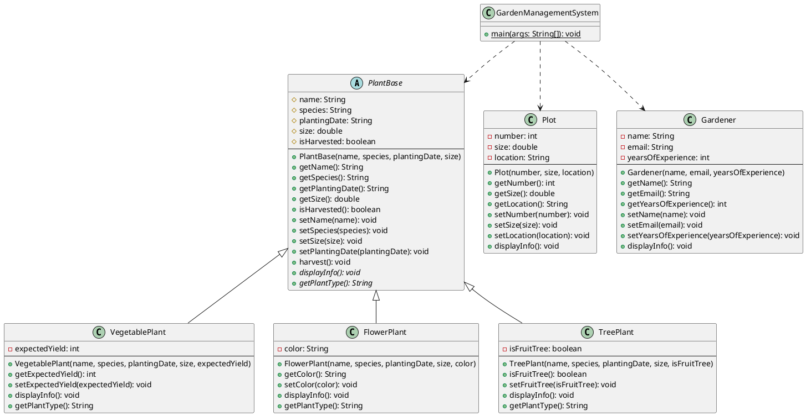

# Programmation orientée objet : Encapsulation et héritage - Mini-projet (partie 2)

Ce mini-projet est conçu pour vous permettre de mettre en pratique les concepts
théoriques vus dans le contenu
_["Programmation orientée objet : Encapsulation et héritage"](../)_.

## Table des matières

- [Table des matières](#table-des-matières)
- [Présentation du mini-projet](#présentation-du-mini-projet)
- [Objectifs de cette session](#objectifs-de-cette-session)
- [Structure du projet](#structure-du-projet)
- [Amélioration de l'encapsulation](#amélioration-de-lencapsulation)
  - [Étape 1 : rendre les attributs privés](#étape-1--rendre-les-attributs-privés)
  - [Étape 2 : créer les getters et setters](#étape-2--créer-les-getters-et-setters)
  - [Étape 3 : ajouter la validation dans les setters](#étape-3--ajouter-la-validation-dans-les-setters)
- [Introduction de l'héritage](#introduction-de-lhéritage)
  - [Étape 4 : créer une classe abstraite PlantBase](#étape-4--créer-une-classe-abstraite-plantbase)
  - [Étape 5 : créer des sous-classes de plantes](#étape-5--créer-des-sous-classes-de-plantes)
  - [Étape 6 : utiliser le mot-clé super](#étape-6--utiliser-le-mot-clé-super)
- [Surcharge (overloading)](#surcharge-overloading)
  - [Étape 7 : ajouter la surcharge de constructeurs](#étape-7--ajouter-la-surcharge-de-constructeurs)
  - [Étape 8 : ajouter la surcharge de méthodes](#étape-8--ajouter-la-surcharge-de-méthodes)
- [Mise à jour de la classe principale](#mise-à-jour-de-la-classe-principale)
  - [Étape 9 : adapter GardenManagementSystem](#étape-9--adapter-gardenmanagementsystem)
- [Test du projet](#test-du-projet)
  - [Compilation et exécution en ligne de commande](#compilation-et-exécution-en-ligne-de-commande)
  - [Sortie attendue](#sortie-attendue)
- [Diagramme de classes](#diagramme-de-classes)
- [Solution](#solution)
- [Conclusion](#conclusion)
- [Aller plus loin](#aller-plus-loin)

## Présentation du mini-projet

Dans cette deuxième partie du mini-projet fil rouge, nous allons améliorer
l'application de gestion de jardin communautaire créée lors de la première
session.

Nous allons appliquer les principes d'**encapsulation** pour protéger les
données et garantir leur cohérence, puis introduire l'**héritage** pour créer
une hiérarchie de classes de plantes avec des comportements spécifiques.

> [!TIP]
>
> Le [support de cours](../) est disponible pour vous aider à comprendre les
> concepts théoriques abordés dans ce mini-projet si besoin !

## Objectifs de cette session

À l'issue de cette session, les personnes qui étudient devraient avoir pu :

- Appliquer le principe d'encapsulation en rendant les attributs privés.
- Créer des getters et setters pour accéder aux attributs.
- Ajouter de la validation dans les setters pour garantir la cohérence des
  données.
- Créer une hiérarchie de classes avec une classe abstraite.
- Utiliser le mot-clé `extends` pour créer des sous-classes.
- Utiliser le mot-clé `super` pour appeler le constructeur parent.
- Définir des méthodes abstraites à implémenter dans les sous-classes.
- Utiliser le modificateur `protected` pour les membres accessibles aux
  sous-classes.
- Appliquer la surcharge de constructeurs pour offrir plusieurs façons de créer
  des objets.
- Appliquer la surcharge de méthodes pour fournir différentes versions d'une
  même fonctionnalité.

## Structure du projet

Pour cette partie du mini-projet, nous allons étendre la structure existante :

```text
05-programmation-orientee-objet-encapsulation-et-heritage/
└── 03-mini-projet/
    └── src/
        ├── PlantBase.java           (nouvelle classe abstraite)
        ├── VegetablePlant.java      (nouvelle sous-classe)
        ├── FlowerPlant.java         (nouvelle sous-classe)
        ├── TreePlant.java           (nouvelle sous-classe)
        ├── Plot.java                (modifiée avec encapsulation)
        ├── Gardener.java            (modifiée avec encapsulation)
        └── GardenManagementSystem.java (mise à jour)
```

> [!IMPORTANT]
>
> Cette partie fait suite à la première session. Si vous n'avez pas terminé la
> partie 1, récupérez le code de la solution avant de continuer.

## Amélioration de l'encapsulation

Nous allons commencer par améliorer l'encapsulation de nos classes existantes
(`Plot` et `Gardener`).

### Étape 1 : rendre les attributs privés

L'encapsulation consiste à cacher l'implémentation interne d'une classe et à
contrôler l'accès aux données.

Modifiez la classe `Plot` pour rendre tous les attributs privés :

```java
public class Plot {
    // Attributs privés
    private int number;
    private double size;
    private String location;

    // Constructeur
    public Plot(int number, double size, String location) {
        this.number = number;
        this.size = size;
        this.location = location;
    }

    // Les getters et setters viendront à l'étape suivante

    // Méthode pour afficher les informations
    public void displayInfo() {
        System.out.println("Parcelle #" + number);
        System.out.println("  Taille: " + size + " m²");
        System.out.println("  Localisation: " + location);
    }
}
```

> [!NOTE]
>
> En rendant les attributs `private`, on empêche l'accès direct depuis
> l'extérieur de la classe. C'est le premier principe de l'encapsulation.

Faites de même pour la classe `Gardener` :

```java
public class Gardener {
    // Attributs privés
    private String name;
    private String email;
    private int yearsOfExperience;

    // Constructeur
    public Gardener(String name, String email, int yearsOfExperience) {
        this.name = name;
        this.email = email;
        this.yearsOfExperience = yearsOfExperience;
    }

    // Les getters et setters viendront à l'étape suivante

    // Méthode pour afficher les informations
    public void displayInfo() {
        System.out.println("Jardinière: " + name);
        System.out.println("  Email: " + email);
        System.out.println("  Expérience: " + yearsOfExperience + " ans");
    }
}
```

### Étape 2 : créer les getters et setters

Maintenant que les attributs sont privés, nous devons créer des méthodes
publiques pour y accéder : les **getters** (pour lire) et les **setters** (pour
modifier).

Ajoutez les getters et setters à la classe `Plot` :

```java
public class Plot {
    // Attributs privés
    private int number;
    private double size;
    private String location;

    // Constructeur
    public Plot(int number, double size, String location) {
        this.number = number;
        this.size = size;
        this.location = location;
    }

    // Getters
    public int getNumber() {
        return number;
    }

    public double getSize() {
        return size;
    }

    public String getLocation() {
        return location;
    }

    // Setters
    public void setNumber(int number) {
        this.number = number;
    }

    public void setSize(double size) {
        this.size = size;
    }

    public void setLocation(String location) {
        this.location = location;
    }

    // Méthode pour afficher les informations
    public void displayInfo() {
        System.out.println("Parcelle #" + number);
        System.out.println("  Taille: " + size + " m²");
        System.out.println("  Localisation: " + location);
    }
}
```

Faites de même pour la classe `Gardener` :

```java
public class Gardener {
    // Attributs privés
    private String name;
    private String email;
    private int yearsOfExperience;

    // Constructeur
    public Gardener(String name, String email, int yearsOfExperience) {
        this.name = name;
        this.email = email;
        this.yearsOfExperience = yearsOfExperience;
    }

    // Getters
    public String getName() {
        return name;
    }

    public String getEmail() {
        return email;
    }

    public int getYearsOfExperience() {
        return yearsOfExperience;
    }

    // Setters
    public void setName(String name) {
        this.name = name;
    }

    public void setEmail(String email) {
        this.email = email;
    }

    public void setYearsOfExperience(int yearsOfExperience) {
        this.yearsOfExperience = yearsOfExperience;
    }

    // Méthode pour afficher les informations
    public void displayInfo() {
        System.out.println("Jardinière: " + name);
        System.out.println("  Email: " + email);
        System.out.println("  Expérience: " + yearsOfExperience + " ans");
    }
}
```

### Étape 3 : ajouter la validation dans les setters

L'un des avantages de l'encapsulation est de pouvoir **valider les données**
avant de les affecter à un attribut.

Améliorez les setters de la classe `Plot` pour ajouter de la validation :

```java
// Setters avec validation
public void setNumber(int number) {
    if (number <= 0) {
        System.out.println("Erreur: le numéro de parcelle doit être positif.");
        return;
    }
    this.number = number;
}

public void setSize(double size) {
    if (size <= 0) {
        System.out.println("Erreur: la taille de la parcelle doit être positive.");
        return;
    }
    if (size > 1000) {
        System.out.println("Erreur: la taille de la parcelle est trop grande.");
        return;
    }
    this.size = size;
}

public void setLocation(String location) {
    if (location == null || location.trim().isEmpty()) {
        System.out.println("Erreur: la localisation ne peut pas être vide.");
        return;
    }
    this.location = location;
}
```

> [!TIP]
>
> La validation dans les setters garantit que les objets restent dans un état
> cohérent. C'est une pratique essentielle en programmation orientée objet !

Faites de même pour la classe `Gardener` :

```java
// Setters avec validation
public void setName(String name) {
    if (name == null || name.trim().isEmpty()) {
        System.out.println("Erreur: le nom ne peut pas être vide.");
        return;
    }
    this.name = name;
}

public void setEmail(String email) {
    if (email == null || !email.contains("@")) {
        System.out.println("Erreur: l'email doit contenir un @.");
        return;
    }
    this.email = email;
}

public void setYearsOfExperience(int yearsOfExperience) {
    if (yearsOfExperience < 0) {
        System.out.println("Erreur: l'expérience ne peut pas être négative.");
        return;
    }
    if (yearsOfExperience > 100) {
        System.out.println("Erreur: l'expérience semble irréaliste.");
        return;
    }
    this.yearsOfExperience = yearsOfExperience;
}
```

## Introduction de l'héritage

Nous allons maintenant utiliser l'héritage pour créer différents types de
plantes avec des caractéristiques spécifiques.

### Étape 4 : créer une classe abstraite PlantBase

Au lieu d'avoir une seule classe `Plant`, nous allons créer une classe abstraite
`PlantBase` qui servira de base pour différents types de plantes.

Créez un fichier `PlantBase.java` dans le dossier `src/` :

```java
public abstract class PlantBase {
    // Attributs protégés (accessibles aux sous-classes)
    protected String name;
    protected String species;
    protected String plantingDate;
    protected double size;
    protected boolean isHarvested;

    // Constructeur
    public PlantBase(String name, String species, String plantingDate, double size) {
        this.name = name;
        this.species = species;
        this.plantingDate = plantingDate;
        this.size = size;
        this.isHarvested = false;
    }

    // Getters
    public String getName() {
        return name;
    }

    public String getSpecies() {
        return species;
    }

    public String getPlantingDate() {
        return plantingDate;
    }

    public double getSize() {
        return size;
    }

    public boolean isHarvested() {
        return isHarvested;
    }

    // Setters avec validation
    public void setName(String name) {
        if (name == null || name.trim().isEmpty()) {
            System.out.println("Erreur: le nom ne peut pas être vide.");
            return;
        }
        this.name = name;
    }

    public void setSpecies(String species) {
        if (species == null || species.trim().isEmpty()) {
            System.out.println("Erreur: l'espèce ne peut pas être vide.");
            return;
        }
        this.species = species;
    }

    public void setSize(double size) {
        if (size < 0) {
            System.out.println("Erreur: la taille ne peut pas être négative.");
            return;
        }
        this.size = size;
    }

    public void setPlantingDate(String plantingDate) {
        // Validation simplifiée
        if (plantingDate == null || plantingDate.trim().isEmpty()) {
            System.out.println("Erreur: la date de plantation ne peut pas être vide.");
            return;
        }
        this.plantingDate = plantingDate;
    }

    // Méthode pour récolter
    public void harvest() {
        if (isHarvested) {
            System.out.println(name + " a déjà été récoltée.");
        } else {
            isHarvested = true;
            System.out.println(name + " a été récoltée avec succès !");
        }
    }

    // Méthode abstraite à implémenter dans les sous-classes
    public abstract void displayInfo();

    // Méthode abstraite pour obtenir le type de plante
    public abstract String getPlantType();
}
```

> [!IMPORTANT]
>
> Une classe abstraite ne peut pas être instanciée directement. Elle sert de
> modèle pour les sous-classes. Les méthodes abstraites doivent être
> implémentées par toutes les sous-classes concrètes.

### Étape 5 : créer des sous-classes de plantes

Nous allons créer trois types de plantes : des légumes, des fleurs et des
arbres.

#### Classe VegetablePlant

Créez un fichier `VegetablePlant.java` :

```java
public class VegetablePlant extends PlantBase {
    // Attribut spécifique aux légumes
    private int expectedYield; // Rendement attendu en kg

    // Constructeur
    public VegetablePlant(String name, String species, String plantingDate,
                          double size, int expectedYield) {
        super(name, species, plantingDate, size);
        this.expectedYield = expectedYield;
    }

    // Getter et setter spécifiques
    public int getExpectedYield() {
        return expectedYield;
    }

    public void setExpectedYield(int expectedYield) {
        if (expectedYield < 0) {
            System.out.println("Erreur: le rendement ne peut pas être négatif.");
            return;
        }
        this.expectedYield = expectedYield;
    }

    // Implémentation de la méthode abstraite
    @Override
    public String getPlantType() {
        return "Légume";
    }

    // Implémentation de la méthode abstraite
    @Override
    public void displayInfo() {
        System.out.println("=== " + getPlantType() + " ===");
        System.out.println("Nom: " + name);
        System.out.println("Espèce: " + species);
        System.out.println("Date de plantation: " + plantingDate);
        System.out.println("Taille: " + size + " cm");
        System.out.println("Rendement attendu: " + expectedYield + " kg");
        System.out.println("Statut: " + (isHarvested ? "Récoltée" : "En croissance"));
    }
}
```

#### Classe FlowerPlant

Créez un fichier `FlowerPlant.java` :

```java
public class FlowerPlant extends PlantBase {
    // Attribut spécifique aux fleurs
    private String color;

    // Constructeur
    public FlowerPlant(String name, String species, String plantingDate,
                       double size, String color) {
        super(name, species, plantingDate, size);
        this.color = color;
    }

    // Getter et setter spécifiques
    public String getColor() {
        return color;
    }

    public void setColor(String color) {
        if (color == null || color.trim().isEmpty()) {
            System.out.println("Erreur: la couleur ne peut pas être vide.");
            return;
        }
        this.color = color;
    }

    // Implémentation de la méthode abstraite
    @Override
    public String getPlantType() {
        return "Fleur";
    }

    // Implémentation de la méthode abstraite
    @Override
    public void displayInfo() {
        System.out.println("=== " + getPlantType() + " ===");
        System.out.println("Nom: " + name);
        System.out.println("Espèce: " + species);
        System.out.println("Date de plantation: " + plantingDate);
        System.out.println("Taille: " + size + " cm");
        System.out.println("Couleur: " + color);
        System.out.println("Statut: " + (isHarvested ? "Fanée" : "En floraison"));
    }
}
```

#### Classe TreePlant

Créez un fichier `TreePlant.java` :

```java
public class TreePlant extends PlantBase {
    // Attribut spécifique aux arbres
    private boolean isFruitTree;

    // Constructeur
    public TreePlant(String name, String species, String plantingDate,
                     double size, boolean isFruitTree) {
        super(name, species, plantingDate, size);
        this.isFruitTree = isFruitTree;
    }

    // Getter et setter spécifiques
    public boolean isFruitTree() {
        return isFruitTree;
    }

    public void setFruitTree(boolean isFruitTree) {
        this.isFruitTree = isFruitTree;
    }

    // Implémentation de la méthode abstraite
    @Override
    public String getPlantType() {
        return "Arbre";
    }

    // Implémentation de la méthode abstraite
    @Override
    public void displayInfo() {
        System.out.println("=== " + getPlantType() + " ===");
        System.out.println("Nom: " + name);
        System.out.println("Espèce: " + species);
        System.out.println("Date de plantation: " + plantingDate);
        System.out.println("Taille: " + size + " cm");
        System.out.println("Type: " + (isFruitTree ? "Fruitier" : "Ornemental"));
        System.out.println("Statut: " + (isHarvested ? "Récolté" : "En croissance"));
    }
}
```

### Étape 6 : utiliser le mot-clé super

Le mot-clé `super` est utilisé dans les constructeurs des sous-classes pour
appeler le constructeur de la classe parent.

> [!NOTE]
>
> Dans les exemples ci-dessus, `super(name, species, plantingDate, size)`
> appelle le constructeur de `PlantBase` pour initialiser les attributs communs
> à toutes les plantes.

## Surcharge (overloading)

La surcharge (overloading) permet de créer plusieurs versions d'un constructeur
ou d'une méthode avec le même nom mais des paramètres différents. C'est un
concept important en Java qui améliore la flexibilité du code.

### Étape 7 : ajouter la surcharge de constructeurs

Nous allons ajouter des constructeurs surchargés à nos classes de plantes pour
permettre différentes façons de les créer.

#### Surcharge dans VegetablePlant

Modifiez la classe `VegetablePlant` pour ajouter des constructeurs surchargés :

```java
public class VegetablePlant extends PlantBase {
    // Attribut spécifique aux légumes
    private int expectedYield; // Rendement attendu en kg

    // Constructeur complet (déjà existant)
    public VegetablePlant(String name, String species, String plantingDate,
                          double size, int expectedYield) {
        super(name, species, plantingDate, size);
        this.expectedYield = expectedYield;
    }

    // Constructeur surchargé : sans rendement (valeur par défaut à 0)
    public VegetablePlant(String name, String species, String plantingDate, double size) {
        super(name, species, plantingDate, size);
        this.expectedYield = 0; // Valeur par défaut
    }

    // Constructeur surchargé : création simplifiée (date et taille par défaut)
    public VegetablePlant(String name, String species) {
        super(name, species, "2024-01-01", 0.0);
        this.expectedYield = 0;
    }

    // Getter et setter spécifiques
    public int getExpectedYield() {
        return expectedYield;
    }

    public void setExpectedYield(int expectedYield) {
        if (expectedYield < 0) {
            System.out.println("Erreur: le rendement ne peut pas être négatif.");
            return;
        }
        this.expectedYield = expectedYield;
    }

    // Implémentation de la méthode abstraite
    @Override
    public String getPlantType() {
        return "Légume";
    }

    // Implémentation de la méthode abstraite
    @Override
    public void displayInfo() {
        System.out.println("=== " + getPlantType() + " ===");
        System.out.println("Nom: " + name);
        System.out.println("Espèce: " + species);
        System.out.println("Date de plantation: " + plantingDate);
        System.out.println("Taille: " + size + " cm");
        System.out.println("Rendement attendu: " + expectedYield + " kg");
        System.out.println("Statut: " + (isHarvested ? "Récoltée" : "En croissance"));
    }
}
```

> [!NOTE]
>
> Les constructeurs surchargés permettent de créer des objets de différentes
> manières selon les informations disponibles. Par exemple :
>
> - `new VegetablePlant("Tomate", "Solanum", "2024-03-15", 45.0, 5)` : complet
> - `new VegetablePlant("Tomate", "Solanum", "2024-03-15", 45.0)` : sans
>   rendement
> - `new VegetablePlant("Tomate", "Solanum")` : minimal

#### Surcharge dans Plot

Ajoutons également des constructeurs surchargés à la classe `Plot` :

```java
public class Plot {
    // Attributs privés
    private int number;
    private double size;
    private String location;

    // Constructeur complet (déjà existant)
    public Plot(int number, double size, String location) {
        this.number = number;
        this.size = size;
        this.location = location;
    }

    // Constructeur surchargé : sans localisation
    public Plot(int number, double size) {
        this.number = number;
        this.size = size;
        this.location = "Non spécifiée";
    }

    // Constructeur surchargé : parcelle par défaut
    public Plot(int number) {
        this.number = number;
        this.size = 20.0; // Taille par défaut
        this.location = "Non spécifiée";
    }

    // Getters et setters (inchangés)
    // ...
}
```

### Étape 8 : ajouter la surcharge de méthodes

La surcharge de méthodes permet d'avoir plusieurs versions d'une même méthode
avec des paramètres différents.

#### Surcharge de la méthode grow() dans PlantBase

Ajoutons une méthode `grow()` surchargée à la classe `PlantBase` :

```java
public abstract class PlantBase {
    // Attributs protégés (accessibles aux sous-classes)
    protected String name;
    protected String species;
    protected String plantingDate;
    protected double size;
    protected boolean isHarvested;

    // Constructeur (inchangé)
    // ...

    // Getters et setters (inchangés)
    // ...

    // Méthode pour faire pousser la plante (version simple)
    public void grow() {
        grow(5.0); // Appel de la version surchargée avec une valeur par défaut
    }

    // Méthode surchargée : faire pousser d'une certaine taille
    public void grow(double increment) {
        if (isHarvested) {
            System.out.println(name + " a été récoltée et ne peut plus pousser.");
            return;
        }
        if (increment < 0) {
            System.out.println("Erreur: la croissance ne peut pas être négative.");
            return;
        }
        size += increment;
        System.out.println(name + " a poussé de " + increment + " cm. Nouvelle taille: " + size + " cm");
    }

    // Méthode surchargée : faire pousser avec un facteur et un message
    public void grow(double increment, String message) {
        grow(increment); // Réutilise la logique de la version précédente
        if (!isHarvested && increment >= 0) {
            System.out.println("  ➜ " + message);
        }
    }

    // Méthode pour récolter (inchangée)
    public void harvest() {
        if (isHarvested) {
            System.out.println(name + " a déjà été récoltée.");
        } else {
            isHarvested = true;
            System.out.println(name + " a été récoltée avec succès !");
        }
    }

    // Méthodes abstraites (inchangées)
    // ...
}
```

> [!TIP]
>
> La surcharge de méthodes améliore l'ergonomie de l'API. Une méthode simple
> `grow()` pour une utilisation rapide, et des versions plus détaillées
> `grow(double)` et `grow(double, String)` pour plus de contrôle.

#### Surcharge de displayInfo() dans VegetablePlant

Nous pouvons également surcharger `displayInfo()` pour offrir différents niveaux
de détail :

```java
public class VegetablePlant extends PlantBase {
    // Attributs et constructeurs (inchangés)
    // ...

    // Version standard de displayInfo (déjà existante)
    @Override
    public void displayInfo() {
        displayInfo(true); // Appel de la version détaillée
    }

    // Version surchargée : avec option d'affichage détaillé ou non
    public void displayInfo(boolean detailed) {
        System.out.println("=== " + getPlantType() + " ===");
        System.out.println("Nom: " + name);
        System.out.println("Espèce: " + species);

        if (detailed) {
            System.out.println("Date de plantation: " + plantingDate);
            System.out.println("Taille: " + size + " cm");
            System.out.println("Rendement attendu: " + expectedYield + " kg");
            System.out.println("Statut: " + (isHarvested ? "Récoltée" : "En croissance"));
        } else {
            System.out.println("Taille: " + size + " cm | Statut: " +
                             (isHarvested ? "Récoltée" : "En croissance"));
        }
    }

    // Autres méthodes (inchangées)
    // ...
}
```

> [!NOTE]
>
> La différence clé entre **surcharge (overloading)** et **redéfinition
> (overriding)** :
>
> - **Overloading** : même nom, paramètres différents, dans la même classe
> - **Overriding** : même signature, implémentation différente, dans une
>   sous-classe (utilise `@Override`)

## Mise à jour de la classe principale

### Étape 9 : adapter GardenManagementSystem

Maintenant que nous avons une hiérarchie de classes, mettons à jour notre classe
principale pour utiliser les nouveaux types de plantes.

Créez ou modifiez le fichier `GardenManagementSystem.java` :

```java
public class GardenManagementSystem {
    public static void main(String[] args) {
        System.out.println("=== Système de Gestion de Jardin Communautaire ===\n");

        // Création de jardinières avec encapsulation
        Gardener gardener1 = new Gardener("Marie Dubois", "marie.dubois@email.com", 5);
        Gardener gardener2 = new Gardener("Jean Martin", "jean.martin@email.com", 3);

        // Création de parcelles avec encapsulation
        Plot plot1 = new Plot(1, 25.5, "Section Nord");
        Plot plot2 = new Plot(2, 30.0, "Section Sud");

        // Création de différents types de plantes
        VegetablePlant tomato = new VegetablePlant(
            "Tomate Cerise",
            "Solanum lycopersicum",
            "2024-03-15",
            45.0,
            5
        );

        FlowerPlant rose = new FlowerPlant(
            "Rose Thé",
            "Rosa × odorata",
            "2024-02-10",
            80.0,
            "Rose"
        );

        TreePlant apple = new TreePlant(
            "Pommier Golden",
            "Malus domestica",
            "2023-11-01",
            200.0,
            true
        );

        VegetablePlant carrot = new VegetablePlant(
            "Carotte Nantaise",
            "Daucus carota",
            "2024-04-01",
            15.0,
            3
        );

        // Affichage des informations
        System.out.println("--- Jardinières ---\n");
        gardener1.displayInfo();
        System.out.println();
        gardener2.displayInfo();
        System.out.println();

        System.out.println("--- Parcelles ---\n");
        plot1.displayInfo();
        System.out.println();
        plot2.displayInfo();
        System.out.println();

        System.out.println("--- Plantes du jardin ---\n");
        tomato.displayInfo();
        System.out.println();
        rose.displayInfo();
        System.out.println();
        apple.displayInfo();
        System.out.println();
        carrot.displayInfo();
        System.out.println();

        // Test de la récolte
        System.out.println("--- Récolte ---\n");
        tomato.harvest();
        carrot.harvest();
        tomato.harvest(); // Tentative de récolte d'une plante déjà récoltée
        System.out.println();

        // Test de la surcharge de constructeurs
        System.out.println("--- Test de surcharge de constructeurs ---\n");
        VegetablePlant lettuce = new VegetablePlant("Laitue", "Lactuca sativa");
        Plot plot3 = new Plot(3);
        Plot plot4 = new Plot(4, 15.0);

        System.out.println("Laitue créée avec constructeur minimal:");
        lettuce.displayInfo();
        System.out.println();

        System.out.println("Parcelle 3 créée avec numéro seulement:");
        plot3.displayInfo();
        System.out.println();

        // Test de la surcharge de méthodes
        System.out.println("--- Test de surcharge de méthodes ---\n");
        rose.grow(); // Version simple
        rose.grow(10.0); // Version avec taille spécifique
        rose.grow(5.0, "Conditions optimales de croissance!"); // Version avec message
        System.out.println();

        System.out.println("Affichage détaillé:");
        carrot.displayInfo(true);
        System.out.println();

        System.out.println("Affichage simplifié:");
        carrot.displayInfo(false);
        System.out.println();

        // Test de la validation
        System.out.println("--- Test de validation ---\n");
        plot1.setSize(-10); // Erreur
        gardener1.setEmail("invalide"); // Erreur
        tomato.setExpectedYield(-5); // Erreur
    }
}
```

## Test du projet

### Compilation et exécution en ligne de commande

Pour compiler et exécuter le projet :

```bash
# Depuis le répertoire contenant src/
javac src/*.java
java -cp src GardenManagementSystem
```

> [!TIP]
>
> Si vous utilisez un IDE comme IntelliJ IDEA ou VS Code, vous pouvez exécuter
> directement depuis l'éditeur.

### Sortie attendue

Voici un exemple de sortie attendue :

```text
=== Système de Gestion de Jardin Communautaire ===

--- Jardinières ---

Jardinière: Marie Dubois
  Email: marie.dubois@email.com
  Expérience: 5 ans

Jardinière: Jean Martin
  Email: jean.martin@email.com
  Expérience: 3 ans

--- Parcelles ---

Parcelle #1
  Taille: 25.5 m²
  Localisation: Section Nord

Parcelle #2
  Taille: 30.0 m²
  Localisation: Section Sud

--- Plantes du jardin ---

=== Légume ===
Nom: Tomate Cerise
Espèce: Solanum lycopersicum
Date de plantation: 2024-03-15
Taille: 45.0 cm
Rendement attendu: 5 kg
Statut: En croissance

=== Fleur ===
Nom: Rose Thé
Espèce: Rosa × odorata
Date de plantation: 2024-02-10
Taille: 80.0 cm
Couleur: Rose
Statut: En floraison

=== Arbre ===
Nom: Pommier Golden
Espèce: Malus domestica
Date de plantation: 2023-11-01
Taille: 200.0 cm
Type: Fruitier
Statut: En croissance

=== Légume ===
Nom: Carotte Nantaise
Espèce: Daucus carota
Date de plantation: 2024-04-01
Taille: 15.0 cm
Rendement attendu: 3 kg
Statut: En croissance

--- Récolte ---

Tomate Cerise a été récoltée avec succès !
Carotte Nantaise a été récoltée avec succès !
Tomate Cerise a déjà été récoltée.

--- Test de surcharge de constructeurs ---

Laitue créée avec constructeur minimal:
=== Légume ===
Nom: Laitue
Espèce: Lactuca sativa
Date de plantation: 2024-01-01
Taille: 0.0 cm
Rendement attendu: 0 kg
Statut: En croissance

Parcelle 3 créée avec numéro seulement:
Parcelle #3
  Taille: 20.0 m²
  Localisation: Non spécifiée

--- Test de surcharge de méthodes ---

Rose Thé a poussé de 5.0 cm. Nouvelle taille: 85.0 cm
Rose Thé a poussé de 10.0 cm. Nouvelle taille: 95.0 cm
Rose Thé a poussé de 5.0 cm. Nouvelle taille: 100.0 cm
  ➜ Conditions optimales de croissance!

Affichage détaillé:
=== Légume ===
Nom: Carotte Nantaise
Espèce: Daucus carota
Date de plantation: 2024-04-01
Taille: 15.0 cm
Rendement attendu: 3 kg
Statut: Récoltée

Affichage simplifié:
=== Légume ===
Nom: Carotte Nantaise
Espèce: Daucus carota
Taille: 15.0 cm | Statut: Récoltée

--- Test de validation ---

Erreur: la taille de la parcelle doit être positive.
Erreur: l'email doit contenir un @.
Erreur: le rendement ne peut pas être négatif.
```

## Diagramme de classes

Voici le diagramme UML représentant la hiérarchie des classes après cette
session :



## Solution

Une solution complète est disponible dans le dossier [`solution/`](./solution/).

> [!TIP]
>
> Essayez de réaliser le mini-projet par vous-même avant de consulter la
> solution. C'est en pratiquant que vous progresserez le plus !

## Conclusion

Dans cette deuxième partie du mini-projet, vous avez appris à :

- Appliquer le principe d'**encapsulation** en rendant les attributs privés et
  en créant des getters/setters.
- Ajouter de la **validation** dans les setters pour garantir la cohérence des
  données.
- Créer une **hiérarchie de classes** avec une classe abstraite `PlantBase`.
- Utiliser le mot-clé `extends` pour créer des **sous-classes**.
- Utiliser le mot-clé `super` pour appeler le constructeur parent.
- Définir des **méthodes abstraites** à implémenter dans les sous-classes.
- Utiliser le modificateur `protected` pour les membres accessibles aux
  sous-classes.
- Appliquer la **surcharge de constructeurs** pour offrir plusieurs façons de
  créer des objets.
- Appliquer la **surcharge de méthodes** pour fournir différentes versions d'une
  fonctionnalité.

Ces concepts sont fondamentaux en programmation orientée objet et vous seront
utiles dans tous vos futurs projets Java !

Dans la prochaine session, nous introduirons le **polymorphisme** avec des
interfaces pour rendre notre système encore plus flexible.

## Aller plus loin

Si vous souhaitez approfondir vos connaissances, voici quelques suggestions :

- **Validation avancée** : utilisez des expressions régulières pour valider les
  emails de manière plus robuste.
- **Gestion des dates** : utilisez la classe `LocalDate` au lieu de `String`
  pour les dates de plantation.
- **Classes sealed** : explorez les classes scellées (Java 17+) pour restreindre
  quelles classes peuvent hériter de `PlantBase`.
- **Méthode toString()** : redéfinissez la méthode `toString()` héritée de
  `Object` pour faciliter l'affichage.
- **Plus de types de plantes** : créez d'autres types de plantes (herbes
  aromatiques, plantes grimpantes, etc.).
- **Attributs final** : utilisez le mot-clé `final` sur certains attributs qui
  ne doivent pas changer après l'initialisation.
