# Programmation orientée objet : Encapsulation et héritage

V. Guidoux, avec l'aide de
[GitHub Copilot](https://github.com/features/copilot).

Ce travail est sous licence [CC BY-SA 4.0][licence].

> [!TIP]
>
> Voici quelques informations relatives à ce contenu.
>
> **Ressources annexes**
>
> - Autres formats du support de cours : [Présentation (web)][presentation-web]
>   · [Présentation (PDF)][presentation-pdf]
> - Exemples de code : [Accéder au contenu](./01-exemples-de-code/)
> - Exercices : [Accéder au contenu](./02-exercices/)
> - Mini-projet : [Accéder au contenu](./03-mini-projet/)
> - Quiz : [Accéder au contenu][quiz-web]
>
> **Objectifs**
>
> À l'issue de cette séance, les personnes qui étudient devraient être capables
> de :
>
> - Appliquer le principe d'encapsulation pour cacher l'implémentation interne.
> - Valider les données dans les setters pour garantir la cohérence.
> - Concevoir des classes avec une interface publique claire.
> - Justifier les choix de visibilité des membres d'une classe.
> - Expliquer le concept d'héritage et sa finalité.
> - Créer des classes dérivées en utilisant le mot-clé `extends`.
> - Utiliser le mot-clé `super` pour appeler le constructeur de la classe
>   parent.
> - Identifier les relations "est-un" entre classes.
> - Organiser une hiérarchie de classes logique.
> - Définir une classe abstraite avec le mot-clé `abstract`.
> - Créer des méthodes abstraites à implémenter dans les sous-classes.
> - Différencier une classe abstraite d'une classe concrète.
> - Justifier l'utilisation de classes abstraites pour factoriser du code.
> - Appliquer le modificateur `protected` pour les membres accessibles aux
>   sous-classes.
> - Utiliser le mot-clé `final` pour empêcher la modification ou la
>   redéfinition.
> - Évaluer quand utiliser `final` sur des classes, méthodes ou variables.
>
> **Méthodes d'enseignement et d'apprentissage**
>
> Les méthodes d'enseignement et d'apprentissage utilisées pour animer la séance
> sont les suivantes :
>
> - Présentation magistrale.
> - Discussions collectives.
> - Travail en autonomie.
>
> **Méthodes d'évaluation**
>
> L'évaluation prend la forme d'exercices et d'un mini-projet à réaliser en
> autonomie en classe ou à la maison.
>
> L'évaluation se fait en utilisant les critères suivants :
>
> - Capacité à répondre avec justesse.
> - Capacité à argumenter.
> - Capacité à réaliser les tâches demandées.
> - Capacité à s'approprier les exemples de code.
> - Capacité à appliquer les exemples de code à des situations similaires.
>
> Les retours se font de la manière suivante :
>
> - Corrigé des exercices.
> - Corrigé du mini-projet.
>
> L'évaluation ne donne pas lieu à une note.

## Table des matières

- [Table des matières](#table-des-matières)
- [Introduction](#introduction)
- [L'encapsulation](#lencapsulation)
  - [Pourquoi l'encapsulation ?](#pourquoi-lencapsulation-)
  - [Les modificateurs d'accès](#les-modificateurs-daccès)
  - [Rendre les attributs privés](#rendre-les-attributs-privés)
  - [Les getters et setters](#les-getters-et-setters)
  - [Validation des données](#validation-des-données)
  - [Le modificateur final](#le-modificateur-final)
- [L'héritage](#lhéritage)
  - [Pourquoi l'héritage ?](#pourquoi-lhéritage-)
  - [La relation "est-un"](#la-relation-est-un)
  - [Créer une sous-classe avec extends](#créer-une-sous-classe-avec-extends)
  - [Le mot-clé super](#le-mot-clé-super)
  - [Le modificateur protected](#le-modificateur-protected)
  - [Les méthodes abstraites](#les-méthodes-abstraites)
  - [Les classes abstraites](#les-classes-abstraites)
  - [Redéfinition vs surcharge](#redéfinition-vs-surcharge)
- [Organiser une hiérarchie de classes](#organiser-une-hiérarchie-de-classes)
  - [Concevoir une hiérarchie logique](#concevoir-une-hiérarchie-logique)
  - [Factorisation du code](#factorisation-du-code)
  - [Exemple complet](#exemple-complet)
- [Ressources annexes](#ressources-annexes)
  - [Documentation officielle](#documentation-officielle)
  - [Tutoriels et guides](#tutoriels-et-guides)
- [Exemples de code](#exemples-de-code)
- [Exercices](#exercices)
- [Mini-projet](#mini-projet)
- [À faire pour la prochaine séance](#à-faire-pour-la-prochaine-séance)

## Introduction

Dans la session précédente, nous avons découvert les concepts fondamentaux de la
programmation orientée objet : les classes et les objets. Nous avons appris à
créer des classes simples avec des attributs directement accessibles (sans
encapsulation) et des méthodes.

Cependant, dans la pratique professionnelle, rendre les attributs publics pose
plusieurs problèmes :

- N'importe qui peut modifier directement les données, même avec des valeurs
  invalides.
- Il est difficile de contrôler comment les données sont modifiées.
- Le code devient difficile à maintenir et à faire évoluer.

De plus, si nous voulons créer plusieurs types d'objets similaires (par exemple,
différents types de véhicules), nous aurions tendance à dupliquer du code, ce
qui viole le principe DRY (Don't Repeat Yourself).

Cette session introduit deux concepts essentiels de la programmation orientée
objet qui résolvent ces problèmes :

1. **L'encapsulation** : protéger les données et contrôler leur accès.
2. **L'héritage** : réutiliser du code et créer des hiérarchies de classes.

Ces concepts sont les piliers de tout code Java professionnel bien conçu. Vous
les retrouverez dans toutes les bibliothèques Java standard et dans tout projet
Java sérieux.

## L'encapsulation

L'encapsulation est l'un des quatre piliers de la programmation orientée objet
(avec l'abstraction, l'héritage et le polymorphisme). Elle consiste à cacher les
détails internes d'une classe et à contrôler l'accès aux données.

### Pourquoi l'encapsulation ?

Reprenons l'exemple d'une classe `BankAccount` (compte bancaire) sans
encapsulation :

```java
class BankAccount {
    public String owner;
    public double balance;

    public void displayInfo() {
        System.out.println("Compte de: " + owner);
        System.out.println("Solde: " + balance + " CHF");
    }
}
```

<details>
<summary>Description du code</summary>

Déclaration d'une classe `BankAccount` avec deux attributs publics : `owner` de
type `String` et `balance` de type `double`.

Déclaration d'une méthode `displayInfo` avec un type de retour `void`. Dans le
corps de la méthode : deux appels de la méthode statique `System.out.println()`
affichant les informations du compte.

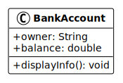

</details>

Avec cette classe, n'importe qui peut modifier directement le solde :

```java
BankAccount account = new BankAccount();
account.owner = "Alice";
account.balance = 1000.0;

// Problème : n'importe qui peut modifier le solde directement !
account.balance = -5000.0;  // Solde négatif !
account.balance = 999999999; // Montant irréaliste !
```

<details>
<summary>Description du code</summary>

Déclaration et initialisation d'une variable `account` de type `BankAccount` par
appel du constructeur avec l'opérateur `new`.

Affectation des attributs de l'objet `account` : `owner` à `"Alice"` et
`balance` à `1000.0`.

Tentatives d'affectation directe de l'attribut `balance` avec des valeurs
invalides : `-5000.0` (négatif) et `999999999` (irréaliste).

</details>

Ces modifications sont possibles car les attributs sont publics. C'est
exactement le problème que l'encapsulation résout.

**Les bénéfices de l'encapsulation** :

- **Protection des données** : empêche les modifications directes non
  contrôlées.
- **Validation** : permet de vérifier que les valeurs sont valides avant de les
  accepter.
- **Maintenabilité** : facilite les modifications futures du code interne sans
  affecter le code externe.
- **Interface claire** : définit clairement ce qui peut être fait avec un objet.

### Les modificateurs d'accès

Java propose quatre modificateurs d'accès pour contrôler la visibilité des
attributs, méthodes et classes :

| Modificateur   | Visibilité                                              | Usage typique                |
| -------------- | ------------------------------------------------------- | ---------------------------- |
| `public`       | Accessible de partout                                   | Méthodes publiques, classes  |
| `private`      | Accessible uniquement dans la classe                    | Attributs, méthodes internes |
| `protected`    | Accessible dans la classe et ses sous-classes           | Héritage                     |
| _(par défaut)_ | Accessible dans le même package (si aucun modificateur) | Rarement utilisé             |

**Règle générale pour l'encapsulation** :

- Les **attributs** sont presque toujours `private`.
- Les **méthodes publiques** (getters, setters, méthodes métier) sont `public`.
- Les **méthodes internes** (méthodes d'aide) sont `private`.

### Rendre les attributs privés

La première étape de l'encapsulation consiste à rendre les attributs privés avec
le mot-clé `private`.

Reprenons notre exemple `BankAccount` avec encapsulation :

```java
class BankAccount {
    private String owner;
    private double balance;

    public void displayInfo() {
        System.out.println("Compte de: " + owner);
        System.out.println("Solde: " + balance + " CHF");
    }
}
```

<details>
<summary>Description du code</summary>

Déclaration d'une classe `BankAccount` avec deux attributs privés : `owner` de
type `String` et `balance` de type `double`.

Déclaration d'une méthode publique `displayInfo` avec un type de retour `void`.
Dans le corps de la méthode : deux appels de la méthode statique
`System.out.println()` affichant les attributs de l'instance courante.

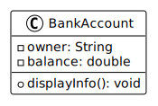

</details>

Maintenant, il est impossible d'accéder ou de modifier directement les attributs
depuis l'extérieur de la classe :

```java
BankAccount account = new BankAccount();
account.owner = "Alice";    // ERREUR : owner est privé
account.balance = 1000.0;   // ERREUR : balance est privé
```

<details>
<summary>Description du code</summary>

Déclaration et initialisation d'une variable `account` de type `BankAccount` par
appel du constructeur avec l'opérateur `new`.

Tentatives d'affectation des attributs privés `owner` et `balance`, ce qui
génère des erreurs de compilation car ces attributs ne sont pas accessibles
depuis l'extérieur de la classe.

</details>

Ce code ne compile pas. C'est exactement le comportement souhaité : les données
sont maintenant protégées.

Mais comment accéder aux données maintenant ? C'est là qu'interviennent les
getters et setters.

### Les getters et setters

Les **getters** (accesseurs) et **setters** (mutateurs) sont des méthodes
publiques qui permettent d'accéder aux attributs privés de manière contrôlée.

**Convention de nommage** :

- Getter : `getAttributeName()` pour lire la valeur.
- Setter : `setAttributeName(valeur)` pour modifier la valeur.
- Pour les booléens : `isAttributeName()` au lieu de `getAttributeName()`.

Ajoutons des getters et setters à notre classe `BankAccount` :

```java
class BankAccount {
    private String owner;
    private double balance;

    // Constructeur
    public BankAccount(String owner, double initialBalance) {
        this.owner = owner;
        this.balance = initialBalance;
    }

    // Getters
    public String getOwner() {
        return owner;
    }

    public double getBalance() {
        return balance;
    }

    // Setters
    public void setOwner(String owner) {
        this.owner = owner;
    }

    public void setBalance(double balance) {
        this.balance = balance;
    }

    public void displayInfo() {
        System.out.println("Compte de: " + owner);
        System.out.println("Solde: " + balance + " CHF");
    }
}
```

<details>
<summary>Description du code</summary>

Déclaration d'une classe `BankAccount` avec deux attributs privés : `owner` et
`balance`.

Déclaration d'un constructeur `BankAccount` avec deux paramètres. Dans le corps
du constructeur : affectation (opérateur `=`) des paramètres aux attributs de
l'instance courante (mot-clé `this`).

Déclaration de deux méthodes getter : `getOwner()` qui retourne l'attribut
`owner`, et `getBalance()` qui retourne l'attribut `balance`.

Déclaration de deux méthodes setter : `setOwner()` qui affecte une nouvelle
valeur à l'attribut `owner`, et `setBalance()` qui affecte une nouvelle valeur à
l'attribut `balance`.

Déclaration de la méthode `displayInfo()` pour afficher les informations du
compte.

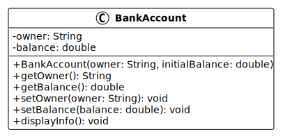

</details>

Maintenant, nous pouvons accéder aux données de manière contrôlée :

```java
BankAccount account = new BankAccount("Alice", 1000.0);

// Lecture avec les getters
String owner = account.getOwner();
double balance = account.getBalance();

// Modification avec les setters
account.setOwner("Alice Dupont");
account.setBalance(1500.0);
```

<details>
<summary>Description du code</summary>

Déclaration et initialisation d'une variable `account` de type `BankAccount` par
appel du constructeur avec deux arguments : `"Alice"` et `1000.0`.

Déclaration et initialisation de la variable `owner` par appel du getter
`getOwner()` sur l'objet `account`.

Déclaration et initialisation de la variable `balance` par appel du getter
`getBalance()` sur l'objet `account`.

Appels des setters `setOwner()` et `setBalance()` sur l'objet `account` pour
modifier les valeurs des attributs privés.

</details>

Les données sont maintenant accessibles, mais de manière contrôlée. Si nous
voulons ajouter de la validation, nous pouvons le faire dans les setters.

### Validation des données

L'un des avantages majeurs de l'encapsulation est la possibilité d'ajouter de la
validation dans les setters pour garantir que les données restent cohérentes.

Améliorons notre classe `BankAccount` avec de la validation :

```java
class BankAccount {
    private String owner;
    private double balance;

    public BankAccount(String owner, double initialBalance) {
        setOwner(owner);        // Utilise le setter pour validation
        setBalance(initialBalance); // Utilise le setter pour validation
    }

    public String getOwner() {
        return owner;
    }

    public double getBalance() {
        return balance;
    }

    public void setOwner(String owner) {
        if (owner == null || owner.trim().isEmpty()) {
            System.out.println("Erreur: le nom du propriétaire ne peut pas être vide.");
            return;
        }
        this.owner = owner;
    }

    public void setBalance(double balance) {
        if (balance < 0) {
            System.out.println("Erreur: le solde ne peut pas être négatif.");
            return;
        }
        this.balance = balance;
    }

    public void deposit(double amount) {
        if (amount <= 0) {
            System.out.println("Erreur: le montant doit être positif.");
            return;
        }
        balance += amount;
        System.out.println("Dépôt de " + amount + " CHF effectué.");
    }

    public void withdraw(double amount) {
        if (amount <= 0) {
            System.out.println("Erreur: le montant doit être positif.");
            return;
        }
        if (amount > balance) {
            System.out.println("Erreur: solde insuffisant.");
            return;
        }
        balance -= amount;
        System.out.println("Retrait de " + amount + " CHF effectué.");
    }

    public void displayInfo() {
        System.out.println("Compte de: " + owner);
        System.out.println("Solde: " + balance + " CHF");
    }
}
```

<details>
<summary>Description du code</summary>

Déclaration d'une classe `BankAccount` encapsulée avec validation.

Dans le constructeur : appel des setters `setOwner()` et `setBalance()` pour
bénéficier de la validation lors de la création de l'objet.

Dans `setOwner()` : structure conditionnelle `if` vérifiant que le paramètre
`owner` n'est ni `null` ni vide (après suppression des espaces avec `trim()`).
Si la condition est vraie, affichage d'un message d'erreur et sortie de la
méthode avec `return`. Sinon, affectation de la valeur à l'attribut.

Dans `setBalance()` : structure conditionnelle `if` vérifiant que le solde n'est
pas négatif. Si la condition est vraie, affichage d'un message d'erreur et
sortie de la méthode avec `return`. Sinon, affectation de la valeur à
l'attribut.

Déclaration de la méthode `deposit()` avec validation du montant. Si le montant
est valide, incrémentation de l'attribut `balance` avec l'opérateur `+=`.

Déclaration de la méthode `withdraw()` avec validation du montant et du solde
disponible. Si les validations passent, décrémentation de l'attribut `balance`
avec l'opérateur `-=`.

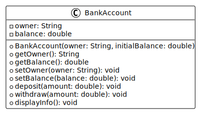

</details>

Maintenant, notre classe garantit que :

- Le nom du propriétaire n'est jamais vide.
- Le solde n'est jamais négatif.
- Les dépôts et retraits sont toujours valides.

Ces validations protègent l'intégrité des données de notre objet.

### Le modificateur final

Le mot-clé `final` peut être utilisé pour empêcher la modification ou la
redéfinition :

**Sur une variable** : la valeur ne peut plus être modifiée après
initialisation.

```java
class Circle {
    private final double radius; // Ne peut être modifié après initialisation

    public Circle(double radius) {
        this.radius = radius;
    }

    public double getRadius() {
        return radius;
    }

    // Pas de setRadius() car radius est final
}
```

<details>
<summary>Description du code</summary>

Déclaration d'une classe `Circle` avec un attribut privé `final` nommé `radius`
de type `double`.

Déclaration d'un constructeur qui initialise l'attribut `radius`. Grâce au
mot-clé `final`, cet attribut ne pourra plus être modifié après cette
initialisation.

Déclaration d'un getter `getRadius()` mais pas de setter, car l'attribut `final`
ne peut pas être modifié.

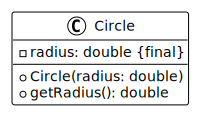

</details>

**Sur une méthode** : la méthode ne peut pas être redéfinie dans les
sous-classes.

```java
class Parent {
    public final void criticalMethod() {
        // Cette méthode ne pourra pas être redéfinie
    }
}
```

<details>
<summary>Description du code</summary>

Déclaration d'une classe `Parent` avec une méthode `final` nommée
`criticalMethod()`. Le mot-clé `final` empêche toute sous-classe de redéfinir
cette méthode.

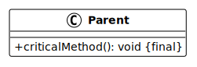

</details>

**Sur une classe** : la classe ne peut pas être étendue (pas de sous-classes).

```java
public final class MathUtils {
    // Cette classe ne peut pas avoir de sous-classes
}
```

<details>
<summary>Description du code</summary>

Déclaration d'une classe `final` nommée `MathUtils`. Le mot-clé `final` empêche
la création de sous-classes héritant de cette classe.

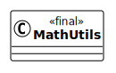

</details>

**Quand utiliser `final` ?** :

- Sur des **constantes** : valeurs qui ne doivent jamais changer.
- Sur des **attributs immuables** : comme un identifiant unique, un rayon de
  cercle, etc.
- Sur des **méthodes critiques** : pour garantir qu'elles ne seront pas
  modifiées par les sous-classes.
- Sur des **classes utilitaires** : comme `Math`, `String` en Java.

## L'héritage

L'héritage est un mécanisme qui permet à une classe (sous-classe ou classe
dérivée) d'hériter des attributs et méthodes d'une autre classe (superclasse ou
classe parent).

### Pourquoi l'héritage ?

Imaginons que nous voulons créer un système pour gérer différents types de
véhicules : voitures, motos, camions. Sans héritage, nous aurions :

```java
class Car {
    private String brand;
    private String model;
    private int year;
    private int numberOfDoors;

	public Car(String brand, String model, int year, int numberOfDoors) {
		this.brand = brand;
		this.model = model;
		this.year = year;
		this.numberOfDoors = numberOfDoors;
	}

	public String getBrand() {
		return brand;
	}

	public String getModel() {
		return model;
	}

	public int getYear() {
		return year;
	}

	public int getNumberOfDoors() {
		return numberOfDoors;
	}
}

class Motorcycle {
    private String brand;
    private String model;
    private int year;
    private boolean hasSidecar;

		public Motorcycle(String brand, String model, int year, boolean hasSidecar) {
			this.brand = brand;
			this.model = model;
			this.year = year;
			this.hasSidecar = hasSidecar;
		}

		public boolean hasSidecar() {
			return hasSidecar;
		}

		public String getBrand() {
			return brand;
		}

		public String getModel() {
			return model;
		}

		public int getYear() {
			return year;
		}
}

class Truck {
    private String brand;
    private String model;
    private int year;
    private double maxLoad;

	public Truck(String brand, String model, int year, double maxLoad) {
		this.brand = brand;
		this.model = model;
		this.year = year;
		this.maxLoad = maxLoad;
	}

	public double getMaxLoad() {
		return maxLoad;
	}

	public String getBrand() {
		return brand;
	}

	public String getModel() {
		return model;
	}

	public int getYear() {
		return year;
	}
}
```

<details>
<summary>Description du code</summary>

Déclaration de trois classes : `Car`, `Motorcycle` et `Truck`.

Chaque classe contient des attributs communs (`brand`, `model`, `year`) et des
attributs spécifiques (`numberOfDoors` pour `Car`, `hasSidecar` pour
`Motorcycle`, `maxLoad` pour `Truck`).

Cette approche viole le principe DRY car le code pour gérer les attributs
communs est dupliqué dans chaque classe.

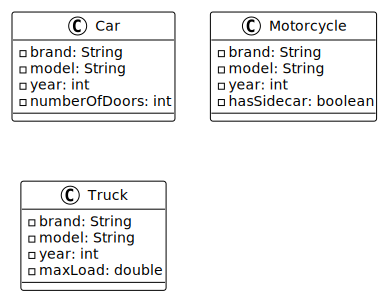

</details>

Le problème : beaucoup de code dupliqué pour les attributs communs (`brand`,
`model`, `year`).

Avec l'héritage, nous pouvons créer une classe parent `Vehicle` qui contient les
attributs communs, et des sous-classes qui héritent de ces attributs :

```java
class Vehicle {
    private String brand;
    private String model;
    private int year;

    public Vehicle(String brand, String model, int year) {
		this.brand = brand;
		this.model = model;
		this.year = year;
	}

	public String getBrand() {
		return brand;
	}

	public String getModel() {
		return model;
	}

	public int getYear() {
		return year;
	}
}

class Car extends Vehicle {
    private int numberOfDoors;
    // Hérite de brand, model, year
}

class Motorcycle extends Vehicle {
    private boolean hasSidecar;
    // Hérite de brand, model, year
}

class Truck extends Vehicle {
    private double maxLoad;
    // Hérite de brand, model, year
}
```

<details>
<summary>Description du code</summary>

Déclaration de la classe parent `Vehicle` avec les attributs communs : `brand`,
`model` et `year`.

Déclaration de trois sous-classes utilisant le mot-clé `extends` :

- `Car extends Vehicle` : hérite des attributs de `Vehicle` et ajoute
  `numberOfDoors`.
- `Motorcycle extends Vehicle` : hérite des attributs de `Vehicle` et ajoute
  `hasSidecar`.
- `Truck extends Vehicle` : hérite des attributs de `Vehicle` et ajoute
  `maxLoad`.

Chaque sous-classe bénéficie automatiquement des attributs et méthodes de la
classe parent sans dupliquer le code.

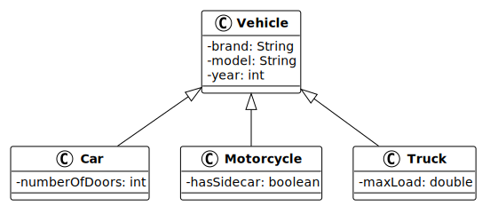

</details>

**Les bénéfices de l'héritage** :

- **Réutilisation du code** : évite la duplication en factorisant le code commun
  dans la classe parent.
- **Organisation logique** : crée une hiérarchie qui reflète les relations du
  monde réel.
- **Maintenabilité** : les modifications dans la classe parent se propagent
  automatiquement aux sous-classes.
- **Extensibilité** : facilite l'ajout de nouveaux types en créant de nouvelles
  sous-classes.

### La relation "est-un"

L'héritage modélise une relation **"est-un"** (is-a relationship) entre les
classes.

Exemples de relations "est-un" :

- Une voiture **est un** véhicule.
- Un chien **est un** animal.
- Une rose **est une** fleur.
- Un cercle **est une** forme géométrique.

Si vous pouvez dire "X est un Y" de manière logique, alors X peut hériter de Y.

**Attention** : ne pas confondre avec la relation "a-un" (has-a relationship)
qui représente la composition :

- Une voiture **a un** moteur (composition, pas héritage).
- Une personne **a une** adresse (composition, pas héritage).

### Créer une sous-classe avec extends

En Java, le mot-clé `extends` permet de créer une sous-classe qui hérite d'une
superclasse.

**Syntaxe** :

```java
class SousClasse extends SuperClasse {
    // Attributs et méthodes spécifiques à la sous-classe
}
```

Exemple complet :

```java
class Animal {
    protected String name;
    protected int age;

    public Animal(String name, int age) {
        this.name = name;
        this.age = age;
    }

    public void eat() {
        System.out.println(name + " mange.");
    }

    public void sleep() {
        System.out.println(name + " dort.");
    }
}

class Dog extends Animal {
    private String breed;

    public Dog(String name, int age, String breed) {
        super(name, age); // Appelle le constructeur parent
        this.breed = breed;
    }

    public void bark() {
        System.out.println(name + " aboie : Woof!");
    }
}
```

<details>
<summary>Description du code</summary>

Déclaration de la classe parent `Animal` avec deux attributs protégés (`name` et
`age`) et un constructeur qui les initialise.

Déclaration de deux méthodes dans `Animal` : `eat()` et `sleep()`.

Déclaration de la classe `Dog` qui hérite de `Animal` avec le mot-clé `extends`.
La classe `Dog` ajoute un attribut privé `breed`.

Dans le constructeur de `Dog` : appel du constructeur parent avec le mot-clé
`super` pour initialiser les attributs hérités, puis initialisation de
l'attribut spécifique `breed`.

Déclaration de la méthode `bark()` spécifique à la classe `Dog`. Cette méthode
peut accéder à l'attribut `name` hérité car il est `protected`.

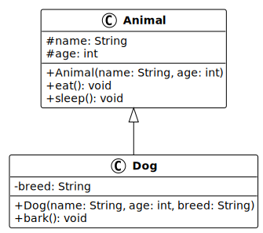

</details>

Utilisation :

```java
Dog myDog = new Dog("Rex", 3, "Berger Allemand");
myDog.eat();   // Méthode héritée de Animal
myDog.sleep(); // Méthode héritée de Animal
myDog.bark();  // Méthode spécifique à Dog
```

<details>
<summary>Description du code</summary>

Déclaration et initialisation d'une variable `myDog` de type `Dog` par appel du
constructeur avec trois arguments.

Appel de la méthode `eat()` héritée de la classe `Animal`.

Appel de la méthode `sleep()` héritée de la classe `Animal`.

Appel de la méthode `bark()` spécifique à la classe `Dog`.

</details>

### Le mot-clé super

Le mot-clé `super` permet d'interagir avec la superclasse depuis une
sous-classe.

**Utilisations de `super`** :

**1. Appeler le constructeur parent** :

```java
class Dog extends Animal {
    private String breed;

    public Dog(String name, int age, String breed) {
        super(name, age); // Appelle Animal(String name, int age)
        this.breed = breed;
    }
}
```

<details>
<summary>Description du code</summary>

Dans le constructeur de `Dog` : appel du constructeur de la classe parent
`Animal` avec le mot-clé `super` suivi des arguments `name` et `age`.

Cet appel doit être la première instruction du constructeur.

Après l'appel à `super`, initialisation de l'attribut spécifique `breed`.

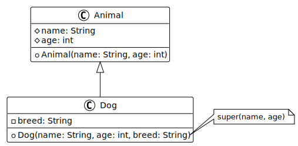

</details>

**2. Appeler une méthode parent redéfinie** :

```java
class Animal {
    public void makeSound() {
        System.out.println("L'animal fait un bruit.");
    }
}

class Dog extends Animal {
    @Override
    public void makeSound() {
        super.makeSound(); // Appelle la méthode parent
        System.out.println("Le chien aboie : Woof!");
    }
}
```

<details>
<summary>Description du code</summary>

Déclaration de la classe `Animal` avec une méthode `makeSound()`.

Déclaration de la classe `Dog` qui redéfinit la méthode `makeSound()` avec
l'annotation `@Override`.

Dans la méthode redéfinie : appel de la méthode parent avec `super.makeSound()`
pour exécuter le comportement hérité, puis ajout d'un comportement spécifique.

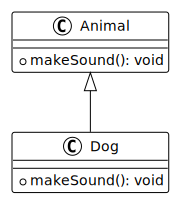

</details>

**Règles importantes** :

- `super()` pour appeler le constructeur parent doit être la **première
  instruction** du constructeur de la sous-classe.
- Si vous ne l'appelez pas explicitement, Java appelle automatiquement le
  constructeur parent sans paramètres.
- Si la superclasse n'a pas de constructeur sans paramètres, vous &devez appeler
  explicitement un constructeur avec `super(arguments)`.

### Le modificateur protected

Le modificateur `protected` est un compromis entre `private` et `public` :

- Un membre `protected` est **accessible** :
  - Dans la classe elle-même.
  - Dans toutes les sous-classes.
  - Dans les classes du même package.
- Un membre `protected` n'est **pas accessible** :
  - Dans des classes d'autres packages qui ne sont pas des sous-classes.

Comparaison des modificateurs dans le contexte de l'héritage :

| Modificateur | Dans la classe | Dans sous-classe | Autres classes |
| ------------ | -------------- | ---------------- | -------------- |
| `private`    | Oui            | Non              | Non            |
| `protected`  | Oui            | Oui              | Non            |
| `public`     | Oui            | Oui              | Oui            |

Exemple :

```java
class Parent {
    private String secret;      // Accessible seulement dans Parent
    protected String family;    // Accessible dans Parent et ses sous-classes
    public String forEveryone;  // Accessible partout
}

class Child extends Parent {
    public void test() {
        // secret = "test";     // ERREUR : private n'est pas accessible
        family = "test";        // OK : protected est accessible
        forEveryone = "test";   // OK : public est accessible
    }
}
```

<details>
<summary>Description du code</summary>

Déclaration de la classe `Parent` avec trois attributs de visibilités
différentes : `private`, `protected` et `public`.

Déclaration de la classe `Child` qui hérite de `Parent`.

Dans la méthode `test()` de `Child` : tentative d'accès aux différents attributs
hérités. L'attribut `private` génère une erreur de compilation, tandis que les
attributs `protected` et `public` sont accessibles.

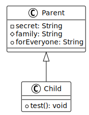

</details>

**Quand utiliser `protected` ?** :

- Pour des attributs ou méthodes que les sous-classes doivent pouvoir utiliser
  directement.
- Dans une hiérarchie de classes où les sous-classes ont besoin d'accéder aux
  membres de la classe parent.
- Attention : `protected` brise partiellement l'encapsulation, utilisez-le avec
  prudence.

### Les méthodes abstraites

Une **méthode abstraite** est une méthode déclarée sans implémentation (sans
corps). Elle définit une **signature** que les sous-classes doivent
obligatoirement implémenter.

**Syntaxe** :

```java
public abstract retourType methodName(parameters);
```

Exemple :

```java
abstract class Shape {
    protected String color;

    public Shape(String color) {
        this.color = color;
    }

    // Méthode abstraite : pas d'implémentation
    public abstract double calculateArea();

    // Méthode concrète : avec implémentation
    public void displayColor() {
        System.out.println("Couleur: " + color);
    }
}

class Circle extends Shape {
    private double radius;

    public Circle(String color, double radius) {
        super(color);
        this.radius = radius;
    }

    // Implémentation obligatoire de la méthode abstraite
    @Override
    public double calculateArea() {
        return Math.PI * radius * radius;
    }
}

class Rectangle extends Shape {
    private double width;
    private double height;

    public Rectangle(String color, double width, double height) {
        super(color);
        this.width = width;
        this.height = height;
    }

    // Implémentation obligatoire de la méthode abstraite
    @Override
    public double calculateArea() {
        return width * height;
    }
}
```

<details>
<summary>Description du code</summary>

Déclaration de la classe abstraite `Shape` avec un attribut `protected` nommé
`color`.

Déclaration d'une méthode abstraite `calculateArea()` sans corps
d'implémentation. Cette méthode définit un "contrat" que toutes les sous-classes
devront respecter.

Déclaration d'une méthode concrète `displayColor()` qui peut être utilisée
directement par les sous-classes.

Déclaration de la classe `Circle` qui hérite de `Shape`. Elle doit
obligatoirement implémenter la méthode abstraite `calculateArea()` avec
l'annotation `@Override`.

Déclaration de la classe `Rectangle` qui hérite également de `Shape` et
implémente `calculateArea()` avec son propre calcul.

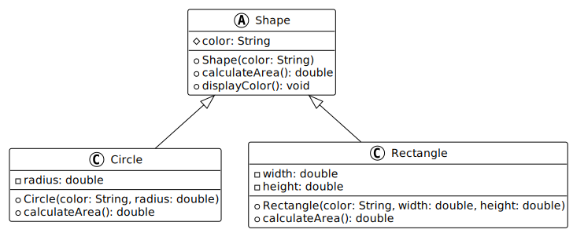

</details>

**Pourquoi utiliser des méthodes abstraites ?** :

- **Contrat** : force les sous-classes à implémenter certaines méthodes.
- **Polymorphisme** : permet de traiter différents types d'objets de manière
  uniforme.
- **Design** : aide à concevoir des hiérarchies de classes cohérentes.

### Les classes abstraites

Une **classe abstraite** est une classe qui ne peut pas être instanciée
directement. Elle sert de modèle pour ses sous-classes.

**Caractéristiques** :

- Déclarée avec le mot-clé `abstract`.
- Peut contenir des méthodes abstraites et/ou concrètes.
- Peut avoir des attributs, constructeurs, méthodes normales.
- Ne peut pas être instanciée avec `new`.

Exemple complet :

```java
abstract class Employee {
    protected String name;
    protected double baseSalary;

    public Employee(String name, double baseSalary) {
        this.name = name;
        this.baseSalary = baseSalary;
    }

    // Méthode abstraite : chaque type d'employé calcule son salaire différemment
    public abstract double calculateSalary();

    // Méthode concrète : commune à tous les employés
    public void displayInfo() {
        System.out.println("Employé: " + name);
        System.out.println("Salaire: " + calculateSalary() + " CHF");
    }
}

class FullTimeEmployee extends Employee {
    public FullTimeEmployee(String name, double baseSalary) {
        super(name, baseSalary);
    }

    @Override
    public double calculateSalary() {
        return baseSalary;
    }
}

class PartTimeEmployee extends Employee {
    private double hoursWorked;
    private double hourlyRate;

    public PartTimeEmployee(String name, double hoursWorked, double hourlyRate) {
        super(name, 0); // Pas de salaire de base
        this.hoursWorked = hoursWorked;
        this.hourlyRate = hourlyRate;
    }

    @Override
    public double calculateSalary() {
        return hoursWorked * hourlyRate;
    }
}
```

<details>
<summary>Description du code</summary>

Déclaration de la classe abstraite `Employee` avec deux attributs `protected` :
`name` et `baseSalary`.

Déclaration d'une méthode abstraite `calculateSalary()` qui devra être
implémentée par chaque type d'employé.

Déclaration d'une méthode concrète `displayInfo()` qui utilise la méthode
abstraite `calculateSalary()`. Cela fonctionne car Java garantit que toute
sous-classe concrète aura implémenté cette méthode.

Déclaration de la classe `FullTimeEmployee` qui hérite de `Employee` et
implémente `calculateSalary()` en retournant simplement le salaire de base.

Déclaration de la classe `PartTimeEmployee` qui hérite de `Employee`, ajoute des
attributs spécifiques (`hoursWorked`, `hourlyRate`), et implémente
`calculateSalary()` avec un calcul basé sur les heures travaillées.

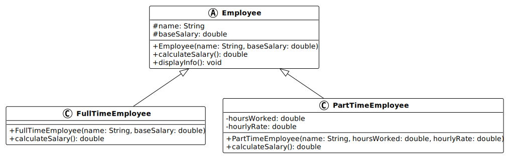

</details>

Utilisation :

```java
// Employee e = new Employee("Test", 5000); // ERREUR : classe abstraite

FullTimeEmployee emp1 = new FullTimeEmployee("Alice", 5000);
PartTimeEmployee emp2 = new PartTimeEmployee("Bob", 120, 40);

emp1.displayInfo(); // Employé: Alice, Salaire: 5000.0 CHF
emp2.displayInfo(); // Employé: Bob, Salaire: 4800.0 CHF
```

<details>
<summary>Description du code</summary>

Tentative commentée de création d'une instance de la classe abstraite
`Employee`, ce qui générerait une erreur de compilation.

Création de deux objets : un `FullTimeEmployee` et un `PartTimeEmployee`.

Appel de la méthode `displayInfo()` héritée sur chaque objet. Cette méthode
appelle `calculateSalary()`, qui exécute l'implémentation spécifique à chaque
type d'employé.

</details>

**Différence entre classe abstraite et classe concrète** :

| Classe abstraite                       | Classe concrète                            |
| -------------------------------------- | ------------------------------------------ |
| Mot-clé `abstract`                     | Pas de mot-clé `abstract`                  |
| Ne peut pas être instanciée            | Peut être instanciée                       |
| Peut avoir des méthodes abstraites     | Toutes les méthodes ont une implémentation |
| Sert de modèle pour les sous-classes   | Peut être utilisée directement             |
| Doit être étendue pour être utilisable | Utilisable telle quelle                    |

### Redéfinition vs surcharge

Il est important de ne pas confondre deux concepts différents :

**Redéfinition (overriding)** :

- Même nom, **mêmes paramètres**, dans une **sous-classe**.
- La méthode de la sous-classe **remplace** celle de la classe parent.
- Utilise l'annotation `@Override`.

```java
class Parent {
    public void greet() {
        System.out.println("Bonjour du parent");
    }
}

class Child extends Parent {
    @Override
    public void greet() {
        System.out.println("Bonjour de l'enfant");
    }
}
```

<details>
<summary>Description du code</summary>

Déclaration de la classe `Parent` avec une méthode `greet()`.

Déclaration de la classe `Child` qui redéfinit la méthode `greet()` avec
l'annotation `@Override`. La méthode a le même nom et les mêmes paramètres, mais
une implémentation différente.

Lorsqu'on appelle `greet()` sur un objet `Child`, c'est la version redéfinie qui
s'exécute.

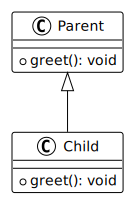

</details>

**Surcharge (overloading)** :

- Même nom, **paramètres différents**, dans la **même classe** ou une
  sous-classe.
- Plusieurs versions de la méthode coexistent.
- Pas d'annotation `@Override`.

```java
class Calculator {
    public int add(int a, int b) {
        return a + b;
    }

    public double add(double a, double b) {
        return a + b;
    }

    public int add(int a, int b, int c) {
        return a + b + c;
    }
}
```

<details>
<summary>Description du code</summary>

Déclaration de la classe `Calculator` avec trois méthodes nommées `add`, mais
avec des paramètres différents (surcharge).

La première version prend deux `int` et retourne un `int`.

La deuxième version prend deux `double` et retourne un `double`.

La troisième version prend trois `int` et retourne un `int`.

Java choisit quelle version appeler en fonction du nombre et du type des
arguments fournis lors de l'appel.

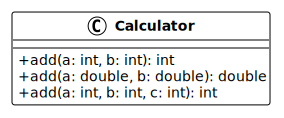

</details>

| Redéfinition (Override)              | Surcharge (Overload)                |
| ------------------------------------ | ----------------------------------- |
| Sous-classe redéfinit méthode parent | Plusieurs versions dans même classe |
| Même signature (nom + paramètres)    | Même nom, paramètres différents     |
| `@Override`                          | Pas d'annotation                    |
| Polymorphisme                        | Flexibilité d'utilisation           |

## Organiser une hiérarchie de classes

### Concevoir une hiérarchie logique

Pour concevoir une bonne hiérarchie de classes, suivez ces principes :

**1. Identifier les caractéristiques communes** :

- Quels attributs et méthodes sont partagés par plusieurs classes ?
- Ces éléments communs vont dans la classe parent.

**2. Appliquer la relation "est-un"** :

- Vérifiez que la relation "X est un Y" est logique.
- Si ce n'est pas le cas, l'héritage n'est probablement pas approprié.

**3. Utiliser des classes abstraites pour les concepts généraux** :

- Si une classe représente un concept général qui ne devrait pas être instancié
  directement, rendez-la abstraite.

**4. Créer des sous-classes pour les spécialisations** :

- Chaque sous-classe ajoute des attributs ou comportements spécifiques.
- Chaque sous-classe implémente les méthodes abstraites de manière appropriée.

**5. Éviter les hiérarchies trop profondes** :

- Une hiérarchie de plus de 3-4 niveaux devient difficile à maintenir.
- Privilégiez la composition à l'héritage quand c'est possible.

### Factorisation du code

L'un des principaux avantages de l'héritage est la **factorisation du code** :
placer le code commun au niveau le plus haut possible dans la hiérarchie.

**Avant factorisation** :

```java
class Cat {
    private String name;
    private int age;

    public void eat() { /* ... */ }
    public void sleep() { /* ... */ }
    public void meow() { /* ... */ }
}

class Dog {
    private String name;
    private int age;

    public void eat() { /* ... */ }
    public void sleep() { /* ... */ }
    public void bark() { /* ... */ }
}
```

**Après factorisation** :

```java
abstract class Animal {
    protected String name;
    protected int age;

    public void eat() { /* ... */ }
    public void sleep() { /* ... */ }
    public abstract void makeSound();
}

class Cat extends Animal {
    @Override
    public void makeSound() {
        System.out.println("Miaou!");
    }
}

class Dog extends Animal {
    @Override
    public void makeSound() {
        System.out.println("Woof!");
    }
}
```

<details>
<summary>Description du code</summary>

Exemple de factorisation du code.

Avant : deux classes `Cat` et `Dog` avec du code dupliqué pour les attributs et
méthodes communs.

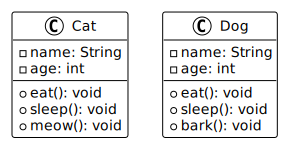

Après : création d'une classe abstraite `Animal` qui factorise les éléments
communs (`name`, `age`, `eat()`, `sleep()`). Introduction d'une méthode
abstraite `makeSound()` pour le comportement spécifique à chaque animal.

Les classes `Cat` et `Dog` héritent de `Animal` et n'implémentent que ce qui est
spécifique à chacune : la méthode `makeSound()`.

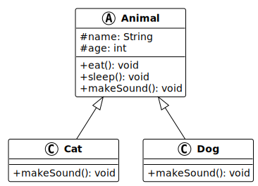

</details>

### Exemple complet

Voici un exemple complet illustrant tous les concepts de cette session :

```java
// Classe abstraite représentant un véhicule générique
abstract class Vehicle {
    protected String brand;
    protected String model;
    protected int year;
    protected double fuelLevel;

    public Vehicle(String brand, String model, int year) {
        this.brand = brand;
        this.model = model;
        this.year = year;
        this.fuelLevel = 0;
    }

    // Getters
    public String getBrand() { return brand; }
    public String getModel() { return model; }
    public int getYear() { return year; }
    public double getFuelLevel() { return fuelLevel; }

    // Setters avec validation
    public void setFuelLevel(double fuelLevel) {
        if (fuelLevel < 0 || fuelLevel > 100) {
            System.out.println("Erreur: niveau de carburant invalide.");
            return;
        }
        this.fuelLevel = fuelLevel;
    }

    // Méthode concrète commune
    public void refuel(double amount) {
        if (amount <= 0) {
            System.out.println("Erreur: quantité invalide.");
            return;
        }
        double newLevel = fuelLevel + amount;
        if (newLevel > 100) {
            fuelLevel = 100;
            System.out.println("Réservoir plein.");
        } else {
            fuelLevel = newLevel;
            System.out.println("Niveau de carburant: " + fuelLevel + "%");
        }
    }

    // Méthodes abstraites
    public abstract void start();
    public abstract String getVehicleType();
}

// Sous-classe pour les voitures
class Car extends Vehicle {
    private int numberOfDoors;

    public Car(String brand, String model, int year, int numberOfDoors) {
        super(brand, model, year);
        this.numberOfDoors = numberOfDoors;
    }

    public int getNumberOfDoors() {
        return numberOfDoors;
    }

    @Override
    public void start() {
        if (fuelLevel < 10) {
            System.out.println("Niveau de carburant insuffisant pour démarrer.");
            return;
        }
        System.out.println("La voiture démarre... Vroom!");
    }

    @Override
    public String getVehicleType() {
        return "Voiture";
    }
}

// Sous-classe pour les motos
class Motorcycle extends Vehicle {
    private final boolean hasSidecar;

    public Motorcycle(String brand, String model, int year, boolean hasSidecar) {
        super(brand, model, year);
        this.hasSidecar = hasSidecar;
    }

    public boolean hasSidecar() {
        return hasSidecar;
    }

    @Override
    public void start() {
        if (fuelLevel < 5) {
            System.out.println("Niveau de carburant insuffisant pour démarrer.");
            return;
        }
        System.out.println("La moto démarre... Broooom!");
    }

    @Override
    public String getVehicleType() {
        return "Moto";
    }
}

// Classe principale pour tester
public class VehicleDemo {
    public static void main(String[] args) {
        // Création de véhicules
        Car myCar = new Car("Toyota", "Corolla", 2020, 4);
        Motorcycle myMoto = new Motorcycle("Harley", "Davidson", 2022, false);

        // Test de l'encapsulation et validation
        myCar.setFuelLevel(50);
        myCar.refuel(30);

        // Test de l'héritage
        myCar.start();
        myMoto.setFuelLevel(10);
        myMoto.start();

        // Polymorphisme (sera vu dans une session future)
        Vehicle[] vehicles = {myCar, myMoto};
        for (Vehicle v : vehicles) {
            System.out.println(v.getVehicleType() + ": " + v.getBrand());
        }
    }
}
```

<details>
<summary>Description du code</summary>

Déclaration d'une classe abstraite `Vehicle` avec encapsulation des attributs
(`protected` pour l'héritage).

Constructeur initialisant les attributs communs. Getters publics et setters avec
validation pour `fuelLevel`.

Méthode concrète `refuel()` commune à tous les véhicules, avec validation et
logique métier.

Deux méthodes abstraites : `start()` et `getVehicleType()` que chaque type de
véhicule devra implémenter.

Déclaration de la classe `Car` qui hérite de `Vehicle` et ajoute un attribut
spécifique `numberOfDoors`. Implémentation des méthodes abstraites avec un
comportement spécifique aux voitures.

Déclaration de la classe `Motorcycle` qui hérite de `Vehicle` et ajoute un
attribut `final` `hasSidecar`. Implémentation des méthodes abstraites avec un
comportement spécifique aux motos.

Dans la classe `VehicleDemo` : création d'instances, test de l'encapsulation
(validation), de l'héritage (méthodes communes et spécifiques), et introduction
au polymorphisme avec un tableau de `Vehicle`.

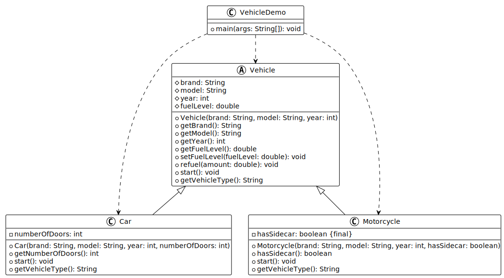

</details>

## Ressources annexes

### Documentation officielle

- [Java Inheritance (Oracle)](https://docs.oracle.com/javase/tutorial/java/IandI/subclasses.html)
  : tutoriel officiel sur l'héritage.
- [Java Encapsulation (Oracle)](https://docs.oracle.com/javase/tutorial/java/javaOO/accesscontrol.html)
  : guide officiel sur le contrôle d'accès.
- [Abstract Classes (Oracle)](https://docs.oracle.com/javase/tutorial/java/IandI/abstract.html)
  : documentation sur les classes abstraites.

### Tutoriels et guides

- [Java Tutorial (W3Schools)](https://www.w3schools.com/java/default.asp) :
  tutoriel complet sur Java.
- [Java Modifiers (W3Schools)](https://www.w3schools.com/java/java_modifiers.asp)
  : guide sur les modificateurs d'accès.
- [Java Encapsulation (W3Schools)](https://www.w3schools.com/java/java_encapsulation.asp)
  : tutoriel pratique sur l'encapsulation.
- [Java Inheritance (W3Schools)](https://www.w3schools.com/java/java_inheritance.asp)
  : guide sur l'héritage avec exemples.
- [Java Super Keyword (W3Schools)](https://www.w3schools.com/java/java_super.asp)
  : utilisation du mot-clé super.
- [Java Abstraction (W3Schools)](https://www.w3schools.com/java/java_abstract.asp)
  : introduction aux classes et méthodes abstraites.

## Exemples de code

Nous vous invitons à consulter les exemples de code associés à ce contenu de
cours pour mieux comprendre les concepts abordés.

Vous trouverez les exemples de code ici :
[Exemples de code](./01-exemples-de-code/).

## Exercices

Nous vous invitons maintenant à réaliser les exercices de la séance afin de
mettre en pratique les concepts abordés.

Vous trouverez les exercices et leur corrigé ici : [Exercices](./02-exercices/).

## Mini-projet

Nous vous invitons maintenant à réaliser le mini-projet de la séance afin de
mettre en pratique les concepts abordés.

Vous trouverez les détails du mini-projet ici :
[Mini-projet](./03-mini-projet/).

## À faire pour la prochaine séance

Chaque personne est libre de gérer son temps comme elle le souhaite. Cependant,
il est recommandé pour la prochaine séance de :

- Relire le support de cours si nécessaire.
- Relire les exemples de code et leur description pour bien comprendre les
  concepts.
- Finaliser les exercices qui n'ont pas été terminés en classe.
- Finaliser la partie du mini-projet qui n'a pas été terminée en classe.

<!-- URLs -->

[licence]:
	https://github.com/heig-vd-progim-course/heig-vd-progim2-course/blob/main/LICENSE.md
[quiz-web]:
	https://heig-vd-progim-course.github.io/heig-vd-progim2-course/01-contenus-du-cours/05-programmation-orientee-objet-encapsulation-et-heritage/quiz.html
[presentation-web]:
	https://heig-vd-progim-course.github.io/heig-vd-progim2-course/01-contenus-du-cours/05-programmation-orientee-objet-encapsulation-et-heritage/presentation.html
[presentation-pdf]:
	https://heig-vd-progim-course.github.io/heig-vd-progim2-course/01-contenus-du-cours/05-programmation-orientee-objet-encapsulation-et-heritage/05-programmation-orientee-objet-encapsulation-et-heritage-presentation.pdf
