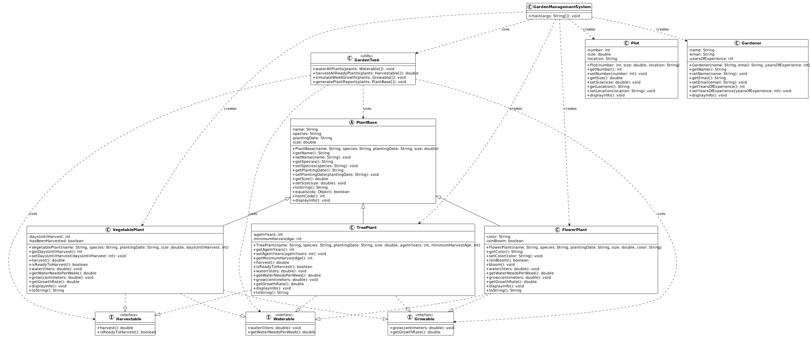

# Programmation orientée objet : Polymorphisme - Mini-projet (partie 3)

Bienvenue dans la troisième partie du mini-projet sur la gestion de jardin
communautaire !

> [!TIP]
>
> Toutes les informations relatives à ce contenu sont décrites dans le
> [support de cours principal](../).

## Table des matières

- [Table des matières](#table-des-matières)
- [Présentation du mini-projet](#présentation-du-mini-projet)
- [Objectifs de cette session](#objectifs-de-cette-session)
- [Structure du projet](#structure-du-projet)
- [Introduction aux interfaces](#introduction-aux-interfaces)
  - [Étape 1 : créer l'interface Harvestable](#étape-1--créer-linterface-harvestable)
  - [Étape 2 : créer l'interface Waterable](#étape-2--créer-linterface-waterable)
  - [Étape 3 : créer l'interface Growable](#étape-3--créer-linterface-growable)
- [Implémentation des interfaces](#implémentation-des-interfaces)
  - [Étape 4 : implémenter les interfaces dans VegetablePlant](#étape-4--implémenter-les-interfaces-dans-vegetableplant)
  - [Étape 5 : implémenter les interfaces dans FlowerPlant](#étape-5--implémenter-les-interfaces-dans-flowerplant)
  - [Étape 6 : implémenter les interfaces dans TreePlant](#étape-6--implémenter-les-interfaces-dans-treeplant)
- [Redéfinition des méthodes Object](#redéfinition-des-méthodes-object)
  - [Étape 7 : redéfinir toString() dans PlantBase](#étape-7--redéfinir-tostring-dans-plantbase)
  - [Étape 8 : redéfinir equals() et hashCode() dans PlantBase](#étape-8--redéfinir-equals-et-hashcode-dans-plantbase)
  - [Étape 9 : redéfinir toString() dans les sous-classes](#étape-9--redéfinir-tostring-dans-les-sous-classes)
- [Utilisation du polymorphisme](#utilisation-du-polymorphisme)
  - [Étape 10 : créer une classe GardenTask](#étape-10--créer-une-classe-gardentask)
  - [Étape 11 : mettre à jour GardenManagementSystem](#étape-11--mettre-à-jour-gardenmanagementsystem)
- [Test du projet](#test-du-projet)
  - [Compilation et exécution en ligne de commande](#compilation-et-exécution-en-ligne-de-commande)
  - [Sortie attendue](#sortie-attendue)
- [Diagramme de classes](#diagramme-de-classes)
- [Solution](#solution)
- [Conclusion](#conclusion)
  - [Prochaine étape](#prochaine-étape)
- [Aller plus loin](#aller-plus-loin)

## Présentation du mini-projet

Dans cette troisième partie du mini-projet, nous allons découvrir et appliquer
le **polymorphisme**, l'un des concepts les plus puissants de la programmation
orientée objet.

Lors des sessions précédentes, nous avons :

- **Partie 1** : créé des classes de base avec des attributs et méthodes.
- **Partie 2** : appliqué l'encapsulation et l'héritage avec une hiérarchie de
  plantes.

Maintenant, nous allons voir comment le polymorphisme nous permet de traiter
différents types de plantes de manière uniforme, tout en respectant leurs
spécificités.

Le polymorphisme permet de :

- Définir des **interfaces** qui spécifient des comportements communs.
- Manipuler des objets de différents types à travers une interface commune.
- Redéfinir des méthodes pour adapter leur comportement.
- Écrire du code plus flexible et maintenable.

Par exemple, toutes les plantes peuvent être arrosées, mais la façon de les
arroser peut varier. Le polymorphisme nous permet de gérer cela élégamment.

## Objectifs de cette session

À l'issue de cette session, les personnes qui étudient devraient avoir pu :

- Définir des interfaces Java avec le mot-clé `interface`.
- Implémenter plusieurs interfaces dans une même classe.
- Différencier une interface d'une classe abstraite.
- Utiliser le polymorphisme pour traiter différents objets de manière uniforme.
- Redéfinir la méthode `toString()` pour représenter un objet sous forme de
  chaîne.
- Implémenter `equals()` et `hashCode()` de manière cohérente.
- Utiliser l'annotation `@Override` pour marquer les redéfinitions.
- Manipuler des collections d'objets polymorphes.

## Structure du projet

Pour cette partie du mini-projet, nous allons étendre la structure existante en
ajoutant des interfaces :

```text
06-programmation-orientee-objet-polymorphisme/
└── 03-mini-projet/
    └── src/
        ├── Harvestable.java         (nouvelle interface)
        ├── Waterable.java           (nouvelle interface)
        ├── Growable.java            (nouvelle interface)
        ├── PlantBase.java           (modifiée)
        ├── VegetablePlant.java      (modifiée avec interfaces)
        ├── FlowerPlant.java         (modifiée avec interfaces)
        ├── TreePlant.java           (modifiée avec interfaces)
        ├── Plot.java
        ├── Gardener.java
        ├── GardenTask.java          (nouvelle classe)
        └── GardenManagementSystem.java (mise à jour)
```

> [!IMPORTANT]
>
> Cette partie fait suite aux sessions précédentes. Si vous n'avez pas terminé
> la partie 2, récupérez le code de la solution avant de continuer.
>
> Votre projet doit contenir les classes `PlantBase`, `VegetablePlant`,
> `FlowerPlant`, `TreePlant`, `Plot` et `Gardener` de la partie 2.

## Introduction aux interfaces

Commençons par comprendre ce qu'est une interface et pourquoi elle est utile.

> [!NOTE]
>
> Une **interface** en Java est un contrat qui spécifie un ensemble de méthodes
> qu'une classe doit implémenter, sans définir leur implémentation. C'est comme
> une promesse : "Si tu implémentes cette interface, tu dois fournir ces
> méthodes".

Prenons un exemple concret : dans notre jardin, toutes les plantes peuvent être
arrosées, mais pas toutes ne peuvent être récoltées. Les légumes et arbres
fruitiers peuvent être récoltés, mais pas les fleurs ornementales.

Au lieu de mettre une méthode `harvest()` dans toutes les classes, nous allons
créer une interface `Harvestable` (récoltable) que seules certaines classes
implémenteront.

### Étape 1 : créer l'interface Harvestable

Une interface définit des méthodes sans implémentation. Les classes qui
implémentent l'interface doivent fournir le code de ces méthodes.

Créez un fichier `Harvestable.java` dans le dossier `src/` :

```java
/**
 * Interface représentant une plante qui peut être récoltée.
 * Les classes qui implémentent cette interface doivent fournir
 * une méthode pour récolter la plante.
 */
public interface Harvestable {
    /**
     * Récolte la plante et retourne la quantité récoltée en kilogrammes.
     *
     * @return la quantité récoltée en kg, ou 0 si la récolte n'est pas possible
     */
    double harvest();

    /**
     * Vérifie si la plante est prête à être récoltée.
     *
     * @return true si la plante peut être récoltée, false sinon
     */
    boolean isReadyToHarvest();
}
```

> [!NOTE]
>
> Dans une interface, toutes les méthodes sont **publiques** et **abstraites**
> par défaut. Vous n'avez pas besoin d'écrire `public abstract` devant chaque
> méthode.

### Étape 2 : créer l'interface Waterable

Toutes les plantes ont besoin d'eau, mais la quantité nécessaire peut varier.
Créons une interface pour représenter ce comportement.

Créez un fichier `Waterable.java` dans le dossier `src/` :

```java
/**
 * Interface représentant une plante qui peut être arrosée.
 * Les classes qui implémentent cette interface doivent fournir
 * une méthode pour arroser la plante.
 */
public interface Waterable {
    /**
     * Arrose la plante avec une certaine quantité d'eau en litres.
     *
     * @param liters la quantité d'eau en litres
     */
    void water(double liters);

    /**
     * Retourne la quantité d'eau nécessaire par semaine en litres.
     *
     * @return la quantité d'eau recommandée en litres par semaine
     */
    double getWaterNeedsPerWeek();
}
```

### Étape 3 : créer l'interface Growable

Les plantes grandissent au fil du temps. Créons une interface pour représenter
la croissance.

Créez un fichier `Growable.java` dans le dossier `src/` :

```java
/**
 * Interface représentant une plante qui peut grandir.
 * Les classes qui implémentent cette interface doivent fournir
 * des méthodes pour gérer la croissance.
 */
public interface Growable {
    /**
     * Fait grandir la plante d'un certain nombre de centimètres.
     *
     * @param centimeters la croissance en centimètres
     */
    void grow(double centimeters);

    /**
     * Retourne le taux de croissance moyen par semaine en centimètres.
     *
     * @return le taux de croissance en cm par semaine
     */
    double getGrowthRate();
}
```

> [!TIP]
>
> Vous venez de créer trois interfaces ! Prenez un moment pour observer leur
> structure. Remarquez qu'elles ne contiennent que des déclarations de méthodes,
> pas d'implémentation. C'est la caractéristique principale d'une interface.

## Implémentation des interfaces

Maintenant que nous avons défini nos interfaces, nous allons les implémenter
dans nos classes de plantes.

> [!NOTE]
>
> Pour implémenter une interface, on utilise le mot-clé `implements` dans la
> déclaration de la classe. Une classe peut implémenter plusieurs interfaces en
> les séparant par des virgules.

### Étape 4 : implémenter les interfaces dans VegetablePlant

Les légumes peuvent être récoltés, arrosés et grandissent. Ils doivent donc
implémenter les trois interfaces.

Ouvrez le fichier `VegetablePlant.java` et modifiez-le :

```java
/**
 * Classe représentant un légume dans le jardin.
 * Les légumes peuvent être récoltés, arrosés et grandissent.
 */
public class VegetablePlant extends PlantBase
        implements Harvestable, Waterable, Growable {

    private int daysUntilHarvest;
    private boolean hasBeenHarvested;

    /**
     * Constructeur pour créer un légume.
     */
    public VegetablePlant(String name, String species, String plantingDate,
                          double size, int daysUntilHarvest) {
        super(name, species, plantingDate, size);
        this.daysUntilHarvest = daysUntilHarvest;
        this.hasBeenHarvested = false;
    }

    // Getters et setters
    public int getDaysUntilHarvest() {
        return daysUntilHarvest;
    }

    public void setDaysUntilHarvest(int daysUntilHarvest) {
        if (daysUntilHarvest >= 0) {
            this.daysUntilHarvest = daysUntilHarvest;
        }
    }

    // Implémentation de Harvestable
    @Override
    public double harvest() {
        if (!isReadyToHarvest()) {
            System.out.println("Le légume " + getName() +
                             " n'est pas encore prêt à être récolté.");
            return 0.0;
        }

        if (hasBeenHarvested) {
            System.out.println("Le légume " + getName() +
                             " a déjà été récolté.");
            return 0.0;
        }

        // Quantité récoltée basée sur la taille (formule simple)
        double quantity = getSize() / 10.0;
        hasBeenHarvested = true;
        System.out.println("Récolte de " + getName() + " : " +
                         String.format("%.2f", quantity) + " kg");
        return quantity;
    }

    @Override
    public boolean isReadyToHarvest() {
        return daysUntilHarvest == 0 && !hasBeenHarvested;
    }

    // Implémentation de Waterable
    @Override
    public void water(double liters) {
        System.out.println("Arrosage de " + getName() + " avec " +
                         String.format("%.1f", liters) + " litres d'eau.");
        // Simulation de croissance après arrosage
        grow(0.5);
    }

    @Override
    public double getWaterNeedsPerWeek() {
        // Les légumes ont besoin de 5 à 10 litres par semaine selon leur taille
        return 5.0 + (getSize() / 20.0);
    }

    // Implémentation de Growable
    @Override
    public void grow(double centimeters) {
        double newSize = getSize() + centimeters;
        setSize(newSize);

        // Réduire le nombre de jours avant récolte
        if (daysUntilHarvest > 0) {
            daysUntilHarvest--;
        }
    }

    @Override
    public double getGrowthRate() {
        // Taux de croissance moyen : 3 cm par semaine
        return 3.0;
    }

    @Override
    public void displayInfo() {
        super.displayInfo();
        System.out.println("Type: Légume");
        System.out.println("Jours avant récolte: " + daysUntilHarvest);
        System.out.println("Déjà récolté: " + (hasBeenHarvested ? "Oui" : "Non"));
    }
}
```

> [!NOTE]
>
> Remarquez l'annotation `@Override` devant chaque méthode qui implémente une
> interface ou redéfinit une méthode héritée. C'est une bonne pratique qui aide
> le compilateur à vérifier que vous redéfinissez correctement une méthode.

### Étape 5 : implémenter les interfaces dans FlowerPlant

Les fleurs peuvent être arrosées et grandissent, mais ne peuvent pas être
récoltées pour la consommation. Elles n'implémentent donc que `Waterable` et
`Growable`.

Ouvrez le fichier `FlowerPlant.java` et modifiez-le :

```java
/**
 * Classe représentant une fleur ornementale dans le jardin.
 * Les fleurs peuvent être arrosées et grandissent, mais ne sont pas récoltées.
 */
public class FlowerPlant extends PlantBase implements Waterable, Growable {

    private String color;
    private boolean isInBloom;

    /**
     * Constructeur pour créer une fleur.
     */
    public FlowerPlant(String name, String species, String plantingDate,
                       double size, String color) {
        super(name, species, plantingDate, size);
        this.color = color;
        this.isInBloom = false;
    }

    // Getters et setters
    public String getColor() {
        return color;
    }

    public void setColor(String color) {
        this.color = color;
    }

    public boolean isInBloom() {
        return isInBloom;
    }

    public void bloom() {
        isInBloom = true;
        System.out.println("La fleur " + getName() + " est maintenant en fleurs !");
    }

    // Implémentation de Waterable
    @Override
    public void water(double liters) {
        System.out.println("Arrosage de la fleur " + getName() + " avec " +
                         String.format("%.1f", liters) + " litres d'eau.");

        // Les fleurs peuvent fleurir après un bon arrosage
        if (liters > 2.0 && getSize() > 20.0 && !isInBloom) {
            bloom();
        }

        grow(0.3);
    }

    @Override
    public double getWaterNeedsPerWeek() {
        // Les fleurs ont besoin de 3 à 6 litres par semaine
        return 3.0 + (getSize() / 30.0);
    }

    // Implémentation de Growable
    @Override
    public void grow(double centimeters) {
        double newSize = getSize() + centimeters;
        setSize(newSize);
    }

    @Override
    public double getGrowthRate() {
        // Taux de croissance moyen : 2 cm par semaine
        return 2.0;
    }

    @Override
    public void displayInfo() {
        super.displayInfo();
        System.out.println("Type: Fleur");
        System.out.println("Couleur: " + color);
        System.out.println("En fleurs: " + (isInBloom ? "Oui" : "Non"));
    }
}
```

### Étape 6 : implémenter les interfaces dans TreePlant

Les arbres fruitiers peuvent être récoltés, arrosés et grandissent, comme les
légumes. Ils implémentent donc les trois interfaces.

Ouvrez le fichier `TreePlant.java` et modifiez-le :

```java
/**
 * Classe représentant un arbre fruitier dans le jardin.
 * Les arbres peuvent être récoltés, arrosés et grandissent.
 */
public class TreePlant extends PlantBase
        implements Harvestable, Waterable, Growable {

    private int ageInYears;
    private int minimumHarvestAge;

    /**
     * Constructeur pour créer un arbre.
     */
    public TreePlant(String name, String species, String plantingDate,
                     double size, int ageInYears, int minimumHarvestAge) {
        super(name, species, plantingDate, size);
        this.ageInYears = ageInYears;
        this.minimumHarvestAge = minimumHarvestAge;
    }

    // Getters et setters
    public int getAgeInYears() {
        return ageInYears;
    }

    public void setAgeInYears(int ageInYears) {
        if (ageInYears >= 0) {
            this.ageInYears = ageInYears;
        }
    }

    public int getMinimumHarvestAge() {
        return minimumHarvestAge;
    }

    // Implémentation de Harvestable
    @Override
    public double harvest() {
        if (!isReadyToHarvest()) {
            System.out.println("L'arbre " + getName() +
                             " n'est pas encore assez mature pour produire des fruits.");
            return 0.0;
        }

        // Quantité récoltée basée sur l'âge de l'arbre
        double quantity = (ageInYears - minimumHarvestAge + 1) * 5.0;
        System.out.println("Récolte de " + getName() + " : " +
                         String.format("%.2f", quantity) + " kg de fruits");
        return quantity;
    }

    @Override
    public boolean isReadyToHarvest() {
        return ageInYears >= minimumHarvestAge;
    }

    // Implémentation de Waterable
    @Override
    public void water(double liters) {
        System.out.println("Arrosage de l'arbre " + getName() + " avec " +
                         String.format("%.1f", liters) + " litres d'eau.");
        grow(0.2);
    }

    @Override
    public double getWaterNeedsPerWeek() {
        // Les arbres ont besoin de plus d'eau selon leur taille
        return 15.0 + (getSize() / 10.0);
    }

    // Implémentation de Growable
    @Override
    public void grow(double centimeters) {
        double newSize = getSize() + centimeters;
        setSize(newSize);
    }

    @Override
    public double getGrowthRate() {
        // Les arbres grandissent plus lentement : 1 cm par semaine
        return 1.0;
    }

    @Override
    public void displayInfo() {
        super.displayInfo();
        System.out.println("Type: Arbre fruitier");
        System.out.println("Âge: " + ageInYears + " ans");
        System.out.println("Âge minimum de récolte: " + minimumHarvestAge + " ans");
        System.out.println("Prêt à récolter: " + (isReadyToHarvest() ? "Oui" : "Non"));
    }
}
```

> [!TIP]
>
> Vous venez d'implémenter les interfaces dans les trois types de plantes !
> Remarquez comment chaque classe fournit sa propre implémentation des méthodes,
> adaptée à son type. C'est la puissance du polymorphisme !

## Redéfinition des méthodes Object

En Java, toutes les classes héritent automatiquement de la classe `Object`.
Cette classe fournit plusieurs méthodes que nous pouvons redéfinir pour
améliorer le comportement de nos objets.

> [!NOTE]
>
> Les trois méthodes les plus importantes de `Object` à redéfinir sont :
>
> - `toString()` : retourne une représentation textuelle de l'objet
> - `equals()` : compare deux objets pour vérifier s'ils sont égaux
> - `hashCode()` : retourne un code de hachage pour l'objet

### Étape 7 : redéfinir toString() dans PlantBase

La méthode `toString()` est appelée automatiquement quand on affiche un objet
avec `System.out.println()`. Par défaut, elle affiche quelque chose comme
`VegetablePlant@15db9742`, ce qui n'est pas très utile.

Ouvrez le fichier `PlantBase.java` et ajoutez la méthode `toString()` :

```java
    /**
     * Retourne une représentation textuelle de la plante.
     */
    @Override
    public String toString() {
        return String.format("%s (%s) - %.1f cm - Planté le %s",
                           name, species, size, plantingDate);
    }
```

> [!NOTE]
>
> Ajoutez cette méthode dans la classe `PlantBase`, après les getters et setters
> mais avant la méthode `displayInfo()`.

Maintenant, quand vous afficherez une plante avec `System.out.println(plant)`,
vous obtiendrez une représentation lisible au lieu d'une adresse mémoire !

### Étape 8 : redéfinir equals() et hashCode() dans PlantBase

Les méthodes `equals()` et `hashCode()` sont utilisées pour comparer des objets
et les stocker dans des collections comme `HashSet` ou `HashMap`.

> [!IMPORTANT]
>
> Si vous redéfinissez `equals()`, vous **devez** également redéfinir
> `hashCode()`. C'est une règle fondamentale en Java !

Deux plantes sont considérées égales si elles ont le même nom et la même espèce.

Ajoutez ces méthodes dans `PlantBase.java` :

```java
    /**
     * Compare cette plante avec un autre objet pour l'égalité.
     * Deux plantes sont égales si elles ont le même nom et la même espèce.
     */
    @Override
    public boolean equals(Object obj) {
        // Vérifier si c'est le même objet
        if (this == obj) {
            return true;
        }

        // Vérifier si l'objet est null ou d'un type différent
        if (obj == null || getClass() != obj.getClass()) {
            return false;
        }

        // Comparer les attributs
        PlantBase other = (PlantBase) obj;
        return name.equals(other.name) && species.equals(other.species);
    }

    /**
     * Retourne un code de hachage pour cette plante.
     * Le code de hachage est basé sur le nom et l'espèce.
     */
    @Override
    public int hashCode() {
        // Combiner les codes de hachage du nom et de l'espèce
        int result = name.hashCode();
        result = 31 * result + species.hashCode();
        return result;
    }
```

> [!TIP]
>
> La formule `31 * result + ...` est une formule courante pour combiner
> plusieurs codes de hachage. Le nombre 31 est utilisé car c'est un nombre
> premier, ce qui donne une bonne distribution des codes de hachage.

### Étape 9 : redéfinir toString() dans les sous-classes

Nous pouvons également redéfinir `toString()` dans les sous-classes pour ajouter
des informations spécifiques.

Dans `VegetablePlant.java`, ajoutez :

```java
    @Override
    public String toString() {
        return super.toString() +
               String.format(" [Légume - Récolte dans %d jours]", daysUntilHarvest);
    }
```

Dans `FlowerPlant.java`, ajoutez :

```java
    @Override
    public String toString() {
        return super.toString() +
               String.format(" [Fleur %s - %s]",
                           color, isInBloom ? "En fleurs" : "Pas encore en fleurs");
    }
```

Dans `TreePlant.java`, ajoutez :

```java
    @Override
    public String toString() {
        return super.toString() +
               String.format(" [Arbre - Âge: %d ans]", ageInYears);
    }
```

> [!NOTE]
>
> Remarquez comment nous appelons `super.toString()` pour obtenir la
> représentation de base de la classe parent, puis nous ajoutons nos
> informations spécifiques. C'est une bonne pratique pour éviter la duplication
> de code !

## Utilisation du polymorphisme

Maintenant que nous avons nos interfaces et nos implémentations, voyons comment
utiliser le polymorphisme pour traiter différentes plantes de manière uniforme.

### Étape 10 : créer une classe GardenTask

Créons une classe qui représente des tâches de jardinage. Cette classe utilisera
le polymorphisme pour effectuer des actions sur n'importe quelle plante qui
implémente les interfaces appropriées.

Créez un fichier `GardenTask.java` dans le dossier `src/` :

```java
/**
 * Classe représentant les tâches de jardinage.
 * Cette classe utilise le polymorphisme pour effectuer des actions
 * sur différents types de plantes.
 */
public class GardenTask {

    /**
     * Arrose toutes les plantes qui peuvent être arrosées.
     */
    public static void waterAllPlants(Waterable[] plants) {
        System.out.println("\n=== Arrosage des plantes ===");

        for (Waterable plant : plants) {
            double waterNeeded = plant.getWaterNeedsPerWeek();
            plant.water(waterNeeded);
        }
    }

    /**
     * Récolte toutes les plantes qui peuvent être récoltées.
     */
    public static double harvestAllReadyPlants(Harvestable[] plants) {
        System.out.println("\n=== Récolte des plantes ===");

        double totalHarvest = 0.0;
        for (Harvestable plant : plants) {
            if (plant.isReadyToHarvest()) {
                totalHarvest += plant.harvest();
            }
        }

        System.out.println("\nRécolte totale: " +
                         String.format("%.2f", totalHarvest) + " kg");
        return totalHarvest;
    }

    /**
     * Fait grandir toutes les plantes pendant une semaine.
     */
    public static void simulateWeekGrowth(Growable[] plants) {
        System.out.println("\n=== Simulation d'une semaine de croissance ===");

        for (Growable plant : plants) {
            double growth = plant.getGrowthRate();
            plant.grow(growth);

            // Afficher le nom si c'est une PlantBase
            if (plant instanceof PlantBase) {
                PlantBase p = (PlantBase) plant;
                System.out.println(p.getName() + " a grandi de " +
                                 String.format("%.1f", growth) +
                                 " cm (nouvelle taille: " +
                                 String.format("%.1f", p.getSize()) + " cm)");
            }
        }
    }

    /**
     * Affiche un rapport sur toutes les plantes.
     */
    public static void generatePlantReport(PlantBase[] plants) {
        System.out.println("\n=== Rapport du jardin ===");
        System.out.println("Nombre total de plantes: " + plants.length);

        int harvestableCount = 0;
        int waterableCount = 0;
        int growableCount = 0;

        for (PlantBase plant : plants) {
            if (plant instanceof Harvestable) {
                harvestableCount++;
            }
            if (plant instanceof Waterable) {
                waterableCount++;
            }
            if (plant instanceof Growable) {
                growableCount++;
            }
        }

        System.out.println("Plantes récoltables: " + harvestableCount);
        System.out.println("Plantes arrosables: " + waterableCount);
        System.out.println("Plantes en croissance: " + growableCount);
    }
}
```

> [!NOTE]
>
> Remarquez comment cette classe peut travailler avec n'importe quelle plante
> qui implémente les interfaces appropriées, sans se soucier du type exact de
> plante. C'est le polymorphisme en action !

> [!TIP]
>
> L'opérateur `instanceof` permet de vérifier si un objet est une instance d'une
> classe ou implémente une interface. C'est utile quand on veut effectuer des
> actions spécifiques selon le type réel de l'objet.

### Étape 11 : mettre à jour GardenManagementSystem

Maintenant, mettons à jour notre classe principale pour utiliser le
polymorphisme et toutes nos nouvelles fonctionnalités.

Remplacez le contenu de `GardenManagementSystem.java` par :

```java
public class GardenManagementSystem {
    public static void main(String[] args) {
        System.out.println("=== Système de gestion de jardin communautaire ===");
        System.out.println("Partie 3 : Polymorphisme\n");

        // Créer différents types de plantes
        VegetablePlant tomato = new VegetablePlant(
            "Tomate cerise", "Solanum lycopersicum", "2025-04-15", 45.5, 7
        );

        VegetablePlant carrot = new VegetablePlant(
            "Carotte", "Daucus carota", "2025-03-20", 12.0, 0
        );

        FlowerPlant rose = new FlowerPlant(
            "Rose", "Rosa", "2025-05-01", 35.0, "Rouge"
        );

        FlowerPlant tulip = new FlowerPlant(
            "Tulipe", "Tulipa", "2025-04-10", 22.0, "Jaune"
        );

        TreePlant appleTree = new TreePlant(
            "Pommier", "Malus domestica", "2022-03-15", 180.0, 3, 3
        );

        TreePlant cherryTree = new TreePlant(
            "Cerisier", "Prunus avium", "2024-04-01", 95.0, 1, 4
        );

        // Démonstration de toString()
        System.out.println("--- Affichage avec toString() ---");
        System.out.println(tomato);
        System.out.println(rose);
        System.out.println(appleTree);

        // Tableau de toutes les plantes (polymorphisme avec PlantBase)
        PlantBase[] allPlants = {tomato, carrot, rose, tulip, appleTree, cherryTree};

        // Générer un rapport
        GardenTask.generatePlantReport(allPlants);

        // Arrosage (polymorphisme avec Waterable)
        Waterable[] waterablePlants = {tomato, carrot, rose, tulip, appleTree, cherryTree};
        GardenTask.waterAllPlants(waterablePlants);

        // Simulation de croissance (polymorphisme avec Growable)
        Growable[] growablePlants = {tomato, carrot, rose, tulip, appleTree, cherryTree};
        GardenTask.simulateWeekGrowth(growablePlants);

        // Récolte (polymorphisme avec Harvestable)
        Harvestable[] harvestablePlants = {tomato, carrot, appleTree, cherryTree};
        GardenTask.harvestAllReadyPlants(harvestablePlants);

        // Afficher les informations détaillées après les opérations
        System.out.println("\n--- État final du jardin ---");
        for (PlantBase plant : allPlants) {
            System.out.println("\n" + plant);
            plant.displayInfo();
        }

        // Démonstration de equals()
        System.out.println("\n--- Test de equals() ---");
        VegetablePlant tomato2 = new VegetablePlant(
            "Tomate cerise", "Solanum lycopersicum", "2025-05-01", 30.0, 14
        );

        System.out.println("tomato.equals(carrot): " + tomato.equals(carrot));
        System.out.println("tomato.equals(tomato2): " + tomato.equals(tomato2));
        System.out.println("tomato.hashCode(): " + tomato.hashCode());
        System.out.println("tomato2.hashCode(): " + tomato2.hashCode());
    }
}
```

> [!TIP]
>
> Remarquez comment nous créons différents tableaux selon l'interface qui nous
> intéresse. C'est la puissance du polymorphisme : nous pouvons traiter les
> objets selon les comportements qu'ils partagent, plutôt que selon leur type
> exact !

## Test du projet

Pour tester votre projet, compilez et exécutez la classe
`GardenManagementSystem`.

### Compilation et exécution en ligne de commande

Si vous utilisez la ligne de commande, placez-vous dans le dossier `src/` et
exécutez :

```bash
# Compilation de tous les fichiers Java
javac *.java

# Exécution de la classe principale
java GardenManagementSystem
```

### Sortie attendue

Vous devriez obtenir une sortie similaire à celle-ci :

```text
=== Système de gestion de jardin communautaire ===
Partie 3 : Polymorphisme

--- Affichage avec toString() ---
Tomate cerise (Solanum lycopersicum) - 45.5 cm - Planté le 2025-04-15 [Légume - Récolte dans 7 jours]
Rose (Rosa) - 35.0 cm - Planté le 2025-05-01 [Fleur Rouge - Pas encore en fleurs]
Pommier (Malus domestica) - 180.0 cm - Planté le 2022-03-15 [Arbre - Âge: 3 ans]

=== Rapport du jardin ===
Nombre total de plantes: 6
Plantes récoltables: 4
Plantes arrosables: 6
Plantes en croissance: 6

=== Arrosage des plantes ===
Arrosage de Tomate cerise avec 7.3 litres d'eau.
Arrosage de Carotte avec 5.6 litres d'eau.
Arrosage de la fleur Rose avec 4.2 litres d'eau.
Arrosage de la fleur Tulipe avec 3.7 litres d'eau.
Arrosage de l'arbre Pommier avec 33.0 litres d'eau.
Arrosage de l'arbre Cerisier avec 24.5 litres d'eau.

=== Simulation d'une semaine de croissance ===
Tomate cerise a grandi de 3.0 cm (nouvelle taille: 49.3 cm)
Carotte a grandi de 3.0 cm (nouvelle taille: 16.6 cm)
Rose a grandi de 2.0 cm (nouvelle taille: 37.5 cm)
Tulipe a grandi de 2.0 cm (nouvelle taille: 25.0 cm)
Pommier a grandi de 1.0 cm (nouvelle taille: 181.2 cm)
Cerisier a grandi de 1.0 cm (nouvelle taille: 96.2 cm)

=== Récolte des plantes ===
Le légume Tomate cerise n'est pas encore prêt à être récolté.
Récolte de Carotte : 1.66 kg
Récolte de Pommier : 5.00 kg de fruits
L'arbre Cerisier n'est pas encore assez mature pour produire des fruits.

Récolte totale: 6.66 kg

--- État final du jardin ---

Tomate cerise (Solanum lycopersicum) - 49.3 cm - Planté le 2025-04-15 [Légume - Récolte dans 6 jours]
=== Informations de la plante ===
Nom: Tomate cerise
Espèce: Solanum lycopersicum
Date de plantation: 2025-04-15
Taille: 49.3 cm
Type: Légume
Jours avant récolte: 6
Déjà récolté: Non

Carotte (Daucus carota) - 16.6 cm - Planté le 2025-03-20 [Légume - Récolte dans 0 jours]
=== Informations de la plante ===
Nom: Carotte
Espèce: Daucus carota
Date de plantation: 2025-03-20
Taille: 16.6 cm
Type: Légume
Jours avant récolte: 0
Déjà récolté: Oui

Rose (Rosa) - 37.5 cm - Planté le 2025-05-01 [Fleur Rouge - Pas encore en fleurs]
=== Informations de la plante ===
Nom: Rose
Espèce: Rosa
Date de plantation: 2025-05-01
Taille: 37.5 cm
Type: Fleur
Couleur: Rouge
En fleurs: Non

Tulipe (Tulipa) - 25.0 cm - Planté le 2025-04-10 [Fleur Jaune - Pas encore en fleurs]
=== Informations de la plante ===
Nom: Tulipe
Espèce: Tulipa
Date de plantation: 2025-04-10
Taille: 25.0 cm
Type: Fleur
Couleur: Jaune
En fleurs: Non

Pommier (Malus domestica) - 181.2 cm - Planté le 2022-03-15 [Arbre - Âge: 3 ans]
=== Informations de la plante ===
Nom: Pommier
Espèce: Malus domestica
Date de plantation: 2022-03-15
Taille: 181.2 cm
Type: Arbre fruitier
Âge: 3 ans
Âge minimum de récolte: 3 ans
Prêt à récolter: Oui

Cerisier (Prunus avium) - 96.2 cm - Planté le 2024-04-01 [Arbre - Âge: 1 ans]
=== Informations de la plante ===
Nom: Cerisier
Espèce: Prunus avium
Date de plantation: 2024-04-01
Taille: 96.2 cm
Type: Arbre fruitier
Âge: 1 ans
Âge minimum de récolte: 4 ans
Prêt à récolter: Non

--- Test de equals() ---
tomato.equals(carrot): false
tomato.equals(tomato2): true
tomato.hashCode(): -1268080446
tomato2.hashCode(): -1268080446
```

> [!TIP]
>
> Si vous obtenez des erreurs de compilation, vérifiez que tous vos fichiers
> sont bien dans le même dossier et que vous avez correctement implémenté toutes
> les interfaces dans chaque classe.

## Diagramme de classes

Voici le diagramme de classes UML représentant la structure complète de notre
système avec les interfaces :



Ce diagramme montre :

- Les trois interfaces (`Harvestable`, `Waterable`, `Growable`) représentées
  avec le stéréotype `<<interface>>`.
- Les trois classes concrètes (`VegetablePlant`, `FlowerPlant`, `TreePlant`) qui
  héritent de `PlantBase` et implémentent les interfaces (représenté par des
  flèches en pointillés).
- Les relations d'héritage (flèches pleines) et d'implémentation (flèches en
  pointillés).

> [!NOTE]
>
> Dans un diagramme UML, les flèches en pointillés avec un triangle vide
> indiquent qu'une classe implémente une interface. Les flèches pleines avec un
> triangle vide indiquent l'héritage de classes.

## Solution

Vous pouvez trouver la solution complète du mini-projet à l'adresse suivante :
[`solution`](./solution/).

> [!NOTE]
>
> La solution est fournie à titre indicatif uniquement. Il est fortement
> recommandé de développer votre propre version du mini-projet avant de
> consulter la solution.
>
> Il existe souvent plusieurs façons de résoudre un même problème. Cette
> solution illustre une approche possible, mais ce n'est pas nécessairement la
> seule solution correcte.

## Conclusion

Dans cette troisième partie du mini-projet, vous avez appris à :

- Définir des **interfaces** pour spécifier des comportements communs.
- **Implémenter** plusieurs interfaces dans une même classe.
- Utiliser le **polymorphisme** pour traiter différents objets de manière
  uniforme.
- Redéfinir `toString()` pour obtenir une représentation textuelle lisible.
- Implémenter `equals()` et `hashCode()` de manière cohérente pour comparer des
  objets.
- Utiliser l'annotation `@Override` pour marquer les redéfinitions.
- Créer des collections polymorphes qui peuvent contenir différents types
  d'objets.

Le polymorphisme est l'un des concepts les plus puissants de la programmation
orientée objet. Il permet d'écrire du code :

- **Flexible** : facile à étendre avec de nouveaux types.
- **Maintenable** : les modifications sont localisées.
- **Réutilisable** : le même code fonctionne avec différents types.

### Prochaine étape

Dans la prochaine partie du mini-projet, nous explorerons :

- Les **algorithmes de tri** pour organiser nos plantes selon différents
  critères.
- Les **collections Java** (`ArrayList`, `HashSet`, `HashMap`) pour gérer nos
  données plus efficacement.
- Les **lambdas et streams** pour manipuler les collections de manière plus
  concise.

> [!TIP]
>
> Conservez votre code ! Vous en aurez besoin pour les prochaines sessions du
> mini-projet.

## Aller plus loin

> [!TIP]
>
> Cette section est optionnelle.
>
> Vous pouvez y revenir si vous avez du temps ou si vous souhaitez approfondir
> vos connaissances après avoir terminé le mini-projet.

Voici quelques pistes pour enrichir votre projet :

- Créez une interface `Fertilizable` avec une méthode `fertilize()` pour
  fertiliser les plantes. Implémentez-la dans les classes appropriées.
- Ajoutez une interface `Prunable` pour représenter les plantes qui peuvent être
  taillées (arbres, arbustes).
- Créez une classe `Season` (saison) et adaptez les comportements en fonction de
  la saison (croissance plus rapide en été, récolte en automne, etc.).
- Implémentez une interface `Comparable<PlantBase>` pour pouvoir trier les
  plantes par taille, date de plantation, etc.
- Ajoutez des méthodes dans `GardenTask` pour calculer des statistiques (plante
  la plus grande, récolte moyenne, etc.).
- Créez une classe `WeatherCondition` et faites varier les besoins en eau selon
  les conditions météo.

<!-- URLs -->

[licence]:
	https://github.com/heig-vd-progim-course/heig-vd-progim2-course/blob/main/LICENSE.md
