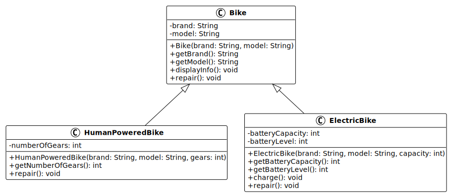

# Programmation orientée objet : Polymorphisme

<!--
_class: lead
_paginate: false
-->

<https://github.com/heig-vd-progim-course/heig-vd-progim2-course>

Visualiser le contenu complet sur GitHub [à cette
adresse][contenu-complet-sur-github].

<small>V. Guidoux, avec l'aide de
[GitHub Copilot](https://github.com/features/copilot).</small>

<small>Ce travail est sous licence [CC BY-SA 4.0][licence].</small>

![bg opacity:0.1][illustration-principale]

## Plus de détails sur GitHub

<!-- _class: lead -->

_Cette présentation est un résumé du contenu complet disponible sur GitHub._

_Pour plus de détails, consulter le [contenu complet sur
GitHub][contenu-complet-sur-github] ou en cliquant sur l'en-tête de ce
document._

## Objectifs (1/4)

- Utiliser l'opérateur `instanceof` pour vérifier le type d'un objet.
- Effectuer un cast (conversion de type) de manière sécurisée.
- Identifier les limites de l'utilisation excessive de `instanceof`.
- Expliquer le concept de polymorphisme en POO.

![bg right:40%][illustration-objectifs]

## Objectifs (2/4)

- Utiliser des références de type parent pour des objets de type enfant.
- Appliquer le polymorphisme pour traiter différents objets de manière uniforme.
- Démontrer comment le polymorphisme améliore la flexibilité du code.

![bg right:40%][illustration-objectifs]

## Objectifs (3/4)

- Appliquer la redéfinition pour adapter le comportement aux sous-classes.
- Définir une interface Java avec le mot-clé `interface`.
- Implémenter une ou plusieurs interfaces dans une classe.
- Différencier une interface d'une classe abstraite.

![bg right:40%][illustration-objectifs]

## Objectifs (4/4)

- Justifier l'utilisation d'interfaces pour le polymorphisme.
- Redéfinir la méthode `toString()` pour représenter un objet sous forme de
  chaîne.
- Implémenter `equals()` pour comparer deux objets de manière significative.
- Implémenter `hashCode()` en cohérence avec `equals()`.

![bg right:40%][illustration-objectifs]

## Hiérarchie des classes de vélos



## L'opérateur instanceof

L'opérateur `instanceof` permet de vérifier si un objet est une instance d'un
type particulier.

```java
Bike bike = new ElectricBike("VanMoof", "S3", 500);

boolean isElectric = bike instanceof ElectricBike;      // true
boolean isHumanPowered = bike instanceof HumanPoweredBike; // false
boolean isBike = bike instanceof Bike;                  // true
```

**Important** : `instanceof` retourne `false` si l'objet est `null` (pas
d'exception).

## Utilisation avec le cast

Après vérification avec `instanceof`, on peut convertir la référence pour
accéder aux méthodes spécifiques.

```java
public void manageBike(Bike bike) {
    if (bike instanceof ElectricBike) {
        ElectricBike electric = (ElectricBike) bike;
        electric.charge();
    } else if (bike instanceof HumanPoweredBike) {
        HumanPoweredBike classic = (HumanPoweredBike) bike;
        System.out.println("Vitesses : " + classic.getNumberOfGears());
    }
}
```

## Les limites de instanceof (1/2)

Bien que `instanceof` soit utile, son utilisation excessive révèle un problème
de conception :

**1. Code verbeux** : cascade de `if-else` difficile à lire.

**2. Violation du principe ouvert/fermé** : ajouter un nouveau type oblige à
modifier le code existant.

**3. Duplication** : même structure répétée partout.

## Les limites de instanceof (2/2)

**4. Couplage fort** : le code doit connaître tous les types possibles.

**5. Risque d'erreurs** : oublier la vérification provoque une
`ClassCastException`.

C'est précisément le problème que le polymorphisme résout de manière élégante.

## Qu'est-ce que le polymorphisme ? (1/2)

Le terme vient du grec _poly_ (plusieurs) et _morphe_ (forme).

**Définition** : capacité d'un même code de manipuler des objets de types
différents de manière uniforme.

## Qu'est-ce que le polymorphisme ? (2/2)

Au lieu de :

```java
if (bike instanceof HumanPoweredBike) {
    ((HumanPoweredBike) bike).repair();
} else if (bike instanceof ElectricBike) {
    ((ElectricBike) bike).repair();
}
```

On écrit simplement :

```java
bike.repair();  // Appelle la bonne méthode automatiquement
```

## Les trois piliers de la POO

Ces trois concepts travaillent ensemble :

**1. Encapsulation** : protège les données derrière des méthodes publiques.

**2. Héritage** : crée des classes à partir de classes existantes (relation "est
un").

**3. Polymorphisme** : traite des objets différents de manière uniforme via une
interface commune.

## Références de type parent (1/2)

Une variable peut avoir un type déclaré différent du type réel de l'objet
qu'elle référence.

```java
Bike bike1 = new HumanPoweredBike("Decathlon", "Riverside", 21);
Bike bike2 = new ElectricBike("VanMoof", "S3", 500);
```

Tous les types héritent de `Bike`, donc ils **sont** des vélos.

## Références de type parent (2/2)

Cette capacité permet de stocker différents types dans une même collection :

```java
Bike[] fleet = new Bike[2];
fleet[0] = new HumanPoweredBike("Decathlon", "Riverside", 21);
fleet[1] = new ElectricBike("VanMoof", "S3", 500);

for (Bike bike : fleet) {
    bike.displayInfo();  // Méthode appropriée pour chaque type
}
```

## Liaison dynamique

Quand on appelle une méthode sur une référence de type parent, Java utilise la
**liaison dynamique**.

```java
Bike bike = new ElectricBike("VanMoof", "S3", 500);
bike.displayInfo();  // Appelle la version de ElectricBike
```

La décision se fait **à l'exécution** (runtime), pas à la compilation.

Java regarde le **type réel** de l'objet (`ElectricBike`), pas le type de la
référence (`Bike`).

## Avantages du polymorphisme (1/2)

**1. Code plus court et plus clair**

```java
// Au lieu de 4 méthodes différentes
public void repairBike(Bike bike) {
    bike.repair();  // Une seule méthode
}
```

**2. Extensibilité**

Ajouter un nouveau type (`TandemBike`) ne nécessite aucune modification du code
existant.

## Avantages du polymorphisme (2/2)

**3. Réduction de la duplication**

La logique est écrite une fois et fonctionne pour tous les types.

**4. Abstraction du type concret**

Le code manipule des concepts abstraits (un vélo) plutôt que des détails
concrets (vélo électrique, cargo).

## Redéfinition de méthodes

La redéfinition (_override_) permet à une sous-classe de fournir sa propre
implémentation d'une méthode héritée.

```java
abstract class Bike {
    public abstract void repair();
}

class ElectricBike extends Bike {
    @Override
    public void repair() {
        System.out.println("Vérification batterie et moteur.");
    }
}
```

## Règles de la redéfinition (1/2)

Pour redéfinir correctement une méthode :

**1. Même signature** : même nom, même types et nombre de paramètres.

**2. Type de retour compatible** : même type ou sous-type (_covariant_).

**3. Visibilité égale ou plus grande** : `public` reste `public`, ne peut pas
devenir `private`.

## Règles de la redéfinition (2/2)

**4. Exceptions plus spécifiques** : peut lever les mêmes exceptions ou plus
spécifiques, pas plus générales.

**5. Méthodes non final** : seules les méthodes non `final` peuvent être
redéfinies.

Si une règle n'est pas respectée, le compilateur génère une erreur.

## L'annotation @Override

L'annotation `@Override` marque explicitement qu'une méthode redéfinit une
méthode héritée.

```java
@Override
public void repair() {
    System.out.println("Réparation spécifique.");
}
```

- Vérification à la compilation (détecte les fautes de frappe).
- Documentation claire de l'intention.
- Protection contre les changements de signature.

**Bonne pratique** : toujours utiliser `@Override`.

## Qu'est-ce qu'une interface ?

Une interface est un **contrat** qui spécifie des méthodes à implémenter, sans
définir comment.

```java
public interface Electric {
    int getBatteryLevel();
    void charge();
}
```

L'interface dit : "Si tu implémentes `Electric`, tu dois fournir ces méthodes".

## Définir une interface

Caractéristiques d'une interface :

```java
public interface Rideable {
    double getMaxSpeed();
}
```

- Méthodes abstraites par défaut (pas d'implémentation).
- Constantes possibles (`public static final`).
- Pas de constructeur.
- Pas de variables d'instance.

## Implémenter une interface

Une classe implémente une interface avec le mot-clé `implements`.

```java
class ElectricBike extends Bike implements Electric, Rideable {
    private int batteryLevel;

    @Override
    public int getBatteryLevel() { return batteryLevel; }

    @Override
    public void charge() { batteryLevel = 100; }

    @Override
    public double getMaxSpeed() { return 25.0; }
}
```

## Implémenter plusieurs interfaces

Contrairement à l'héritage (une seule classe parent), une classe peut
implémenter **plusieurs interfaces**.

```java
class ElectricBike extends Bike implements Electric, Rideable {
    // Implémente toutes les méthodes de Electric et Rideable
}
```

C'est une des forces majeures des interfaces : composer des comportements de
manière flexible.

## Polymorphisme avec les interfaces

Une variable de type interface peut référencer tout objet qui implémente cette
interface.

```java
Electric bike = new ElectricBike("VanMoof", "S3", 500);

// Traitement uniforme
bike.charge();
```

## Collections polymorphes avec interfaces

Les interfaces permettent de regrouper les objets par capacités.

```java
Electric[] electricBikes = new Electric[2];
electricBikes[0] = new ElectricBike("VanMoof", "S3", 500);
electricBikes[1] = new ElectricBike("Stromer", "ST5", 983);

for (Electric bike : electricBikes) {
    bike.charge();
}
```

Traitement basé sur ce qu'ils **peuvent faire**, pas ce qu'ils **sont**.

## Interface vs classe abstraite

<div class="two-columns">
<div>

**Interface**

- définit des capacités ("peut faire").
- Pour des classes non liées.
- Héritage multiple possible.
- Pas de code commun.

</div>
<div>

**Classe abstraite**

- définit une nature ("est un").
- Pour une hiérarchie de classes.
- Héritage simple uniquement.
- Partage de code commun.

</div>
</div>

## La méthode toString()

```java
@Override
public String toString() {
    return "Bike{brand='" + brand + "', model='" + model + "'}";
}
```

Appelée automatiquement par `System.out.println(object)`. `toString()` retourne
une représentation textuelle d'un objet.

**Par défaut** : `ElectricBike@15db9742` (peu utile).

**Redéfinie** : `Bike{brand='VanMoof', model='S3'}` (clair et utile).

## Les méthodes equals() et hashCode()

Ces méthodes travaillent ensemble pour la comparaison d'objets.

```java
@Override
public boolean equals(Object obj) {
    if (this == obj) return true;
    if (obj == null) return false;
    Bike that = (Bike) obj;
    return brand.equals(that.brand) && model.equals(that.model);
}

@Override
public int hashCode() {
    return brand.hashCode() + 31 * model.hashCode();
}
```

## Pourquoi equals() et hashCode() ensemble ?

**Règle** : si vous redéfinissez `equals()`, vous **devez** redéfinir
`hashCode()`.

**Pourquoi** : deux objets égaux doivent avoir le même `hashCode()`.

Sans cela, `HashSet` et `HashMap` ne fonctionnent pas correctement.

## Collections polymorphes en pratique

Stocker et manipuler différents types dans une même collection :

```java
Bike[] fleet = new Bike[2];
fleet[0] = new HumanPoweredBike("Decathlon", "Riverside", 21);
fleet[1] = new ElectricBike("VanMoof", "S3", 500);

for (Bike bike : fleet) {
    bike.displayInfo();  // Chaque vélo affiche ses infos
}
```

## Conception flexible (1/2)

**Sans polymorphisme (rigide)** :

```java
public void repairFleet(HumanPoweredBike[] classic,
                        ElectricBike[] electric) {
    for (HumanPoweredBike bike : classic) bike.repair();
    for (ElectricBike bike : electric) bike.repair();
}
```

Ajouter un type oblige à modifier cette méthode.

## Conception flexible (2/2)

**Avec polymorphisme (flexible)** :

```java
public void repairFleet(Bike[] bikes) {
    for (Bike bike : bikes) {
        bike.repair();
    }
}
```

Ajouter un nouveau type ne nécessite **aucune modification**.

**Principe ouvert/fermé** : ouvert à l'extension, fermé à la modification.

## Questions

<!-- _class: lead -->

Est-ce que vous avez des questions ?

## À vous de jouer !

- (Re)lire le contenu de cours.
- Lire les exemples de code et les descriptions.
- Faire les exercices.
- Faire le mini-projet.
- Poser des questions si nécessaire.
- Entraider-vous !

➡️ [Visualiser le contenu complet sur GitHub.][contenu-complet-sur-github]

**N'hésitez pas à vous entraider si vous avez des difficultés !**

![bg right:40%][illustration-a-vous-de-jouer]

## Sources (1/2)

- [Illustration principale][illustration-principale] par
  [Markus Winkler](https://unsplash.com/@markuswinkler) sur
  [Unsplash](https://unsplash.com/photos/assorted-color-plastic-interlocking-toy-lot-cxoR55-bels)
- [Illustration][illustration-objectifs] par
  [Aline de Nadai](https://unsplash.com/@alinedenadai) sur
  [Unsplash](https://unsplash.com/photos/low-angle-view-of-ball-shoots-in-the-ring-j6brni7fpvs)

## Sources (2/2)

- [Illustration][illustration-a-vous-de-jouer] par
  [Nikita Kachanovsky](https://unsplash.com/@nkachanovskyyy) sur
  [Unsplash](https://unsplash.com/photos/white-sony-ps4-dualshock-controller-over-persons-palm-FJFPuE1MAOM)

<!-- URLs -->

[contenu-complet-sur-github]:
	https://github.com/heig-vd-progim-course/heig-vd-progim2-course/tree/main/01-contenus-du-cours/06-programmation-orientee-objet-polymorphisme/
[licence]:
	https://github.com/heig-vd-progim-course/heig-vd-progim2-course/blob/main/LICENSE.md

<!-- Illustrations -->

[illustration-principale]:
	https://images.unsplash.com/photo-1758417787521-498012813a2a?fit=crop&h=720
[illustration-objectifs]:
	https://images.unsplash.com/photo-1516389573391-5620a0263801?fit=crop&h=720
[illustration-a-vous-de-jouer]:
	https://images.unsplash.com/photo-1509198397868-475647b2a1e5?fit=crop&h=720
