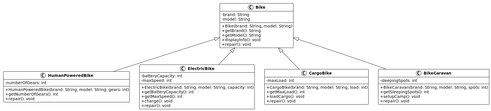
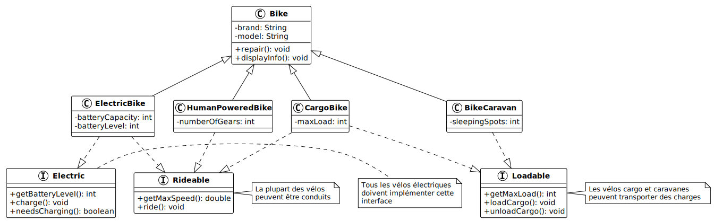

# Programmation orientée objet : Polymorphisme

V. Guidoux, avec l'aide de
[GitHub Copilot](https://github.com/features/copilot).

Ce travail est sous licence [CC BY-SA 4.0][licence].

> [!TIP]
>
> Voici quelques informations relatives à ce contenu.
>
> **Ressources annexes**
>
> - Autres formats du support de cours : [Présentation (web)][presentation-web]
>   · [Présentation (PDF)][presentation-pdf]
> - Exemples de code : [Accéder au contenu](./01-exemples-de-code/)
> - Exercices : [Accéder au contenu](./02-exercices/)
> - Mini-projet : [Accéder au contenu](./03-mini-projet/)
> - Quiz : [Accéder au contenu][quiz-web]
>
> **Objectifs**
>
> À l'issue de cette séance, les personnes qui étudient devraient être capables
> de :
>
> - Utiliser l'opérateur `instanceof` pour vérifier le type d'un objet.
> - Effectuer un cast (conversion de type) de manière sécurisée.
> - Identifier les limites de l'utilisation excessive de `instanceof`.
> - Expliquer le concept de polymorphisme en POO.
> - Utiliser des références de type parent pour des objets de type enfant.
> - Appliquer le polymorphisme pour traiter différents objets de manière
>   uniforme.
> - Démontrer comment le polymorphisme améliore la flexibilité du code.
> - Appliquer la redéfinition pour adapter le comportement aux sous-classes.
> - Définir une interface Java avec le mot-clé `interface`.
> - Implémenter une ou plusieurs interfaces dans une classe.
> - Différencier une interface d'une classe abstraite.
> - Justifier l'utilisation d'interfaces pour le polymorphisme.
> - Redéfinir la méthode `toString()` pour représenter un objet sous forme de
>   chaîne.
> - Implémenter `equals()` pour comparer deux objets de manière significative.
> - Implémenter `hashCode()` en cohérence avec `equals()`.
>
> **Méthodes d'enseignement et d'apprentissage**
>
> Les méthodes d'enseignement et d'apprentissage utilisées pour animer la séance
> sont les suivantes :
>
> - Présentation magistrale.
> - Discussions collectives.
> - Travail en autonomie.
>
> **Méthodes d'évaluation**
>
> L'évaluation prend la forme d'exercices et d'un mini-projet à réaliser en
> autonomie en classe ou à la maison.
>
> L'évaluation se fait en utilisant les critères suivants :
>
> - Capacité à répondre avec justesse.
> - Capacité à argumenter.
> - Capacité à réaliser les tâches demandées.
> - Capacité à s'approprier les exemples de code.
> - Capacité à appliquer les exemples de code à des situations similaires.
>
> Les retours se font de la manière suivante :
>
> - Corrigé des exercices.
> - Corrigé du mini-projet.
>
> L'évaluation ne donne pas lieu à une note.

## Table des matières

- [Table des matières](#table-des-matières)
- [Vérifier le type d'un objet avec instanceof](#vérifier-le-type-dun-objet-avec-instanceof)
  - [Un problème concret](#un-problème-concret)
  - [L'opérateur instanceof](#lopérateur-instanceof)
  - [Utilisation avec le cast](#utilisation-avec-le-cast)
  - [Les limites de instanceof](#les-limites-de-instanceof)
- [Introduction au polymorphisme](#introduction-au-polymorphisme)
  - [Du instanceof au polymorphisme](#du-instanceof-au-polymorphisme)
  - [Les trois piliers de la POO](#les-trois-piliers-de-la-poo)
- [Le polymorphisme d'héritage](#le-polymorphisme-dhéritage)
  - [Références de type parent](#références-de-type-parent)
  - [Liaison dynamique](#liaison-dynamique)
  - [Avantages du polymorphisme d'héritage](#avantages-du-polymorphisme-dhéritage)
- [La redéfinition de méthodes](#la-redéfinition-de-méthodes)
  - [Règles de la redéfinition](#règles-de-la-redéfinition)
  - [L'annotation @Override](#lannotation-override)
- [Les interfaces en Java](#les-interfaces-en-java)
  - [Qu'est-ce qu'une interface ?](#quest-ce-quune-interface-)
  - [Définir une interface](#définir-une-interface)
  - [Implémenter une interface](#implémenter-une-interface)
  - [Implémenter plusieurs interfaces](#implémenter-plusieurs-interfaces)
  - [Polymorphisme avec les interfaces](#polymorphisme-avec-les-interfaces)
- [Interface vs classe abstraite](#interface-vs-classe-abstraite)
  - [Les points communs](#les-points-communs)
  - [Les différences](#les-différences)
  - [Quand utiliser quoi ?](#quand-utiliser-quoi-)
- [Redéfinition des méthodes de Object](#redéfinition-des-méthodes-de-object)
  - [La méthode toString()](#la-méthode-tostring)
  - [Les méthodes equals() et hashCode()](#les-méthodes-equals-et-hashcode)
  - [Pourquoi redéfinir equals() et hashCode() ensemble ?](#pourquoi-redéfinir-equals-et-hashcode-ensemble-)
- [Le polymorphisme en pratique](#le-polymorphisme-en-pratique)
  - [Collections polymorphes](#collections-polymorphes)
  - [Conception flexible](#conception-flexible)
- [Conclusion](#conclusion)
- [Exemples de code](#exemples-de-code)
- [Exercices](#exercices)
- [Mini-projet](#mini-projet)
- [À faire pour la prochaine séance](#à-faire-pour-la-prochaine-séance)

## Vérifier le type d'un objet avec instanceof

Avant d'explorer le polymorphisme, nous devons comprendre comment Java nous
permet de vérifier le type d'un objet. Cette compréhension nous aidera à
apprécier la puissance du polymorphisme.

### Un problème concret

Imaginons un système de gestion de flotte de vélos pour une ville. Nous avons
différents types de vélos : vélos classiques à propulsion humaine, vélos
électriques, vélos cargo et caravanes vélo. Nous avons une méthode qui reçoit un
vélo de type `Bike`, mais nous devons effectuer des actions spécifiques selon le
type réel du vélo :

```java
public void manageBike(Bike bike) {
    // Comment savoir si c'est un vélo classique, électrique, cargo ou une caravane ?
    // Comment accéder aux méthodes spécifiques à chaque type ?
}
```

Si nous voulons recharger les batteries des vélos électriques mais seulement
vérifier les freins des vélos classiques, comment faire ? La référence est de
type `Bike`, mais l'objet réel peut être un `HumanPoweredBike`, `ElectricBike`,
`CargoBike` ou `BikeCaravan`.

C'est ici qu'intervient l'opérateur `instanceof`.

### L'opérateur instanceof

L'opérateur `instanceof` permet de vérifier si un objet est une instance d'un
type particulier. Il retourne un booléen : `true` si l'objet est du type
spécifié, `false` sinon.

**Syntaxe**

```java
objet instanceof TypeDeClasse
```

**Exemples**

```java
Bike bike = new ElectricBike("VanMoof S3", 25);

boolean isElectric = bike instanceof ElectricBike;      // true
boolean isCargo = bike instanceof CargoBike;            // false
boolean isBike = bike instanceof Bike;                  // true (car ElectricBike hérite de Bike)
```

L'opérateur `instanceof` prend en compte la hiérarchie d'héritage. Un objet
`ElectricBike` est aussi une instance de `Bike` parce qu'il en hérite. Cette
relation "est un" (_is-a_) est fondamentale en programmation orientée objet.

**Vérification contre null**

Un point important : `instanceof` retourne toujours `false` si l'objet est
`null`, ce qui évite les `NullPointerException` :

```java
Bike bike = null;
boolean result = bike instanceof ElectricBike;  // false (pas d'exception)
```

Cette caractéristique rend `instanceof` sûr à utiliser sans vérification
préalable de `null`.

### Utilisation avec le cast

Une fois que nous avons vérifié le type avec `instanceof`, nous pouvons
convertir la référence (_cast_) pour accéder aux méthodes spécifiques du type :

```java
public void manageBike(Bike bike) {
    if (bike instanceof ElectricBike) {
        ElectricBike electric = (ElectricBike) bike;
        System.out.println("Autonomie : " + electric.getBatteryRange() + " km");
        if (electric.needsCharging()) {
            electric.charge();
        }
    } else if (bike instanceof CargoBike) {
        CargoBike cargo = (CargoBike) bike;
        System.out.println("Capacité de charge : " + cargo.getMaxLoad() + " kg");
        cargo.loadCargo();
    } else if (bike instanceof BikeCaravan) {
        BikeCaravan caravan = (BikeCaravan) bike;
        System.out.println("Nombre de couchettes : " + caravan.getSleepingSpots());
        caravan.setupCamp();
    }
}
```

Le cast `(ElectricBike) bike` convertit la référence de type `Bike` en type
`ElectricBike`, nous permettant d'accéder aux méthodes spécifiques de
`ElectricBike` comme `getBatteryRange()` et `charge()`.

**Pourquoi le cast est-il nécessaire ?**

Java utilise le typage statique : le compilateur vérifie les types à la
compilation. Même si nous savons que `bike` est en réalité un `ElectricBike`, le
compilateur ne voit que le type déclaré `Bike`. Le cast indique explicitement au
compilateur : "Je sais que cet objet est un `ElectricBike`, laisse-moi accéder à
ses méthodes spécifiques".

### Les limites de instanceof

Bien que `instanceof` soit utile, son utilisation excessive révèle souvent un
problème de conception. Regardons les inconvénients de l'approche ci-dessus :

**1. Code verbeux et répétitif**

Chaque fois que nous ajoutons une logique qui dépend du type, nous devons écrire
une cascade de `if-else` avec `instanceof`. Le code devient long et difficile à
lire.

**2. Violation du principe ouvert/fermé**

Si nous ajoutons un nouveau type de vélo (par exemple `TandemBike`), nous devons
modifier toutes les méthodes qui utilisent `instanceof` pour ajouter un nouveau
cas. Le code n'est pas ouvert à l'extension sans modification.

**3. Duplication de la logique de typage**

La même structure `if (x instanceof Y)` se répète dans plusieurs endroits du
code, créant de la duplication et augmentant le risque d'erreurs.

**4. Couplage fort**

Le code qui utilise `instanceof` est fortement couplé aux types concrets. Il
doit connaître tous les types possibles, ce qui rend le code fragile et
difficile à maintenir.

**5. Risque d'erreurs**

Si nous oublions de vérifier avec `instanceof` avant de faire un cast, nous
risquons une `ClassCastException` à l'exécution :

```java
// Dangereux : pas de vérification !
ElectricBike electric = (ElectricBike) bike;  // Exception si bike n'est pas un ElectricBike
```

**En résumé**, bien que `instanceof` soit un outil valide dans certaines
situations (comme la gestion d'événements ou la sérialisation), son utilisation
fréquente dans la logique métier indique souvent qu'une meilleure conception
orientée objet est possible.

C'est précisément le problème que le polymorphisme résout de manière élégante.

## Introduction au polymorphisme

Le polymorphisme est l'un des concepts fondamentaux de la programmation orientée
objet, aux côtés de l'encapsulation et de l'héritage que nous avons déjà
étudiés. Le terme vient du grec _poly_ (plusieurs) et _morphe_ (forme),
signifiant littéralement "plusieurs formes".

En programmation orientée objet, le polymorphisme permet à un même code de
manipuler des objets de types différents de manière uniforme. C'est la capacité
d'un objet à prendre différentes formes tout en conservant une interface
commune.

### Du instanceof au polymorphisme

Reprenons notre exemple précédent avec `instanceof`. Nous avions ce code verbeux
pour réparer différents types de vélos :

```java
if (bike instanceof HumanPoweredBike) {
    HumanPoweredBike classic = (HumanPoweredBike) bike;
    classic.repair();
} else if (bike instanceof ElectricBike) {
    ElectricBike electric = (ElectricBike) bike;
    electric.repair();
} else if (bike instanceof CargoBike) {
    CargoBike cargo = (CargoBike) bike;
    cargo.repair();
}
```

Ce code fonctionne, mais il présente tous les problèmes que nous avons
identifiés : verbosité, rigidité, violation du principe ouvert/fermé, et
couplage fort.

Avec le polymorphisme, ce même code devient simplement :

```java
bike.repair();
```

Comment est-ce possible ? Grâce au mécanisme de liaison dynamique que nous
allons explorer. Si tous les vélos héritent de `Bike` et que `Bike` définit une
méthode `repair()`, Java saura automatiquement quelle version de `repair()`
appeler en fonction du type réel de l'objet, sans avoir besoin de vérifier avec
`instanceof`.

Le polymorphisme élimine le besoin de vérifications de type explicites dans la
plupart des situations. Au lieu de demander "De quel type es-tu ?" et d'agir en
conséquence, nous demandons simplement à l'objet d'effectuer une action, et il
sait comment le faire selon sa propre nature.

Cette approche rend le code :

- **Plus court et plus clair** : pas de cascade de `if-else`
- **Plus flexible** : ajouter un nouveau type de vélo ne nécessite aucune
  modification du code existant
- **Plus maintenable** : la logique spécifique à chaque type est encapsulée dans
  sa propre classe
- **Plus robuste** : moins de risques d'oublier un cas ou de faire une erreur de
  cast

### Les trois piliers de la POO

Rappelons les trois concepts fondamentaux de la programmation orientée objet,
qui travaillent ensemble :

1. **L'encapsulation** : protège les données en les cachant derrière des
   méthodes publiques. Elle définit ce qui est visible et accessible de
   l'extérieur d'une classe.

2. **L'héritage** : permet de créer de nouvelles classes à partir de classes
   existantes, en réutilisant et en étendant leurs fonctionnalités. Il établit
   une relation "est un" entre les classes.

3. **Le polymorphisme** : permet de traiter des objets de classes différentes de
   manière uniforme, tant qu'ils partagent une interface ou une classe parent
   commune. Il exploite l'héritage pour permettre la flexibilité.

Ces trois concepts se renforcent mutuellement. L'encapsulation cache les détails
d'implémentation, l'héritage établit des relations entre classes, et le
polymorphisme permet d'exploiter ces relations pour écrire du code flexible et
réutilisable.

## Le polymorphisme d'héritage

Le polymorphisme d'héritage repose sur la hiérarchie de classes que nous avons
construite dans les séances précédentes. Il exploite le fait qu'une sous-classe
hérite du type de sa classe parent.

### Références de type parent

En Java, une variable peut avoir un type déclaré différent du type réel de
l'objet qu'elle référence, à condition qu'il existe une relation d'héritage
entre les deux types.

Prenons notre exemple de vélos. Si nous avons une hiérarchie :

```text
Bike (classe parente)
├── HumanPoweredBike
├── ElectricBike
├── CargoBike
└── BikeCaravan
```



**Code complet de la hiérarchie de classes**

Voici le code complet montrant toutes les classes de vélos dans un seul fichier
pour bien comprendre la structure :

```java
// Classe parente abstraite
abstract class Bike {
    protected String brand;
    protected String model;

    public Bike(String brand, String model) {
        this.brand = brand;
        this.model = model;
    }

    public String getBrand() {
        return brand;
    }

    public String getModel() {
        return model;
    }

    public void displayInfo() {
        System.out.println("Vélo : " + brand + " " + model);
    }

    public abstract void repair();
}

// Vélo à propulsion humaine
class HumanPoweredBike extends Bike {
    private int numberOfGears;

    public HumanPoweredBike(String brand, String model, int gears) {
        super(brand, model);
        this.numberOfGears = gears;
    }

    public int getNumberOfGears() {
        return numberOfGears;
    }

    @Override
    public void displayInfo() {
        super.displayInfo();
        System.out.println("  Type : Vélo classique");
        System.out.println("  Vitesses : " + numberOfGears);
    }

    @Override
    public void repair() {
        System.out.println("Réparation du vélo classique : vérification chaîne et freins.");
    }
}

// Vélo électrique
class ElectricBike extends Bike {
    private int batteryCapacity;  // en Wh
    private int batteryLevel;     // pourcentage

    public ElectricBike(String brand, String model, int capacity) {
        super(brand, model);
        this.batteryCapacity = capacity;
        this.batteryLevel = 100;
    }

    public int getBatteryCapacity() {
        return batteryCapacity;
    }

    public int getBatteryLevel() {
        return batteryLevel;
    }

    public void charge() {
        this.batteryLevel = 100;
        System.out.println("Batterie rechargée à 100%");
    }

    @Override
    public void displayInfo() {
        super.displayInfo();
        System.out.println("  Type : Vélo électrique");
        System.out.println("  Capacité batterie : " + batteryCapacity + " Wh");
        System.out.println("  Niveau batterie : " + batteryLevel + "%");
    }

    @Override
    public void repair() {
        System.out.println("Réparation du vélo électrique : vérification batterie et moteur.");
    }
}

// Vélo cargo
class CargoBike extends Bike {
    private int maxLoad;  // en kg

    public CargoBike(String brand, String model, int load) {
        super(brand, model);
        this.maxLoad = load;
    }

    public int getMaxLoad() {
        return maxLoad;
    }

    public void loadCargo() {
        System.out.println("Chargement du cargo (max : " + maxLoad + " kg)");
    }

    @Override
    public void displayInfo() {
        super.displayInfo();
        System.out.println("  Type : Vélo cargo");
        System.out.println("  Charge max : " + maxLoad + " kg");
    }

    @Override
    public void repair() {
        System.out.println("Réparation du vélo cargo : vérification cadre renforcé et freins.");
    }
}

// Caravane vélo
class BikeCaravan extends Bike {
    private int sleepingSpots;

    public BikeCaravan(String brand, String model, int spots) {
        super(brand, model);
        this.sleepingSpots = spots;
    }

    public int getSleepingSpots() {
        return sleepingSpots;
    }

    public void setupCamp() {
        System.out.println("Installation du campement (" + sleepingSpots + " couchettes)");
    }

    @Override
    public void displayInfo() {
        super.displayInfo();
        System.out.println("  Type : Caravane vélo");
        System.out.println("  Couchettes : " + sleepingSpots);
    }

    @Override
    public void repair() {
        System.out.println("Réparation de la caravane : vérification attelage et pneus.");
    }
}

// Classe principale avec méthode main
public class BikeFleetExample {
    public static void main(String[] args) {
        Bike bike1 = new HumanPoweredBike("Decathlon", "Riverside", 21);
        Bike bike2 = new ElectricBike("VanMoof", "S3", 500);
        Bike bike3 = new CargoBike("Urban Arrow", "Family", 100);
        Bike bike4 = new BikeCaravan("WidePath", "Camper", 2);
    }
}
```

<details>
<summary>Description du code</summary>

**Classe `Bike` (abstraite)** : classe parente qui définit les attributs et
méthodes communs à tous les vélos. La méthode `repair()` est abstraite car
chaque type de vélo a ses propres procédures de réparation.

**Classe `HumanPoweredBike`** : représente un vélo classique à propulsion
humaine avec un nombre de vitesses. Redéfinit `displayInfo()` et `repair()` avec
les spécificités d'un vélo classique.

**Classe `ElectricBike`** : représente un vélo électrique avec une batterie.
Ajoute les méthodes `charge()` pour recharger la batterie et redéfinit les
méthodes héritées.

**Classe `CargoBike`** : représente un vélo cargo capable de transporter des
charges lourdes. Ajoute la méthode `loadCargo()` et redéfinit les méthodes
héritées.

**Classe `BikeCaravan`** : représente une caravane vélo avec des couchettes pour
dormir. Ajoute la méthode `setupCamp()` pour installer le campement.

</details>

Nous pouvons écrire :

```java
Bike bike1 = new HumanPoweredBike("Decathlon", "Riverside", 21);
Bike bike2 = new ElectricBike("VanMoof", "S3", 500);
Bike bike3 = new CargoBike("Urban Arrow", "Family", 100);
Bike bike4 = new BikeCaravan("WidePath", "Camper", 2);
```

Ici, le type déclaré est `Bike`, mais les objets réels sont de types
`HumanPoweredBike`, `ElectricBike`, `CargoBike` et `BikeCaravan`. C'est possible
parce que ces quatre classes héritent de `Bike` : un vélo classique **est un**
vélo, un vélo électrique **est un** vélo, un vélo cargo **est un** vélo, une
caravane vélo **est un** vélo.

Cette capacité est fondamentale pour le polymorphisme. Elle nous permet de
stocker différents types d'objets dans une même collection :

```java
ArrayList<Bike> fleet = new ArrayList<>();
fleet.add(new HumanPoweredBike("Decathlon", "Riverside", 21));
fleet.add(new ElectricBike("VanMoof", "S3", 500));
fleet.add(new CargoBike("Urban Arrow", "Family", 100));
fleet.add(new BikeCaravan("WidePath", "Camper", 2));

for (Bike bike : fleet) {
    bike.displayInfo();  // Appelle la méthode appropriée pour chaque type
}
```

### Liaison dynamique

Quand nous appelons une méthode sur une référence de type parent qui pointe vers
un objet de type enfant, Java utilise la **liaison dynamique** (ou résolution
dynamique) pour déterminer quelle version de la méthode exécuter.

```java
Bike bike = new ElectricBike("VanMoof", "S3", 500);
bike.displayInfo();  // Appelle la version de ElectricBike, pas celle de Bike
```

La décision de quelle méthode appeler se fait **à l'exécution** (runtime), pas à
la compilation. Java regarde le type réel de l'objet (ici `ElectricBike`), pas
le type de la référence (ici `Bike`).

Cette mécanisme est automatique et transparent. C'est la machine virtuelle Java
(JVM) qui s'occupe de tout. Pour la personne qui développe, il suffit de
comprendre que l'objet réel détermine quelle méthode sera exécutée.

### Avantages du polymorphisme d'héritage

Le polymorphisme d'héritage offre plusieurs avantages concrets :

**1. Code plus court et plus clair**

Au lieu d'écrire une méthode pour chaque type de vélo :

```java
public void repairHumanPowered(HumanPoweredBike bike) { ... }
public void repairElectric(ElectricBike bike) { ... }
public void repairCargo(CargoBike bike) { ... }
```

Nous écrivons une seule méthode :

```java
public void repairBike(Bike bike) {
    bike.repair();
}
```

**2. Extensibilité sans modification**

Si nous ajoutons un nouveau type de vélo (par exemple `TandemBike`), le code
existant continue de fonctionner sans modification. C'est le principe
ouvert/fermé : le code est ouvert à l'extension mais fermé à la modification.

**3. Réduction de la duplication**

Au lieu de dupliquer la logique pour chaque type, nous l'écrivons une fois et
elle fonctionne pour tous les types qui partagent la même hiérarchie.

**4. Abstraction du type concret**

Le code qui utilise les objets n'a pas besoin de connaître leur type exact. Il
manipule des concepts abstraits (un vélo) plutôt que des détails concrets (un
vélo électrique, un vélo cargo).

## La redéfinition de méthodes

La redéfinition (ou surcharge en français, _override_ en anglais) permet à une
sous-classe de fournir sa propre implémentation d'une méthode héritée de sa
classe parent. C'est un mécanisme essentiel du polymorphisme.

Imaginons que notre classe `Bike` définit une méthode `repair()` générique, mais
que chaque type de vélo a des besoins spécifiques de réparation :

```java
public class Bike {
    public void repair() {
        System.out.println("Réparation standard du vélo.");
    }
}

public class ElectricBike extends Bike {
    @Override
    public void repair() {
        System.out.println("Réparation du vélo électrique : vérification batterie et moteur.");
    }
}
```

Quand nous appelons `repair()` sur un objet `ElectricBike`, c'est la version
redéfinie qui est exécutée, même si la référence est de type `Bike` :

```java
Bike bike = new ElectricBike("VanMoof", "S3", 500);
bike.repair();  // Affiche le message spécifique aux vélos électriques
```

### Règles de la redéfinition

Pour redéfinir correctement une méthode en Java, plusieurs règles doivent être
respectées :

1. **Même signature** : la méthode doit avoir le même nom, les mêmes types de
   paramètres et le même nombre de paramètres que dans la classe parent.

2. **Type de retour compatible** : le type de retour doit être le même ou un
   sous-type (_covariant_). Par exemple, si la méthode parent retourne `Bike`,
   la méthode enfant peut retourner `ElectricBike`.

3. **Visibilité égale ou plus grande** : si la méthode parent est `public`, la
   méthode redéfinie doit aussi être `public`. Elle ne peut pas être `private`
   ou `protected`.

4. **Exceptions plus spécifiques** : la méthode redéfinie peut lever les mêmes
   exceptions que la méthode parent, ou des exceptions plus spécifiques, mais
   pas d'exceptions plus générales ou nouvelles.

5. **Méthodes non final** : seules les méthodes non marquées `final` dans la
   classe parent peuvent être redéfinies.

Si une de ces règles n'est pas respectée, le compilateur Java génère une erreur.

### L'annotation @Override

Java fournit l'annotation `@Override` pour marquer explicitement qu'une méthode
est destinée à redéfinir une méthode de la classe parent :

```java
@Override
public void water() {
    // Implémentation spécifique
}
```

Cette annotation n'est pas obligatoire, mais elle est **fortement recommandée**
pour plusieurs raisons :

1. **Vérification à la compilation** : si la méthode ne redéfinit pas vraiment
   une méthode parent (par exemple à cause d'une faute de frappe dans le nom),
   le compilateur génère une erreur.

2. **Documentation** : elle rend explicite l'intention de redéfinir une méthode,
   ce qui améliore la lisibilité du code.

3. **Protection contre les erreurs** : si la signature de la méthode parent
   change dans une future version, le compilateur signalera que l'annotation
   `@Override` n'est plus valide.

C'est une bonne pratique de toujours utiliser `@Override` quand on redéfinit une
méthode.

## Les interfaces en Java

Les interfaces représentent l'autre forme majeure de polymorphisme en Java, aux
côtés de l'héritage de classes. Elles permettent de définir des contrats que les
classes doivent respecter, indépendamment de leur hiérarchie d'héritage.

### Qu'est-ce qu'une interface ?

Une interface est un contrat qui spécifie un ensemble de méthodes qu'une classe
doit implémenter, sans définir comment ces méthodes fonctionnent. C'est une
promesse : "Si tu implémentes cette interface, tu dois fournir ces méthodes".

Prenons un exemple concret. Dans notre flotte de vélos, certains vélos ont un
moteur électrique et une batterie (vélos électriques, vélos cargo électriques)
mais pas d'autres (vélos classiques). Au lieu de mettre une méthode `charge()`
dans toutes les classes, nous créons une interface `Electric` :

```java
public interface Electric {
    int getBatteryLevel();
    void charge();
}
```

Cette interface dit : "Tout objet qui implémente `Electric` doit fournir ces
deux méthodes". Elle ne dit pas comment les implémenter, seulement qu'elles
doivent exister.

### Définir une interface

La syntaxe pour définir une interface est similaire à celle d'une classe, mais
avec le mot-clé `interface` :

```java
public interface Rideable {
    double getMaxSpeed();
    void ride();
}
```

Les caractéristiques d'une interface :

1. **Méthodes abstraites** : par défaut, toutes les méthodes sont publiques et
   abstraites (pas d'implémentation). Vous n'avez pas besoin d'écrire
   `public abstract` devant chaque méthode.

2. **Constantes** : les interfaces peuvent contenir des constantes (variables
   `public static final`), mais pas de variables d'instance.

3. **Pas de constructeur** : les interfaces ne peuvent pas avoir de constructeur
   car elles ne peuvent pas être instanciées directement.

4. **Méthodes par défaut (depuis Java 8)** : les interfaces peuvent contenir des
   méthodes avec une implémentation par défaut en utilisant le mot-clé
   `default`.

5. **Méthodes statiques** : les interfaces peuvent contenir des méthodes
   statiques avec implémentation.

Pour notre cours, nous nous concentrons sur les méthodes abstraites, qui sont le
cas d'usage principal des interfaces.

**Interfaces pour notre flotte de vélos**

Créons trois interfaces pour modéliser les capacités de nos vélos :

```java
// Interface pour les véhicules électriques
public interface Electric {
    int getBatteryLevel();
    void charge();
    boolean needsCharging();
}

// Interface pour les véhicules conduisibles
public interface Rideable {
    double getMaxSpeed();
    void ride();
}

// Interface pour les véhicules pouvant transporter des charges
public interface Loadable {
    int getMaxLoad();
    void loadCargo();
    void unloadCargo();
}
```

**Diagramme PlantUML avec les interfaces**



<details>
<summary>Description du diagramme</summary>

Ce diagramme montre la hiérarchie complète avec les classes et les interfaces.

**Flèches de type `<|--`** : représentent l'héritage entre classes (ligne
pleine).

**Flèches de type `..|>`** : représentent l'implémentation d'une interface
(ligne pointillée).

**Observations importantes** :

- `HumanPoweredBike` n'implémente que `Rideable` (vélo classique sans batterie).
- `ElectricBike` implémente `Electric` et `Rideable` (peut être rechargé et
  conduit).
- `CargoBike` implémente `Loadable` et `Rideable` (peut transporter des charges
  et être conduit).
- `BikeCaravan` n'implémente que `Loadable` (caravane tractée, pas vraiment
  conduite comme un vélo classique).

</details>

### Implémenter une interface

Une classe implémente une interface en utilisant le mot-clé `implements` :

```java
public class ElectricBike extends Bike implements Electric, Rideable {
    private int batteryCapacity;
    private int batteryLevel;

    public ElectricBike(String brand, String model, int capacity) {
        super(brand, model);
        this.batteryCapacity = capacity;
        this.batteryLevel = 100;
    }

    // Implémentation de Electric
    @Override
    public int getBatteryLevel() {
        return this.batteryLevel;
    }

    @Override
    public void charge() {
        if (batteryLevel < 100) {
            this.batteryLevel = 100;
            System.out.println("Batterie rechargée à 100%");
        } else {
            System.out.println("Batterie déjà pleine.");
        }
    }

    @Override
    public boolean needsCharging() {
        return batteryLevel <  20;
    }

    // Implémentation de Rideable
    @Override
    public double getMaxSpeed() {
        return 25.0;  // Vitesse max en km/h
    }

    @Override
    public void ride() {
        if (batteryLevel > 0) {
            System.out.println("Déplacement en vélo électrique à " + getMaxSpeed() + " km/h");
            batteryLevel -= 5;  // Consomme la batterie
        } else {
            System.out.println("Batterie vide ! Rechargez d'abord.");
        }
    }

    @Override
    public void repair() {
        System.out.println("Réparation du vélo électrique : vérification batterie et moteur.");
    }
}
```

**Autre exemple : CargoBike implémentant plusieurs interfaces**

```java
public class CargoBike extends Bike implements Loadable, Rideable {
    private int maxLoad;
    private int currentLoad;

    public CargoBike(String brand, String model, int load) {
        super(brand, model);
        this.maxLoad = load;
        this.currentLoad = 0;
    }

    // Implémentation de Loadable
    @Override
    public int getMaxLoad() {
        return maxLoad;
    }

    @Override
    public void loadCargo() {
        if (currentLoad < maxLoad) {
            currentLoad += 10;
            System.out.println("Chargement : " + currentLoad + "/" + maxLoad + " kg");
        } else {
            System.out.println("Chargement maximum atteint!");
        }
    }

    @Override
    public void unloadCargo() {
        currentLoad = 0;
        System.out.println("Cargo déchargé");
    }

    // Implémentation de Rideable
    @Override
    public double getMaxSpeed() {
        return 20.0;  // Plus lent qu'un vélo classique
    }

    @Override
    public void ride() {
        System.out.println("Déplacement en vélo cargo à " + getMaxSpeed() + " km/h");
    }

    @Override
    public void repair() {
        System.out.println("Réparation du vélo cargo : vérification cadre renforcé.");
    }
}
```

<details>
<summary>Description du code</summary>

**Classe `ElectricBike`** : implémente deux interfaces (`Electric` et
`Rideable`), ce qui l'oblige à fournir toutes les méthodes de ces deux
interfaces. La méthode `ride()` réduit le niveau de batterie à chaque
utilisation, montrant comment les interfaces et l'état interne interagissent.

**Classe `CargoBike`** : implémente également deux interfaces (`Loadable` et
`Rideable`). Elle maintient un état interne pour suivre la charge actuelle et ne
permet pas de charger au-delà de la capacité maximale.

Notez l'utilisation de `@Override` pour chaque méthode d'interface, ce qui est
une bonne pratique pour documenter l'intention et permettre au compilateur de
vérifier que nous implémentons bien les méthodes attendues.

</details>

Quand une classe implémente une interface, elle **doit** fournir une
implémentation pour toutes les méthodes de l'interface. Si elle ne le fait pas,
le compilateur génère une erreur, sauf si la classe est déclarée `abstract`.

Notez l'utilisation de `@Override` : même si nous implémentons une méthode
d'interface (et pas d'une classe parent), `@Override` est approprié et
recommandé.

### Implémenter plusieurs interfaces

Contrairement à l'héritage de classes (où une classe ne peut hériter que d'une
seule classe parent), une classe peut implémenter plusieurs interfaces. C'est
une des forces majeures des interfaces.

```java
public class CargoBike extends Bike
        implements Electric, Loadable, Rideable {
    // Doit implémenter toutes les méthodes de Electric, Loadable et Rideable
}
```

Les interfaces multiples permettent de composer des comportements de manière
flexible. Un vélo cargo peut avoir un moteur électrique, transporter des charges
et être conduit, tout en héritant de `Bike`.

Cela résout le problème de l'héritage multiple (qu'une classe ne peut avoir
qu'un seul parent direct). Les interfaces permettent à une classe d'adopter
plusieurs "rôles" ou "capacités" sans les contraintes de l'héritage multiple.

### Polymorphisme avec les interfaces

Comme avec l'héritage de classes, les interfaces permettent le polymorphisme.
Une variable de type interface peut référencer tout objet dont la classe
implémente cette interface :

```java
Electric bike1 = new ElectricBike("VanMoof", "S3", 500);
Electric bike2 = new CargoBike("Urban Arrow", "Family", 100);

// Les deux peuvent être traités de la même manière
if (bike1.getBatteryLevel() < 20) {
    bike1.charge();
}

if (bike2.getBatteryLevel() < 20) {
    bike2.charge();
}
```

Le type réel de l'objet (`ElectricBike` ou `CargoBike`) n'a pas d'importance
tant qu'il implémente l'interface `Electric`. Nous pouvons même créer une
collection d'objets électriques :

```java
ArrayList<Electric> electricBikes = new ArrayList<>();
electricBikes.add(new ElectricBike("VanMoof", "S3", 500));
electricBikes.add(new CargoBike("Urban Arrow", "Family", 100));
// Mais pas : electricBikes.add(new HumanPoweredBike(...))  car HumanPoweredBike n'implémente pas Electric

for (Electric bike : electricBikes) {
    if (bike.getBatteryLevel() < 50) {
        bike.charge();
    }
}
```

Cette approche est extrêmement puissante. Elle nous permet de regrouper et de
traiter des objets en fonction de leurs capacités (ce qu'ils peuvent faire)
plutôt que de leur type exact (ce qu'ils sont).

## Interface vs classe abstraite

Les interfaces et les classes abstraites semblent parfois similaires : les deux
définissent des méthodes que les sous-classes doivent implémenter. Cependant,
ils ont des objectifs et des caractéristiques différents.

### Les points communs

Interfaces et classes abstraites :

1. **Ne peuvent pas être instanciées** : on ne peut pas faire
   `new MyInterface()` ou `new MyAbstractClass()`.

2. **Définissent des contrats** : ils spécifient des méthodes que les classes
   concrètes doivent fournir.

3. **Permettent le polymorphisme** : une variable de type interface ou classe
   abstraite peut référencer des objets de types concrets.

4. **Servent de types** : on peut déclarer des variables, des paramètres de
   méthodes, et des types de retour avec ces types.

### Les différences

Les différences fondamentales entre interfaces et classes abstraites :

| Aspect                  | Interface                         | Classe abstraite             |
| :---------------------- | :-------------------------------- | :--------------------------- |
| Héritage multiple       | Une classe peut implémenter       | Une classe ne peut hériter   |
|                         | plusieurs interfaces              | que d'une seule classe       |
| Méthodes                | Seulement abstraites (par défaut) | Abstraites et concrètes      |
| Attributs               | Seulement constantes              | Attributs d'instance et      |
|                         | (`public static final`)           | constantes                   |
| Constructeur            | Pas de constructeur               | Peut avoir des constructeurs |
| Relation                | Définit "ce que l'objet peut      | Définit "ce que l'objet est" |
|                         | faire" (capacités)                | (nature)                     |
| Visibilité des méthodes | Toujours `public`                 | `public`, `protected`, ou    |
|                         |                                   | _package-private_            |
| Mot-clé                 | `implements`                      | `extends`                    |
| Usage typique           | Contrats de comportement          | Hiérarchie avec code commun  |

### Quand utiliser quoi ?

**Utilisez une interface quand :**

1. Vous voulez définir des capacités ou des comportements que des classes non
   liées peuvent partager. Par exemple, `Electric` peut s'appliquer à des vélos
   électriques et des vélos cargo électriques qui peuvent avoir des
   implémentations différentes.

2. Vous avez besoin qu'une classe adopte plusieurs rôles. Une classe peut
   implémenter plusieurs interfaces.

3. Vous voulez spécifier un contrat sans imposer de structure d'héritage. Les
   interfaces sont plus flexibles et moins contraignantes.

4. Vous concevez une API publique où vous voulez laisser le maximum de
   flexibilité aux personnes qui utilisent votre code.

**Utilisez une classe abstraite quand :**

1. Vous avez du code commun à partager entre plusieurs classes. Les classes
   abstraites peuvent contenir des méthodes concrètes avec implémentation.

2. Vous voulez définir une hiérarchie claire avec une relation "est un". Par
   exemple, `ElectricBike` **est un** `Bike`.

3. Vous avez besoin d'attributs d'instance partagés. Les classes abstraites
   peuvent avoir des attributs non constants.

4. Vous voulez contrôler la construction des objets. Les classes abstraites
   peuvent avoir des constructeurs.

Dans notre exemple de flotte de vélos :

- `Bike` est une classe abstraite parce qu'elle définit ce qu'est un vélo
  (nature) et fournit du code commun (attributs `brand`, `model`, etc.).

- `Electric`, `Rideable`, `Loadable` sont des interfaces parce qu'elles
  définissent des capacités que différents vélos peuvent avoir indépendamment de
  leur type exact.

En pratique, on utilise souvent les deux ensemble : une hiérarchie de classes
pour la structure et l'état partagé, et des interfaces pour les comportements et
capacités.

## Redéfinition des méthodes de Object

En Java, toutes les classes héritent automatiquement de la classe `Object`, même
si ce n'est pas explicitement écrit. La classe `Object` est la racine de la
hiérarchie de classes Java.

`Object` fournit plusieurs méthodes que toutes les classes héritent. Trois
d'entre elles sont particulièrement importantes à redéfinir pour améliorer le
comportement de nos classes : `toString()`, `equals()` et `hashCode()`.

### La méthode toString()

La méthode `toString()` retourne une représentation textuelle d'un objet. Elle
est appelée automatiquement dans plusieurs situations :

1. Quand on utilise `System.out.println(object)`
2. Quand on concatène un objet avec une chaîne : `"Objet: " + object`
3. Dans le débogueur pour afficher les valeurs

Par défaut, `toString()` retourne quelque chose comme `ElectricBike@15db9742`
(le nom de la classe suivi d'un code hexadécimal), ce qui n'est pas très utile.

Redéfinir `toString()` nous permet de fournir une représentation plus
significative :

```java
@Override
public String toString() {
    return "Bike{brand='" + brand + "', model='" + model + "'}";
}
```

Maintenant, `System.out.println(bike)` affiche quelque chose d'utile comme
`Bike{brand='VanMoof', model='S3'}`.

**Bonnes pratiques pour toString() :**

1. Incluez les attributs importants qui identifient l'objet
2. Utilisez un format cohérent dans toute votre base de code
3. N'incluez pas d'informations sensibles (mots de passe, etc.)
4. Gardez la représentation concise et lisible

Les sous-classes peuvent redéfinir `toString()` à leur tour pour ajouter leurs
propres attributs :

```java
@Override
public String toString() {
    return "ElectricBike{" +
           "brand='" + getBrand() + "', " +
           "model='" + getModel() + "', " +
           "batteryCapacity=" + batteryCapacity +
           "}";
}
```

Une technique courante est d'appeler `super.toString()` et d'ajouter les
informations spécifiques :

```java
@Override
public String toString() {
    return super.toString() + ", batteryCapacity=" + batteryCapacity + "Wh";
}
```

### Les méthodes equals() et hashCode()

Les méthodes `equals()` et `hashCode()` travaillent ensemble pour permettre la
comparaison d'objets et leur utilisation dans des collections comme `HashSet` ou
`HashMap`.

**La méthode equals()**

Par défaut, `equals()` compare les références : deux variables sont égales
seulement si elles pointent vers le même objet en mémoire. Souvent, nous voulons
une comparaison basée sur le contenu plutôt que sur l'identité.

```java
@Override
public boolean equals(Object obj) {
    if (this == obj) return true;  // Même objet
    if (obj == null || getClass() != obj.getClass()) return false;  // Null ou type différent

    Bike that = (Bike) obj;
    return brand.equals(that.brand) && model.equals(that.model);
}
```

Cette implémentation dit : deux vélos sont égaux s'ils ont la même marque et le
même modèle, même si ce sont deux objets distincts en mémoire.

**La méthode hashCode()**

La méthode `hashCode()` retourne un entier qui sert de "signature" de l'objet.
Elle est utilisée par les structures de données basées sur le hachage comme
`HashSet` et `HashMap` pour organiser efficacement les objets.

```java
@Override
public int hashCode() {
    int result = brand.hashCode();
    result = 31 * result + model.hashCode();
    return result;
}
```

La formule `31 * result + ...` est une convention courante. Le nombre 31 est
utilisé parce que c'est un nombre premier, ce qui donne une bonne distribution
des codes de hachage et réduit les collisions.

### Pourquoi redéfinir equals() et hashCode() ensemble ?

En Java, c'est une règle fondamentale : **si vous redéfinissez `equals()`, vous
devez aussi redéfinir `hashCode()`**, et vice-versa.

Le contrat entre `equals()` et `hashCode()` stipule que :

1. Si deux objets sont égaux selon `equals()`, ils doivent avoir le même
   `hashCode()`.
2. Si deux objets ont des `hashCode()` différents, ils ne peuvent pas être égaux
   selon `equals()`.
3. Si deux objets ont le même `hashCode()`, ils peuvent être égaux ou non selon
   `equals()` (collision possible).

Si vous ne respectez pas ce contrat, les collections basées sur le hachage
(`HashSet`, `HashMap`, etc.) ne fonctionneront pas correctement. Par exemple,
vous pourriez ajouter un objet à un `HashSet`, puis le chercher et ne pas le
trouver !

**Exemple du problème :**

```java
// Sans hashCode() redéfini
Bike bike1 = new Bike("VanMoof", "S3");
Bike bike2 = new Bike("VanMoof", "S3");

Set<Bike> bikes = new HashSet<>();
bikes.add(bike1);

// bike2 est égal à bike1 selon equals(), mais...
System.out.println(bikes.contains(bike2));  // Pourrait retourner false !
```

Ce comportement inattendu se produit parce que `HashSet` utilise d'abord
`hashCode()` pour trouver l'emplacement où chercher l'objet. Si les `hashCode()`
diffèrent, `HashSet` ne cherche pas au bon endroit et ne trouve pas l'objet,
même s'il est présent.

**En résumé :** redéfinissez toujours `equals()` et `hashCode()` ensemble, en
utilisant les mêmes attributs dans les deux méthodes.

## Le polymorphisme en pratique

Maintenant que nous avons comprendre les mécanismes du polymorphisme, voyons
comment l'utiliser efficacement dans nos programmes.

### Collections polymorphes

L'un des usages les plus courants du polymorphisme est de stocker et manipuler
des objets de types différents dans une même collection :

```java
ArrayList<Bike> fleet = new ArrayList<>();
fleet.add(new HumanPoweredBike("Decathlon", "Riverside", 21));
fleet.add(new ElectricBike("VanMoof", "S3", 500));
fleet.add(new CargoBike("Urban Arrow", "Family", 100));
fleet.add(new BikeCaravan("WidePath", "Camper", 2));

// Traitement uniforme
for (Bike bike : fleet) {
    bike.displayInfo();  // Chaque vélo affiche ses informations spécifiques
}
```

Nous pouvons aussi organiser les objets selon leurs capacités :

```java
ArrayList<Electric> electricBikes = new ArrayList<>();
ArrayList<Rideable> rideableBikes = new ArrayList<>();

Bike bike = new ElectricBike("VanMoof", "S3", 500);

// Un vélo électrique est à la fois électrique et conduisible
if (bike instanceof Electric) {
    electricBikes.add((Electric) bike);
}
if (bike instanceof Rideable) {
    rideableBikes.add((Rideable) bike);
}
```

Cette organisation permet de traiter les objets en fonction de ce qu'ils peuvent
faire, indépendamment de ce qu'ils sont exactement.

### Conception flexible

Le polymorphisme encourage une conception flexible où l'ajout de nouvelles
fonctionnalités n'oblige pas à modifier le code existant. C'est le principe
**ouvert/fermé** de la conception orientée objet : le code doit être ouvert à
l'extension mais fermé à la modification.

**Exemple sans polymorphisme (rigide) :**

```java
public void repairFleet(ArrayList<HumanPoweredBike> classicBikes,
                        ArrayList<ElectricBike> electricBikes,
                        ArrayList<CargoBike> cargoBikes) {
    for (HumanPoweredBike bike : classicBikes) {
        bike.repair();
    }
    for (ElectricBike bike : electricBikes) {
        bike.repair();
    }
    for (CargoBike bike : cargoBikes) {
        bike.repair();
    }
}
```

Si nous ajoutons un nouveau type de vélo, nous devons modifier cette méthode
pour ajouter une nouvelle boucle. C'est fragile et peu maintenable.

**Exemple avec polymorphisme (flexible) :**

```java
public void repairFleet(ArrayList<Bike> bikes) {
    for (Bike bike : bikes) {
        bike.repair();
    }
}
```

Avec cette approche, ajouter un nouveau type de vélo ne nécessite aucune
modification de la méthode `repairFleet()`. Il suffit que le nouveau type hérite
de `Bike`.

Cette flexibilité est particulièrement précieuse dans les grands projets où le
code doit évoluer au fil du temps. Le polymorphisme permet d'ajouter des
fonctionnalités sans risquer de casser le code existant.

## Conclusion

Le polymorphisme est un concept puissant qui transforme la façon dont nous
concevons et organisons notre code. En permettant à un même code de manipuler
des objets de types différents de manière uniforme, il améliore la flexibilité,
la réutilisabilité et la maintenabilité de nos programmes.

Les points clés à retenir :

1. **Le polymorphisme d'héritage** exploite les relations parent-enfant pour
   traiter des objets de sous-classes à travers des références de type parent.
   La liaison dynamique assure que la bonne méthode est appelée au moment de
   l'exécution.

2. **La redéfinition de méthodes** permet aux sous-classes d'adapter le
   comportement hérité à leurs besoins spécifiques. L'annotation `@Override`
   aide à éviter les erreurs et documente l'intention.

3. **Les interfaces** définissent des contrats de comportement indépendants de
   la hiérarchie d'héritage. Une classe peut implémenter plusieurs interfaces,
   ce qui permet de composer des capacités de manière flexible.

4. **Interfaces vs classes abstraites** : les interfaces définissent ce qu'un
   objet peut faire (capacités), tandis que les classes abstraites définissent
   ce qu'un objet est (nature) et partagent du code commun.

5. **Les méthodes de Object** (`toString()`, `equals()`, `hashCode()`) doivent
   être redéfinies pour améliorer le comportement de nos classes. Il est crucial
   de redéfinir `equals()` et `hashCode()` ensemble pour maintenir leur contrat.

6. **Le polymorphisme en pratique** permet d'écrire du code plus court, plus
   clair et plus extensible. Il encourage le principe ouvert/fermé : ouvert à
   l'extension, fermé à la modification.

Le polymorphisme n'est pas seulement un concept théorique. C'est un outil
pratique qui, combiné avec l'encapsulation et l'héritage, forme la base d'une
conception orientée objet solide et maintenable.

## Exemples de code

Nous vous invitons à consulter les exemples de code associés à ce contenu de
cours pour mieux comprendre les concepts abordés.

Vous trouverez les exemples de code ici :
[Exemples de code](./01-exemples-de-code/).

## Exercices

Nous vous invitons maintenant à réaliser les exercices de la séance afin de
mettre en pratique les concepts abordés.

Vous trouverez les exercices et leur corrigé ici : [Exercices](./02-exercices/).

## Mini-projet

Nous vous invitons maintenant à réaliser le mini-projet de la séance afin de
mettre en pratique les concepts abordés.

Vous trouverez les détails du mini-projet ici :
[Mini-projet](./03-mini-projet/).

## À faire pour la prochaine séance

Chaque personne est libre de gérer son temps comme elle le souhaite. Cependant,
il est recommandé pour la prochaine séance de :

- Relire le support de cours si nécessaire.
- Relire les exemples de code et leur description pour bien comprendre les
  concepts.
- Finaliser les exercices qui n'ont pas été terminés en classe.
- Finaliser la partie du mini-projet qui n'a pas été terminée en classe.

<!-- URLs -->

[licence]:
	https://github.com/heig-vd-progim-course/heig-vd-progim2-course/blob/main/LICENSE.md
[quiz-web]:
	https://heig-vd-progim-course.github.io/heig-vd-progim2-course/01-contenus-du-cours/06-programmation-orientee-objet-polymorphisme/quiz.html
[presentation-web]:
	https://heig-vd-progim-course.github.io/heig-vd-progim2-course/01-contenus-du-cours/06-programmation-orientee-objet-polymorphisme/presentation.html
[presentation-pdf]:
	https://heig-vd-progim-course.github.io/heig-vd-progim2-course/01-contenus-du-cours/06-programmation-orientee-objet-polymorphisme/06-programmation-orientee-objet-polymorphisme-presentation.pdf
