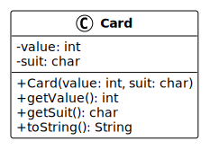

# Exercices - Algorithmes de tri

V. Guidoux, avec l'aide de
[GitHub Copilot](https://github.com/features/copilot).

Ce travail est sous licence [CC BY-SA 4.0][licence].

> [!TIP]
>
> Voici quelques informations relatives à ce contenu.
>
> **Ressources annexes**
>
> - Support de cours : [Retour au contenu principal](../README.md).
> - Exemples de code : [Accéder aux exemples](../01-exemples-de-code/).

## Table des matières

- [Table des matières](#table-des-matières)
- [Introduction](#introduction)
- [La classe Card](#la-classe-card)
- [Liste des exercices](#liste-des-exercices)
  - [Exercice 01 - Tri par sélection](#exercice-01---tri-par-sélection)
  - [Exercice 02 - Tri par insertion](#exercice-02---tri-par-insertion)
  - [Exercice 03 - Tri à bulles](#exercice-03---tri-à-bulles)
  - [Exercice 04 - Tri rapide](#exercice-04---tri-rapide)
  - [Exercice 05 - Tri fusion](#exercice-05---tri-fusion)

## Introduction

Cette section contient des exercices pratiques pour implémenter les algorithmes
de tri vus en cours. Contrairement aux exemples qui trient des entiers, ces
exercices vous demandent de trier des **cartes à jouer**.

**Objectifs** :

- Créer une classe `Card` pour représenter une carte à jouer.
- Implémenter chaque algorithme de tri pour trier des tableaux de cartes.
- Comprendre comment adapter un algorithme de tri à un type d'objet
  personnalisé.

## La classe Card

Chaque exercice commence par la création d'une classe `Card` avec les attributs
suivants :

**Diagramme UML** :

**Attributs** :

- `value` (int) : la valeur de la carte (1 = As, 2-10 = chiffres, 11 = Valet, 12
  = Dame, 13 = Roi).
- `suit` (char) : la couleur de la carte (♠ ♥ ♦ ♣).

**Méthode** :

- `toString()` : retourne une représentation textuelle de la carte (ex: "7♥").

**Ordre de tri** : Les cartes sont triées **par valeur croissante uniquement**.
La couleur n'est pas prise en compte pour le tri.

## Liste des exercices

### Exercice 01 - Tri par sélection

**Dossier** : [01-tri-selection/](./01-tri-selection/)

Implémentez le tri par sélection pour trier un tableau de cartes.

### Exercice 02 - Tri par insertion

**Dossier** : [02-tri-insertion/](./02-tri-insertion/)

Implémentez le tri par insertion pour trier un tableau de cartes.

### Exercice 03 - Tri à bulles

**Dossier** : [03-tri-bulles/](./03-tri-bulles/)

Implémentez le tri à bulles pour trier un tableau de cartes.

### Exercice 04 - Tri rapide

**Dossier** : [04-tri-rapide/](./04-tri-rapide/)

Implémentez le tri rapide pour trier un tableau de cartes.

### Exercice 05 - Tri fusion

**Dossier** : [05-tri-fusion/](./05-tri-fusion/)

Implémentez le tri fusion pour trier un tableau de cartes.

<!-- URLs -->

[licence]:
	https://github.com/heig-vd-progim-course/heig-vd-progim2-course/blob/main/LICENSE.md
