# Algorithmes de tri

<!--
_class: lead
_paginate: false
-->

<https://github.com/heig-vd-progim-course/heig-vd-progim2-course>

Visualiser le contenu complet sur GitHub [à cette
adresse][contenu-complet-sur-github].

<small>V. Guidoux, avec l'aide de
[GitHub Copilot](https://github.com/features/copilot).</small>

<small>Ce travail est sous licence [CC BY-SA 4.0][licence].</small>

![bg opacity:0.1][illustration-principale]

## Plus de détails sur GitHub

<!-- _class: lead -->

_Cette présentation est un résumé du contenu complet disponible sur GitHub._

_Pour plus de détails, consulter le [contenu complet sur
GitHub][contenu-complet-sur-github] ou en cliquant sur l'en-tête de ce
document._

## Objectifs (1/3)

- Expliquer pourquoi le tri de données est important en programmation.
- Identifier les critères de comparaison pour trier des objets.
- Différencier tri croissant et tri décroissant.
- Utiliser des comparateurs pour trier selon différents critères.

![bg right:40%][illustration-objectifs]

## Objectifs (2/3)

- Appliquer plusieurs stratégies de tri sur une même collection.
- Expliquer le fonctionnement du tri par sélection.
- Expliquer le fonctionnement du tri par insertion.
- Expliquer le fonctionnement du tri à bulles.

![bg right:40%][illustration-objectifs]

## Objectifs (3/3)

- Expliquer le fonctionnement du tri rapide (quicksort).
- Expliquer le fonctionnement du tri fusion (mergesort).

![bg right:40%][illustration-objectifs]

## Introduction : le problème de la recherche d'informations

<!-- _class: lead -->

### Chercher dans une base de données (1/2)

**Exemples concrets** :

- Application de contacts avec des milliers d'entrées.
- Système de gestion de bibliothèque avec des millions de livres.
- Plateforme de commerce électronique avec des centaines de milliers de
  produits.

**Le problème** : comment retrouver rapidement l'information recherchée ?

### Chercher dans une base de données (2/2)

**Recherche linéaire** : parcourir tous les éléments un par un.

- Pour 1 million d'entrées : jusqu'à 1 million de comparaisons.
- Lente et inefficace pour de grandes quantités de données.

**Recherche binaire** : diviser l'espace de recherche par deux à chaque étape.

- Pour 1 million d'entrées : maximum 20 comparaisons.
- Exponentiellement plus rapide. mais **nécessite des données triées.**

### Le tri comme solution (1/2)

Le tri rend la recherche exponentiellement plus rapide.

**Exemple du jeu de devinettes** :

- Deviner un nombre entre 1 et 100.
- Stratégie linéaire (1, 2, 3...) : jusqu'à 100 tentatives.
- Stratégie binaire (50, 25 ou 75...) : maximum 7 tentatives.

La stratégie binaire nécessite un ordre.

### Le tri comme solution (2/2)

- **Affichage** : contacts alphabétiques, produits par prix, articles par date.
- **Analyse** : calculer la médiane, détecter des doublons, regrouper des
  similaires.
- **Optimisation** : de nombreux algorithmes utilisent le tri comme étape
  préliminaire.

**Le compromis** : trier coûte du temps et des ressources, d'où l'importance de
choisir le bon algorithme.

## Comprendre le tri avec des cartes à jouer

<!-- _class: lead -->

### Observer avant d'agir (1/2)

Imaginez que vous recevez un jeu de cartes mélangées.

**Avant de commencer à trier** : vous observez les cartes pour comprendre quelle
stratégie adopter.

|                  1                   |                  2                   |                  3                   |                  4                   |                  5                   |
| :----------------------------------: | :----------------------------------: | :----------------------------------: | :----------------------------------: | :----------------------------------: |
| 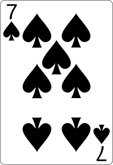 | 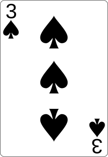 | 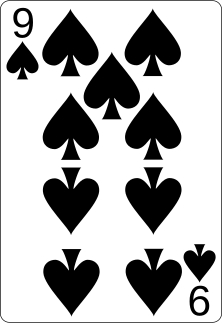 | 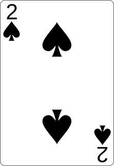 | 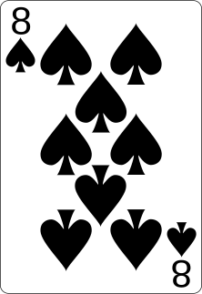 |

### Observer avant d'agir (2/2)

L'ordre actuel : **7, 3, 9, 2, 8**

Aucune logique apparente dans cet ordre.

**Observation** : permet d'identifier visuellement l'état initial et de
comprendre le travail à effectuer.

### Définir un critère de tri (1/2)

Avant de trier, il faut décider **comment** trier.

**Critères possibles pour des cartes** :

- **Par valeur croissante** : du plus petit au plus grand.
- **Par valeur décroissante** : du plus grand au plus petit.

Dans ce cours : focus sur le tri croissant (le plus courant et intuitif).

### Définir un critère de tri (2/2)

**Résultat attendu après tri croissant** :

|                      1                      |                      2                      |                      3                      |                      4                      |                      5                      |
| :-----------------------------------------: | :-----------------------------------------: | :-----------------------------------------: | :-----------------------------------------: | :-----------------------------------------: |
| 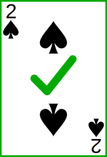 | 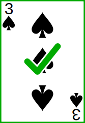 | 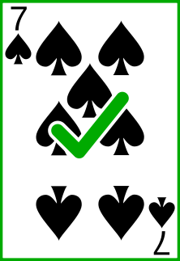 | 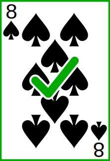 | 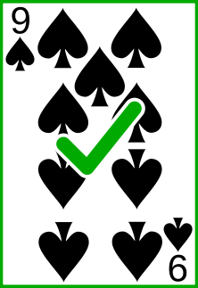 |

Progression naturelle du plus petit au plus grand.

### La notion de tri stable (1/3)

**Définition** : un tri est **stable** si deux éléments égaux conservent leur
ordre relatif d'origine.

**Pourquoi est-ce important ?**

Quand on trie uniquement par valeur, que se passe-t-il avec deux cartes de même
valeur mais de couleurs différentes ?

### La notion de tri stable (2/3)

**Liste initiale** :

|                  1                   |                  2                   |                  3                  |                  4                   |
| :----------------------------------: | :----------------------------------: | :---------------------------------: | :----------------------------------: |
|  | 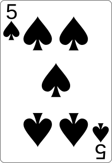 | 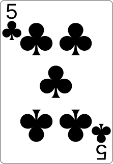 |  |

### La notion de tri stable (3/3)

**Avec un tri stable** :

|                      1                      |                      2                      |                     3                      |                      4                      |
| :-----------------------------------------: | :-----------------------------------------: | :----------------------------------------: | :-----------------------------------------: |
|  | 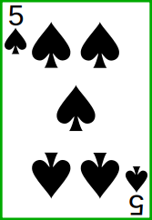 | 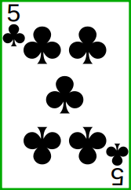 |  |

## Les algorithmes de tri simples

<!-- _class: lead -->

### Conventions visuelles

Dans les visualisations qui suivent, code couleur pour comprendre l'état des
cartes :

|               Normale                |                 Sélectionnée                  |                    Triée                    |
| :----------------------------------: | :-------------------------------------------: | :-----------------------------------------: |
| 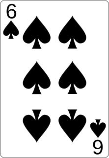 | 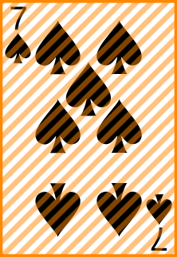 | 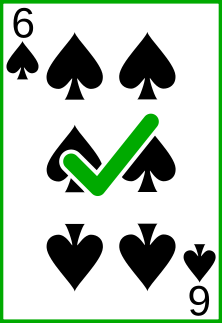 |
|           Pas encore triée           |             Actuellement comparée             |            À sa position finale             |

### Tri par sélection (selection sort) (1/2)

**Principe** : ressemble à la façon naturelle de trier.

1. Chercher le plus petit élément de la liste.
2. Le placer au début.
3. Chercher le plus petit élément parmi ceux qui restent.
4. Le placer en deuxième position.
5. Continuer jusqu'à ce que tous les éléments soient triés.

**Pourquoi "tri par sélection" ?** À chaque étape, on **sélectionne** le plus
petit élément.

### Tri par sélection (selection sort) (2/2)

**Avantage** : simplicité conceptuelle, fait ce qu'un humain ferait
intuitivement.

**Inconvénient** : doit toujours parcourir tous les éléments restants pour
trouver le minimum.

Le nombre de comparaisons est toujours le même, quel que soit l'état initial de
la liste.

### Tri par sélection (selection sort) - Étape initiale

|                  1                   |                  2                   |                  3                   |                  4                   |                  5                   |
| :----------------------------------: | :----------------------------------: | :----------------------------------: | :----------------------------------: | :----------------------------------: |
|  |  |  |  |  |

### Tri par sélection (selection sort) - Passage 1 : chercher

**Chercher le minimum dans toute la liste**. On trouve le **2** (position 4) qui
doit être échangé avec le **7** (position 1).

|                       1                       |                  2                   |                  3                   |                       4                       |                  5                   |
| :-------------------------------------------: | :----------------------------------: | :----------------------------------: | :-------------------------------------------: | :----------------------------------: |
|  |  |  | 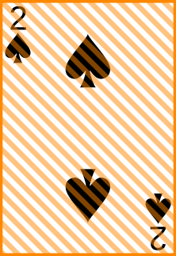 |  |

### Tri par sélection (selection sort) - Passage 1 : échanger

**Échange du 7 et du 2**. Le **2** est maintenant à sa position finale.

|                      1                      |                  2                   |                  3                   |                  4                   |                  5                   |
| :-----------------------------------------: | :----------------------------------: | :----------------------------------: | :----------------------------------: | :----------------------------------: |
|  |  |  |  |  |

### Tri par sélection (selection sort) - Passage 2 : chercher

**Chercher le minimum dans les positions 2 à 5**. On trouve le **3** (position
2), déjà à la bonne position.

|                      1                      |                       2                       |                  3                   |                  4                   |                  5                   |
| :-----------------------------------------: | :-------------------------------------------: | :----------------------------------: | :----------------------------------: | :----------------------------------: |
|  | 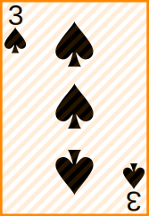 |  |  |  |

### Tri par sélection (selection sort) - Passage 2 : déjà en place

**Pas d'échange nécessaire**. Le **3** est maintenant à sa position finale.

|                      1                      |                      2                      |                  3                   |                  4                   |                  5                   |
| :-----------------------------------------: | :-----------------------------------------: | :----------------------------------: | :----------------------------------: | :----------------------------------: |
|  |  |  |  |  |

### Tri par sélection (selection sort) - Passage 3 : chercher

**Chercher le minimum dans les positions 3 à 5**. On trouve le **7**
(position 4) qui doit être échangé avec le **9** (position 3).

|                      1                      |                      2                      |                       3                       |                       4                       |                  5                   |
| :-----------------------------------------: | :-----------------------------------------: | :-------------------------------------------: | :-------------------------------------------: | :----------------------------------: |
|  |  | 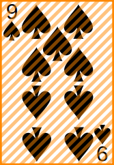 |  |  |

### Tri par sélection (selection sort) - Passage 3 : échanger

**Échange du 9 et du 7**. Le **7** est maintenant à sa position finale.

|                      1                      |                      2                      |                      3                      |                  4                   |                  5                   |
| :-----------------------------------------: | :-----------------------------------------: | :-----------------------------------------: | :----------------------------------: | :----------------------------------: |
|  |  |  |  |  |

### Tri par sélection (selection sort) - Passage 4 : chercher

**Chercher le minimum dans les positions 4 à 5**. On trouve le **8**
(position 5) qui doit être échangé avec le **9** (position 4).

|                      1                      |                      2                      |                      3                      |                       4                       |                       5                       |
| :-----------------------------------------: | :-----------------------------------------: | :-----------------------------------------: | :-------------------------------------------: | :-------------------------------------------: |
|  |  |  |  | 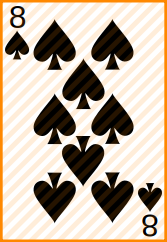 |

### Tri par sélection (selection sort) - Passage 4 : échanger

**Échange du 9 et du 8**. Le **8** est maintenant à sa position finale.

|                      1                      |                      2                      |                      3                      |                      4                      |                  5                   |
| :-----------------------------------------: | :-----------------------------------------: | :-----------------------------------------: | :-----------------------------------------: | :----------------------------------: |
|  |  |  |  |  |

### Tri par sélection (selection sort) - Terminé

**Le dernier élément est automatiquement trié**. Toutes les cartes sont
maintenant à leur position finale.

|                      1                      |                      2                      |                      3                      |                      4                      |                      5                      |
| :-----------------------------------------: | :-----------------------------------------: | :-----------------------------------------: | :-----------------------------------------: | :-----------------------------------------: |
|  |  |  |  |  |

### Tri par insertion (insertion sort) (1/2)

**Principe** : similaire au tri de cartes dans la main.

1. Le premier élément est déjà trié (une liste d'un élément est toujours triée).
2. Prendre le deuxième élément et l'insérer au bon endroit.
3. Prendre le troisième élément et l'insérer au bon endroit.
4. Continuer jusqu'au dernier élément.

**Idée clé** : on construit progressivement une partie triée en insérant chaque
nouvel élément à sa place.

### Tri par insertion (insertion sort) (2/2)

**Avantage** : particulièrement efficace quand la liste est presque triée.
Chaque élément est proche de sa position finale.

**Qualité importante** : l'algorithme est **stable**, deux éléments égaux
conservent leur ordre relatif.

### Tri par insertion (insertion sort) - Étape initiale

|                  1                   |                  2                   |                  3                   |                  4                   |                  5                   |
| :----------------------------------: | :----------------------------------: | :----------------------------------: | :----------------------------------: | :----------------------------------: |
|  |  |  |  |  |

Ordre : **7, 3, 9, 2, 8**

### Tri par insertion (insertion sort) - Étape 1 : 7 déjà trié

**Le 7 est considéré comme déjà trié**. Une liste d'un élément est toujours
triée.

|                      1                      |                  2                   |                  3                   |                  4                   |                  5                   |
| :-----------------------------------------: | :----------------------------------: | :----------------------------------: | :----------------------------------: | :----------------------------------: |
|  |  |  |  |  |

### Tri par insertion (insertion sort) - Sélection du 3

**Prendre le 3** pour l'insérer dans la partie triée [7].

|                      1                      |                       2                       |                  3                   |                  4                   |                  5                   |
| :-----------------------------------------: | :-------------------------------------------: | :----------------------------------: | :----------------------------------: | :----------------------------------: |
|  |  |  |  |  |

### Tri par insertion (insertion sort) - 3 inséré

**Le 3 est plus petit que le 7**, on le place avant. Partie triée : [3, 7].

|                      1                      |                      2                      |                  3                   |                  4                   |                  5                   |
| :-----------------------------------------: | :-----------------------------------------: | :----------------------------------: | :----------------------------------: | :----------------------------------: |
|  |  |  |  |  |

### Tri par insertion (insertion sort) - Sélection du 9

**Prendre le 9** pour l'insérer dans la partie triée [3, 7].

|                      1                      |                      2                      |                       3                       |                  4                   |                  5                   |
| :-----------------------------------------: | :-----------------------------------------: | :-------------------------------------------: | :----------------------------------: | :----------------------------------: |
|  |  |  |  |  |

### Tri par insertion (insertion sort) - 9 inséré

**Le 9 est plus grand que 7**, on le place après. Partie triée : [3, 7, 9].

|                      1                      |                      2                      |                      3                      |                  4                   |                  5                   |
| :-----------------------------------------: | :-----------------------------------------: | :-----------------------------------------: | :----------------------------------: | :----------------------------------: |
|  |  |  |  |  |

### Tri par insertion (insertion sort) - Sélection du 2

**Prendre le 2** pour l'insérer dans la partie triée [3, 7, 9].

|                      1                      |                      2                      |                      3                      |                       4                       |                  5                   |
| :-----------------------------------------: | :-----------------------------------------: | :-----------------------------------------: | :-------------------------------------------: | :----------------------------------: |
|  |  |  |  |  |

### Tri par insertion (insertion sort) - 2 inséré

**Le 2 est le plus petit**, on le place au début. Partie triée : [2, 3, 7, 9].

|                      1                      |                      2                      |                      3                      |                      4                      |                  5                   |
| :-----------------------------------------: | :-----------------------------------------: | :-----------------------------------------: | :-----------------------------------------: | :----------------------------------: |
|  |  |  |  |  |

### Tri par insertion (insertion sort) - Sélection du 8

**Prendre le 8** pour l'insérer dans la partie triée [2, 3, 7, 9].

|                      1                      |                      2                      |                      3                      |                      4                      |                       5                       |
| :-----------------------------------------: | :-----------------------------------------: | :-----------------------------------------: | :-----------------------------------------: | :-------------------------------------------: |
|  |  |  |  |  |

### Tri par insertion (insertion sort) - Terminé

**Le 8 se place entre 7 et 9**. Toutes les cartes sont triées.

|                      1                      |                      2                      |                      3                      |                      4                      |                      5                      |
| :-----------------------------------------: | :-----------------------------------------: | :-----------------------------------------: | :-----------------------------------------: | :-----------------------------------------: |
|  |  |  |  |  |

### Tri à bulles (bubble sort) (1/2)

**Principe** : les plus grandes valeurs "remontent" vers la fin comme des bulles
dans l'eau.

1. Parcourir la liste et comparer chaque paire d'éléments adjacents.
2. Si deux éléments adjacents sont dans le mauvais ordre, les échanger.
3. Répéter le processus jusqu'à ce qu'aucun échange ne soit nécessaire.

### Tri à bulles (bubble sort) (2/2)

**Inconvénient** : réputé comme l'algorithme le moins efficace. Effectue de
nombreux échanges inutiles.

**Rarement utilisé en pratique** pour des données réelles.

**Valeur pédagogique** : très simple à comprendre et à implémenter, bon premier
exemple d'algorithme de tri.

### Tri à bulles (bubble sort) - Étape initiale

|                  1                   |                  2                   |                  3                   |                  4                   |                  5                   |
| :----------------------------------: | :----------------------------------: | :----------------------------------: | :----------------------------------: | :----------------------------------: |
|  |  |  |  |  |

### Tri à bulles (bubble sort) - Pass. 1 : comparer 7 et 3

**Comparer les positions 1 et 2**. 7 > 3, donc échanger.

|                       1                       |                       2                       |                  3                   |                  4                   |                  5                   |
| :-------------------------------------------: | :-------------------------------------------: | :----------------------------------: | :----------------------------------: | :----------------------------------: |
|  |  |  |  |  |

### Tri à bulles (bubble sort) - Pass. 1 : comparer 7 et 9

**Comparer les positions 2 et 3**. 7 < 9, pas d'échange.

|                  1                   |                       2                       |                       3                       |                  4                   |                  5                   |
| :----------------------------------: | :-------------------------------------------: | :-------------------------------------------: | :----------------------------------: | :----------------------------------: |
|  |  |  |  |  |

### Tri à bulles (bubble sort) - Pass. 1 : comparer 9 et 2

**Comparer les positions 3 et 4**. 9 > 2, donc échanger.

|                  1                   |                  2                   |                       3                       |                       4                       |                  5                   |
| :----------------------------------: | :----------------------------------: | :-------------------------------------------: | :-------------------------------------------: | :----------------------------------: |
|  |  |  |  |  |

### Tri à bulles (bubble sort) - Pass. 1 : comparer 9 et 8

**Comparer les positions 4 et 5**. 9 > 8, donc échanger. Le 9 est à sa position
finale !

|                  1                   |                  2                   |                  3                   |                       4                       |                       5                       |
| :----------------------------------: | :----------------------------------: | :----------------------------------: | :-------------------------------------------: | :-------------------------------------------: |
|  |  |  |  |  |

### Tri à bulles (bubble sort) - Pass. 1 : terminé

**Le plus grand élément (9) est remonté** à sa position finale.

|                  1                   |                  2                   |                  3                   |                  4                   |                      5                      |
| :----------------------------------: | :----------------------------------: | :----------------------------------: | :----------------------------------: | :-----------------------------------------: |
|  |  |  |  |  |

### Tri à bulles (bubble sort) - Pass. 2 : comparer 3 et 7

**Recommencer depuis le début**. Comparer 3 et 7 : 3 < 7, pas d'échange.

|                       1                       |                       2                       |                  3                   |                  4                   |                      5                      |
| :-------------------------------------------: | :-------------------------------------------: | :----------------------------------: | :----------------------------------: | :-----------------------------------------: |
|  |  |  |  |  |

### Tri à bulles (bubble sort) - Pass. 2 : comparer 7 et 2

**Comparer les positions 2 et 3**. 7 > 2, donc échanger.

|                  1                   |                       2                       |                       3                       |                  4                   |                      5                      |
| :----------------------------------: | :-------------------------------------------: | :-------------------------------------------: | :----------------------------------: | :-----------------------------------------: |
|  |  |  |  |  |

### Tri à bulles (bubble sort) - Pass. 2 : comparer 7 et 8

**Comparer les positions 2 et 3**. 7 < 8, pas d'échange. Le 8 est à sa position
finale !

|                  1                   |                  2                   |                       3                       |                       4                       |                      5                      |
| :----------------------------------: | :----------------------------------: | :-------------------------------------------: | :-------------------------------------------: | :-----------------------------------------: |
|  |  |  |  |  |

### Tri à bulles (bubble sort) - Pass. 2 : terminé

**Le deuxième plus grand (8) est à sa place**.

|                  1                   |                  2                   |                  3                   |                      4                      |                      5                      |
| :----------------------------------: | :----------------------------------: | :----------------------------------: | :-----------------------------------------: | :-----------------------------------------: |
|  |  |  |  |  |

### Tri à bulles (bubble sort) - Pass. 3 : comparer 3 et 2

**Continuer**. Comparer les positions 1 et 2 : 3 > 2, donc échanger.

|                       1                       |                       2                       |                  3                   |                      4                      |                      5                      |
| :-------------------------------------------: | :-------------------------------------------: | :----------------------------------: | :-----------------------------------------: | :-----------------------------------------: |
|  |  |  |  |  |

### Tri à bulles (bubble sort) - Pass. 3 : comparer 3 et 7

**Comparer les positions 1 et 3**. 3 < 7, pas d'échange. Le 7 est à sa position
finale !

|                  1                   |                       2                       |                       3                       |                      4                      |                      5                      |
| :----------------------------------: | :-------------------------------------------: | :-------------------------------------------: | :-----------------------------------------: | :-----------------------------------------: |
|  |  |  |  |  |

### Tri à bulles (bubble sort) - Pass. 3 : terminé

**Le troisième plus grand (7) est à sa place**.

|                  1                   |                  2                   |                      3                      |                      4                      |                      5                      |
| :----------------------------------: | :----------------------------------: | :-----------------------------------------: | :-----------------------------------------: | :-----------------------------------------: |
|  |  |  |  |  |

### Tri à bulles (bubble sort) - Pass. 4 : comparer les positions 2 et 3

**Dernier passage**. Comparer les positions 2 et 3 : 2 < 3, pas d'échange. Aucun
échange : trié !

|                       1                       |                       2                       |                      3                      |                      4                      |                      5                      |
| :-------------------------------------------: | :-------------------------------------------: | :-----------------------------------------: | :-----------------------------------------: | :-----------------------------------------: |
|  |  |  |  |  |

### Tri à bulles (bubble sort) - Terminé

**Aucun échange effectué, le tri est terminé**. Toutes les cartes sont triées.

|                      1                      |                      2                      |                      3                      |                      4                      |                      5                      |
| :-----------------------------------------: | :-----------------------------------------: | :-----------------------------------------: | :-----------------------------------------: | :-----------------------------------------: |
|  |  |  |  |  |

## Les algorithmes de tri avancés

<!-- _class: lead -->

### Tri rapide (quicksort) (1/3)

**Principe** : diviser pour régner avec un **pivot**.

Un pivot respecte trois conditions :

1. Le pivot est à sa position finale.
2. Tous les éléments à gauche sont plus petits que le pivot.
3. Tous les éléments à droite sont plus grands que le pivot.

**Stratégie** : choisir un pivot, réorganiser le tableau, appliquer
récursivement aux sous-tableaux.

### Tri rapide (quicksort) (2/3)

**Avantage** : trie "sur place" (in-place), économise la mémoire. Pas besoin de
copier les éléments.

**Inconvénient** : n'est **pas stable**, deux éléments égaux peuvent changer
d'ordre.

**Choix du pivot** : crucial pour les performances. Méthode courante : médiane
de trois (premier, milieu, dernier).

### Tri rapide (quicksort) (3/3)

**Complexité** : dans le pire cas O(n²), mais avec un bon pivot la complexité
moyenne est O(n log n).

**Utilisation** : l'un des algorithmes les plus utilisés en pratique grâce à sa
rapidité moyenne.

### Tri rapide (quicksort) - Étape initiale

|                  1                   |                  2                   |                  3                   |                  4                   |                  5                   |
| :----------------------------------: | :----------------------------------: | :----------------------------------: | :----------------------------------: | :----------------------------------: |
| 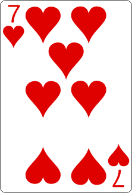 | 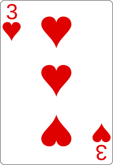 | 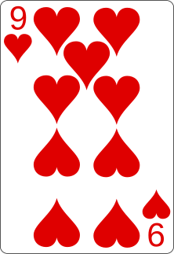 | 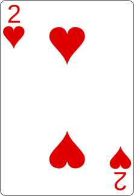 | 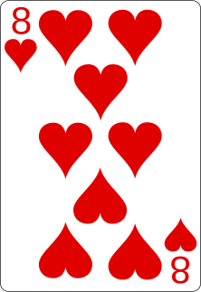 |

### Tri rapide (quicksort) - Choix du pivot

**Choisir le dernier élément comme pivot** : le 8. C'est une stratégie simple et
courante.

|                  1                   |                  2                   |                  3                   |                  4                   |                       5                       |
| :----------------------------------: | :----------------------------------: | :----------------------------------: | :----------------------------------: | :-------------------------------------------: |
|  |  |  |  | 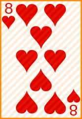 |

### Tri rapide (quicksort) - Chercher depuis la gauche

**Parcourir depuis la gauche** pour trouver un élément **> pivot (8)**. Le 7 <
8, continuer.

|                       1                       |                  2                   |                  3                   |                  4                   |                       5                       |
| :-------------------------------------------: | :----------------------------------: | :----------------------------------: | :----------------------------------: | :-------------------------------------------: |
| 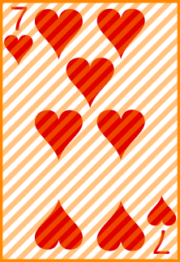 |  |  |  |  |

### Tri rapide (quicksort) - Continuer la recherche

**Continuer**. Le 3 < 8, continuer. Le 9 > 8, **trouvé** ! C'est l'élément de
gauche à échanger.

|                  1                   |                  2                   |                       3                       |                  4                   |                       5                       |
| :----------------------------------: | :----------------------------------: | :-------------------------------------------: | :----------------------------------: | :-------------------------------------------: |
|  |  | 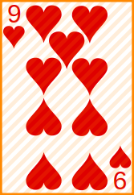 |  |  |

### Tri rapide (quicksort) - Chercher depuis la droite

**Parcourir depuis la droite** (avant le pivot) pour trouver un élément **<
pivot (8)**. Le 2 < 8, **trouvé** ! C'est l'élément de droite à échanger.

|                  1                   |                  2                   |                       3                       |                       4                       |                       5                       |
| :----------------------------------: | :----------------------------------: | :-------------------------------------------: | :-------------------------------------------: | :-------------------------------------------: |
|  |  |  | 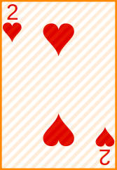 |  |

### Tri rapide (quicksort) - Échanger 9 et 2

**Échanger les deux éléments trouvés**. Le 2 et le 9 inversent leurs positions.

|                  1                   |                  2                   |                  3                   |                  4                   |                       5                       |
| :----------------------------------: | :----------------------------------: | :----------------------------------: | :----------------------------------: | :-------------------------------------------: |
|  |  |  |  |  |

### Tri rapide (quicksort)

**Les indices se croisent** entre le 2 et le 9. Tous les éléments < 8 sont à
gauche, tous les éléments > 8 sont à droite. **Le partitionnement est terminé**.

|                  1                   |                  2                   |                  3                   |                  4                   |                       5                       |
| :----------------------------------: | :----------------------------------: | :----------------------------------: | :----------------------------------: | :-------------------------------------------: |
|  |  |  |  |  |

### Tri rapide (quicksort) - Placer le pivot

**Placer le pivot à sa position finale**. Échanger le 8 (pivot) avec le 9
(première position de la partie droite).

|                  1                   |                  2                   |                  3                   |                      4                      |                  5                   |
| :----------------------------------: | :----------------------------------: | :----------------------------------: | :-----------------------------------------: | :----------------------------------: |
|  |  |  | 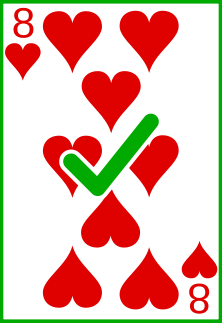 |  |

Gauche : [7, 3, 2] - Droite : [9]

### Tri rapide (quicksort) - Sous-tableau gauche

**Appliquer le tri à [7, 3, 2]**. Choisir le dernier élément comme pivot : le 2.

|                       1                       |                  2                   |                       3                       |                      4                      |                  5                   |
| :-------------------------------------------: | :----------------------------------: | :-------------------------------------------: | :-----------------------------------------: | :----------------------------------: |
|  |  |  |  |  |

### Tri rapide (quicksort) - Chercher depuis la gauche

**Chercher depuis la gauche** un élément > pivot (2). Le 7 > 2, **trouvé** en
position 1 !

|                       1                       |                  2                   |                       3                       |                      4                      |                  5                   |
| :-------------------------------------------: | :----------------------------------: | :-------------------------------------------: | :-----------------------------------------: | :----------------------------------: |
|  |  |  |  |  |

### Tri rapide (quicksort) - Chercher depuis la droite

**Chercher depuis la droite** (avant le pivot) un élément < pivot (2). Le 3 > 2,
continuer. **Pas d'élément < 2**. Les indices se croisent.

|                       1                       |                       2                       |                       3                       |                      4                      |                  5                   |
| :-------------------------------------------: | :-------------------------------------------: | :-------------------------------------------: | :-----------------------------------------: | :----------------------------------: |
|  | 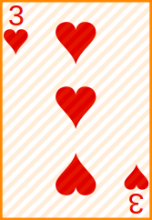 |  |  |  |

### Tri rapide (quicksort) - Placer le pivot [7, 3, 2]

**Indices croisés**. Placer le pivot à sa position : échanger le 2 et le 7.

|                       1                       |                  2                   |                       3                       |                      4                      |                  5                   |
| :-------------------------------------------: | :----------------------------------: | :-------------------------------------------: | :-----------------------------------------: | :----------------------------------: |
|  |  |  |  |  |

### Tri rapide (quicksort) - Le 2 est placé

**Le 2 est maintenant à sa position finale**. Le 2 < tous les éléments à droite.

|                      1                      |                  2                   |                  3                   |                      4                      |                  5                   |
| :-----------------------------------------: | :----------------------------------: | :----------------------------------: | :-----------------------------------------: | :----------------------------------: |
| 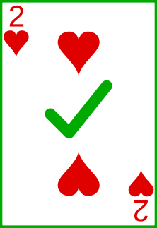 |  |  |  |  |

Reste à trier : [3, 7]

### Tri rapide (quicksort) - Sous-tableau [3, 7]

**Appliquer le tri à [3, 7]**. Choisir le pivot : le 7. Chercher depuis la
gauche : 3 < 7. Les indices se croisent immédiatement.

|                      1                      |                       2                       |                       3                       |                      4                      |                  5                   |
| :-----------------------------------------: | :-------------------------------------------: | :-------------------------------------------: | :-----------------------------------------: | :----------------------------------: |
|  |  |  |  |  |

### Tri rapide (quicksort) - Le 3 et le 7 placés

**Le 3 et le 7 sont à leur position finale**. Gauche trié : [2, 3, 7]. Le 9 est
seul, donc trié.

|                      1                      |                      2                      |                      3                      |                      4                      |                      5                      |
| :-----------------------------------------: | :-----------------------------------------: | :-----------------------------------------: | :-----------------------------------------: | :-----------------------------------------: |
|  | 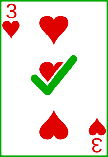 | 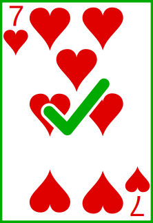 |  | 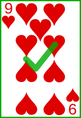 |

### Tri rapide (quicksort) - Terminé

**Tous les sous-tableaux sont triés**. Le tri rapide est terminé.

|                      1                      |                      2                      |                      3                      |                      4                      |                      5                      |
| :-----------------------------------------: | :-----------------------------------------: | :-----------------------------------------: | :-----------------------------------------: | :-----------------------------------------: |
|  |  |  |  |  |

**Résultat final** : **2, 3, 7, 8, 9** ✓

### Tri fusion (mergesort) (1/3)

**Principe** : diviser pour régner (divide and conquer).

1. **Diviser** : couper le tableau en deux jusqu'à avoir des éléments
   individuels.
2. **Conquérir** : fusionner les petits tableaux triés en tableaux plus grands,
   toujours triés.
3. Une fois tous fusionnés, le tableau est complètement trié.

**Inventé en 1945** par John von Neumann, pionnier de l'informatique.

### Tri fusion (mergesort) (2/3)

**Avantage** : algorithme **stable**, conserve l'ordre relatif des éléments
égaux.

**Complexité** : toujours O(n log n), même dans le pire cas. Performance
prévisible.

**Inconvénient** : nécessite de la mémoire supplémentaire pour les tableaux
temporaires.

### Tri fusion (mergesort) (3/3)

**Utilisation** : privilégié quand la stabilité est importante ou quand on a
besoin de performances garanties.

**Visualisation** : nous allons utiliser deux lignes, la ligne source et la
ligne résultat en construction.

### Tri fusion (mergesort) - Étape initiale

**Tableau de départ** à diviser puis fusionner.

|                  1                   |                  2                   |                  3                   |                  4                   |                  5                   |
| :----------------------------------: | :----------------------------------: | :----------------------------------: | :----------------------------------: | :----------------------------------: |
|  |  |  |  |  |

Ordre : **7, 3, 9, 2, 8**

### Tri fusion (mergesort) - Division

**Diviser continuellement en deux** jusqu'à avoir des éléments individuels. Une
liste d'un élément est toujours triée.

Divisions : [7, 3, 9, 2, 8] → [7, 3] + [9, 2, 8] → [7] + [3] + [9] + [2, 8] →
[7] + [3] + [9] + [2] + [8]

**Maintenant, remonter en fusionnant** les éléments triés.

### Tri fusion (mergesort) - Fusion 1 : [7] et [3]

|                       1                       |                       2                       |                  3                   |                  4                   |                  5                   |
| :-------------------------------------------: | :-------------------------------------------: | :----------------------------------: | :----------------------------------: | :----------------------------------: |
|  |  |  |  |  |
|    |    |        |        |        |

### Tri fusion (mergesort) - Fusion 2 : [2] et [8]

|                      1                      |                      2                      |                  3                   |                       4                       |                       5                       |
| :-----------------------------------------: | :-----------------------------------------: | :----------------------------------: | :-------------------------------------------: | :-------------------------------------------: |
|  |  |  |  |  |
|               |               |        |    |    |

### Tri fusion (mergesort) - État intermédiaire

**Après premières fusions** : [3, 7], [9], [2, 8]. Le 9 est seul donc déjà trié.

**Prochaine étape** : fusionner [3, 7] avec [9, 2, 8] mais d'abord fusionner [9]
avec [2, 8].

### Tri fusion (mergesort) - Fus. 3 : [9] et [2, 8]

|                      1                      |                      2                      |                       3                       |                       4                       |                       5                       |
| :-----------------------------------------: | :-----------------------------------------: | :-------------------------------------------: | :-------------------------------------------: | :-------------------------------------------: |
|  |  |  |  |  |
|               |               |                 |                 |                 |

### Tri fusion (mergesort) - Fus. 3 : [9] et [2, 8]

|                      1                      |                      2                      |                       3                       |               4                |                       5                       |
| :-----------------------------------------: | :-----------------------------------------: | :-------------------------------------------: | :----------------------------: | :-------------------------------------------: |
|  |  |  |  |  |
|  |               |                 |  |                 |

### Tri fusion (mergesort) - Fus. 3 : [9] et [2, 8]

|                      1                      |                      2                      |                       3                       |               4                |               5                |
| :-----------------------------------------: | :-----------------------------------------: | :-------------------------------------------: | :----------------------------: | :----------------------------: |
|  |  |  |  |  |
|  |  |                 |  |  |

### Tri fusion (mergesort) - Fus. 3 : [9] et [2, 8]

|                      1                      |                      2                      |                      3                      |               4                |               5                |
| :-----------------------------------------: | :-----------------------------------------: | :-----------------------------------------: | :----------------------------: | :----------------------------: |
|  |  |               |  |  |
|  |  |  |  |  |

### Tri fusion (mergesort) - [3, 7] et [2, 8, 9]

|                       1                       |                       2                       |               3                |                       4                       |                       5                       |
| :-------------------------------------------: | :-------------------------------------------: | :----------------------------: | :-------------------------------------------: | :-------------------------------------------: |
|  |  |  |  |  |
|    |                 |  |                 |                 |

### Tri fusion (mergesort) - [3, 7] et [2, 8, 9]

|                      1                      |                       2                       |               3                |                       4                       |                       5                       |
| :-----------------------------------------: | :-------------------------------------------: | :----------------------------: | :-------------------------------------------: | :-------------------------------------------: |
|               |  |  |  |  |
|  |    |  |                 |                 |

### Tri fusion (mergesort) - [3, 7] et [2, 8, 9]

|                      1                      |                      2                      |                      3                      |                       4                       |                       5                       |
| :-----------------------------------------: | :-----------------------------------------: | :-----------------------------------------: | :-------------------------------------------: | :-------------------------------------------: |
|               |               |               |  |  |
|  |  |  |                 |                 |

### Tri fusion (mergesort) - [3, 7] et [2, 8, 9]

|                      1                      |                      2                      |                      3                      |                       4                       |                       5                       |
| :-----------------------------------------: | :-----------------------------------------: | :-----------------------------------------: | :-------------------------------------------: | :-------------------------------------------: |
|               |               |               |  |  |
|  |  |  |    |    |

### Tri fusion (mergesort) - Terminé

**Le tri fusion est terminé**. Tous les éléments sont triés.

|                      1                      |                      2                      |                      3                      |                      4                      |                      5                      |
| :-----------------------------------------: | :-----------------------------------------: | :-----------------------------------------: | :-----------------------------------------: | :-----------------------------------------: |
|  |  |  |  |  |

## Questions

<!-- _class: lead -->

Est-ce que vous avez des questions ?

## À vous de jouer !

- (Re)lire le contenu de cours.
- Lire les exemples de code et les descriptions.
- Faire les exercices.
- Poser des questions si nécessaire. ➡️ [Visualiser le contenu complet sur
  GitHub.][contenu-complet-sur-github]

**N'hésitez pas à vous entraidez si vous avez des difficultés !**

![bg right:40%][illustration-a-vous-de-jouer]

## Sources

- [Illustration principale][illustration-principale] par
  [Amanda Jones](https://unsplash.com/fr/@amandagraphc) sur
  [Unsplash](https://unsplash.com/fr/photos/une-pile-de-cartes-a-jouer-assises-les-unes-sur-les-autres-P787-xixGio)
- [Illustration][illustration-objectifs] par
  [Aline de Nadai](https://unsplash.com/@alinedenadai) sur
  [Unsplash](https://unsplash.com/photos/low-angle-view-of-ball-shoots-in-the-ring-j6brni7fpvs)

---

- [Illustration][illustration-a-vous-de-jouer] par
  [Nikita Kachanovsky](https://unsplash.com/@nkachanovskyyy) sur
  [Unsplash](https://unsplash.com/photos/white-sony-ps4-dualshock-controller-over-persons-palm-FJFPuE1MAOM)

<!-- URLs -->

[contenu-complet-sur-github]:
	https://github.com/heig-vd-progim-course/heig-vd-progim2-course/tree/main/01-contenus-du-cours/07-algorithmes-de-tri/
[licence]:
	https://github.com/heig-vd-progim-course/heig-vd-progim2-course/blob/main/LICENSE.md

<!-- Illustrations -->

[illustration-principale]:
	https://images.unsplash.com/photo-1541278107931-e006523892df?fit=crop&h=720
[illustration-objectifs]:
	https://images.unsplash.com/photo-1516389573391-5620a0263801?fit=crop&h=720
[illustration-a-vous-de-jouer]:
	https://images.unsplash.com/photo-1509198397868-475647b2a1e5?fit=crop&h=720
