# Algorithmes de tri

V. Guidoux, avec l'aide de
[GitHub Copilot](https://github.com/features/copilot).

Ce travail est sous licence [CC BY-SA 4.0][licence].

> [!TIP]
>
> Voici quelques informations relatives à ce contenu.
>
> **Ressources annexes**
>
> - Autres formats du support de cours : [Présentation (web)][presentation-web]
>   · [Présentation (PDF)][presentation-pdf]
> - Exemples de code : [Accéder au contenu](./01-exemples-de-code/)
> - Exercices : [Accéder au contenu](./02-exercices/)
> - Quiz : [Accéder au contenu][quiz-web]
>
> **Objectifs**
>
> À l'issue de cette séance, les personnes qui étudient devraient être capables
> de :
>
> - Expliquer pourquoi le tri de données est important en programmation.
> - Identifier les critères de comparaison pour trier des objets.
> - Différencier tri croissant et tri décroissant.
> - Utiliser des comparateurs pour trier selon différents critères.
> - Appliquer plusieurs stratégies de tri sur une même collection.
> - Expliquer le fonctionnement du tri par sélection.
> - Expliquer le fonctionnement du tri à bulles.
> - Expliquer le fonctionnement du tri rapide (quicksort).
> - Expliquer le fonctionnement du tri fusion (mergesort).
>
> **Méthodes d'enseignement et d'apprentissage**
>
> Les méthodes d'enseignement et d'apprentissage utilisées pour animer la séance
> sont les suivantes :
>
> - Présentation magistrale.
> - Discussions collectives.
> - Travail en autonomie.
>
> **Méthodes d'évaluation**
>
> L'évaluation prend la forme d'exercices à réaliser en autonomie en classe ou à
> la maison.
>
> L'évaluation se fait en utilisant les critères suivants :
>
> - Capacité à répondre avec justesse.
> - Capacité à argumenter.
> - Capacité à réaliser les tâches demandées.
> - Capacité à s'approprier les exemples de code.
> - Capacité à appliquer les exemples de code à des situations similaires.
>
> Les retours se font de la manière suivante :
>
> - Corrigé des exercices.
>
> L'évaluation ne donne pas lieu à une note.

## Table des matières

- [Table des matières](#table-des-matières)
- [Objectifs](#objectifs)
- [Introduction : le problème de la recherche d'informations](#introduction--le-problème-de-la-recherche-dinformations)
  - [Chercher dans une base de données](#chercher-dans-une-base-de-données)
  - [Le tri comme solution](#le-tri-comme-solution)
- [Comprendre le tri avec des cartes à jouer](#comprendre-le-tri-avec-des-cartes-à-jouer)
  - [Observer avant d'agir](#observer-avant-dagir)
  - [Définir un critère de tri](#définir-un-critère-de-tri)
  - [La notion de tri stable](#la-notion-de-tri-stable)
- [Les algorithmes de tri simples](#les-algorithmes-de-tri-simples)
  - [Tri par sélection (selection sort)](#tri-par-sélection-selection-sort)
  - [Tri à bulles (bubble sort)](#tri-à-bulles-bubble-sort)
- [Les algorithmes de tri avancés](#les-algorithmes-de-tri-avancés)
  - [Tri rapide (quicksort)](#tri-rapide-quicksort)
  - [Tri fusion (mergesort)](#tri-fusion-mergesort)
- [Conclusion](#conclusion)
- [Aller plus loin](#aller-plus-loin)
  - [Complexité algorithmique et notation Big O](#complexité-algorithmique-et-notation-big-o)
  - [Comparator et Comparable en Java](#comparator-et-comparable-en-java)
- [Exemples de code](#exemples-de-code)
- [Exercices](#exercices)
- [À faire pour la prochaine séance](#à-faire-pour-la-prochaine-séance)

## Objectifs

Ce contenu de cours a pour objectifs de permettre aux personnes qui étudient de
comprendre les principes fondamentaux du tri de données, d'expliquer le
fonctionnement des principaux algorithmes de tri, et de maîtriser l'utilisation
des interfaces `Comparable<T>` et `Comparator<T>` en Java pour définir des
critères de tri personnalisés.

La liste complète des objectifs est disponible dans la section _"Objectifs"_ du
bloc d'information en haut de ce contenu.

## Introduction : le problème de la recherche d'informations

### Chercher dans une base de données

Nous devons souvent chercher des informations dans des bases de données.
Imaginez une application de contacts avec des milliers d'entrées, un système de
gestion de bibliothèque avec des millions de livres, ou une plateforme de
commerce électronique avec des centaines de milliers de produits. Comment
retrouver rapidement l'information recherchée ?

La façon la plus simple de chercher un élément dans une collection serait de
parcourir tous les éléments un par un jusqu'à trouver celui qu'on cherche. Cette
approche, appelée recherche linéaire, fonctionne mais devient très lente quand
la quantité de données augmente. Pour trouver un élément parmi un million
d'entrées, il faudrait dans le pire cas examiner un million d'éléments.

Imaginez un jeu simple : une personne choisit un nombre entre 1 et 100, et vous
devez le deviner. À chaque tentative, la personne répond uniquement "c'est plus"
ou "c'est moins". Si vous essayez les nombres dans l'ordre (1, 2, 3, 4...), vous
aurez besoin de jusqu'à 100 tentatives dans le pire cas. C'est la recherche
linéaire : lente et prévisible.

Mais si vous utilisez une stratégie différente - commencer à 50, puis selon la
réponse aller à 25 ou 75, puis à 12 ou 37 ou 62 ou 87, et ainsi de suite - vous
trouverez le nombre en maximum 7 tentatives. Cette stratégie, appelée recherche
binaire ou dichotomique, est exponentiellement plus rapide. Cependant, elle
nécessite que les nombres soient ordonnés.

Historiquement, ce problème a toujours préoccupé l'humanité. Les bibliothèques
médiévales organisaient leurs manuscrits selon un système de classement, les
comptables tenaient des registres ordonnés, les botanistes cataloguaient leurs
spécimens. L'ordre facilitait la recherche et permettait de retrouver rapidement
ce qu'on cherchait.

### Le tri comme solution

Le tri répond à ce problème de recherche. Lorsque les données sont triées, la
recherche devient exponentiellement plus rapide. Avec la recherche binaire sur
des données triées, trouver un élément parmi un million d'entrées ne nécessite
que 20 comparaisons au maximum, au lieu d'un million.

Cette différence de performance est radicale. C'est la différence entre une
recherche instantanée et une recherche qui prend plusieurs secondes, voire
plusieurs minutes pour de très grandes quantités de données.

Le tri n'est pas seulement utile pour la recherche :

**Pour l'affichage** : présenter des données de manière ordonnée améliore
l'expérience utilisateur. Une liste de contacts alphabétique, un catalogue de
produits par prix, des articles de blog par date - l'ordre rend l'information
plus accessible.

**Pour l'analyse** : certaines analyses nécessitent des données triées. Par
exemple, pour calculer la médiane d'une série de valeurs, pour détecter des
doublons, ou pour regrouper des éléments similaires.

**Pour l'optimisation** : de nombreux algorithmes complexes utilisent le tri
comme étape préliminaire. Le tri peut transformer un problème difficile en un
problème simple à résoudre.

Cependant, le tri a un coût. Trier des millions d'éléments demande du temps et
des ressources. C'est pourquoi les personnes en informatique ont développé de
nombreux algorithmes de tri, chacun avec ses avantages et ses inconvénients
selon le contexte d'utilisation. Le choix de l'algorithme peut faire la
différence entre une application réactive et une application lente.

## Comprendre le tri avec des cartes à jouer

### Observer avant d'agir

Imaginez que vous recevez un jeu de cartes mélangées. Avant de commencer à
trier, vous observez naturellement les cartes pour comprendre quelle stratégie
adopter.

Voici un exemple de cartes désordonnées :

|            Carte 1             |            Carte 2             |            Carte 3             |            Carte 4             |            Carte 5             |            Carte 6             |            Carte 7             |            Carte 8             |
| :----------------------------: | :----------------------------: | :----------------------------: | :----------------------------: | :----------------------------: | :----------------------------: | :----------------------------: | :----------------------------: |
|  |  |  |  |  | 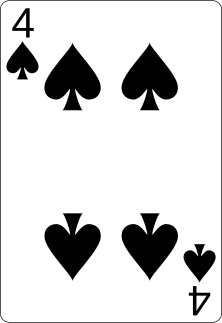 |  |  |

Cette représentation visuelle nous permet de voir immédiatement que les cartes
sont actuellement dans un ordre qui ne suit aucune logique apparente : 7, 3, 5,
2, 8, 4, 6, 9.

### Définir un critère de tri

Avant de trier, il faut décider **comment** trier. Dans le cas de cartes à
jouer, plusieurs critères sont possibles :

- **Par valeur croissante** : du plus petit au plus grand (2, 3, 4, 5, 6, 7, 8,
  9).
- **Par valeur décroissante** : du plus grand au plus petit (9, 8, 7, 6, 5, 4,
  3, 2).

Dans ce cours, nous nous concentrerons principalement sur le tri par valeur
croissante, car c'est le critère le plus simple à comprendre et à illustrer.
Cependant, les algorithmes présentés fonctionnent avec n'importe quel critère de
comparaison.

Voici le résultat attendu après un tri par valeur croissante :

|                Carte 1                |                Carte 2                |                Carte 3                |                Carte 4                |                Carte 5                |                Carte 6                |                Carte 7                |                Carte 8                |
| :-----------------------------------: | :-----------------------------------: | :-----------------------------------: | :-----------------------------------: | :-----------------------------------: | :-----------------------------------: | :-----------------------------------: | :-----------------------------------: |
|  |  | 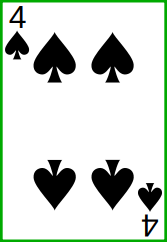 |  |  |  |  |  |

Cette progression naturelle du plus petit au plus grand est facile à vérifier
visuellement et correspond à notre intuition du tri.

### La notion de tri stable

Avant d'explorer les différents algorithmes de tri, il est important de
comprendre une propriété que certains algorithmes possèdent : la **stabilité**.

Un algorithme de tri est dit **stable** si deux éléments égaux (selon le critère
de tri) conservent leur ordre relatif d'origine après le tri. Autrement dit, si
l'élément A apparaît avant l'élément B dans la liste initiale, et que A et B
sont considérés comme égaux pour le tri, alors A apparaîtra toujours avant B
dans la liste triée.

**Pourquoi est-ce important ?**

Imaginons que nous ayons des cartes avec à la fois une valeur et une couleur, et
que nous voulions les trier uniquement par valeur. Si nous avons deux 5 (un 5♠
et un 5♣), dans quel ordre doivent-ils apparaître dans le résultat ?

Liste initiale :

|            Carte 1             |            Carte 2             |            Carte 3            |            Carte 4             |
| :----------------------------: | :----------------------------: | :---------------------------: | :----------------------------: |
|  |  |  |  |

Avec un **tri stable** (par valeur croissante) :

|                Carte 1                |                Carte 2                |               Carte 3                |                Carte 4                |
| :-----------------------------------: | :-----------------------------------: | :----------------------------------: | :-----------------------------------: |
|  |  |  |  |

Les deux 5 restent dans leur ordre d'origine : le 5♠ (qui était en position 2)
reste avant le 5♣ (qui était en position 3).

Avec un **tri non-stable**, le résultat pourrait être :

|                Carte 1                |               Carte 2                |                Carte 3                |                Carte 4                |
| :-----------------------------------: | :----------------------------------: | :-----------------------------------: | :-----------------------------------: |
|  |  |  |  |

L'ordre des deux 5 a changé par rapport à la liste initiale.

## Les algorithmes de tri simples

Les algorithmes de tri simples sont appelés ainsi parce qu'ils sont faciles à
comprendre et à implémenter. Ils fonctionnent bien pour de petites collections
de données. Cependant, ils deviennent moins efficaces pour de grandes quantités
de données.

Ces algorithmes ont néanmoins une grande valeur pédagogique : ils permettent de
comprendre les principes de base du tri et illustrent différentes façons
d'aborder le même problème.

**Conventions visuelles**

Dans les visualisations qui suivent, nous utilisons un code couleur pour aider à
comprendre l'état des cartes :

|         Carte normale          |          Carte avec bordure orange et rayures orange           |    Carte avec bordure verte et coche verte     |
| :----------------------------: | :------------------------------------------------------------: | :--------------------------------------------: |
|  |            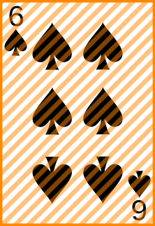             |           |
|    Carte pas encore triée.     | Carte actuellement sélectionnée ou comparée dans l'algorithme. | Carte déjà à sa position finale et définitive. |

### Tri par sélection (selection sort)

Le tri par sélection est probablement l'algorithme de tri le plus intuitif. Son
principe ressemble à la façon dont beaucoup de personnes trient naturellement :

1. Chercher le plus petit élément de la liste.
2. Le placer au début.
3. Chercher le plus petit élément parmi ceux qui restent.
4. Le placer en deuxième position.
5. Continuer jusqu'à ce que tous les éléments soient triés.

**Visualisation avec des cartes - Premières étapes détaillées**

Partons de nos cartes désordonnées :

|            Carte 1             |            Carte 2             |            Carte 3             |            Carte 4             |            Carte 5             |            Carte 6             |            Carte 7             |            Carte 8             |
| :----------------------------: | :----------------------------: | :----------------------------: | :----------------------------: | :----------------------------: | :----------------------------: | :----------------------------: | :----------------------------: |
|  |  |  |  |  |  |  |  |

**Premier passage - Recherche** : on parcourt toute la liste pour trouver la
plus petite carte. On trouve le 2 (position 4) et le 7 (position 1) qui doit
être échangé.

|                 Carte 1                 |            Carte 2             |            Carte 3             |                 Carte 4                 |            Carte 5             |            Carte 6             |            Carte 7             |            Carte 8             |
| :-------------------------------------: | :----------------------------: | :----------------------------: | :-------------------------------------: | :----------------------------: | :----------------------------: | :----------------------------: | :----------------------------: |
|  |  |  |  |  |  |  |  |

**Premier passage - Échange** : on échange le 7 et le 2. Le 2 est maintenant à
sa position finale.

|                Carte 1                |            Carte 2             |            Carte 3             |            Carte 4             |            Carte 5             |            Carte 6             |            Carte 7             |            Carte 8             |
| :-----------------------------------: | :----------------------------: | :----------------------------: | :----------------------------: | :----------------------------: | :----------------------------: | :----------------------------: | :----------------------------: |
|  |  |  |  |  |  |  |  |

**Deuxième passage - Recherche** : on cherche la plus petite carte dans les
positions 2 à 8. C'est le 3, déjà en position 2.

|                Carte 1                |                 Carte 2                 |            Carte 3             |            Carte 4             |            Carte 5             |            Carte 6             |            Carte 7             |            Carte 8             |
| :-----------------------------------: | :-------------------------------------: | :----------------------------: | :----------------------------: | :----------------------------: | :----------------------------: | :----------------------------: | :----------------------------: |
|  |  |  |  |  |  |  |  |

**Deuxième passage - Pas d'échange** : le 3 est déjà à sa position finale, aucun
échange nécessaire.

|                Carte 1                |                Carte 2                |            Carte 3             |            Carte 4             |            Carte 5             |            Carte 6             |            Carte 7             |            Carte 8             |
| :-----------------------------------: | :-----------------------------------: | :----------------------------: | :----------------------------: | :----------------------------: | :----------------------------: | :----------------------------: | :----------------------------: |
|  |  |  |  |  |  |  |  |

**Troisième passage - Recherche** : on cherche la plus petite carte dans les
positions 3 à 8. C'est le 4 (position 6). On doit l'échanger avec le 5 (position
3).

|                Carte 1                |                Carte 2                |                 Carte 3                 |            Carte 4             |            Carte 5             |                 Carte 6                 |            Carte 7             |            Carte 8             |
| :-----------------------------------: | :-----------------------------------: | :-------------------------------------: | :----------------------------: | :----------------------------: | :-------------------------------------: | :----------------------------: | :----------------------------: |
|  |  | 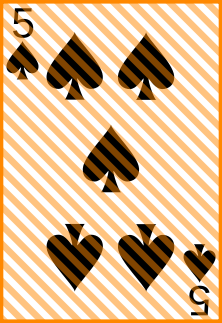 |  |  | 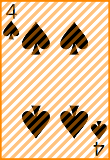 |  |  |

**Troisième passage - Échange** : on échange le 5 et le 4. Le 4 est maintenant à
sa position finale.

|                Carte 1                |                Carte 2                |                Carte 3                |            Carte 4             |            Carte 5             |            Carte 6             |            Carte 7             |            Carte 8             |
| :-----------------------------------: | :-----------------------------------: | :-----------------------------------: | :----------------------------: | :----------------------------: | :----------------------------: | :----------------------------: | :----------------------------: |
|  |  |  |  |  |  |  |  |

**Visualisation complète de l'algorithme**

Voici maintenant toutes les étapes du tri par sélection du début à la fin :

|          Étape          |                 Carte 1                 |                 Carte 2                 |                 Carte 3                 |                 Carte 4                 |                 Carte 5                 |                 Carte 6                 |                 Carte 7                 |                Carte 8                |
| :---------------------: | :-------------------------------------: | :-------------------------------------: | :-------------------------------------: | :-------------------------------------: | :-------------------------------------: | :-------------------------------------: | :-------------------------------------: | :-----------------------------------: |
|         Initial         |           |           |           |           |           |           |           |         |
|   Pass. 1 : Chercher    |  |           |           |  |           |           |           |         |
|   Pass. 1 : Échanger    |    |           |           |           |           |           |           |         |
|   Pass. 2 : Chercher    |    |  |           |           |           |           |           |         |
| Pass. 2 : Déjà en place |    |    |           |           |           |           |           |         |
|   Pass. 3 : Chercher    |    |    |  |           |           |  |           |         |
|   Pass. 3 : Échanger    |    |    |    |           |           |           |           |         |
|   Pass. 4 : Chercher    |    |    |    |  |           |  |           |         |
|   Pass. 4 : Échanger    |    |    |    |    |           |           |           |         |
|   Pass. 5 : Chercher    |    |    |    |    |  |           |  |         |
|   Pass. 5 : Échanger    |    |    |    |    |    |           |           |         |
|   Pass. 6 : Chercher    |    |    |    |    |    |  |           |         |
| Pass. 6 : Déjà en place |    |    |    |    |    |    |           |         |
|   Pass. 7 : Chercher    |    |    |    |    |    |    |  |         |
| Pass. 7 : Déjà en place |    |    |    |    |    |    |    |         |
|         Terminé         |    |    |    |    |    |    |    |  |

**Réflexion sur le tri par sélection**

Pourquoi cet algorithme s'appelle-t-il "tri par sélection" ? Parce qu'à chaque
étape, on **sélectionne** le plus petit élément parmi ceux qui restent à trier.

L'avantage de cet algorithme est sa simplicité conceptuelle : il fait exactement
ce qu'un humain ferait intuitivement. Son inconvénient est qu'il doit toujours
parcourir tous les éléments restants pour trouver le minimum, même si la liste
est presque triée. Le nombre de comparaisons est toujours le même, quel que soit
l'état initial de la liste.

### Tri à bulles (bubble sort)

Le tri à bulles tire son nom du fait que les plus grandes valeurs "remontent"
progressivement vers la fin de la liste, comme des bulles d'air dans l'eau.

Le principe :

1. On parcourt la liste et on compare chaque paire d'éléments adjacents.
2. Si deux éléments adjacents sont dans le mauvais ordre, on les échange.
3. On répète le processus jusqu'à ce qu'aucun échange ne soit nécessaire.

**Visualisation avec des cartes**

Partons à nouveau de nos cartes désordonnées :

|            Carte 1             |            Carte 2             |            Carte 3             |            Carte 4             |            Carte 5             |            Carte 6             |            Carte 7             |            Carte 8             |
| :----------------------------: | :----------------------------: | :----------------------------: | :----------------------------: | :----------------------------: | :----------------------------: | :----------------------------: | :----------------------------: |
|  |  |  |  |  |  |  |  |

**Premier passage - Étape 1** : on compare les cartes 1 et 2 (7 et 3). Le 7 est
plus grand que le 3, donc on les échange.

|                 Carte 1                 |                 Carte 2                 |            Carte 3             |            Carte 4             |            Carte 5             |            Carte 6             |            Carte 7             |            Carte 8             |
| :-------------------------------------: | :-------------------------------------: | :----------------------------: | :----------------------------: | :----------------------------: | :----------------------------: | :----------------------------: | :----------------------------: |
|  |  |  |  |  |  |  |  |

**Premier passage - Étape 2** : on compare les cartes 2 et 3 (7 et 5). Le 7 est
plus grand que le 5, donc on les échange.

|            Carte 1             |                 Carte 2                 |                 Carte 3                 |            Carte 4             |            Carte 5             |            Carte 6             |            Carte 7             |            Carte 8             |
| :----------------------------: | :-------------------------------------: | :-------------------------------------: | :----------------------------: | :----------------------------: | :----------------------------: | :----------------------------: | :----------------------------: |
|  |  |  |  |  |  |  |  |

**Premier passage - Étape 3** : on compare les cartes 3 et 4 (7 et 2). Le 7 est
plus grand que le 2, donc on les échange.

|            Carte 1             |            Carte 2             |                 Carte 3                 |                 Carte 4                 |            Carte 5             |            Carte 6             |            Carte 7             |            Carte 8             |
| :----------------------------: | :----------------------------: | :-------------------------------------: | :-------------------------------------: | :----------------------------: | :----------------------------: | :----------------------------: | :----------------------------: |
|  |  |  |  |  |  |  |  |

|    Étape     |                 Carte 1                 |                 Carte 2                 |                 Carte 3                 |                 Carte 4                 |                 Carte 5                 |                 Carte 6                 |                 Carte 7                 |                 Carte 8                 |
| :----------: | :-------------------------------------: | :-------------------------------------: | :-------------------------------------: | :-------------------------------------: | :-------------------------------------: | :-------------------------------------: | :-------------------------------------: | :-------------------------------------: |
| Comparer 7-8 |           |           |           |  |  |           |           |           |
| Comparer 8-4 |           |           |           |           |  |  |           |           |
| Comparer 8-6 |           |           |           |           |           |  |  |           |
| Comparer 8-9 |           |           |           |           |           |           |  |  |
| Comparer 3-5 |  |  |           |           |           |           |           |    |
| Comparer 5-2 |           |  |  |           |           |           |           |    |
| Comparer 5-7 |           |           |  |  |           |           |           |    |
| Comparer 7-4 |           |           |           |  |  |           |           |    |
| Comparer 7-6 |           |           |           |           |  |  |           |    |
| Comparer 7-8 |           |           |           |           |           |  |  |    |
| Comparer 3-2 |  |  |           |           |           |           |    |    |
| Comparer 3-5 |           |  |  |           |           |           |    |    |
| Comparer 5-4 |           |           |  |  |           |           |    |    |
| Comparer 5-6 |           |           |           |  |  |           |    |    |
| Comparer 6-7 |           |           |           |           |  |  |    |    |
| Comparer 2-3 |  |  |           |           |           |    |    |    |
| Comparer 3-4 |           |  |  |           |           |    |    |    |
| Comparer 4-5 |           |           |  |  |           |    |    |    |
| Comparer 5-6 |           |           |           |  |  |    |    |    |
| Comparer 2-3 |  |  |           |           |    |    |    |    |
| Comparer 3-4 |           |  |  |           |    |    |    |    |
| Comparer 4-5 |           |           |  |  |    |    |    |    |
| Comparer 2-3 |  |  |           |    |    |    |    |    |
| Comparer 3-4 |           |  |  |    |    |    |    |    |
| Comparer 2-3 |  |  |    |    |    |    |    |    |
|   Finalisé   |    |    |    |    |    |    |    |    |

<details>
<summary>Tableau récapitulatif des comparaisons</summary>

|    Étape     | Carte 1 | Carte 2 | Carte 3 | Carte 4 | Carte 5 | Carte 6 | Carte 7 | Carte 8 |
| :----------: | :-----: | :-----: | :-----: | :-----: | :-----: | :-----: | :-----: | :-----: |
| Comparer 7-8 |    3    |    5    |    2    | **(7)** | **(8)** |    4    |    6    |    9    |
| Comparer 8-4 |    3    |    5    |    2    |    7    | **(4)** | **(8)** |    6    |    9    |
| Comparer 8-6 |    3    |    5    |    2    |    7    |    4    | **(6)** | **(8)** |    9    |
| Comparer 8-9 |    3    |    5    |    2    |    7    |    4    |    6    | **(8)** | **(9)** |
| Comparer 3-5 | **(3)** | **(5)** |    2    |    7    |    4    |    6    |    8    |  _{9}_  |
| Comparer 5-2 |    3    | **(5)** | **(2)** |    7    |    4    |    6    |    8    |  _{9}_  |
| Comparer 5-7 |    3    |    2    | **(5)** | **(7)** |    4    |    6    |    8    |  _{9}_  |
| Comparer 7-4 |    3    |    2    |    5    | **(7)** | **(4)** |    6    |    8    |  _{9}_  |
| Comparer 7-6 |    3    |    2    |    5    |    4    | **(6)** | **(7)** |    8    |  _{9}_  |
| Comparer 7-8 |    3    |    2    |    5    |    4    |    6    | **(7)** | **(8)** |  _{9}_  |
| Comparer 3-2 | **(2)** | **(3)** |    5    |    4    |    6    |    7    |  _{8}_  |  _{9}_  |
| Comparer 3-5 |    2    | **(3)** | **(5)** |    4    |    6    |    7    |  _{8}_  |  _{9}_  |
| Comparer 5-4 |    2    |    3    | **(4)** | **(5)** |    6    |    7    |  _{8}_  |  _{9}_  |
| Comparer 5-6 |    2    |    3    |    4    | **(5)** | **(6)** |    7    |  _{8}_  |  _{9}_  |
| Comparer 6-7 |    2    |    3    |    4    |    5    | **(6)** | **(7)** |  _{8}_  |  _{9}_  |
| Comparer 2-3 | **(2)** | **(3)** |    4    |    5    |    6    |  _{7}_  |  _{8}_  |  _{9}_  |

</details>

**Réflexion sur le tri à bulles**

Le tri à bulles a la réputation d'être l'algorithme de tri le moins efficace
parmi les algorithmes classiques. Il effectue de nombreux échanges inutiles et
est rarement utilisé en pratique pour des données réelles.

Cependant, il a un avantage : il est très simple à comprendre et à implémenter.
C'est pourquoi il est souvent enseigné comme premier algorithme de tri, même si
on ne devrait jamais l'utiliser en production. Sa principale valeur est
pédagogique.

## Les algorithmes de tri avancés

Les algorithmes de tri avancés utilisent des stratégies plus sophistiquées. Ils
reposent souvent sur le principe de "diviser pour régner" : diviser un problème
complexe en sous-problèmes plus simples, résoudre ces sous-problèmes, puis
combiner les solutions.

### Tri rapide (quicksort)

Le tri rapide est l'un des algorithmes de tri les plus utilisés en pratique.
Quand vous pensez au tri rapide, pensez au mot **pivot**.

#### Comprendre le pivot

Un pivot est simplement l'un des éléments du tableau qui respecte trois
conditions après le partitionnement :

1. **Le pivot est à sa position finale** dans le tableau trié.
2. **Tous les éléments à gauche sont plus petits** que le pivot.
3. **Tous les éléments à droite sont plus grands** que le pivot.

Le tri rapide fonctionne ainsi : on choisit un pivot, on réorganise le tableau
pour respecter ces trois conditions, puis on applique récursivement le même
processus aux sous-tableaux de gauche et de droite.

#### Algorithme de partitionnement détaillé

Regardons un exemple complet. Voici notre tableau initial :

|            Carte 1             |            Carte 2             |            Carte 3             |            Carte 4             |            Carte 5             |            Carte 6             |            Carte 7             |            Carte 8             |
| :----------------------------: | :----------------------------: | :----------------------------: | :----------------------------: | :----------------------------: | :----------------------------: | :----------------------------: | :----------------------------: |
|  | 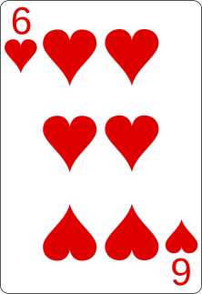 | 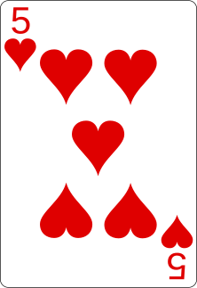 |  |  |  |  | 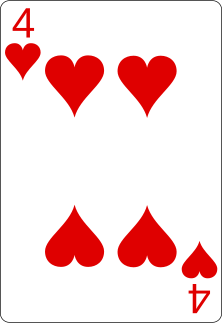 |

**Étape 1 : Choix du pivot**

Choisissons le dernier élément comme pivot : le 4. C'est une stratégie simple et
courante. Le pivot reste à sa position pour le moment.

|            Carte 1             |            Carte 2             |            Carte 3             |            Carte 4             |            Carte 5             |            Carte 6             |            Carte 7             |                 Carte 8                 |
| :----------------------------: | :----------------------------: | :----------------------------: | :----------------------------: | :----------------------------: | :----------------------------: | :----------------------------: | :-------------------------------------: |
|  |  |  |  |  |  |  | 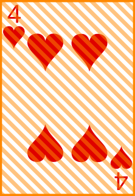 |

**Étape 2 : Chercher l'élément de gauche et l'élément de droite**

Nous allons chercher **deux éléments** :

- **L'élément de gauche** : le premier élément en partant de la gauche qui est
  **plus grand** que le pivot (4).
- **L'élément de droite** : le premier élément en partant de la droite (sans
  compter le pivot) qui est **plus petit** que le pivot (4).

En partant de la gauche : 2 est < 4, on continue. Le 6 est > 4, c'est notre
**élément de gauche** !

En partant de la droite : 9 est > 4, on continue. Le 3 est < 4, c'est notre
**élément de droite** !

|            Carte 1             |                 Carte 2                 |            Carte 3             |            Carte 4             |            Carte 5             |                 Carte 6                 |            Carte 7             |                 Carte 8                 |
| :----------------------------: | :-------------------------------------: | :----------------------------: | :----------------------------: | :----------------------------: | :-------------------------------------: | :----------------------------: | :-------------------------------------: |
|  | 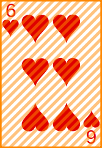 |  |  |  |  |  |  |

**Étape 3 : Échanger l'élément de gauche avec l'élément de droite**

|            Carte 1             |            Carte 2             |            Carte 3             |            Carte 4             |            Carte 5             |            Carte 6             |            Carte 7             |                 Carte 8                 |
| :----------------------------: | :----------------------------: | :----------------------------: | :----------------------------: | :----------------------------: | :----------------------------: | :----------------------------: | :-------------------------------------: |
|  |  |  |  |  |  |  |  |

**Étape 4 : Répéter le processus**

Cherchons à nouveau :

- **Élément de gauche** : en partant après le 3, le 5 est > 4, c'est notre
  élément de gauche.
- **Élément de droite** : en partant avant le 6, on ne trouve rien de < 4.

Quand les indices se croisent, on arrête la recherche !

|            Carte 1             |            Carte 2             |                 Carte 3                 |            Carte 4             |            Carte 5             |            Carte 6             |            Carte 7             |                 Carte 8                 |
| :----------------------------: | :----------------------------: | :-------------------------------------: | :----------------------------: | :----------------------------: | :----------------------------: | :----------------------------: | :-------------------------------------: |
|  |  | 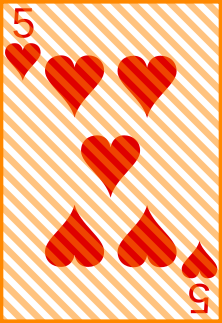 |  |  |  |  |  |

**Étape 5 : Placer le pivot à sa position finale**

Quand les indices se croisent, on échange le pivot avec l'élément de gauche :

|            Carte 1             |            Carte 2             |                Carte 3                |            Carte 4             |            Carte 5             |            Carte 6             |            Carte 7             |            Carte 8             |
| :----------------------------: | :----------------------------: | :-----------------------------------: | :----------------------------: | :----------------------------: | :----------------------------: | :----------------------------: | :----------------------------: |
|  |  | 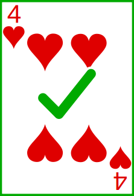 |  |  |  |  |  |

**Le 4 est maintenant à sa position finale !** Vérifions nos trois conditions :

- ✓ Le 4 est dans sa position finale (index 2).
- ✓ Tous les éléments à gauche (2, 3) sont plus petits que 4.
- ✓ Tous les éléments à droite (8, 7, 6, 9, 5) sont plus grands que 4.

Nous avons maintenant deux sous-tableaux à trier : [2, 3] et [8, 7, 6, 9, 5].

#### Application récursive : Sous-tableau de droite [8, 7, 6, 9, 5]

Répétons le processus avec la partition plus grande. Pivot : le 5 (dernier
élément).

|            Carte 1             |            Carte 2             |                Carte 3                |            Carte 4             |            Carte 5             |            Carte 6             |            Carte 7             |                 Carte 8                 |
| :----------------------------: | :----------------------------: | :-----------------------------------: | :----------------------------: | :----------------------------: | :----------------------------: | :----------------------------: | :-------------------------------------: |
|  |  |  |  |  |  |  |  |

**Chercher éléments de gauche et droite** :

- Élément de gauche : 8 est > 5.
- Élément de droite : aucun élément < 5 avant le 8.

Les indices se croisent immédiatement !

**Placer le pivot** : échanger le 5 avec le 8.

|            Carte 1             |            Carte 2             |                Carte 3                |                Carte 4                |            Carte 5             |            Carte 6             |            Carte 7             |            Carte 8             |
| :----------------------------: | :----------------------------: | :-----------------------------------: | :-----------------------------------: | :----------------------------: | :----------------------------: | :----------------------------: | :----------------------------: |
|  |  |  | 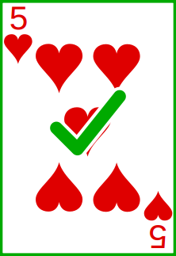 |  |  |  |  |

Le 5 est à sa position finale ! Maintenant nous avons le 4 et le 5 correctement
placés. Sous-tableaux restants : [2, 3] et [7, 6, 9, 8].

#### Continuons avec [7, 6, 9, 8]

Pivot : le 8 (dernier élément).

|            Carte 1             |            Carte 2             |                Carte 3                |                Carte 4                |            Carte 5             |            Carte 6             |            Carte 7             |                 Carte 8                 |
| :----------------------------: | :----------------------------: | :-----------------------------------: | :-----------------------------------: | :----------------------------: | :----------------------------: | :----------------------------: | :-------------------------------------: |
|  |  |  |  |  |  |  |  |

**Chercher** :

- Élément de gauche : 9 est > 8.
- Élément de droite : 6 est < 8.

**Échanger le 9 et le 6** :

|            Carte 1             |            Carte 2             |                Carte 3                |                Carte 4                |            Carte 5             |            Carte 6             |                Carte 7                |            Carte 8             |
| :----------------------------: | :----------------------------: | :-----------------------------------: | :-----------------------------------: | :----------------------------: | :----------------------------: | :-----------------------------------: | :----------------------------: |
|  |  |  |  |  |  |  |  |

Les indices se croisent, on place le pivot. Le 8 est déjà à sa position !

Sous-tableaux : [7, 6] et [9]. Le 9 est seul, donc trié.

|            Carte 1             |            Carte 2             |                Carte 3                |                Carte 4                |            Carte 5             |            Carte 6             |                Carte 7                |                Carte 8                |
| :----------------------------: | :----------------------------: | :-----------------------------------: | :-----------------------------------: | :----------------------------: | :----------------------------: | :-----------------------------------: | :-----------------------------------: |
|  |  |  |  |  |  |  |  |

#### Trions [7, 6]

Pivot : le 6 (dernier élément). Le 7 est > 6, il devient l'élément de gauche.
Pas d'élément de droite. Indices croisés !

**Échanger le pivot avec l'élément de gauche** :

|            Carte 1             |            Carte 2             |                Carte 3                |                Carte 4                |                Carte 5                |                Carte 6                |                Carte 7                |                Carte 8                |
| :----------------------------: | :----------------------------: | :-----------------------------------: | :-----------------------------------: | :-----------------------------------: | :-----------------------------------: | :-----------------------------------: | :-----------------------------------: |
|  |  |  |  | 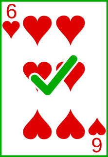 |  |  |  |

#### Trions [2, 3]

Pivot : le 3 (dernier élément). Le 2 est < 3, aucun élément de gauche. Indices
croisés ! Le pivot reste en place.

|                Carte 1                |                Carte 2                |                Carte 3                |                Carte 4                |                Carte 5                |                Carte 6                |                Carte 7                |                Carte 8                |
| :-----------------------------------: | :-----------------------------------: | :-----------------------------------: | :-----------------------------------: | :-----------------------------------: | :-----------------------------------: | :-----------------------------------: | :-----------------------------------: |
|  |  |  |  |  |  |  |  |

**Terminé !** Le tableau est maintenant complètement trié.

#### Réflexion sur le tri rapide

**Stratégies de choix du pivot** : Le choix du pivot est crucial. Une méthode
populaire est la **médiane de trois** : on examine le premier, le milieu et le
dernier élément, on les trie, et on choisit celui du milieu comme pivot. Cette
méthode donne généralement un pivot proche de la médiane réelle du tableau.

**Stabilité** : Le tri rapide n'est **pas stable** (voir la section sur la
notion de tri stable) : deux éléments égaux peuvent changer d'ordre relatif
pendant le tri.

**Avantage** : Le tri rapide trie "sur place" (in-place), c'est-à-dire qu'il ne
nécessite pas de copier tous les éléments dans une nouvelle structure de
données, ce qui économise de la mémoire.

### Tri fusion (mergesort)

Le tri fusion est un algorithme élégant qui illustre parfaitement le principe de
**diviser pour régner** (divide and conquer). Nous allons décomposer notre
problème en sous-problèmes plus petits pour le résoudre. Historiquement, il a
été inventé par John von Neumann en 1945, l'un des pionniers de l'informatique.

Le principe :

1. **Diviser** : couper continuellement le tableau en deux jusqu'à avoir des
   éléments individuels.
2. **Conquérir** : fusionner les petits tableaux triés en tableaux plus grands,
   toujours triés.
3. Une fois tous les éléments fusionnés, le tableau est complètement trié.

#### Étape 1 : Division (Divide)

Nous allons continuellement diviser notre tableau en deux jusqu'à avoir des
éléments individuels. Voici notre tableau de départ :

|            Carte 1             |            Carte 2             |            Carte 3             |            Carte 4             |            Carte 5             |            Carte 6             |            Carte 7             |            Carte 8             |
| :----------------------------: | :----------------------------: | :----------------------------: | :----------------------------: | :----------------------------: | :----------------------------: | :----------------------------: | :----------------------------: |
|  |  |  |  |  |  |  |  |

**Division 1** : couper en deux moitiés de 4 cartes.

**Division 2** : couper chaque moitié en deux groupes de 2 cartes.

**Division 3** : couper chaque groupe en éléments individuels.

Nos cartes sont maintenant décomposées en éléments individuels :

| 7 | 3 | 9 | 2 | 8 | 4 | 6 | 5 |

**Note importante** : en pratique, lors de l'implémentation en code, ces étapes
se font dans un ordre différent à cause de la récursion. Mais cet ordre est plus
clair pour l'apprentissage.

#### Étape 2 : Fusion (Conquer) - Premiers niveaux

Nous sommes maintenant prêts à trier ! Nous allons examiner les éléments
individuels, comparer leurs valeurs, et les fusionner dans des tableaux
temporaires triés.

**Fusion 1 : Fusionner [7] et [3]**

Source :

|                 Carte 1                 |                 Carte 2                 |            Carte 3             |            Carte 4             |            Carte 5             |            Carte 6             |            Carte 7             |            Carte 8             |
| :-------------------------------------: | :-------------------------------------: | :----------------------------: | :----------------------------: | :----------------------------: | :----------------------------: | :----------------------------: | :----------------------------: |
|  |  |  |  |  |  |  |  |

Comparer 7 et 3 : 3 < 7, donc 3 en premier.

Résultat :

|            Carte 1             |            Carte 2             |         Carte 3         |         Carte 4         |         Carte 5         |         Carte 6         |         Carte 7         |         Carte 8         |
| :----------------------------: | :----------------------------: | :---------------------: | :---------------------: | :---------------------: | :---------------------: | :---------------------: | :---------------------: |
|  |  |  |  |  |  |  |  |

**Fusion 2 : Fusionner [9] et [2]**

Source :

|            Carte 1             |            Carte 2             |                 Carte 3                 |                 Carte 4                 |            Carte 5             |            Carte 6             |            Carte 7             |            Carte 8             |
| :----------------------------: | :----------------------------: | :-------------------------------------: | :-------------------------------------: | :----------------------------: | :----------------------------: | :----------------------------: | :----------------------------: |
|  |  |  |  |  |  |  |  |

Comparer 9 et 2 : 2 < 9, donc 2 en premier.

Résultat :

|            Carte 1             |            Carte 2             |            Carte 3             |            Carte 4             |         Carte 5         |         Carte 6         |         Carte 7         |         Carte 8         |
| :----------------------------: | :----------------------------: | :----------------------------: | :----------------------------: | :---------------------: | :---------------------: | :---------------------: | :---------------------: |
|  |  |  |  |  |  |  |  |

**Fusion 3 : Fusionner [8] et [4]**

Source :

|            Carte 1             |            Carte 2             |            Carte 3             |            Carte 4             |                 Carte 5                 |                 Carte 6                 |            Carte 7             |            Carte 8             |
| :----------------------------: | :----------------------------: | :----------------------------: | :----------------------------: | :-------------------------------------: | :-------------------------------------: | :----------------------------: | :----------------------------: |
|  |  |  |  |  |  |  |  |

Comparer 8 et 4 : 4 < 8, donc 4 en premier.

Résultat :

|            Carte 1             |            Carte 2             |            Carte 3             |            Carte 4             |            Carte 5             |            Carte 6             |         Carte 7         |         Carte 8         |
| :----------------------------: | :----------------------------: | :----------------------------: | :----------------------------: | :----------------------------: | :----------------------------: | :---------------------: | :---------------------: |
|  |  |  |  |  |  |  |  |

**Fusion 4 : Fusionner [6] et [5]**

Source :

|            Carte 1             |            Carte 2             |            Carte 3             |            Carte 4             |            Carte 5             |            Carte 6             |                 Carte 7                 |                 Carte 8                 |
| :----------------------------: | :----------------------------: | :----------------------------: | :----------------------------: | :----------------------------: | :----------------------------: | :-------------------------------------: | :-------------------------------------: |
|  |  |  |  |  |  |  |  |

Comparer 6 et 5 : 5 < 6, donc 5 en premier.

Résultat :

|            Carte 1             |            Carte 2             |            Carte 3             |            Carte 4             |            Carte 5             |            Carte 6             |            Carte 7             |            Carte 8             |
| :----------------------------: | :----------------------------: | :----------------------------: | :----------------------------: | :----------------------------: | :----------------------------: | :----------------------------: | :----------------------------: |
|  |  |  |  |  |  |  |  |

Nous avons maintenant quatre paires triées : [3, 7], [2, 9], [4, 8], [5, 6].

#### Étape 3 : Fusion - Niveau intermédiaire

Les tableaux temporaires de paires sont triés, mais il reste du travail.
Remontons la pile de récursion et continuons. Nous allons fusionner nos petits
tableaux en tableaux plus grands, en insérant les éléments dans l'ordre correct.

**Fusion 5 : Fusionner [3, 7] et [2, 9]**

Source :

|                 Carte 1                 |            Carte 2             |                 Carte 3                 |            Carte 4             |            Carte 5             |            Carte 6             |            Carte 7             |            Carte 8             |
| :-------------------------------------: | :----------------------------: | :-------------------------------------: | :----------------------------: | :----------------------------: | :----------------------------: | :----------------------------: | :----------------------------: |
|  |  |  |  |  |  |  |  |

Comparer 3 et 2 : 2 < 3, donc 2 en premier.

Résultat :

|            Carte 1             |         Carte 2         |         Carte 3         |         Carte 4         |         Carte 5         |         Carte 6         |         Carte 7         |         Carte 8         |
| :----------------------------: | :---------------------: | :---------------------: | :---------------------: | :---------------------: | :---------------------: | :---------------------: | :---------------------: |
|  |  |  |  |  |  |  |  |

Source :

|                 Carte 1                 |            Carte 2             |         Carte 3         |            Carte 4             |            Carte 5             |            Carte 6             |            Carte 7             |            Carte 8             |
| :-------------------------------------: | :----------------------------: | :---------------------: | :----------------------------: | :----------------------------: | :----------------------------: | :----------------------------: | :----------------------------: |
|  |  |  |  |  |  |  |  |

Le 2 est placé. Comparer 3 et 9 : 3 < 9, donc 3 ensuite.

Résultat :

|            Carte 1             |            Carte 2             |         Carte 3         |         Carte 4         |         Carte 5         |         Carte 6         |         Carte 7         |         Carte 8         |
| :----------------------------: | :----------------------------: | :---------------------: | :---------------------: | :---------------------: | :---------------------: | :---------------------: | :---------------------: |
|  |  |  |  |  |  |  |  |

Source :

|         Carte 1         |                 Carte 2                 |         Carte 3         |                 Carte 4                 |            Carte 5             |            Carte 6             |            Carte 7             |            Carte 8             |
| :---------------------: | :-------------------------------------: | :---------------------: | :-------------------------------------: | :----------------------------: | :----------------------------: | :----------------------------: | :----------------------------: |
|  |  |  |  |  |  |  |  |

Comparer 7 et 9 : 7 < 9, donc 7 ensuite. Puis le 9 reste.

Résultat :

|            Carte 1             |            Carte 2             |            Carte 3             |            Carte 4             |         Carte 5         |         Carte 6         |         Carte 7         |         Carte 8         |
| :----------------------------: | :----------------------------: | :----------------------------: | :----------------------------: | :---------------------: | :---------------------: | :---------------------: | :---------------------: |
|  |  |  |  |  |  |  |  |

**Fusion 6 : Fusionner [4, 8] et [5, 6]**

Source :

|            Carte 1             |            Carte 2             |            Carte 3             |            Carte 4             |                 Carte 5                 |            Carte 6             |                 Carte 7                 |            Carte 8             |
| :----------------------------: | :----------------------------: | :----------------------------: | :----------------------------: | :-------------------------------------: | :----------------------------: | :-------------------------------------: | :----------------------------: |
|  |  |  |  |  |  |  |  |

Comparer 4 et 5 : 4 < 5, donc 4 en premier.

Résultat :

|            Carte 1             |            Carte 2             |            Carte 3             |            Carte 4             |            Carte 5             |         Carte 6         |         Carte 7         |         Carte 8         |
| :----------------------------: | :----------------------------: | :----------------------------: | :----------------------------: | :----------------------------: | :---------------------: | :---------------------: | :---------------------: |
|  |  |  |  |  |  |  |  |

Source :

|            Carte 1             |            Carte 2             |            Carte 3             |            Carte 4             |         Carte 5         |                 Carte 6                 |                 Carte 7                 |            Carte 8             |
| :----------------------------: | :----------------------------: | :----------------------------: | :----------------------------: | :---------------------: | :-------------------------------------: | :-------------------------------------: | :----------------------------: |
|  |  |  |  |  |  |  |  |

Comparer 8 et 5 : 5 < 8, donc 5 ensuite.

Résultat :

|            Carte 1             |            Carte 2             |            Carte 3             |            Carte 4             |            Carte 5             |            Carte 6             |         Carte 7         |         Carte 8         |
| :----------------------------: | :----------------------------: | :----------------------------: | :----------------------------: | :----------------------------: | :----------------------------: | :---------------------: | :---------------------: |
|  |  |  |  |  |  |  |  |

Source :

|            Carte 1             |            Carte 2             |            Carte 3             |            Carte 4             |         Carte 5         |         Carte 6         |                 Carte 7                 |                 Carte 8                 |
| :----------------------------: | :----------------------------: | :----------------------------: | :----------------------------: | :---------------------: | :---------------------: | :-------------------------------------: | :-------------------------------------: |
|  |  |  |  |  |  |  |  |

Comparer 6 et 8 : 6 < 8, donc 6. Puis 8 reste.

Résultat :

|            Carte 1             |            Carte 2             |            Carte 3             |            Carte 4             |            Carte 5             |            Carte 6             |            Carte 7             |            Carte 8             |
| :----------------------------: | :----------------------------: | :----------------------------: | :----------------------------: | :----------------------------: | :----------------------------: | :----------------------------: | :----------------------------: |
|  |  |  |  |  |  |  |  |

Nous avons maintenant deux groupes triés : [2, 3, 7, 9] et [4, 5, 6, 8].

#### Étape 4 : Fusion finale

Une dernière fusion et nous aurons notre tableau trié ! Fusionnons [2, 3, 7, 9]
et [4, 5, 6, 8].

Source :

|                 Carte 1                 |            Carte 2             |            Carte 3             |            Carte 4             |                 Carte 5                 |            Carte 6             |            Carte 7             |            Carte 8             |
| :-------------------------------------: | :----------------------------: | :----------------------------: | :----------------------------: | :-------------------------------------: | :----------------------------: | :----------------------------: | :----------------------------: |
|  |  |  |  |  |  |  |  |

Comparer 2 et 4 : 2 < 4, prendre le 2. Comparer 3 et 4 : 3 < 4, prendre le 3.
Comparer 7 et 4 : 4 < 7, prendre le 4. Comparer 7 et 5 : 5 < 7, prendre le 5.
Comparer 7 et 6 : 6 < 7, prendre le 6. Comparer 7 et 8 : 7 < 8, prendre le 7.
Prendre le 8. Prendre le 9.

Résultat final :

|                Carte 1                |                Carte 2                |                Carte 3                |                Carte 4                |                Carte 5                |                Carte 6                |                Carte 7                |                Carte 8                |
| :-----------------------------------: | :-----------------------------------: | :-----------------------------------: | :-----------------------------------: | :-----------------------------------: | :-----------------------------------: | :-----------------------------------: | :-----------------------------------: |
|  |  |  |  |  |  |  |  |

**C'est terminé !** Notre tableau est maintenant trié.

#### Visualisation de la récursion

```
[7, 3, 9, 2, 8, 4, 6, 5]
       /              \
[7, 3, 9, 2]      [8, 4, 6, 5]
   /      \          /      \
[7, 3]  [9, 2]    [8, 4]  [6, 5]
 /  \    /  \      /  \    /  \
[7] [3] [9] [2]  [8] [4] [6] [5]
 \  /    \  /      \  /    \  /
[3, 7]  [2, 9]    [4, 8]  [5, 6]
   \      /          \      /
[2, 3, 7, 9]      [4, 5, 6, 8]
       \              /
    [2, 3, 4, 5, 6, 7, 8, 9]
```

#### Réflexion sur le tri fusion

**Stabilité** : Le tri fusion est **stable** (voir la section sur la notion de
tri stable) : deux éléments égaux conservent leur ordre relatif d'origine.

**Efficacité prévisible** : Contrairement au tri rapide, le tri fusion trie de
manière constante, quelle que soit la distribution initiale des données.

**Inconvénient** : Le tri fusion nécessite de la mémoire supplémentaire pour
créer les tableaux temporaires lors de la fusion. Ce n'est pas un tri "sur
place" (in-place). Cela peut être problématique pour de très grandes listes ou
dans des environnements avec peu de mémoire disponible.

**Utilisation** : Le tri fusion est souvent utilisé quand on a besoin d'un tri
stable et prévisible, ou quand on trie des données accessibles séquentiellement
(par exemple, des données stockées sur disque dur ou provenant d'un flux
réseau).

## Conclusion

Le tri de données est une opération fondamentale en programmation, omniprésente
dans nos applications quotidiennes. À travers l'exemple concret des cartes à
jouer, nous avons exploré différentes façons d'aborder ce problème.

Les algorithmes de tri simples (sélection, insertion, bulles) nous apprennent
que même un problème simple peut être résolu de multiples façons, chacune avec
ses avantages et ses inconvénients. Ils nous montrent aussi que l'intuition
humaine peut être traduite en algorithmes, mais que ce qui semble naturel n'est
pas forcément le plus efficace.

Les algorithmes de tri avancés (quicksort, mergesort) illustrent des concepts
plus sophistiqués comme le principe de "diviser pour régner". Ils nous
enseignent qu'investir du temps dans une stratégie plus complexe peut apporter
des avantages, surtout pour de grandes quantités de données.

Au-delà des algorithmes eux-mêmes, le tri nous enseigne des leçons plus
générales : l'importance de choisir le bon outil pour le bon contexte, la
nécessité de comprendre les compromis entre simplicité et efficacité, et la
valeur d'une bonne abstraction pour rendre notre code flexible et maintenable.

## Aller plus loin

> [!NOTE]
>
> Cette section contient des informations complémentaires pour les personnes qui
> souhaitent approfondir leurs connaissances. Ces notions ne sont pas requises
> pour les exercices.

### Complexité algorithmique et notation Big O

La **complexité algorithmique** mesure la quantité de ressources (temps ou
mémoire) qu'un algorithme utilise en fonction de la taille des données traitées.
On utilise la notation **Big O** pour décrire cette complexité.

#### Notation Big O

La notation Big O décrit le comportement d'un algorithme dans le pire cas.

**Complexités courantes** (du meilleur au pire) :

- $O(1)$ : **Temps constant** - l'algorithme prend toujours le même temps,
  quelle que soit la taille des données. Exemple : accéder à un élément d'un
  tableau par son index.
- $O(\log n)$ : **Temps logarithmique** - le temps augmente lentement même si
  les données augmentent beaucoup. Exemple : recherche binaire dans un tableau
  trié.
- $O(n)$ : **Temps linéaire** - le temps est proportionnel à la taille des
  données. Exemple : parcourir tous les éléments d'un tableau.
- $O(n \log n)$ : **Temps log-linéaire** - plus lent que linéaire, mais bien
  meilleur que quadratique. Exemple : tri fusion, tri rapide (cas moyen).
- $O(n^2)$ : **Temps quadratique** - le temps est proportionnel au carré de la
  taille des données. Exemple : tri par sélection, tri à bulles, tri rapide
  (pire cas).
- $O(2^n)$ : **Temps exponentiel** - le temps double à chaque ajout d'élément.
  Exemple : certains problèmes de combinatoire.

#### Complexité des algorithmes de tri

**Algorithmes de tri simples** :

- **Tri par sélection** : $O(n^2)$ dans tous les cas.
- **Tri à bulles** : $O(n^2)$ dans le pire cas, $O(n)$ dans le meilleur cas
  (liste déjà triée).

**Algorithmes de tri avancés** :

- **Tri rapide (quicksort)** : $O(n \log n)$ en moyenne, $O(n^2)$ dans le pire
  cas (mauvais choix de pivot). Le choix de la médiane de trois réduit
  considérablement les chances du pire cas.
- **Tri fusion (mergesort)** : $O(n \log n)$ dans tous les cas (meilleur, moyen,
  pire). Cette prévisibilité est un grand avantage.

**Exemple concret** : pour trier 1 000 000 d'éléments :

- Avec $O(n^2)$ : environ 1 000 000 000 000 (un trillion) d'opérations.
- Avec $O(n \log n)$ : environ 20 000 000 (vingt millions) d'opérations.

La différence est de **50 000 fois** plus rapide !

### Comparator<T> et Comparable<T> en Java

Java fournit deux interfaces pour définir comment comparer des objets :
`Comparable<T>` et `Comparator<T>`.

#### L'interface Comparable<T>

L'interface `Comparable<T>` permet à une classe de définir son **ordre
naturel**. Une classe qui implémente `Comparable<T>` doit définir la méthode
`compareTo(T other)`.

```java
public class Person implements Comparable<Person> {
    private String name;
    private int age;

    @Override
    public int compareTo(Person other) {
        // Comparaison par âge (ordre naturel)
        return Integer.compare(this.age, other.age);
    }
}
```

La méthode `compareTo()` retourne :

- **Un nombre négatif** si `this` est plus petit que `other`.
- **Zéro** si `this` est égal à `other`.
- **Un nombre positif** si `this` est plus grand que `other`.

Avec `Comparable<T>`, on peut trier directement avec `Collections.sort(list)` ou
`Arrays.sort(array)`.

**Avantage** : l'ordre est défini dans la classe elle-même.

**Inconvénient** : on ne peut définir qu'**un seul** ordre naturel.

#### L'interface Comparator<T>

L'interface `Comparator<T>` permet de définir des **ordres personnalisés**
externe à la classe. On peut créer plusieurs comparateurs pour la même classe.

```java
public class Person {
    private String name;
    private int age;

    // Getters...
}

// Comparateur par nom
Comparator<Person> byName = new Comparator<Person>() {
    @Override
    public int compare(Person p1, Person p2) {
        return p1.getName().compareTo(p2.getName());
    }
};

// Comparateur par âge
Comparator<Person> byAge = new Comparator<Person>() {
    @Override
    public int compare(Person p1, Person p2) {
        return Integer.compare(p1.getAge(), p2.getAge());
    }
};

// Utilisation
Collections.sort(personList, byName);  // Tri par nom
Collections.sort(personList, byAge);   // Tri par âge
```

**Avec les expressions lambda** (Java 8+) :

```java
Collections.sort(personList, (p1, p2) -> p1.getName().compareTo(p2.getName()));

// Ou encore plus simple avec Comparator.comparing()
Collections.sort(personList, Comparator.comparing(Person::getName));
Collections.sort(personList, Comparator.comparing(Person::getAge));
```

**Avantage** : on peut définir **plusieurs ordres** différents.

**Inconvénient** : nécessite de créer des comparateurs séparés.

#### Quand utiliser l'un ou l'autre ?

**Utiliser `Comparable<T>`** quand :

- Il existe un ordre naturel évident pour la classe.
- Cet ordre sera utilisé la plupart du temps.
- Exemple : trier des nombres, des dates, des chaînes alphabétiquement.

**Utiliser `Comparator<T>`** quand :

- On veut plusieurs façons de trier la même classe.
- L'ordre dépend du contexte d'utilisation.
- On ne peut pas modifier la classe originale.
- Exemple : trier des personnes par nom, âge, ou salaire selon les besoins.

## Exemples de code

Nous vous invitons à consulter les exemples de code associés à ce contenu de
cours pour mieux comprendre les concepts abordés.

Vous trouverez les exemples de code ici :
[Exemples de code](./01-exemples-de-code/).

## Exercices

Nous vous invitons maintenant à réaliser les exercices de la séance afin de
mettre en pratique les concepts abordés.

Vous trouverez les exercices et leur corrigé ici : [Exercices](./02-exercices/).

## À faire pour la prochaine séance

Chaque personne est libre de gérer son temps comme elle le souhaite. Cependant,
il est recommandé pour la prochaine séance de :

- Relire le support de cours si nécessaire.
- Relire les exemples de code et leur description pour bien comprendre les
  concepts.
- Finaliser les exercices qui n'ont pas été terminés en classe.

<!-- URLs -->

[licence]:
	https://github.com/heig-vd-progim-course/heig-vd-progim2-course/blob/main/LICENSE.md
[quiz-web]:
	https://heig-vd-progim-course.github.io/heig-vd-progim2-course/01-contenus-du-cours/07-algorithmes-de-tri/quiz.html
[presentation-web]:
	https://heig-vd-progim-course.github.io/heig-vd-progim2-course/01-contenus-du-cours/07-algorithmes-de-tri/presentation.html
[presentation-pdf]:
	https://heig-vd-progim-course.github.io/heig-vd-progim2-course/01-contenus-du-cours/07-algorithmes-de-tri/07-algorithmes-de-tri-presentation.pdf
