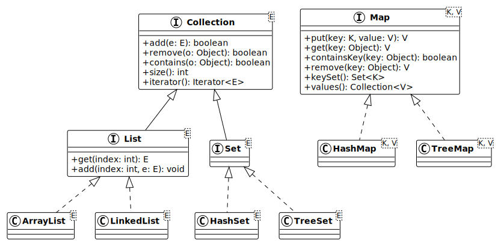

# Collections Java : Listes, sets et maps

V. Guidoux, avec l'aide de
[GitHub Copilot](https://github.com/features/copilot).

Ce travail est sous licence [CC BY-SA 4.0][licence].

> [!TIP]
>
> Voici quelques informations relatives à ce contenu.
>
> **Ressources annexes**
>
> - Autres formats du support de cours : [Présentation (web)][presentation-web]
>   · [Présentation (PDF)][presentation-pdf]
> - Exemples de code : [Accéder au contenu](./01-exemples-de-code/)
> - Exercices : [Accéder au contenu](./02-exercices/)
> - Mini-projet : [Accéder au contenu](./03-mini-projet/)
> - Quiz : [Accéder au contenu][quiz-web]
>
> **Objectifs**
>
> À l'issue de cette séance, les personnes qui étudient devraient être capables
> de :
>
> - Expliquer ce qu'est une collection et pourquoi les tableaux ne suffisent pas
>   toujours.
> - Différencier les trois types de collections : liste, ensemble et association
>   clé-valeur (map).
> - Sélectionner le type de collection approprié selon le besoin.
> - Utiliser les listes (`ArrayList`, `LinkedList`) pour stocker des éléments
>   ordonnés.
> - Utiliser les ensembles (`HashSet`, `TreeSet`) pour stocker des éléments
>   uniques.
> - Utiliser les maps (`HashMap`, `TreeMap`) pour associer des clés à des
>   valeurs.
> - Appliquer les opérations courantes sur les collections : ajout, suppression,
>   recherche et parcours.
> - Parcourir une collection avec une boucle `for-each` et un itérateur.
> - Différencier les implémentations d'une même interface en termes de
>   performance et de comportement.
> - Modifier une collection pendant l'itération de manière sécurisée.
> - Justifier le choix d'une collection dans une situation donnée.
>
> **Méthodes d'enseignement et d'apprentissage**
>
> Les méthodes d'enseignement et d'apprentissage utilisées pour animer la séance
> sont les suivantes :
>
> - Présentation magistrale.
> - Discussions collectives.
> - Travail en autonomie.
>
> **Méthodes d'évaluation**
>
> L'évaluation prend la forme d'exercices et d'un mini-projet à réaliser en
> autonomie en classe ou à la maison.
>
> L'évaluation se fait en utilisant les critères suivants :
>
> - Capacité à répondre avec justesse.
> - Capacité à argumenter.
> - Capacité à réaliser les tâches demandées.
> - Capacité à s'approprier les exemples de code.
> - Capacité à appliquer les exemples de code à des situations similaires.
>
> Les retours se font de la manière suivante :
>
> - Corrigé des exercices.
> - Corrigé du mini-projet.
>
> L'évaluation ne donne pas lieu à une note.

## Table des matières

- [Table des matières](#table-des-matières)
- [Objectifs](#objectifs)
- [Introduction : au-delà des tableaux](#introduction--au-delà-des-tableaux)
  - [Ce que les tableaux font bien](#ce-que-les-tableaux-font-bien)
  - [Les limites des tableaux](#les-limites-des-tableaux)
  - [Les collections : une réponse flexible](#les-collections--une-réponse-flexible)
- [Le framework Collections de Java](#le-framework-collections-de-java)
  - [Trois grandes familles](#trois-grandes-familles)
  - [Comment choisir ?](#comment-choisir-)
- [Les listes : des éléments ordonnés](#les-listes--des-éléments-ordonnés)
  - [Le concept de liste](#le-concept-de-liste)
  - [ArrayList : le choix courant](#arraylist--le-choix-courant)
  - [LinkedList : une autre approche](#linkedlist--une-autre-approche)
  - [ArrayList ou LinkedList ?](#arraylist-ou-linkedlist-)
- [Les ensembles : des éléments uniques](#les-ensembles--des-éléments-uniques)
  - [Le concept d'ensemble](#le-concept-densemble)
  - [HashSet : rapide et sans ordre](#hashset--rapide-et-sans-ordre)
  - [TreeSet : trié automatiquement](#treeset--trié-automatiquement)
  - [Pourquoi utiliser un ensemble ?](#pourquoi-utiliser-un-ensemble-)
- [Les maps : des associations clé-valeur](#les-maps--des-associations-clé-valeur)
  - [Le concept de map](#le-concept-de-map)
  - [HashMap : accès rapide par clé](#hashmap--accès-rapide-par-clé)
  - [TreeMap : triée par clés](#treemap--triée-par-clés)
- [Parcourir les collections](#parcourir-les-collections)
  - [La boucle for-each](#la-boucle-for-each)
  - [Les itérateurs](#les-itérateurs)
  - [Modifier une collection pendant l'itération](#modifier-une-collection-pendant-litération)
- [Choisir la bonne collection](#choisir-la-bonne-collection)
- [Conclusion](#conclusion)
- [Aller plus loin](#aller-plus-loin)
- [Exemples de code](#exemples-de-code)
- [Exercices](#exercices)
- [Mini-projet](#mini-projet)
- [À faire pour la prochaine séance](#à-faire-pour-la-prochaine-séance)

## Objectifs

Ce contenu de cours a pour objectifs de permettre aux personnes qui étudient de
comprendre ce que sont les collections en Java, pourquoi elles existent, et
comment choisir et utiliser le bon type de collection selon la situation. Nous
partirons des limites des tableaux pour découvrir progressivement les listes,
les ensembles et les maps.

La liste complète des objectifs est disponible dans la section _"Objectifs"_ du
bloc d'information en haut de ce contenu.

## Introduction : au-delà des tableaux

Depuis le début du cours, nous utilisons des tableaux (`int[]`, `String[]`,
`PlantBase[]`, etc.) pour stocker plusieurs éléments. Les tableaux sont un outil
fondamental, mais ils présentent des limites importantes dès que les besoins
deviennent un peu plus complexes.

### Ce que les tableaux font bien

Les tableaux sont simples et efficaces pour des situations bien définies :

- Stocker un nombre fixe d'éléments connus à l'avance.
- Accéder rapidement à un élément par son index.
- Travailler avec des types primitifs (`int[]`, `double[]`, etc.).

Par exemple, pour stocker les notes d'une classe de 25 personnes :

```java
double[] grades = new double[25];
grades[0] = 5.5;
grades[1] = 4.0;
```

<details>
<summary>Description du code</summary>

Déclaration et initialisation d'un tableau de type `double` nommé `grades` avec
une taille fixe de 25 éléments. Affectation de la valeur `5.5` à l'élément
d'index `0` du tableau. Affectation de la valeur `4.0` à l'élément d'index `1`
du tableau.

</details>

### Les limites des tableaux

Imaginons maintenant que nous gérons les plantes d'un jardin communautaire. Le
nombre de plantes change constamment : on en ajoute au printemps, on en retire
après la récolte. Avec un tableau, cela devient vite problématique :

```java
// On crée un tableau de 10 plantes
PlantBase[] plants = new PlantBase[10];
plants[0] = new VegetablePlant("Tomate", "Solanum", "2026-03-15", 0, 90);
plants[1] = new FlowerPlant("Rose", "Rosa", "2026-04-01", 0, "Rouge");

// Que se passe-t-il si on veut ajouter une 11e plante ?
// Il faut créer un nouveau tableau plus grand, copier tout, puis ajouter...
PlantBase[] newPlants = new PlantBase[20];
for (int i = 0; i < plants.length; i++) {
    newPlants[i] = plants[i];
}
plants = newPlants;
plants[2] = new TreePlant("Pommier", "Malus", "2026-02-01", 0, 4);
```

<details>
<summary>Description du code</summary>

Déclaration et initialisation d'un tableau de type `PlantBase` nommé `plants`
avec une taille fixe de 10 éléments. Affectation d'un nouvel objet
`VegetablePlant` à l'index `0` et d'un nouvel objet `FlowerPlant` à l'index `1`.
Déclaration d'un nouveau tableau `newPlants` de taille 20. Boucle `for` pour
copier chaque élément de `plants` vers `newPlants`. Réaffectation de la
référence `plants` vers le nouveau tableau `newPlants`. Affectation d'un nouvel
objet `TreePlant` à l'index `2`.

</details>

Ce code est laborieux. Chaque ajout ou suppression nécessite de gérer
manuellement la taille du tableau. De plus, supprimer un élément au milieu
oblige à décaler tous les éléments suivants. Et si l'on veut vérifier qu'une
plante existe déjà ? Il faut parcourir tout le tableau.

Les tableaux ne proposent aucune aide pour ces opérations courantes. C'est là
que les collections interviennent.

### Les collections : une réponse flexible

Une collection est une structure de données qui permet de stocker, organiser et
manipuler un groupe d'objets. Contrairement aux tableaux, les collections :

- S'adaptent automatiquement en taille.
- Offrent des méthodes pour ajouter, supprimer, rechercher des éléments.
- Proposent différentes façons d'organiser les données selon le besoin.

En Java, le framework Collections fournit un ensemble de classes et d'interfaces
prêtes à l'emploi pour répondre à ces besoins.

## Le framework Collections de Java

Le framework Collections de Java est un ensemble d'interfaces et de classes qui
se trouve dans le package `java.util`. Il repose sur une idée simple : séparer
ce qu'une collection fait (l'interface) de comment elle le fait
(l'implémentation).

Ce principe n'est pas nouveau pour nous. Dans les séances précédentes, nous
avons vu que les interfaces définissent un contrat (comme `Harvestable` ou
`Waterable`) et que les classes fournissent l'implémentation concrète. Le
framework Collections fonctionne exactement de la même manière.

### Trois grandes familles

Le framework organise les collections en trois grandes familles, chacune
répondant à un besoin différent :

| Famille           | Interface | Ce qu'elle fait                          | Exemple concret                                    |
| :---------------- | :-------- | :--------------------------------------- | :------------------------------------------------- |
| Liste             | `List`    | Stocke des éléments dans un ordre précis | La liste des plantes d'une parcelle.               |
| Ensemble          | `Set`     | Stocke des éléments uniques              | Les espèces de plantes disponibles dans le jardin. |
| Association (map) | `Map`     | Associe des clés à des valeurs           | Le nom d'une jardinière associé à sa parcelle.     |

> [!NOTE]
>
> L'interface `Map` ne fait techniquement pas partie de l'interface `Collection`
> de Java, mais elle fait partie du framework Collections au sens large. La
> distinction est subtile et principalement technique.

Le diagramme de classes ci-dessous illustre la hiérarchie des principales
interfaces et implémentations du framework Collections :



### Comment choisir ?

Avant de plonger dans le code, posons-nous les bonnes questions :

- Les éléments doivent-ils être ordonnés ? Si oui, une liste est probablement le
  bon choix.
- Les éléments doivent-ils être uniques ? Si oui, un ensemble est plus adapté.
- Faut-il retrouver un élément à partir d'une clé ? Si oui, une map est la
  solution.

Ces questions guideront notre choix tout au long de ce cours. Nous reviendrons
sur cette décision à la fin, une fois que nous aurons exploré chaque famille en
détail.

## Les listes : des éléments ordonnés

### Le concept de liste

Une liste est une collection ordonnée d'éléments. Chaque élément a une position
(un index) et les doublons sont autorisés. On peut accéder à un élément par son
index, ajouter des éléments n'importe où dans la liste, et en supprimer.

C'est le type de collection le plus proche du tableau, mais sans ses limitations
de taille fixe.

En Java, l'interface `List` définit le contrat commun à toutes les listes. Deux
implémentations principales existent : `ArrayList` et `LinkedList`.

### ArrayList : le choix courant

`ArrayList` stocke ses éléments dans un tableau interne qui grandit
automatiquement quand c'est nécessaire. C'est la liste la plus utilisée en Java
car elle offre un bon compromis entre simplicité et performance.

```java
import java.util.ArrayList;
import java.util.List;

List<String> plantNames = new ArrayList<>();

// Ajouter des éléments
plantNames.add("Tomate");
plantNames.add("Carotte");
plantNames.add("Basilic");
plantNames.add("Tomate"); // Les doublons sont autorisés

System.out.println(plantNames); // [Tomate, Carotte, Basilic, Tomate]

// Accéder à un élément par son index
String first = plantNames.get(0);
System.out.println(first); // Tomate

// Supprimer un élément
plantNames.remove("Basilic");
System.out.println(plantNames); // [Tomate, Carotte, Tomate]

// Taille de la liste
System.out.println(plantNames.size()); // 3

// Vérifier si un élément existe
System.out.println(plantNames.contains("Carotte")); // true
```

<details>
<summary>Description du code</summary>

Importation des classes `ArrayList` et `List` depuis le package `java.util`.
Déclaration d'une variable `plantNames` de type `List<String>` et initialisation
avec un nouvel objet `ArrayList<>`. L'opérateur diamant (`<>`) permet au
compilateur d'inférer le type générique.

Appels successifs de la méthode `add()` pour ajouter quatre éléments de type
`String` à la liste, dont un doublon (`"Tomate"`). Appel de
`System.out.println()` pour afficher le contenu de la liste.

Appel de la méthode `get(0)` pour accéder à l'élément d'index `0` et affectation
du résultat à la variable `first` de type `String`.

Appel de la méthode `remove("Basilic")` pour supprimer la première occurrence de
`"Basilic"`. Appel de la méthode `size()` pour obtenir le nombre d'éléments.
Appel de la méthode `contains("Carotte")` pour vérifier la présence d'un
élément.

</details>

Remarquez deux choses importantes dans ce code :

La variable est déclarée avec le type `List<String>` (l'interface) et non
`ArrayList<String>` (l'implémentation). C'est une bonne pratique que nous avons
déjà vue avec le polymorphisme : programmer vers l'interface permet de changer
facilement d'implémentation si nécessaire.

Le `<String>` entre chevrons est un type générique. Il indique que cette liste
ne peut contenir que des objets de type `String`. Le compilateur vérifiera cette
contrainte et signalera une erreur si l'on tente d'ajouter un autre type. Nous
verrons les génériques plus en détail dans une prochaine séance.

### LinkedList : une autre approche

`LinkedList` stocke ses éléments sous forme de noeuds chaînés : chaque élément
connaît son voisin précédent et son voisin suivant, un peu comme une chaîne dont
chaque maillon est relié au suivant.

```java
import java.util.LinkedList;
import java.util.List;

List<String> tasks = new LinkedList<>();

tasks.add("Arroser les tomates");
tasks.add("Récolter les carottes");
tasks.add("Planter du basilic");

System.out.println(tasks); // [Arroser les tomates, Récolter les carottes, ...]
```

<details>
<summary>Description du code</summary>

Importation des classes `LinkedList` et `List` depuis le package `java.util`.
Déclaration d'une variable `tasks` de type `List<String>` et initialisation avec
un nouvel objet `LinkedList<>`. Appels successifs de la méthode `add()` pour
ajouter trois éléments de type `String`. Appel de `System.out.println()` pour
afficher le contenu de la liste.

</details>

L'utilisation est identique à celle d'`ArrayList` du point de vue du code. La
différence est entièrement interne.

### ArrayList ou LinkedList ?

Puisque les deux implémentent la même interface `List`, le code qui les utilise
est identique. La différence se situe dans la performance de certaines
opérations :

| Opération                   |         `ArrayList`          |           `LinkedList`           |
| :-------------------------- | :--------------------------: | :------------------------------: |
| Accès par index (`get(i)`)  |    Rapide (accès direct)     | Lent (parcours depuis le début)  |
| Ajout à la fin (`add(e)`)   | Rapide (la plupart du temps) |              Rapide              |
| Ajout/suppression au milieu | Lent (décalage des éléments) | Rapide (réarrangement des liens) |
| Recherche (`contains(e)`)   |   Lent (parcours complet)    |     Lent (parcours complet)      |

En pratique, `ArrayList` est le choix par défaut dans la grande majorité des
cas. `LinkedList` n'est pertinente que dans des situations très spécifiques où
l'on insère et supprime fréquemment au milieu de la liste sans jamais accéder
par index.

> [!TIP]
>
> En cas de doute, utilisez `ArrayList`. C'est le choix recommandé par la
> communauté Java pour la plupart des situations.

## Les ensembles : des éléments uniques

### Le concept d'ensemble

Un ensemble est une collection qui garantit l'unicité de ses éléments.
Contrairement à une liste, un ensemble ne permet pas de stocker deux fois le
même élément. L'ordre des éléments n'est pas garanti (sauf avec `TreeSet`).

Les ensembles sont directement inspirés du concept mathématique d'ensemble vu en
algèbre de Boole : un groupe d'éléments distincts, sans notion d'ordre ni de
position.

### HashSet : rapide et sans ordre

`HashSet` est l'implémentation la plus courante de l'interface `Set`. Elle
utilise une table de hachage pour stocker les éléments, ce qui rend les
opérations d'ajout, de suppression et de recherche très rapides.

```java
import java.util.HashSet;
import java.util.Set;

Set<String> species = new HashSet<>();

species.add("Tomate");
species.add("Carotte");
species.add("Basilic");
species.add("Tomate"); // Doublon : ignoré silencieusement

System.out.println(species); // [Carotte, Tomate, Basilic] (ordre non garanti)
System.out.println(species.size()); // 3 (pas 4)
System.out.println(species.contains("Tomate")); // true

species.remove("Basilic");
System.out.println(species); // [Carotte, Tomate]
```

<details>
<summary>Description du code</summary>

Importation des classes `HashSet` et `Set` depuis le package `java.util`.
Déclaration d'une variable `species` de type `Set<String>` et initialisation
avec un nouvel objet `HashSet<>`.

Appels successifs de la méthode `add()` pour ajouter quatre éléments, dont un
doublon (`"Tomate"`). Le doublon est ignoré silencieusement par l'ensemble.

Appel de `System.out.println()` pour afficher le contenu de l'ensemble. L'ordre
d'affichage n'est pas garanti et peut varier d'une exécution à l'autre. Appel de
`size()` qui retourne `3` car le doublon n'a pas été ajouté. Appel de
`contains("Tomate")` qui retourne `true`. Appel de `remove("Basilic")` pour
supprimer un élément de l'ensemble.

</details>

L'ajout d'un doublon ne provoque pas d'erreur : la méthode `add()` retourne
simplement `false` pour indiquer que l'élément existait déjà.

> [!IMPORTANT]
>
> Pour que `HashSet` fonctionne correctement avec vos propres classes (comme
> `PlantBase`), celles-ci doivent correctement redéfinir les méthodes `equals()`
> et `hashCode()`. C'est ce que nous avons fait dans la partie 3 du mini-projet.
> Sans cela, deux objets identiques pourraient être considérés comme différents
> par l'ensemble.

### TreeSet : trié automatiquement

`TreeSet` est une implémentation de `Set` qui maintient ses éléments triés en
permanence. Les éléments doivent implémenter l'interface `Comparable` ou un
`Comparator` doit être fourni.

```java
import java.util.Set;
import java.util.TreeSet;

Set<String> sortedSpecies = new TreeSet<>();

sortedSpecies.add("Tomate");
sortedSpecies.add("Basilic");
sortedSpecies.add("Carotte");

System.out.println(sortedSpecies); // [Basilic, Carotte, Tomate] (trié)
```

<details>
<summary>Description du code</summary>

Importation des classes `Set` et `TreeSet` depuis le package `java.util`.
Déclaration d'une variable `sortedSpecies` de type `Set<String>` et
initialisation avec un nouvel objet `TreeSet<>`. Appels successifs de `add()`
pour ajouter trois éléments. L'affichage montre les éléments triés par ordre
alphabétique car `String` implémente l'interface `Comparable`.

</details>

### Pourquoi utiliser un ensemble ?

Les ensembles sont particulièrement utiles quand on a besoin :

- de garantir l'unicité des éléments (par exemple, la liste des espèces
  présentes dans le jardin) ;
- de vérifier rapidement si un élément existe (la recherche dans un `HashSet`
  est beaucoup plus rapide que dans une `ArrayList`) ;
- d'éliminer les doublons d'une liste existante.

Ce dernier cas est un usage courant : on peut convertir une liste en ensemble
pour supprimer les doublons, puis reconvertir si besoin :

```java
List<String> withDuplicates = new ArrayList<>(
    List.of("Tomate", "Carotte", "Tomate", "Basilic", "Carotte")
);

Set<String> noDuplicates = new HashSet<>(withDuplicates);

System.out.println(noDuplicates); // [Carotte, Tomate, Basilic]
```

<details>
<summary>Description du code</summary>

Déclaration d'une variable `withDuplicates` de type `List<String>` initialisée
avec un `ArrayList` contenant cinq éléments dont des doublons. La méthode
`List.of()` crée une liste immuable qui est passée au constructeur
d'`ArrayList`.

Déclaration d'une variable `noDuplicates` de type `Set<String>` initialisée avec
un `HashSet` construit à partir de la liste `withDuplicates`. Le constructeur de
`HashSet` ajoute chaque élément de la liste, en ignorant les doublons.
L'affichage montre les trois éléments uniques.

</details>

## Les maps : des associations clé-valeur

### Le concept de map

Une map (ou dictionnaire) est une structure qui associe des clés à des valeurs.
Chaque clé est unique et permet d'accéder directement à la valeur
correspondante. C'est comme un annuaire téléphonique : le nom (clé) permet de
retrouver le numéro (valeur).

Dans notre jardin communautaire, une map pourrait associer le nom de chaque
jardinière à sa parcelle, ou le nom d'une plante à ses informations détaillées.

### HashMap : accès rapide par clé

`HashMap` est l'implémentation la plus courante de l'interface `Map`. Elle
utilise une table de hachage pour offrir un accès rapide aux valeurs par leur
clé.

```java
import java.util.HashMap;
import java.util.Map;

Map<String, String> plotAssignments = new HashMap<>();

// Associer des jardinières à des parcelles
plotAssignments.put("Alice", "Parcelle A1");
plotAssignments.put("Bob", "Parcelle B2");
plotAssignments.put("Clara", "Parcelle A3");

// Retrouver la parcelle d'une jardinière
String alicePlot = plotAssignments.get("Alice");
System.out.println(alicePlot); // Parcelle A1

// Vérifier si une clé existe
System.out.println(plotAssignments.containsKey("Bob")); // true

// Modifier une valeur existante
plotAssignments.put("Alice", "Parcelle C1");
System.out.println(plotAssignments.get("Alice")); // Parcelle C1

// Supprimer une entrée
plotAssignments.remove("Bob");

// Taille de la map
System.out.println(plotAssignments.size()); // 2
```

<details>
<summary>Description du code</summary>

Importation des classes `HashMap` et `Map` depuis le package `java.util`.
Déclaration d'une variable `plotAssignments` de type `Map<String, String>` et
initialisation avec un nouvel objet `HashMap<>`. Le premier type générique
(`String`) correspond au type des clés, le second (`String`) au type des
valeurs.

Appels successifs de la méthode `put()` pour associer trois clés à trois
valeurs. Appel de `get("Alice")` pour retrouver la valeur associée à la clé
`"Alice"`. Appel de `containsKey("Bob")` pour vérifier l'existence d'une clé.

Appel de `put("Alice", "Parcelle C1")` qui remplace la valeur existante associée
à la clé `"Alice"`. Si la clé existe déjà, `put()` écrase l'ancienne valeur.
Appel de `remove("Bob")` pour supprimer l'entrée ayant la clé `"Bob"`. Appel de
`size()` qui retourne `2`.

</details>

> [!NOTE]
>
> La méthode `put()` a un double rôle : elle ajoute une nouvelle entrée si la
> clé n'existe pas encore, ou elle remplace la valeur existante si la clé existe
> déjà. C'est une différence importante par rapport aux listes et aux ensembles.

On peut aussi accéder à l'ensemble des clés, des valeurs, ou des paires
clé-valeur :

```java
// Obtenir toutes les clés
Set<String> gardeners = plotAssignments.keySet();
System.out.println(gardeners); // [Alice, Clara]

// Obtenir toutes les valeurs
Collection<String> plots = plotAssignments.values();
System.out.println(plots); // [Parcelle C1, Parcelle A3]
```

<details>
<summary>Description du code</summary>

Appel de la méthode `keySet()` qui retourne un `Set<String>` contenant toutes
les clés de la map. Appel de la méthode `values()` qui retourne une
`Collection<String>` contenant toutes les valeurs de la map.

</details>

### TreeMap : triée par clés

`TreeMap` fonctionne comme `HashMap`, mais maintient ses entrées triées par clé.
Comme pour `TreeSet`, les clés doivent implémenter `Comparable` ou un
`Comparator` doit être fourni.

```java
import java.util.Map;
import java.util.TreeMap;

Map<String, Integer> plantCounts = new TreeMap<>();

plantCounts.put("Tomate", 12);
plantCounts.put("Basilic", 8);
plantCounts.put("Carotte", 15);

System.out.println(plantCounts); // {Basilic=8, Carotte=15, Tomate=12} (trié)
```

<details>
<summary>Description du code</summary>

Importation des classes `Map` et `TreeMap` depuis le package `java.util`.
Déclaration d'une variable `plantCounts` de type `Map<String, Integer>` et
initialisation avec un nouvel objet `TreeMap<>`. Le type des clés est `String`,
le type des valeurs est `Integer` (la version objet de `int`, car les génériques
ne supportent pas les types primitifs).

Appels successifs de `put()` pour ajouter trois entrées. L'affichage montre les
entrées triées par ordre alphabétique des clés.

</details>

## Parcourir les collections

### La boucle for-each

La boucle `for-each` est la manière la plus simple et la plus lisible de
parcourir une collection. Elle fonctionne avec toutes les collections qui
implémentent l'interface `Iterable` (c'est-à-dire les listes, les ensembles, et
les vues d'une map).

```java
List<String> plants = new ArrayList<>(
    List.of("Tomate", "Carotte", "Basilic")
);

for (String plant : plants) {
    System.out.println("Plante : " + plant);
}
```

<details>
<summary>Description du code</summary>

Déclaration d'une variable `plants` de type `List<String>` initialisée avec un
`ArrayList` contenant trois éléments. Boucle `for-each` qui itère sur chaque
élément de la liste. À chaque itération, l'élément courant est affecté à la
variable `plant` de type `String`, puis affiché.

</details>

Pour une map, on peut parcourir les clés, les valeurs, ou les paires clé-valeur
:

```java
Map<String, String> assignments = new HashMap<>();
assignments.put("Alice", "Parcelle A1");
assignments.put("Bob", "Parcelle B2");

// Parcourir les paires clé-valeur
for (Map.Entry<String, String> entry : assignments.entrySet()) {
    System.out.println(entry.getKey() + " -> " + entry.getValue());
}
```

<details>
<summary>Description du code</summary>

Déclaration d'une variable `assignments` de type `Map<String, String>` et
initialisation avec un `HashMap`. Ajout de deux entrées avec `put()`. Boucle
`for-each` sur le résultat de `entrySet()`, qui retourne un
`Set<Map.Entry<String, String>>`. Chaque élément `entry` est un objet
`Map.Entry` offrant les méthodes `getKey()` et `getValue()` pour accéder à la
clé et à la valeur de chaque paire.

</details>

### Les itérateurs

Un itérateur est un objet qui permet de parcourir une collection élément par
élément. Chaque collection peut fournir un itérateur via la méthode
`iterator()`.

L'itérateur offre deux méthodes principales :

- `hasNext()` : retourne `true` s'il reste des éléments à parcourir.
- `next()` : retourne l'élément courant et avance au suivant.

```java
import java.util.Iterator;

List<String> plants = new ArrayList<>(
    List.of("Tomate", "Carotte", "Basilic")
);

Iterator<String> it = plants.iterator();

while (it.hasNext()) {
    String plant = it.next();
    System.out.println("Plante : " + plant);
}
```

<details>
<summary>Description du code</summary>

Importation de la classe `Iterator` depuis le package `java.util`. Déclaration
d'une variable `plants` de type `List<String>` et initialisation. Appel de la
méthode `iterator()` sur la liste pour obtenir un objet `Iterator<String>`
affecté à la variable `it`.

Boucle `while` qui continue tant que `it.hasNext()` retourne `true`. À chaque
itération, `it.next()` retourne l'élément courant et fait avancer l'itérateur.

</details>

Dans la plupart des cas, la boucle `for-each` est préférable car elle est plus
lisible. Cependant, les itérateurs deviennent indispensables dans une situation
précise : quand on a besoin de modifier la collection pendant le parcours.

### Modifier une collection pendant l'itération

Que se passe-t-il si on essaie de supprimer un élément d'une liste en la
parcourant avec une boucle `for-each` ?

```java
List<String> plants = new ArrayList<>(
    List.of("Tomate", "Carotte", "Basilic", "Tomate")
);

// Attention : ce code provoque une ConcurrentModificationException !
for (String plant : plants) {
    if (plant.equals("Tomate")) {
        plants.remove(plant); // Erreur à l'exécution
    }
}
```

<details>
<summary>Description du code</summary>

Déclaration d'une variable `plants` de type `List<String>` et initialisation
avec quatre éléments. Boucle `for-each` sur la liste. Structure conditionnelle
`if` avec appel de la méthode `equals("Tomate")` pour tester l'égalité. Appel de
`plants.remove(plant)` pour tenter de supprimer un élément pendant l'itération.
Ce code lève une exception `ConcurrentModificationException` à l'exécution.

</details>

> [!WARNING]
>
> Supprimer un élément d'une collection pendant une boucle `for-each` provoque
> une `ConcurrentModificationException`. C'est une erreur fréquente chez les
> personnes qui débutent avec les collections.

La solution consiste à utiliser la méthode `remove()` de l'itérateur :

```java
List<String> plants = new ArrayList<>(
    List.of("Tomate", "Carotte", "Basilic", "Tomate")
);

Iterator<String> it = plants.iterator();

while (it.hasNext()) {
    String plant = it.next();
    if (plant.equals("Tomate")) {
        it.remove(); // Suppression sécurisée
    }
}

System.out.println(plants); // [Carotte, Basilic]
```

<details>
<summary>Description du code</summary>

Déclaration d'une variable `plants` de type `List<String>` et initialisation
avec quatre éléments. Obtention d'un itérateur avec `plants.iterator()`. Boucle
`while` avec `it.hasNext()`. Appel de `it.next()` pour obtenir chaque élément.
Structure conditionnelle `if` testant l'égalité avec `"Tomate"`. Appel de
`it.remove()` (et non `plants.remove()`) pour supprimer l'élément courant de
manière sécurisée. Affichage du résultat : seuls `"Carotte"` et `"Basilic"`
restent.

</details>

La méthode `remove()` de l'itérateur est la seule façon sûre de supprimer des
éléments pendant un parcours. C'est l'itérateur qui gère la cohérence interne de
la collection.

## Choisir la bonne collection

Voici un tableau récapitulatif pour guider le choix :

| Besoin                                        | Collection recommandée | Pourquoi                               |
| :-------------------------------------------- | :--------------------- | :------------------------------------- |
| Liste ordonnée avec accès par index.          | `ArrayList`            | Rapide pour l'accès et l'ajout en fin. |
| Insertions/suppressions fréquentes au milieu. | `LinkedList`           | Pas de décalage d'éléments.            |
| Éléments uniques, ordre non important.        | `HashSet`              | Recherche et ajout rapides.            |
| Éléments uniques et triés.                    | `TreeSet`              | Tri automatique maintenu.              |
| Associer des clés à des valeurs.              | `HashMap`              | Accès rapide par clé.                  |
| Associations triées par clé.                  | `TreeMap`              | Clés triées automatiquement.           |

Le choix dépend toujours du contexte. Il n'y a pas de collection universelle.
Chaque implémentation a ses forces et ses faiblesses, et c'est en comprenant ces
différences que l'on peut faire le bon choix.

Dans le mini-projet, nous mettrons ces choix en pratique en utilisant
simultanément des listes, des ensembles et des maps pour gérer le jardin
communautaire.

## Conclusion

Les collections sont un outil fondamental de la programmation Java. Elles
permettent de dépasser les limitations des tableaux en offrant des structures
flexibles et adaptées à chaque situation.

Nous avons vu trois familles de collections :

- Les listes (`ArrayList`, `LinkedList`) pour les éléments ordonnés avec
  doublons.
- Les ensembles (`HashSet`, `TreeSet`) pour les éléments uniques.
- Les maps (`HashMap`, `TreeMap`) pour les associations clé-valeur.

Chaque famille répond à un besoin différent. Le choix de la bonne collection est
une décision de conception qui influence la lisibilité, la performance et la
maintenabilité du code.

Dans la prochaine séance, nous irons plus loin avec les expressions lambda, les
streams et les génériques, qui permettent de manipuler les collections de
manière plus concise et plus puissante.

## Aller plus loin

> [!TIP]
>
> Cette section est optionnelle.
>
> Vous pouvez y revenir si vous avez du temps ou si vous souhaitez approfondir
> vos connaissances après avoir terminé les exercices et le mini-projet.

- Le guide officiel de Java sur les collections :
  <https://docs.oracle.com/javase/tutorial/collections/>.
- La documentation de l'interface `Collection` :
  <https://docs.oracle.com/en/java/javase/21/docs/api/java.base/java/util/Collection.html>.
- La documentation de l'interface `Map` :
  <https://docs.oracle.com/en/java/javase/21/docs/api/java.base/java/util/Map.html>.
- Les performances des différentes implémentations sont détaillées dans la
  Javadoc de chaque classe. Par exemple, la Javadoc d'`ArrayList` mentionne que
  les opérations `size`, `isEmpty`, `get`, `set` et `iterator` s'exécutent en
  temps constant.

## Exemples de code

Nous vous invitons à consulter les exemples de code associés à ce contenu de
cours pour mieux comprendre les concepts abordés.

Vous trouverez les exemples de code ici :
[Exemples de code](./01-exemples-de-code/).

## Exercices

Nous vous invitons maintenant à réaliser les exercices de la séance afin de
mettre en pratique les concepts abordés.

Vous trouverez les exercices et leur corrigé ici : [Exercices](./02-exercices/).

## Mini-projet

Nous vous invitons maintenant à réaliser le mini-projet de la séance afin de
mettre en pratique les concepts abordés.

Vous trouverez les détails du mini-projet ici :
[Mini-projet](./03-mini-projet/).

## À faire pour la prochaine séance

Chaque personne est libre de gérer son temps comme elle le souhaite. Cependant,
il est recommandé pour la prochaine séance de :

- Relire le support de cours si nécessaire.
- Relire les exemples de code et leur description pour bien comprendre les
  concepts.
- Finaliser les exercices qui n'ont pas été terminés en classe.
- Finaliser la partie du mini-projet qui n'a pas été terminée en classe.

<!-- URLs -->

[licence]:
	https://github.com/heig-vd-progim-course/heig-vd-progim2-course/blob/main/LICENSE.md
[quiz-web]:
	https://heig-vd-progim-course.github.io/heig-vd-progim2-course/01-contenus-du-cours/08-collections-java-listes-sets-et-maps/quiz.html
[presentation-web]:
	https://heig-vd-progim-course.github.io/heig-vd-progim2-course/01-contenus-du-cours/08-collections-java-listes-sets-et-maps/presentation.html
[presentation-pdf]:
	https://heig-vd-progim-course.github.io/heig-vd-progim2-course/01-contenus-du-cours/08-collections-java-listes-sets-et-maps/08-collections-java-listes-sets-et-maps-presentation.pdf
