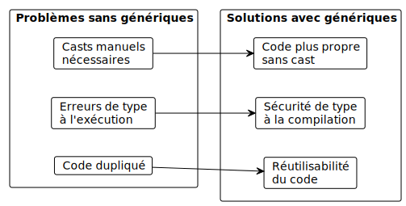
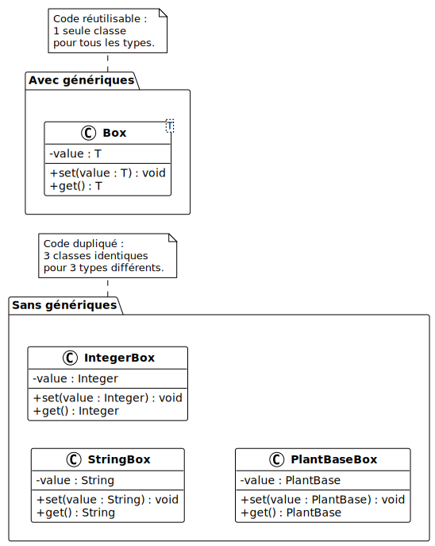
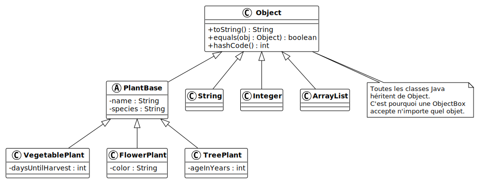
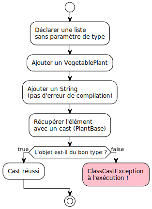

# Collections Java : Les génériques

V. Guidoux, avec l'aide de
[GitHub Copilot](https://github.com/features/copilot).

Ce travail est sous licence [CC BY-SA 4.0][licence].

> [!TIP]
>
> Voici quelques informations relatives à ce contenu.
>
> **Ressources annexes**
>
> - Autres formats du support de cours : [Présentation (web)][presentation-web]
>   · [Présentation (PDF)][presentation-pdf]
> - Exemples de code : [Accéder au contenu](./01-exemples-de-code/)
> - Exercices : [Accéder au contenu](./02-exercices/)
> - Mini-projet : [Accéder au contenu](./03-mini-projet/)
> - Quiz : [Accéder au contenu][quiz-web]
>
> **Objectifs**
>
> À l'issue de cette séance, les personnes qui étudient devraient être capables
> de :
>
> - Expliquer l'utilité des génériques pour la sécurité de type et la
>   réutilisabilité du code.
> - Identifier les trois problèmes résolus par les génériques : code dupliqué,
>   absence de sécurité de type et conversions de type manuelles.
> - Créer des classes et des méthodes génériques avec des paramètres de type.
> - Utiliser l'opérateur diamant (`<>`) pour l'inférence de type.
> - Utiliser les wildcards (`<? extends T>`, `<? super T>`) pour écrire du code
>   flexible.
> - Appliquer les génériques avec les collections pour éviter les erreurs de
>   type à la compilation.
> - Expliquer le concept d'effacement de type (type erasure) et ses limitations.
>
> **Méthodes d'enseignement et d'apprentissage**
>
> Les méthodes d'enseignement et d'apprentissage utilisées pour animer la séance
> sont les suivantes :
>
> - Présentation magistrale.
> - Discussions collectives.
> - Travail en autonomie.
>
> **Méthodes d'évaluation**
>
> L'évaluation prend la forme d'exercices et d'un mini-projet à réaliser en
> autonomie en classe ou à la maison.
>
> L'évaluation se fait en utilisant les critères suivants :
>
> - Capacité à répondre avec justesse.
> - Capacité à argumenter.
> - Capacité à réaliser les tâches demandées.
> - Capacité à s'approprier les exemples de code.
> - Capacité à appliquer les exemples de code à des situations similaires.
>
> Les retours se font de la manière suivante :
>
> - Corrigé des exercices.
> - Corrigé du mini-projet.
>
> L'évaluation ne donne pas lieu à une note.

## Table des matières

- [Table des matières](#table-des-matières)
- [Introduction : écrire du code réutilisable et sûr](#introduction--écrire-du-code-réutilisable-et-sûr)
- [Les génériques](#les-génériques)
	- [Le problème : trois raisons d'utiliser les génériques](#le-problème--trois-raisons-dutiliser-les-génériques)
	- [Les classes génériques](#les-classes-génériques)
	- [Les méthodes génériques](#les-méthodes-génériques)
	- [Les wildcards](#les-wildcards)
	- [Limitations des génériques](#limitations-des-génériques)
- [Conclusion](#conclusion)
- [Exemples de code](#exemples-de-code)
- [Exercices](#exercices)
- [Mini-projet](#mini-projet)
- [À faire pour la prochaine séance](#à-faire-pour-la-prochaine-séance)

## Introduction : écrire du code réutilisable et sûr

Dans le chapitre précédent, nous avons découvert les collections Java :
`ArrayList`, `HashSet` et `HashMap`. Nous savons maintenant stocker, parcourir
et manipuler des ensembles d'objets de manière flexible.

Mais en utilisant les collections, nous avons toujours dû préciser le type des
éléments entre chevrons : `ArrayList<PlantBase>`, `HashMap<String, Plot>`, etc.
Ces chevrons utilisent un mécanisme fondamental de Java : les génériques.

Ce chapitre explore les génériques en profondeur. Nous verrons pourquoi ils
existent, comment créer nos propres classes et méthodes génériques, et comment
les wildcards ajoutent de la flexibilité.

## Les génériques

### Le problème : trois raisons d'utiliser les génériques

Sans les génériques, on se heurte à trois problèmes concrets : le code dupliqué,
l'absence de sécurité de type et la nécessité de faire des conversions de type
manuelles (source :
[W3Schools - Java Generics](https://www.w3schools.com/java/java_generics.asp)).



#### Premier problème : le code dupliqué (réutilisabilité)

Imaginons que nous avons besoin d'une classe qui stocke une valeur et la
retourne. Si on veut le faire pour différents types, il faut écrire une classe
par type :

```java
public class StringBox {
    private String value;

    public void set(String value) {
        this.value = value;
    }

    public String get() {
        return value;
    }
}
```

<details>
<summary>Description du code</summary>

Déclaration d'une classe publique `StringBox` avec un champ privé `value` de
type `String`.

Déclaration d'un setter `set` qui accepte un paramètre de type `String` et
l'assigne au champ `value`.

Déclaration d'un getter `get` qui retourne la valeur de type `String`.

</details>

```java
public class IntegerBox {
    private Integer value;

    public void set(Integer value) {
        this.value = value;
    }

    public Integer get() {
        return value;
    }
}
```

<details>
<summary>Description du code</summary>

Déclaration d'une classe publique `IntegerBox` avec un champ privé `value` de
type `Integer`.

Déclaration d'un setter `set` qui accepte un paramètre de type `Integer` et
l'assigne au champ `value`.

Déclaration d'un getter `get` qui retourne la valeur de type `Integer`.

</details>

```java
public class PlantBaseBox {
    private PlantBase value;

    public void set(PlantBase value) {
        this.value = value;
    }

    public PlantBase get() {
        return value;
    }
}
```

<details>
<summary>Description du code</summary>

Déclaration d'une classe publique `PlantBaseBox` avec un champ privé `value` de
type `PlantBase`.

Déclaration d'un setter `set` qui accepte un paramètre de type `PlantBase` et
l'assigne au champ `value`.

Déclaration d'un getter `get` qui retourne la valeur de type `PlantBase`.

</details>

Trois classes avec exactement la même logique, seul le type change. Si on doit
ajouter une méthode ou corriger un bug, il faut le faire dans chaque classe.



#### Deuxième problème : l'absence de sécurité de type

On pourrait essayer de résoudre le problème de duplication en utilisant `Object`
comme type universel. En Java, toutes les classes héritent implicitement de la
classe `Object`. C'est la racine de la hiérarchie de classes :



Puisque tout est un `Object`, on pourrait créer une seule classe qui utilise ce
type :

```java
public class ObjectBox {
    private Object value;

    public void set(Object value) {
        this.value = value;
    }

    public Object get() {
        return value;
    }
}
```

<details>
<summary>Description du code</summary>

Déclaration d'une classe publique `ObjectBox` avec un champ privé `value` de
type `Object`.

Déclaration d'un setter `set` qui accepte un paramètre de type `Object` et
l'assigne au champ `value`.

Déclaration d'un getter `get` qui retourne la valeur de type `Object`.

</details>

Le code n'est plus dupliqué, mais on perd la sécurité de type. On peut stocker
n'importe quoi et le compilateur ne détecte aucune erreur :

```java
ObjectBox box = new ObjectBox();
box.set("Tomate");
box.set(42);        // Pas d'erreur de compilation !
box.set(3.14);      // Pas d'erreur non plus !
```

<details>
<summary>Description du code</summary>

Déclaration d'une variable `box` de type `ObjectBox` initialisée avec une
nouvelle instance.

Appel de `set` avec une `String`, puis avec un `Integer`, puis avec un `Double`.
Les trois appels compilent sans erreur car `Object` accepte n'importe quel type.

</details>

Le compilateur ne peut pas vérifier que l'on utilise toujours le même type dans
la boîte. L'erreur ne se manifeste qu'à l'exécution.



#### Troisième problème : les conversions de type manuelles (casting)

Comme `ObjectBox.get()` retourne un `Object`, il faut convertir (caster) le
résultat à chaque fois qu'on le récupère :

```java
ObjectBox box = new ObjectBox();
box.set("Tomate");

// Il faut caster manuellement
String value = (String) box.get();
```

<details>
<summary>Description du code</summary>

Déclaration d'une variable `box` de type `ObjectBox` initialisée avec une
nouvelle instance. Appel de `set` avec la `String` "Tomate".

Déclaration d'une variable `value` de type `String` initialisée avec le résultat
de `get()`, converti (casté) en `String` avec l'opérateur `(String)`.

</details>

Si on se trompe de type lors du cast, on obtient une `ClassCastException` à
l'exécution :

```java
ObjectBox box = new ObjectBox();
box.set(42);

// Compile sans erreur, mais plante à l'exécution !
String value = (String) box.get(); // ClassCastException !
```

<details>
<summary>Description du code</summary>

Déclaration d'une variable `box` de type `ObjectBox` initialisée avec une
nouvelle instance. Appel de `set` avec l'entier `42`.

Tentative de cast du résultat de `get()` en `String`. Le cast compile sans
erreur car le compilateur ne connaît pas le type réel de l'objet. À l'exécution,
une `ClassCastException` est levée car la valeur est un `Integer` et non un
`String`.

</details>

Les casts manuels rendent le code fragile et difficile à maintenir. On
préférerait que le compilateur détecte ces erreurs avant l'exécution.

Les génériques résolvent ces trois problèmes simultanément : ils permettent
d'écrire une seule classe réutilisable, avec une vérification des types à la
compilation et sans cast manuel.

### Les classes génériques

Une classe générique déclare un ou plusieurs paramètres de type entre chevrons
(`<>`). Ce paramètre de type est un espace réservé qui sera remplacé par un type
concret lors de l'utilisation :

```java
public class Box<T> {
    private T value;

    public void set(T value) {
        this.value = value;
    }

    public T get() {
        return value;
    }
}
```

<details>
<summary>Description du code</summary>

Déclaration d'une classe publique `Box` avec un paramètre de type `T`.

Déclaration d'un champ privé `value` de type `T`.

Déclaration d'un setter `set` qui accepte un paramètre de type `T`.

Déclaration d'un getter `get` qui retourne une valeur de type `T`.

</details>

`T` est un paramètre de type. Par convention, on utilise des lettres majuscules
seules : `T` (type), `E` (element), `K` (key), `V` (value), `R` (return).

À l'utilisation, on spécifie le type concret :

```java
Box<String> stringBox = new Box<>();
stringBox.set("Tomate");
String name = stringBox.get(); // Pas de cast nécessaire

Box<Integer> intBox = new Box<>();
intBox.set(42);
int value = intBox.get();

// Erreur de compilation (pas d'erreur à l'exécution !)
// stringBox.set(42); // Type incompatible
```

<details>
<summary>Description du code</summary>

Déclaration d'une variable `stringBox` de type `Box<String>` initialisée avec
une nouvelle instance de `Box` (opérateur diamant `<>`).

Appel de `set` avec une `String`. Appel de `get` qui retourne directement un
`String` sans conversion de type.

Déclaration d'une variable `intBox` de type `Box<Integer>` initialisée avec une
nouvelle instance de `Box`. Appel de `set` avec un `Integer` et appel de `get`
qui retourne un `int` (auto-unboxing).

L'appel `stringBox.set(42)` provoquerait une erreur de compilation car `42`
n'est pas un `String`.

</details>

> [!IMPORTANT]
>
> Les génériques ne fonctionnent qu'avec des types de référence (objets), pas
> avec des types primitifs. Utilisez `Integer` au lieu de `int`, `Double` au
> lieu de `double`, etc.

On peut avoir plusieurs paramètres de type :

```java
public class Pair<K, V> {
    private K key;
    private V value;

    public Pair(K key, V value) {
        this.key = key;
        this.value = value;
    }

    public K getKey() { return key; }
    public V getValue() { return value; }
}
```

<details>
<summary>Description du code</summary>

Déclaration d'une classe publique `Pair` avec deux paramètres de type `K` et
`V`.

Déclaration de deux champs privés : `key` de type `K` et `value` de type `V`.

Constructeur qui prend deux paramètres de types `K` et `V` et les assigne aux
champs correspondants.

Deux getters `getKey` et `getValue` retournant respectivement `K` et `V`.

</details>

Utilisation :

```java
Pair<String, Integer> plantAge = new Pair<>("Pommier", 3);
String treeName = plantAge.getKey();    // "Pommier"
int age = plantAge.getValue();           // 3
```

<details>
<summary>Description du code</summary>

Déclaration d'une variable `plantAge` de type `Pair<String, Integer>`
initialisée avec le constructeur en passant le nom "Pommier" et l'âge 3.

Appel de `getKey()` retournant un `String` et de `getValue()` retournant un
`Integer` (auto-unboxing vers `int`).

</details>

### Les méthodes génériques

On peut aussi rendre une méthode générique sans que la classe entière le soit.
Le paramètre de type est déclaré avant le type de retour :

```java
public class GardenUtils {

    /**
     * Affiche tous les éléments d'une liste.
     */
    public static <T> void printAll(List<T> items) {
        for (T item : items) {
            System.out.println(item);
        }
    }

    /**
     * Retourne le premier élément d'une liste ou null si vide.
     */
    public static <T> T getFirst(List<T> items) {
        if (items.isEmpty()) {
            return null;
        }
        return items.get(0);
    }
}
```

<details>
<summary>Description du code</summary>

Déclaration d'une classe `GardenUtils` avec deux méthodes statiques génériques.

La méthode `printAll` déclare un paramètre de type `<T>` avant le type de retour
`void`. Elle prend une `List<T>` et parcourt les éléments avec une boucle
`for-each` pour les afficher.

La méthode `getFirst` déclare un paramètre de type `<T>` et retourne un `T`.
Elle vérifie si la liste est vide avec `isEmpty()` et retourne `null` le cas
échéant, sinon retourne l'élément à l'index 0.

</details>

Utilisation :

```java
List<PlantBase> plants = new ArrayList<>();
// ... ajout des plantes ...

GardenUtils.printAll(plants);        // T est inféré comme PlantBase
PlantBase first = GardenUtils.getFirst(plants);

List<String> names = List.of("Tomate", "Carotte");
GardenUtils.printAll(names);         // T est inféré comme String
String firstName = GardenUtils.getFirst(names);
```

<details>
<summary>Description du code</summary>

Appel de `GardenUtils.printAll` avec une liste de `PlantBase` : le paramètre de
type `T` est automatiquement inféré comme `PlantBase`.

Appel de `GardenUtils.getFirst` qui retourne un `PlantBase`.

Appel de `GardenUtils.printAll` avec une liste de `String` : le paramètre de
type `T` est automatiquement inféré comme `String`.

Appel de `GardenUtils.getFirst` qui retourne un `String`.

</details>

### Les wildcards

Les wildcards (jokers) permettent de rendre les génériques plus flexibles. Ils
sont utilisés quand on ne connaît pas ou ne veut pas fixer le type exact.

#### Le wildcard non borné : `<?>`

Le wildcard `<?>` signifie "n'importe quel type" :

```java
public static void printList(List<?> list) {
    for (Object item : list) {
        System.out.println(item);
    }
}

// Fonctionne avec n'importe quel type de liste
printList(plants);  // List<PlantBase>
printList(names);   // List<String>
```

<details>
<summary>Description du code</summary>

Déclaration d'une méthode statique `printList` qui accepte une `List<?>` (liste
de n'importe quel type). Boucle `for-each` qui parcourt les éléments en tant
qu'`Object` et les affiche.

Appels de `printList` avec une liste de `PlantBase` et une liste de `String` :
les deux sont acceptés.

</details>

#### Le wildcard borné supérieurement : `<? extends T>`

Le wildcard `<? extends T>` signifie "un type qui est `T` ou un sous-type de
`T`". Il permet de lire les éléments en tant que `T` :

```java
public static double totalSize(List<? extends PlantBase> plants) {
    double total = 0;
    for (PlantBase plant : plants) {
        total += plant.getSize();
    }
    return total;
}

// Fonctionne avec List<PlantBase>, List<VegetablePlant>, etc.
List<VegetablePlant> vegetables = new ArrayList<>();
// ... ajout de légumes ...
double total = totalSize(vegetables); // OK
```

<details>
<summary>Description du code</summary>

Déclaration d'une méthode `totalSize` qui accepte une
`List<? extends PlantBase>` : toute liste dont le type est `PlantBase` ou un de
ses sous-types. Boucle `for-each` qui parcourt les éléments en tant que
`PlantBase` et additionne les tailles.

Déclaration d'une liste de `VegetablePlant`. Appel de `totalSize` avec cette
liste : cela fonctionne car `VegetablePlant` est un sous-type de `PlantBase`.

</details>

#### Le wildcard borné inférieurement : `<? super T>`

Le wildcard `<? super T>` signifie "un type qui est `T` ou un super-type de
`T`". Il est surtout utile pour écrire dans une collection :

```java
public static void addDefaultVegetables(
        List<? super VegetablePlant> list) {
    list.add(new VegetablePlant("Laitue", "Lactuca sativa",
            "2026-05-01", 5.0, 45));
    list.add(new VegetablePlant("Radis", "Raphanus sativus",
            "2026-05-01", 3.0, 25));
}

// Fonctionne avec List<VegetablePlant>, List<PlantBase>, List<Object>
List<PlantBase> allPlants = new ArrayList<>();
addDefaultVegetables(allPlants); // OK
```

<details>
<summary>Description du code</summary>

Déclaration d'une méthode `addDefaultVegetables` qui accepte une
`List<? super VegetablePlant>` : toute liste dont le type est `VegetablePlant`
ou un de ses super-types (`PlantBase`, `Object`). Ajout de deux `VegetablePlant`
à la liste.

Déclaration d'une liste de `PlantBase`. Appel de `addDefaultVegetables` avec
cette liste : cela fonctionne car `PlantBase` est un super-type de
`VegetablePlant`.

</details>

> [!TIP]
>
> Règle mnémotechnique PECS (Producer Extends, Consumer Super) :
>
> - Si vous **lisez** des éléments de la collection : utilisez `<? extends T>`.
> - Si vous **écrivez** des éléments dans la collection : utilisez
>   `<? super T>`.

### Limitations des génériques

Les génériques ont quelques restrictions à connaître :

- On ne peut pas utiliser des types primitifs : `List<int>` est interdit, il
  faut utiliser `List<Integer>`.
- On ne peut pas créer d'instance d'un paramètre de type : `new T()` est
  interdit.
- On ne peut pas créer de tableau d'un type générique : `new T[10]` est
  interdit.

Ces restrictions sont liées à l'effacement de type (type erasure) : Java
remplace les types génériques par `Object` à la compilation. Les génériques
n'existent qu'à la compilation, pas à l'exécution.

---

<details>
<summary>Pour aller plus loin</summary>

Les génériques ouvrent la porte à des concepts plus avancés :

- Les types bornés (`<T extends Comparable<T>>`) permettent de contraindre un
  paramètre de type à implémenter une interface.
- Les collections génériques et les types paramétrés sont la base de nombreuses
  bibliothèques Java.

</details>

---

## Conclusion

Dans ce chapitre, nous avons découvert les génériques, un mécanisme fondamental
de Java :

- Les génériques résolvent trois problèmes : le code dupliqué, l'absence de
  sécurité de type et les conversions de type manuelles.
- Les classes génériques (`Box<T>`, `Pair<K, V>`) permettent d'écrire du code
  réutilisable qui fonctionne avec n'importe quel type.
- Les méthodes génériques permettent de paramétrer une méthode sans rendre toute
  la classe générique.
- Les wildcards (`? extends T`, `? super T`) ajoutent de la flexibilité aux
  génériques.
- L'effacement de type (type erasure) impose certaines limitations à connaître.

## Exemples de code

Nous vous invitons à consulter les exemples de code associés à ce contenu de
cours pour mieux comprendre les concepts abordés.

Vous trouverez les exemples de code ici :
[Exemples de code](./01-exemples-de-code/).

## Exercices

Nous vous invitons maintenant à réaliser les exercices de la séance afin de
mettre en pratique les concepts abordés.

Vous trouverez les exercices et leur corrigé ici : [Exercices](./02-exercices/).

## Mini-projet

Nous vous invitons maintenant à réaliser le mini-projet de la séance afin de
mettre en pratique les concepts abordés.

Vous trouverez les détails du mini-projet ici :
[Mini-projet](./03-mini-projet/).

## À faire pour la prochaine séance

Chaque personne est libre de gérer son temps comme elle le souhaite. Cependant,
il est recommandé pour la prochaine séance de :

- Relire le support de cours si nécessaire.
- Relire les exemples de code et leur description pour bien comprendre les
  concepts.
- Finaliser les exercices qui n'ont pas été terminés en classe.
- Finaliser la partie du mini-projet qui n'a pas été terminée en classe.

<!-- URLs -->

[licence]:
	https://github.com/heig-vd-progim-course/heig-vd-progim2-course/blob/main/LICENSE.md
[quiz-web]:
	https://heig-vd-progim-course.github.io/heig-vd-progim2-course/01-contenus-du-cours/09-collections-java-lambda-et-generiques/quiz.html
[presentation-web]:
	https://heig-vd-progim-course.github.io/heig-vd-progim2-course/01-contenus-du-cours/09-collections-java-lambda-et-generiques/presentation.html
[presentation-pdf]:
	https://heig-vd-progim-course.github.io/heig-vd-progim2-course/01-contenus-du-cours/09-collections-java-lambda-et-generiques/09-collections-java-lambda-et-generiques-presentation.pdf
