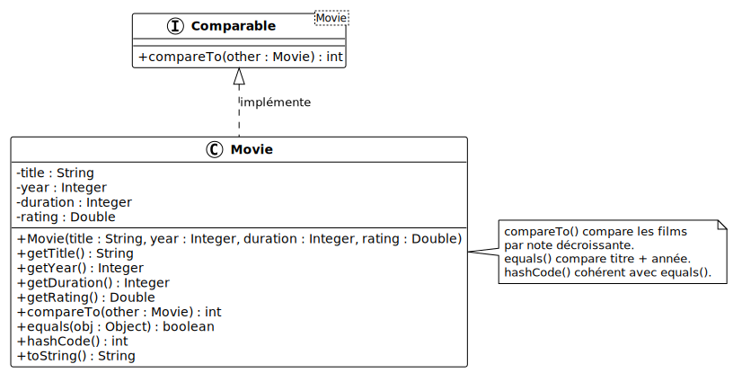

# Types enveloppes et comparaison d'objets

<!--
_class: lead
_paginate: false
-->

<https://github.com/heig-vd-progim-course/heig-vd-progim2-course>

Visualiser le contenu complet sur GitHub [à cette
adresse][contenu-complet-sur-github].

<small>V. Guidoux, avec l'aide de
[GitHub Copilot](https://github.com/features/copilot).</small>

<small>Ce travail est sous licence [CC BY-SA 4.0][licence].</small>

![bg opacity:0.1][illustration-principale]

## Plus de détails sur GitHub

<!-- _class: lead -->

_Cette présentation est un résumé du contenu complet disponible sur GitHub._

_Pour plus de détails, consulter le [contenu complet sur
GitHub][contenu-complet-sur-github] ou en cliquant sur l'en-tête de ce
document._

## Objectifs (1/3)

- Expliquer pourquoi les types primitifs ne peuvent pas être utilisés
  directement avec les génériques et les collections Java.
- Identifier la classe enveloppe correspondant à chaque type primitif
  (`Integer`, `Double`, `Boolean`, `Character`, etc.).
- Expliquer et utiliser l'autoboxing et l'unboxing.

![bg right:40%][illustration-objectifs]

## Objectifs (2/3)

- Utiliser les méthodes utilitaires des classes enveloppes (`parseInt()`,
  `valueOf()`, `MAX_VALUE`, etc.).
- Expliquer la différence entre `==` et `equals()` pour la comparaison d'objets.
- Redéfinir `equals()` et `hashCode()` de façon cohérente dans une classe.

![bg right:40%][illustration-objectifs]

## Objectifs (3/3)

- Implémenter l'interface `Comparable<T>` pour définir un ordre naturel.
- Trier une collection avec `Collections.sort()`.

![bg right:40%][illustration-objectifs]

## Introduction : quand les primitifs ne suffisent plus

Les génériques et les collections utilisent des types entre chevrons :

```java
// Interdit : les génériques n'acceptent pas les primitifs
ArrayList<int> durations = new ArrayList<>();   // Erreur !
ArrayList<double> ratings = new ArrayList<>();  // Erreur !

// Correct : on utilise les classes enveloppes
ArrayList<Integer> durations = new ArrayList<>();
ArrayList<Double> ratings = new ArrayList<>();
```

## Les types enveloppes

<!-- _class: lead -->

### Les types primitifs vs classes enveloppes

| Type primitif | Classe enveloppe | Exemple                |
| :------------ | :--------------- | :--------------------- |
| `int`         | `Integer`        | `ArrayList<Integer>`   |
| `double`      | `Double`         | `ArrayList<Double>`    |
| `long`        | `Long`           | `ArrayList<Long>`      |
| `boolean`     | `Boolean`        | `ArrayList<Boolean>`   |
| `char`        | `Character`      | `ArrayList<Character>` |
| `float`       | `Float`          | `ArrayList<Float>`     |

### Hiérarchie des classes enveloppes

- `Number` est la classe parente de toutes les classes numériques.
- On peut stocker des `Integer` et des `Double` dans une `List<Number>`.

### Créer un objet enveloppe depuis une valeur

Chaque classe enveloppe fournit `valueOf()` pour construire un objet
explicitement :

```java
Integer year    = Integer.valueOf(2010);
Double  rating  = Double.valueOf(9.0);
Boolean flag    = Boolean.valueOf(true);
```

L'inverse : `intValue()`, `doubleValue()`, `booleanValue()` extraient la valeur
primitive depuis l'objet.

### L'autoboxing et l'unboxing (1/2)

Dans Java, la conversion est **automatique** :

```java
// Autoboxing : int → Integer
Integer year = 2010;
// équivaut à : Integer year = Integer.valueOf(2010);

// Unboxing : Integer → int
int y = year;
// équivaut à : int y = year.intValue();
```

### L'autoboxing et l'unboxing (2/2)

L'autoboxing fonctionne aussi dans les collections :

```java
ArrayList<Integer> durations = new ArrayList<>();
durations.add(148);   // autoboxing : 148 → Integer.valueOf(148)
durations.add(97);
durations.add(132);

int first = durations.get(0);  // unboxing : Integer → int
```

### Les méthodes utilitaires (1/3)

**Convertir une chaîne en nombre :**

```java
int year       = Integer.parseInt("2010");
double rating  = Double.parseDouble("8.5");
long id        = Long.parseLong("12345678");
```

> Si la chaîne n'est pas un nombre valide → `NumberFormatException` !

### Les méthodes utilitaires (2/3)

**Constantes utiles :**

```java
System.out.println(Integer.MAX_VALUE);  // 2147483647
System.out.println(Integer.MIN_VALUE);  // -2147483648
System.out.println(Integer.SIZE);       // 32 (bits)
```

### Les méthodes utilitaires (3/3)

**Méthodes utilitaires de `Character` :**

```java
char c1 = 'A';
char c2 = '3';

System.out.println(Character.isLetter(c1));     // true
System.out.println(Character.isDigit(c2));      // true
System.out.println(Character.toLowerCase(c1));  // 'a'
System.out.println(Character.toUpperCase('b')); // 'B'
```

### Les pièges : comparaison avec `==`

Java met en cache les `Integer` entre **-128 et 127** :

```java
Integer a = 100;
Integer b = 100;
System.out.println(a == b);   // true  (dans le cache)

Integer x = 200;
Integer y = 200;
System.out.println(x == y);      // false (hors cache)
System.out.println(x.equals(y)); // true  (comparaison par valeur)
```

**Règle :** ne jamais comparer des objets avec `==`. Utiliser `equals()`.

### Les pièges : unboxing d'une valeur `null` (1/2)

Un objet enveloppe peut être `null`. Si Java tente de l'unboxer →
`NullPointerException` :

```java
Integer value = null;
int i = value;  // NullPointerException !
```

### Les pièges : unboxing d'une valeur `null` (2/2)

Cas fréquent avec les collections :

```java
ArrayList<Integer> list = new ArrayList<>();
list.add(null);
for (int d : list) { ... }  // NullPointerException !

// Toujours vérifier `null` avant d'unboxer :

if (value != null) {
    int i = value;
}
```

## Comparaison d'objets

<!-- _class: lead -->

### Movie



### L'opérateur `==` et la méthode `equals()` (1/2)

`==` compare des **références** (adresses mémoire), pas des valeurs :

```java
String s1 = new String("Inception");
String s2 = new String("Inception");

System.out.println(s1 == s2);       // false : deux objets distincts
System.out.println(s1.equals(s2));  // true  : même contenu
```

### L'opérateur `==` et la méthode `equals()` (2/2)

Sans redéfinir `equals()`, deux objets `Movie` avec les mêmes données ne sont
pas égaux :

```java
Movie m1 = new Movie("Inception", 2010, 148, 9.0);
Movie m2 = new Movie("Inception", 2010, 148, 9.0);
System.out.println(m1.equals(m2));  // false (hérité de Object)
```

### Redéfinir `equals()` (1/2)

On redéfinit `equals()` pour comparer par **contenu** :

```java
@Override
public boolean equals(Object obj) {
    if (this == obj) {
        return true;
    }
    if (obj == null || getClass() != obj.getClass()) {
        return false;
    }
    Movie other = (Movie) obj;
    return year.equals(other.year)
            && title.equals(other.title);
}
```

### Redéfinir `equals()` (2/2)

Après redéfinition :

```java
Movie m1 = new Movie("Inception", 2010, 148, 9.0);
Movie m2 = new Movie("Inception", 2010, 148, 9.0);
Movie m3 = new Movie("Interstellar", 2014, 169, 8.6);

System.out.println(m1.equals(m2));  // true
System.out.println(m1.equals(m3));  // false
```

### La méthode `hashCode()` (1/2)

`hashCode()` est utilisée par `HashSet` et `HashMap` pour trouver les éléments
rapidement. **Sans `hashCode()` cohérent :**

```java
HashSet<Movie> favorites = new HashSet<>();
favorites.add(new Movie("Inception", 2010, 148, 9.0));

Movie search = new Movie("Inception", 2010, 148, 9.0);
System.out.println(favorites.contains(search)); // false !
```

`equals()` redéfini mais `hashCode()` incohérent → `HashSet` ne trouve pas.

### La méthode `hashCode()` (2/2)

**Le contrat :** si `a.equals(b)` → `a.hashCode() == b.hashCode()`.

**Toujours redéfinir `hashCode()` avec les mêmes champs que `equals()` :**

```java
@Override
public int hashCode() {
    int result = title.hashCode();
    result = 31 * result + year.hashCode();
    return result;
}
```

## L'interface `Comparable<T>`

<!-- _class: lead -->

### Définir un ordre naturel (1/2)

`Comparable<T>` déclare une seule méthode :

```java
public interface Comparable<T> {
    int compareTo(T other);
}
```

`compareTo()` retourne :

- Un entier **négatif** si `this < other`.
- `0` si `this == other`.
- Un entier **positif** si `this > other`.

### Définir un ordre naturel (2/2)

Films triés par note **décroissante** (meilleure note en premier) :

```java
public class Movie implements Comparable<Movie> {
    // ...
    @Override
    public int compareTo(Movie other) {
        // Ordre décroissant : on inverse les paramètres
        return Double.compare(other.rating, this.rating);
    }
}
```

### Trier avec `Collections.sort()`

```java
ArrayList<Movie> movies = new ArrayList<>();
movies.add(new Movie("Interstellar", 2014, 169, 8.6));
movies.add(new Movie("Inception", 2010, 148, 9.0));
movies.add(new Movie("Tenet", 2020, 150, 7.4));
movies.add(new Movie("The Dark Knight", 2008, 152, 9.0));

Collections.sort(movies);

for (Movie m : movies) {
    System.out.println(m.getRating() + " - " + m.getTitle());
}

// Sortie : `9.0 - Inception`, `9.0 - The Dark Knight`, `8.6 - Interstellar`, `7.4 - Tenet`
```

### Trier avec `Collections.sort()` - remarque

> Les classes enveloppes numériques (`Integer`, `Double`, etc.) implémentent
> déjà `Comparable`. C'est pourquoi `Collections.sort()` fonctionne
> automatiquement sur une `ArrayList<Integer>`.

```java
ArrayList<Integer> numbers = new ArrayList<>();
numbers.add(5);
numbers.add(1);
numbers.add(3);
Collections.sort(numbers);
System.out.println(numbers);  // [1, 3, 5]
```

## Conclusion

- Les **classes enveloppes** permettent d'utiliser les primitifs dans les
  génériques et les collections.
- L'**autoboxing/unboxing** est automatique, mais cache des pièges (`==`,
  `null`).
- `equals()` compare les **valeurs**, `==` compare les **références**.
- `hashCode()` est indissociable de `equals()` : toujours les redéfinir
  ensemble.
- `Comparable<T>` et `compareTo()` définissent un ordre naturel pour le tri.

## Sources

- [Oracle Java Documentation - Wrapper Classes](https://docs.oracle.com/en/java/docs/)
- [Oracle Java Documentation - Comparable](https://docs.oracle.com/en/java/api/java.base/java/lang/Comparable.html)
- [Oracle Java Documentation - Collections.sort](<https://docs.oracle.com/en/java/api/java.base/java/util/Collections.html#sort(java.util.List)>)

<!-- URLs -->

[contenu-complet-sur-github]:
	https://github.com/heig-vd-progim-course/heig-vd-progim2-course/tree/main/01-contenus-du-cours/10-types-enveloppes-et-comparaison/
[licence]:
	https://github.com/heig-vd-progim-course/heig-vd-progim2-course/blob/main/LICENSE.md
[illustration-principale]:
	https://images.unsplash.com/photo-1485846234645-a62644f84728?w=1280&q=80
[illustration-objectifs]:
	https://images.unsplash.com/photo-1516321318423-f06f85e504b3?w=1280&q=80
