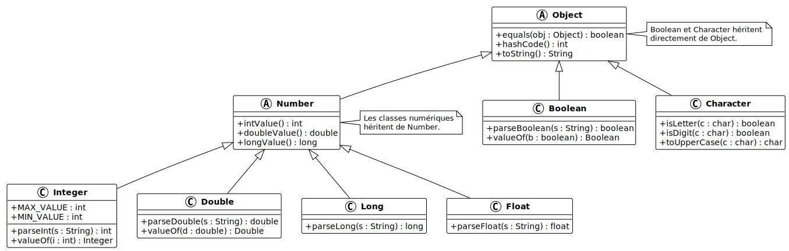
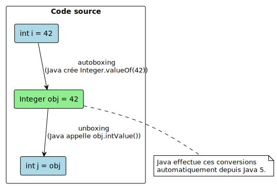
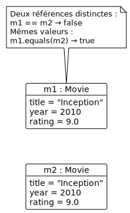

# Types enveloppes et comparaison d'objets

V. Guidoux, avec l'aide de
[GitHub Copilot](https://github.com/features/copilot).

Ce travail est sous licence [CC BY-SA 4.0][licence].

> [!TIP]
>
> Voici quelques informations relatives à ce contenu.
>
> **Ressources annexes**
>
> - Autres formats du support de cours : [Présentation (web)][presentation-web]
>   · [Présentation (PDF)][presentation-pdf]
> - Exemples de code : [Accéder au contenu](./01-exemples-de-code/)
> - Exercices : [Accéder au contenu](./02-exercices/)
> - Mini-projet : [Accéder au contenu](./03-mini-projet/)
> - Quiz : [Accéder au contenu][quiz-web]
>
> **Objectifs**
>
> À l'issue de cette séance, les personnes qui étudient devraient être capables
> de :
>
> - Expliquer pourquoi les types primitifs ne peuvent pas être utilisés
>   directement avec les génériques et les collections Java.
> - Identifier la classe enveloppe correspondant à chaque type primitif
>   (`Integer`, `Double`, `Boolean`, `Character`, etc.).
> - Expliquer et utiliser l'autoboxing et l'unboxing.
> - Utiliser les méthodes utilitaires des classes enveloppes (`parseInt()`,
>   `valueOf()`, `MAX_VALUE`, etc.).
> - Expliquer la différence entre `==` et `equals()` pour la comparaison
>   d'objets.
> - Redéfinir `equals()` et `hashCode()` de façon cohérente dans une classe.
> - Implémenter l'interface `Comparable<T>` pour définir un ordre naturel.
> - Trier une collection avec `Collections.sort()`.
>
> **Méthodes d'enseignement et d'apprentissage**
>
> Les méthodes d'enseignement et d'apprentissage utilisées pour animer la séance
> sont les suivantes :
>
> - Présentation magistrale.
> - Discussions collectives.
> - Travail en autonomie.
>
> **Méthodes d'évaluation**
>
> L'évaluation prend la forme d'exercices et d'un mini-projet à réaliser en
> autonomie en classe ou à la maison.
>
> L'évaluation se fait en utilisant les critères suivants :
>
> - Capacité à répondre avec justesse.
> - Capacité à argumenter.
> - Capacité à réaliser les tâches demandées.
> - Capacité à s'approprier les exemples de code.
> - Capacité à appliquer les exemples de code à des situations similaires.
>
> Les retours se font de la manière suivante :
>
> - Corrigé des exercices.
> - Corrigé du mini-projet.
>
> L'évaluation ne donne pas lieu à une note.

## Table des matières

- [Table des matières](#table-des-matières)
- [Introduction : quand les primitifs ne suffisent plus](#introduction--quand-les-primitifs-ne-suffisent-plus)
- [Les types enveloppes](#les-types-enveloppes)
  - [Les types primitifs et leurs classes enveloppes](#les-types-primitifs-et-leurs-classes-enveloppes) -
    [Créer un objet enveloppe depuis une valeur](#créer-un-objet-enveloppe-depuis-une-valeur) -
    [L'autoboxing et l'unboxing](#lautoboxing-et-lunboxing)
  - [Les méthodes utilitaires](#les-méthodes-utilitaires)
  - [Les pièges à connaître](#les-pièges-à-connaître)
- [Comparaison d'objets](#comparaison-dobjets)
  - [L'opérateur `==` et la méthode `equals()`](#lopérateur--et-la-méthode-equals)
  - [Redéfinir `equals()`](#redéfinir-equals)
  - [La méthode `hashCode()`](#la-méthode-hashcode)
  - [Le contrat `equals()` et `hashCode()`](#le-contrat-equals-et-hashcode)
- [L'interface `Comparable<T>`](#linterface-comparablet)
  - [Définir un ordre naturel](#définir-un-ordre-naturel)
  - [Trier avec `Collections.sort()`](#trier-avec-collectionssort)
- [Conclusion](#conclusion)
- [Exemples de code](#exemples-de-code)
- [Exercices](#exercices)
- [Mini-projet](#mini-projet)
- [À faire pour la prochaine séance](#à-faire-pour-la-prochaine-séance)

## Introduction : quand les primitifs ne suffisent plus

Dans les chapitres précédents, nous avons vu que les génériques et les
collections Java utilisent des types entre chevrons : `ArrayList<String>`,
`Box<Integer>`, `HashMap<String, Double>`. Vous avez peut-être remarqué que l'on
écrit `Integer` et non `int`, `Double` et non `double`.

Ce n'est pas un hasard : les génériques en Java ne fonctionnent qu'avec des
objets, pas avec des types primitifs. Cette contrainte est liée à l'effacement
de type que nous avons étudié dans le chapitre précédent.

```java
// Interdit : les génériques n'acceptent pas les types primitifs
ArrayList<int> durations = new ArrayList<>();   // Erreur !
ArrayList<double> ratings = new ArrayList<>();  // Erreur !

// Correct : on utilise les classes enveloppes
ArrayList<Integer> durations = new ArrayList<>();
ArrayList<Double> ratings = new ArrayList<>();
```

<details>
<summary>Description du code</summary>

Les deux premières lignes provoquent une erreur de compilation. Les génériques
ne fonctionnent qu'avec des objets. Les types primitifs `int` et `double` ne
sont pas des objets.

Les deux lignes suivantes sont correctes. `Integer` et `Double` sont des classes
Java à part entière ; elles peuvent être utilisées comme paramètres de type.

</details>

Ce chapitre explore les classes enveloppes qui encapsulent les types primitifs,
et revient sur la comparaison d'objets et le tri, deux mécanismes directement
liés à l'utilisation de ces types dans des collections.

## Les types enveloppes

### Les types primitifs et leurs classes enveloppes

Java fournit une classe enveloppe (wrapper class) pour chaque type primitif. Ces
classes enveloppent une valeur primitive dans un objet. Elles font toutes partie
de la bibliothèque standard Java (`java.lang`) et sont donc disponibles sans
import.

| Type primitif | Classe enveloppe | Exemple d'utilisation                        |
| :------------ | :--------------- | :------------------------------------------- |
| `int`         | `Integer`        | `ArrayList<Integer>`, `Integer.parseInt`     |
| `double`      | `Double`         | `ArrayList<Double>`, `Double.parseDouble`    |
| `long`        | `Long`           | `ArrayList<Long>`, `Long.parseLong`          |
| `float`       | `Float`          | `ArrayList<Float>`, `Float.parseFloat`       |
| `boolean`     | `Boolean`        | `ArrayList<Boolean>`, `Boolean.valueOf`      |
| `char`        | `Character`      | `ArrayList<Character>`, `Character.isLetter` |
| `byte`        | `Byte`           | `ArrayList<Byte>`                            |
| `short`       | `Short`          | `ArrayList<Short>`                           |

Ces classes héritent toutes de `Object` et les classes numériques héritent en
plus de la classe abstraite `Number` :



Cette hiérarchie explique pourquoi on peut stocker des `Integer` et des `Double`
dans une `List<Number>`, ou les utiliser partout où un `Object` est attendu.

### Créer un objet enveloppe depuis une valeur

Avant de parler d'autoboxing, voyons comment créer explicitement un objet
enveloppe. Chaque classe enveloppe fournit une méthode statique `valueOf()` pour
construire un objet à partir d'une valeur primitive :

```java
Integer year = Integer.valueOf(2010);
Double rating = Double.valueOf(9.0);
Boolean flag = Boolean.valueOf(true);
```

<details>
<summary>Description du code</summary>

Appel de la méthode statique `Integer.valueOf(2010)` : création d'un objet
`Integer` encapsulant la valeur `2010`. Appel de `Double.valueOf(9.0)` :
création d'un objet `Double` encapsulant `9.0`. Appel de `Boolean.valueOf(true)`
: création d'un objet `Boolean` encapsulant `true`.

Ces méthodes sont l'inverse de `intValue()`, `doubleValue()`, `booleanValue()`,
etc., qui extraient la valeur primitive depuis l'objet enveloppe.

</details>

Il est utile de connaître ces méthodes car elles expliquent ce que Java fait
automatiquement lors de l'autoboxing.

### L'autoboxing et l'unboxing

Depuis Java 5, la conversion entre un type primitif et sa classe enveloppe est
automatique. On appelle cela l'autoboxing (primitif → objet) et l'unboxing
(objet → primitif).

```java
// Autoboxing : Java convertit int en Integer automatiquement
Integer year = 2010;
// équivaut à : Integer year = Integer.valueOf(2010);

// Unboxing : Java extrait le int depuis l'Integer automatiquement
int y = year;
// équivaut à : int y = year.intValue();
```

<details>
<summary>Description du code</summary>

Déclaration d'une variable `year` de type `Integer` initialisée avec la valeur
entière `2010`. Java convertit automatiquement le `int` en `Integer` par
autoboxing.

Déclaration d'une variable `y` de type primitif `int` initialisée avec la valeur
de `year`. Java extrait automatiquement le `int` depuis l'`Integer` par
unboxing.

</details>

L'autoboxing fonctionne aussi dans les collections :

```java
ArrayList<Integer> durations = new ArrayList<>();
durations.add(148);   // autoboxing : 148 → Integer.valueOf(148)
durations.add(97);
durations.add(132);

int first = durations.get(0);  // unboxing : Integer → int
```

<details>
<summary>Description du code</summary>

Déclaration d'une liste de `Integer`. Ajout de trois valeurs entières :
l'autoboxing les convertit automatiquement en `Integer` avant l'ajout.

Déclaration d'une variable `first` de type `int` initialisée avec le premier
élément de la liste. L'unboxing convertit automatiquement l'`Integer` en `int`.

</details>



### Les méthodes utilitaires

Les classes enveloppes ne servent pas seulement à contourner la limitation des
génériques. Elles fournissent aussi de nombreuses méthodes utilitaires pour
travailler avec des valeurs.

#### Convertir une chaîne en nombre

```java
String input = "2010";
int year = Integer.parseInt(input);

String ratingInput = "8.5";
double rating = Double.parseDouble(ratingInput);

String durationInput = "148";
long durationLong = Long.parseLong(durationInput);
```

<details>
<summary>Description du code</summary>

`Integer.parseInt()` convertit une `String` en `int`. `Double.parseDouble()`
convertit une `String` en `double`. `Long.parseLong()` convertit une `String` en
`long`. Ces méthodes statiques sont très utilisées pour traiter des saisies
utilisateur ou lire des fichiers texte.

</details>

> [!WARNING]
>
> Si la chaîne ne représente pas un nombre valide, une `NumberFormatException`
> est levée à l'exécution. Par exemple, `Integer.parseInt("abc")` provoque une
> erreur.

#### Les constantes utiles

```java
System.out.println(Integer.MAX_VALUE);   // 2147483647
System.out.println(Integer.MIN_VALUE);   // -2147483648
System.out.println(Double.MAX_VALUE);    // 1.7976931348623157E308
System.out.println(Integer.SIZE);        // 32 (bits)
```

<details>
<summary>Description du code</summary>

`Integer.MAX_VALUE` et `Integer.MIN_VALUE` sont des constantes statiques qui
donnent les bornes des valeurs représentables par un `int`. Ces constantes sont
utiles pour initialiser des variables de recherche de minimum ou de maximum.

</details>

#### Méthodes utilitaires de `Character`

```java
char c1 = 'A';
char c2 = '3';
char c3 = ' ';

System.out.println(Character.isLetter(c1));     // true
System.out.println(Character.isDigit(c2));      // true
System.out.println(Character.isWhitespace(c3)); // true
System.out.println(Character.toLowerCase(c1));  // 'a'
System.out.println(Character.toUpperCase('b')); // 'B'
```

<details>
<summary>Description du code</summary>

La classe `Character` fournit des méthodes statiques pour tester et transformer
des caractères. `isLetter()` vérifie que le caractère est une lettre.
`isDigit()` vérifie que c'est un chiffre. `isWhitespace()` vérifie que c'est un
espace. `toLowerCase()` et `toUpperCase()` changent la casse.

</details>

### Les pièges à connaître

#### La comparaison avec `==` est trompeuse

Java met en cache les `Integer` entre -128 et 127. Les comparaisons avec `==`
peuvent donner des résultats surprenants au-delà de cette plage :

```java
Integer a = 100;
Integer b = 100;
System.out.println(a == b);   // true  (valeur dans le cache)

Integer x = 200;
Integer y = 200;
System.out.println(x == y);   // false (hors du cache, deux objets distincts)
System.out.println(x.equals(y)); // true (comparaison par valeur)
```

<details>
<summary>Description du code</summary>

Pour les valeurs entre -128 et 127, Java réutilise le même objet `Integer` pour
économiser de la mémoire (cache interne). Ainsi `a == b` retourne `true` car `a`
et `b` pointent vers le même objet.

Pour la valeur 200, Java crée deux objets distincts. `x == y` retourne `false`
car ce sont deux références différentes. `x.equals(y)` retourne `true` car la
méthode compare les valeurs.

</details>

> [!IMPORTANT]
>
> Ne comparez jamais des objets `Integer`, `Double` ou `String` avec `==`.
> Utilisez toujours `equals()` pour comparer des objets par valeur.

#### L'unboxing d'une valeur `null`

Un objet enveloppe peut être `null`, comme tout objet Java. Si Java tente de
l'unboxer alors qu'il est `null`, il provoque une `NullPointerException` à
l'exécution :

```java
Integer value = null;
int i = value;  // NullPointerException à l'exécution !
```

<details>
<summary>Description du code</summary>

Déclaration d'une variable `value` de type `Integer` initialisée à `null`.
Tentative d'unboxing : Java tente d'exécuter `value.intValue()` pour obtenir le
`int`. Comme `value` est `null`, cet appel de méthode provoque une
`NullPointerException`.

</details>

Ce piège est fréquent lorsqu'on lit des valeurs depuis une collection ou une
méthode qui peut retourner `null`. Par exemple :

```java
ArrayList<Integer> durations = new ArrayList<>();
durations.add(148);
durations.add(null);   // Java autorise l'ajout de null

for (int d : durations) {  // NullPointerException sur null !
    System.out.println(d);
}
```

<details>
<summary>Description du code</summary>

Une liste d'`Integer` contenant une valeur `null`. La boucle `for-each` tente
d'unboxer chaque élément en `int`. Sur la valeur `null`, Java tente d'appeler
`null.intValue()`, ce qui provoque une `NullPointerException`.

</details>

Pour éviter ce problème, il faut vérifier `null` avant l'unboxing :

```java
Integer value = getValueFromSomewhere(); // peut retourner null

if (value != null) {
    int i = value;  // Unboxing sûr
    System.out.println("Durée : " + i + " min");
} else {
    System.out.println("Durée inconnue");
}
```

<details>
<summary>Description du code</summary>

Avant l'unboxing, on vérifie que `value` n'est pas `null` avec une structure
conditionnelle `if`. L'unboxing n'est effectué que dans la branche `if`, où la
valeur est garantie non nulle.

</details>

> [!WARNING]
>
> Lorsqu'on utilise des objets enveloppes comme attributs de classe ou valeurs
> de retour, il faut toujours vérifier `null` avant d'unboxer, surtout si la
> valeur peut être absente ou inconnue.

## Comparaison d'objets

### L'opérateur `==` et la méthode `equals()`

En Java, l'opérateur `==` compare des références, pas des valeurs. Pour deux
objets, `==` retourne `true` seulement s'ils sont la même instance en mémoire.

```java
String s1 = new String("Inception");
String s2 = new String("Inception");

System.out.println(s1 == s2);       // false : deux objets distincts
System.out.println(s1.equals(s2));  // true  : même contenu
```

<details>
<summary>Description du code</summary>

`new String("Inception")` crée à chaque fois un nouvel objet en mémoire. `s1` et
`s2` sont deux références différentes vers deux objets différents, même si leur
contenu est identique. `s1 == s2` compare les adresses mémoire : elles sont
différentes. `s1.equals(s2)` compare le contenu : il est identique.

</details>

Ce principe s'applique à toutes les classes. Considérons une classe `Movie` :

```java
public class Movie {
    private String title;
    private Integer year;
    private Integer duration;
    private Double rating;

    public Movie(String title, Integer year,
            Integer duration, Double rating) {
        this.title = title;
        this.year = year;
        this.duration = duration;
        this.rating = rating;
    }
}
```

<details>
<summary>Description du code</summary>

Déclaration d'une classe `Movie` avec quatre attributs : `title` (String),
`year` (Integer), `duration` (Integer, en minutes) et `rating` (Double, sur 10).
Notez l'utilisation des classes enveloppes `Integer` et `Double` plutôt que des
types primitifs `int` et `double`.

</details>

Sans redéfinir `equals()`, deux objets `Movie` avec les mêmes données ne sont
pas considérés comme égaux :

```java
Movie m1 = new Movie("Inception", 2010, 148, 9.0);
Movie m2 = new Movie("Inception", 2010, 148, 9.0);

System.out.println(m1 == m2);       // false
System.out.println(m1.equals(m2));  // false aussi ! (hérité de Object)
```

<details>
<summary>Description du code</summary>

Deux instances de `Movie` créées avec les mêmes données. `m1 == m2` retourne
`false` car ce sont deux objets distincts en mémoire. `m1.equals(m2)` retourne
aussi `false` car, par défaut, `equals()` héritée de `Object` compare les
références, pas le contenu.

</details>



### Redéfinir `equals()`

Pour comparer des objets par leur contenu, on redéfinit la méthode `equals()`
héritée de `Object`. La convention est de considérer deux films comme identiques
s'ils ont le même titre et la même année (comme dans une base de données) :

```java
@Override
public boolean equals(Object obj) {
    if (this == obj) {
        return true;
    }
    if (obj == null || getClass() != obj.getClass()) {
        return false;
    }
    Movie other = (Movie) obj;
    return year.equals(other.year)
            && title.equals(other.title);
}
```

<details>
<summary>Description du code</summary>

La méthode `equals()` redéfinie dans `Movie` suit le patron classique :

1. `this == obj` : si c'est le même objet, on retourne `true` directement
   (optimisation).
2. `obj == null || getClass() != obj.getClass()` : si `obj` est `null` ou d'un
   type différent, on retourne `false`.
3. On convertit `obj` en `Movie` (cast) et on compare le titre et l'année avec
   `equals()` de `String` et `Integer`.

</details>

Après cette redéfinition :

```java
Movie m1 = new Movie("Inception", 2010, 148, 9.0);
Movie m2 = new Movie("Inception", 2010, 148, 9.0);
Movie m3 = new Movie("Interstellar", 2014, 169, 8.6);

System.out.println(m1.equals(m2));  // true
System.out.println(m1.equals(m3));  // false
```

<details>
<summary>Description du code</summary>

`m1.equals(m2)` retourne `true` car les deux films ont le même titre et la même
année. `m1.equals(m3)` retourne `false` car les titres sont différents.

</details>

### La méthode `hashCode()`

La méthode `hashCode()` retourne un entier qui représente l'objet. Elle est
utilisée par les structures comme `HashSet` et `HashMap` pour organiser les
éléments en "cases" (buckets) afin de retrouver les objets rapidement.

```java
HashSet<Movie> favorites = new HashSet<>();
favorites.add(new Movie("Inception", 2010, 148, 9.0));

// Retrouver le film dans le HashSet
Movie search = new Movie("Inception", 2010, 148, 9.0);
System.out.println(favorites.contains(search)); // false ! (sans hashCode)
```

<details>
<summary>Description du code</summary>

On ajoute un film dans un `HashSet`. On crée un deuxième objet avec les mêmes
données et on vérifie s'il est dans l'ensemble. Même si `equals()` est redéfini,
`contains()` retourne `false` car `HashSet` utilise `hashCode()` pour trouver la
bonne case, et la `hashCode()` par défaut (basée sur la référence) donne un
entier différent pour les deux objets.

</details>

### Le contrat `equals()` et `hashCode()`

Il existe une règle fondamentale en Java, appelée le contrat entre `equals()` et
`hashCode()` :

> [!IMPORTANT]
>
> Si deux objets sont égaux selon `equals()`, alors ils doivent obligatoirement
> avoir le même `hashCode()`. Toujours redéfinir `hashCode()` quand on redéfinit
> `equals()`, et vice-versa.

On redéfinit `hashCode()` en utilisant les mêmes champs que ceux utilisés dans
`equals()` :

```java
@Override
public int hashCode() {
    int result = title.hashCode();
    result = 31 * result + year.hashCode();
    return result;
}
```

<details>
<summary>Description du code</summary>

La méthode `hashCode()` calcule un entier à partir de `title` et `year` (les
mêmes champs que dans `equals()`). Le multiplicateur `31` est une convention
répandue en Java pour produire des valeurs bien distribuées et limiter les
collisions. `String.hashCode()` et `Integer.hashCode()` sont déjà redéfinis dans
leurs classes respectives.

</details>

Après cette redéfinition :

```java
HashSet<Movie> favorites = new HashSet<>();
favorites.add(new Movie("Inception", 2010, 148, 9.0));

Movie search = new Movie("Inception", 2010, 148, 9.0);
System.out.println(favorites.contains(search)); // true
```

<details>
<summary>Description du code</summary>

Avec `hashCode()` cohérent avec `equals()`, `HashSet.contains()` trouve
correctement le film car les deux objets ont le même `hashCode()` et sont
considérés comme égaux par `equals()`.

</details>

## L'interface `Comparable<T>`

### Définir un ordre naturel

L'interface `Comparable<T>` permet de définir un ordre naturel pour les objets
d'une classe. Elle déclare une seule méthode :

```java
public interface Comparable<T> {
    int compareTo(T other);
}
```

La méthode `compareTo()` retourne :

- Un entier négatif si `this` est inférieur à `other`.
- `0` si `this` est égal à `other`.
- Un entier positif si `this` est supérieur à `other`.

Implémentons `Comparable<Movie>` pour trier les films par note décroissante (le
film le mieux noté en premier) :

```java
public class Movie implements Comparable<Movie> {
    private String title;
    private Integer year;
    private Integer duration;
    private Double rating;

    // ... constructeur, getters, equals(), hashCode() ...

    @Override
    public int compareTo(Movie other) {
        // Ordre décroissant : on inverse le signe
        return Double.compare(other.rating, this.rating);
    }
}
```

<details>
<summary>Description du code</summary>

La classe `Movie` implémente `Comparable<Movie>`. La méthode `compareTo()`
utilise `Double.compare()` pour comparer deux notes. L'ordre des paramètres est
inversé (`other.rating` avant `this.rating`) pour obtenir un tri décroissant :
les films avec les meilleures notes apparaissent en premier.

`Double.compare(a, b)` retourne un négatif si `a < b`, 0 si `a == b`, un positif
si `a > b`. C'est la méthode recommandée pour comparer des `Double` car elle
gère correctement les cas spéciaux (`NaN`, etc.).

</details>


### Trier avec `Collections.sort()`

Une fois `Comparable<Movie>` implémenté, on peut trier une liste de films avec
`Collections.sort()` :

```java
import java.util.ArrayList;
import java.util.Collections;

ArrayList<Movie> movies = new ArrayList<>();
movies.add(new Movie("Interstellar", 2014, 169, 8.6));
movies.add(new Movie("Inception", 2010, 148, 9.0));
movies.add(new Movie("Tenet", 2020, 150, 7.4));
movies.add(new Movie("The Dark Knight", 2008, 152, 9.0));

Collections.sort(movies);

for (Movie m : movies) {
    System.out.println(m.getRating() + " - " + m.getTitle());
}
```

<details>
<summary>Description du code</summary>

`Collections.sort()` trie la liste en appelant `compareTo()` pour comparer les
éléments. Comme `Movie` implémente `Comparable<Movie>`, Java sait comment
comparer deux films.

La boucle `for-each` affiche ensuite les films dans l'ordre trié : par note
décroissante.

</details>

Sortie :

```text
9.0 - Inception
9.0 - The Dark Knight
8.6 - Interstellar
7.4 - Tenet
```

On peut aussi trier directement la liste avec la méthode `sort()` de `ArrayList`
:

```java
movies.sort(null);  // null : utilise l'ordre naturel (Comparable)
```

<details>
<summary>Description du code</summary>

`list.sort(null)` est équivalent à `Collections.sort(list)`. Le paramètre `null`
signifie "utiliser l'ordre naturel défini par `Comparable`".

</details>

> [!NOTE]
>
> Les classes enveloppes numériques (`Integer`, `Double`, etc.) implémentent
> déjà `Comparable`. C'est pourquoi `Collections.sort()` fonctionne
> automatiquement sur une `ArrayList<Integer>` : `Integer` définit déjà un ordre
> naturel croissant.

---

<details>
<summary>Pour aller plus loin</summary>

#### Le tri avec un `Comparator`

Il est parfois utile de définir plusieurs ordres de tri différents pour une même
classe. L'interface `Comparator<T>` permet de définir un comparateur externe,
sans modifier la classe elle-même :

```java
import java.util.Comparator;

// Trier par titre alphabétique
Comparator<Movie> byTitle = new Comparator<Movie>() {
    @Override
    public int compare(Movie a, Movie b) {
        return a.getTitle().compareTo(b.getTitle());
    }
};

movies.sort(byTitle);
```

On peut ainsi avoir autant d'ordres de tri que nécessaire, sans toucher à
`compareTo()`.

#### `Objects.hash()` pour `hashCode()`

La classe `Objects` (avec un `s`) fournit une méthode utilitaire pour calculer
un `hashCode` à partir de plusieurs champs :

```java
import java.util.Objects;

@Override
public int hashCode() {
    return Objects.hash(title, year);
}
```

C'est plus concis et équivalent au calcul manuel avec le multiplicateur 31.

</details>

---

## Conclusion

Dans ce chapitre, nous avons exploré deux mécanismes fondamentaux qui complètent
notre usage des génériques et des collections :

- Les classes enveloppes (`Integer`, `Double`, `Boolean`, etc.) permettent
  d'utiliser les types primitifs dans les génériques et les collections, et
  fournissent des méthodes utilitaires précieuses.
- L'autoboxing et l'unboxing rendent la conversion transparente, mais cachent
  des pièges qu'il faut connaître (comparaison avec `==`, unboxing de `null`).
- `equals()` compare les valeurs, `==` compare les références. Il faut redéfinir
  `equals()` pour que deux objets distincts avec les mêmes données soient
  considérés comme égaux.
- `hashCode()` est indissociable de `equals()` : les redéfinir ensemble est une
  règle fondamentale de Java.
- `Comparable<T>` et `compareTo()` permettent de définir un ordre naturel pour
  une classe et de trier des collections avec `Collections.sort()`.

## Exemples de code

Nous vous invitons à consulter les exemples de code associés à ce contenu de
cours pour mieux comprendre les concepts abordés.

Vous trouverez les exemples de code ici :
[Exemples de code](./01-exemples-de-code/).

## Exercices

Nous vous invitons maintenant à réaliser les exercices de la séance afin de
mettre en pratique les concepts abordés.

Vous trouverez les exercices et leur corrigé ici : [Exercices](./02-exercices/).

## Mini-projet

Nous vous invitons maintenant à réaliser le mini-projet de la séance afin de
mettre en pratique les concepts abordés.

Vous trouverez les détails du mini-projet ici :
[Mini-projet](./03-mini-projet/).

## À faire pour la prochaine séance

Chaque personne est libre de gérer son temps comme elle le souhaite. Cependant,
il est recommandé pour la prochaine séance de :

- Relire le support de cours si nécessaire.
- Relire les exemples de code et leur description pour bien comprendre les
  concepts.
- Finaliser les exercices qui n'ont pas été terminés en classe.
- Finaliser la partie du mini-projet qui n'a pas été terminée en classe.

<!-- URLs -->

[licence]:
	https://github.com/heig-vd-progim-course/heig-vd-progim2-course/blob/main/LICENSE.md
[quiz-web]:
	https://heig-vd-progim-course.github.io/heig-vd-progim2-course/01-contenus-du-cours/10-types-enveloppes-et-comparaison/quiz.html
[presentation-web]:
	https://heig-vd-progim-course.github.io/heig-vd-progim2-course/01-contenus-du-cours/10-types-enveloppes-et-comparaison/presentation.html
[presentation-pdf]:
	https://heig-vd-progim-course.github.io/heig-vd-progim2-course/01-contenus-du-cours/10-types-enveloppes-et-comparaison/10-types-enveloppes-et-comparaison-presentation.pdf
