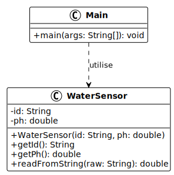
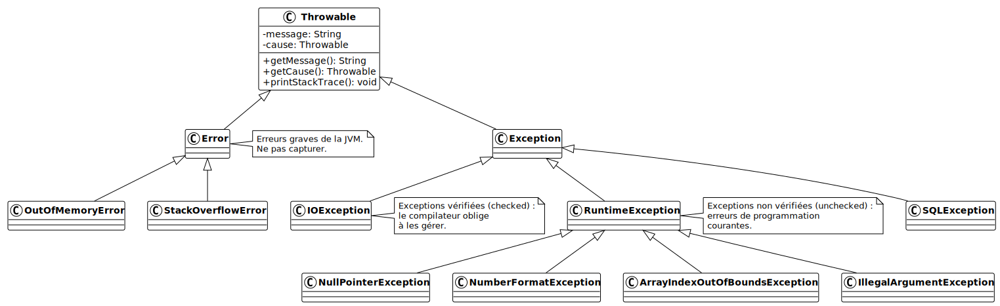
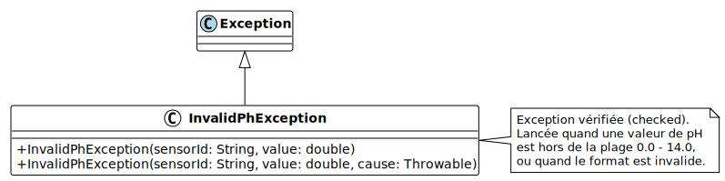

# Gestion des exceptions

V. Guidoux, avec l'aide de
[GitHub Copilot](https://github.com/features/copilot).

Ce travail est sous licence [CC BY-SA 4.0][licence].

> [!TIP]
>
> Voici quelques informations relatives à ce contenu.
>
> **Ressources annexes**
>
> - Autres formats du support de cours : [Présentation (web)][presentation-web]
>   · [Présentation (PDF)][presentation-pdf]
> - Exemples de code : [Accéder au contenu](./01-exemples-de-code/)
> - Exercices : [Accéder au contenu](./02-exercices/)
> - Mini-projet : [Accéder au contenu](./03-mini-projet/)
> - Quiz : [Accéder au contenu][quiz-web]
>
> **Objectifs**
>
> À l'issue de cette séance, les personnes qui étudient devraient être capables
> de :

> - Nommer les mots-clés Java liés à la gestion des exceptions : `try`, `catch`,
>   `finally`, `throw`, `throws`.
> - Lister les niveaux principaux de la hiérarchie des exceptions Java :
>   `Throwable`, `Error`, `Exception`, `RuntimeException`.
> - Expliquer ce qu'est une exception et son rôle dans un programme Java.
> - Décrire la hiérarchie des types d'exceptions en Java.
> - Différencier les exceptions vérifiées (checked) des exceptions non vérifiées
>   (unchecked).
> - Illustrer le flux d'exécution lors de la levée et de la capture d'une
>   exception.
> - Utiliser un bloc `try-catch` pour capturer une exception.
> - Employer plusieurs blocs `catch` pour traiter différents types d'exceptions.
> - Mettre en oeuvre le bloc `finally` pour garantir l'exécution de code de
>   nettoyage.
> - Appliquer le multi-catch pour simplifier la gestion de plusieurs exceptions.
> - Lancer une exception avec le mot-clé `throw`.
> - Déclarer les exceptions propagées avec `throws` dans la signature d'une
>   méthode.
> - Distinguer les situations où il faut capturer une exception de celles où il
>   faut la propager.
> - Comparer une exception personnalisée à une exception générique du JDK pour
>   choisir la plus adaptée.
> - Justifier la création d'une exception personnalisée dans un contexte métier
>   donné.
> - Concevoir une classe d'exception personnalisée héritant de `Exception`.
> - Implémenter les constructeurs appropriés dans une exception personnalisée.
>
> **Méthodes d'enseignement et d'apprentissage**
>
> Les méthodes d'enseignement et d'apprentissage utilisées pour animer la séance
> sont les suivantes :
>
> - Présentation magistrale.
> - Discussions collectives.
> - Travail en autonomie.
>
> **Méthodes d'évaluation**
>
> L'évaluation prend la forme d'exercices et d'un mini-projet à réaliser en
> autonomie en classe ou à la maison.
>
> L'évaluation se fait en utilisant les critères suivants :
>
> - Capacité à répondre avec justesse.
> - Capacité à argumenter.
> - Capacité à réaliser les tâches demandées.
> - Capacité à s'approprier les exemples de code.
> - Capacité à appliquer les exemples de code à des situations similaires.
>
> Les retours se font de la manière suivante :
>
> - Corrigé des exercices.
> - Corrigé du mini-projet.
>
> L'évaluation ne donne pas lieu à une note.

## Table des matières

- [Table des matières](#table-des-matières)
- [Objectifs](#objectifs)
- [Un programme fragile](#un-programme-fragile)
	- [Le système de surveillance de l'eau](#le-système-de-surveillance-de-leau)
	- [Un code sans gestion d'erreurs](#un-code-sans-gestion-derreurs)
	- [Ce que Java fait quand quelque chose se passe mal](#ce-que-java-fait-quand-quelque-chose-se-passe-mal)
- [La hiérarchie des exceptions en Java](#la-hiérarchie-des-exceptions-en-java)
	- [Throwable : la racine commune](#throwable--la-racine-commune)
	- [Error et Exception](#error-et-exception)
	- [Exceptions vérifiées et non vérifiées](#exceptions-vérifiées-et-non-vérifiées)
- [Capturer les exceptions](#capturer-les-exceptions)
	- [Le bloc try-catch](#le-bloc-try-catch)
	- [Plusieurs blocs catch et leur ordre](#plusieurs-blocs-catch-et-leur-ordre)
	- [Le multi-catch](#le-multi-catch)
	- [Le bloc finally](#le-bloc-finally)
- [Lancer des exceptions](#lancer-des-exceptions)
	- [Le mot-clé throw](#le-mot-clé-throw)
	- [Déclarer les exceptions avec throws](#déclarer-les-exceptions-avec-throws)
	- [Capturer ou propager ?](#capturer-ou-propager-)
- [Créer ses propres exceptions](#créer-ses-propres-exceptions)
	- [Pourquoi des exceptions personnalisées ?](#pourquoi-des-exceptions-personnalisées-)
	- [Créer une classe d'exception](#créer-une-classe-dexception)
	- [Implémenter les constructeurs](#implémenter-les-constructeurs)
- [Le système de surveillance robuste](#le-système-de-surveillance-robuste)
	- [Assembler les pièces](#assembler-les-pièces)
	- [Bonnes pratiques](#bonnes-pratiques)
- [Conclusion](#conclusion)
- [Aller plus loin](#aller-plus-loin)
- [Exemples de code](#exemples-de-code)
- [Exercices](#exercices)
- [Mini-projet](#mini-projet)
- [À faire pour la prochaine séance](#à-faire-pour-la-prochaine-séance)

## Objectifs

Ce contenu de cours a pour objectifs de permettre aux personnes qui étudient de
comprendre pourquoi et comment Java signale les situations imprévues, et
d'acquérir les outils pour écrire du code robuste face aux erreurs. Nous
partirons d'un programme qui plante de façon inexplicable pour construire
progressivement une gestion des erreurs claire et maîtrisée.

La liste complète des objectifs est disponible dans la section _"Objectifs"_ du
bloc d'information en haut de ce contenu.

## Un programme fragile

### Le système de surveillance de l'eau

L'accès à une eau potable de qualité est un enjeu écologique et social majeur.
Dans de nombreuses régions, la qualité de l'eau est surveillée en continu par
des réseaux de capteurs automatiques qui mesurent des paramètres comme le pH ou
la température.

Le programme que nous allons faire évoluer tout au long de cette séance simule
un capteur d'eau simplifié. Il contient deux classes dans un seul fichier :

- `WaterSensor` : représente un capteur d'eau avec un identifiant et une valeur
  de pH.
- `Main` : le programme principal qui utilise le capteur.

Le diagramme ci-dessous présente la structure initiale :



### Un code sans gestion d'erreurs

Voici le programme complet dans son état initial, sans aucune gestion d'erreurs
:

```java
class WaterSensor {
    private String id;
    private double ph;

    public WaterSensor(String id, double ph) {
        this.id = id;
        this.ph = ph;
    }

    public String getId() {
        return id;
    }

    public double getPh() {
        return ph;
    }
}

class Main {
    public static void main(String[] args) {
        WaterSensor sensor = new WaterSensor("PH-01", 7.2);
        System.out.println("Capteur : " + sensor.getId());
        System.out.println("pH : " + sensor.getPh());

        // Simulation d'un identifiant reçu depuis l'extérieur
        String rawIndex = "deux"; // valeur invalide
        int index = Integer.parseInt(rawIndex);
        System.out.println("Index : " + index);
    }
}
```

<details>
<summary>Description du code</summary>

La classe `WaterSensor` représente un capteur avec un identifiant (`id`) et une
valeur de pH (`ph`). La classe `Main` crée un capteur valide, affiche ses
informations, puis tente de convertir la chaîne `"deux"` en entier avec
`Integer.parseInt()`. Cette conversion va échouer car `"deux"` n'est pas un
nombre.

</details>

En exécutant ce programme, Java affiche dans le terminal :

```
Capteur : PH-01
pH : 7.2
Exception in thread "main" java.lang.NumberFormatException: For input string: "deux"
	at java.base/java.lang.NumberFormatException.forInputString(NumberFormatException.java:67)
	at java.base/java.lang.Integer.parseInt(Integer.java:668)
	at java.base/java.lang.Integer.parseInt(Integer.java:786)
	at Main.main(Main.java:23)
```

Le programme s'arrête brutalement à la ligne 23. Les deux premières lignes
s'affichent correctement, mais tout s'interrompt à la troisième. Dans un système
de surveillance réel, ce comportement serait inacceptable : un seul capteur
défaillant ne devrait pas faire tomber tout le réseau.

### Ce que Java fait quand quelque chose se passe mal

Java ne laisse pas un programme continuer à s'exécuter en silence quand quelque
chose d'anormal se produit. A la place, il crée un objet spécial qui représente
le problème : une exception. Cet objet est _lancé_ (thrown) et remonte la pile
d'appels de méthodes jusqu'à ce qu'il soit _capturé_ (caught) par un bloc de
gestion d'erreurs, ou jusqu'à ce qu'il atteigne le sommet de la pile et fasse
planter le programme.

Ce mécanisme garantit qu'aucune erreur ne passe silencieusement inaperçue.
L'objectif de cette séance est d'apprendre à intercepter ces exceptions, à les
comprendre, et à en créer de nouvelles pour exprimer clairement les problèmes
propres à notre domaine.

## La hiérarchie des exceptions en Java

### Throwable : la racine commune

En Java, toute situation anormale est représentée par un objet dont la classe
hérite de `Throwable`. C'est la racine de toute la hiérarchie des erreurs et
exceptions.



La hiérarchie se décompose ainsi :

- `Throwable` est la classe racine. Elle définit les attributs communs à toutes
  les situations anormales : un message descriptif, une cause optionnelle, et
  une trace de pile (stack trace).
- `Error` représente les erreurs graves liées à la JVM elle-même, comme un
  manque de mémoire (`OutOfMemoryError`) ou un débordement de pile d'appels
  (`StackOverflowError`).
- `Exception` représente les situations anormales que le programme peut, et
  souvent doit, gérer.
- `RuntimeException` est une sous-classe d'`Exception` pour les erreurs de
  programmation courantes : accès à `null` (`NullPointerException`), index hors
  limites (`ArrayIndexOutOfBoundsException`), conversion invalide
  (`NumberFormatException`), etc.

### Error et Exception

La première distinction importante est entre `Error` et `Exception`.

Les `Error` signalent que la JVM est dans un état tellement dégradé qu'il n'est
pas raisonnable de continuer. Un programme normal ne doit jamais tenter de
capturer une `Error` : on ne peut pas grand-chose contre un `OutOfMemoryError`,
et prétendre le gérer serait trompeur.

Les `Exception`, en revanche, représentent des situations anormales mais
prévisibles que le code peut traiter : une valeur de pH hors normes, un entier
mal formaté, un fichier de configuration absent.

### Exceptions vérifiées et non vérifiées

La deuxième distinction concerne les exceptions vérifiées (checked) et non
vérifiées (unchecked).

Les exceptions vérifiées héritent d'`Exception` (mais pas de
`RuntimeException`). Le compilateur Java les vérifie : si une méthode peut
lancer une exception vérifiée, le code appelant doit soit la capturer, soit
déclarer qu'il la propage avec `throws`. Cette vérification à la compilation est
un filet de sécurité : elle oblige à réfléchir à chaque point de défaillance
possible.

Les exceptions non vérifiées héritent de `RuntimeException`. Le compilateur ne
les vérifie pas. Elles signalent typiquement des erreurs de programmation qu'il
serait fastidieux de déclarer partout.

| Type               | Héritage           | Vérification | Exemples typiques                     |
| :----------------- | :----------------- | :----------- | :------------------------------------ |
| Vérifiée (checked) | `Exception`        | Compilateur  | `IOException`, `SQLException`         |
| Non vérifiée       | `RuntimeException` | Aucune       | `NullPointerException`, `NFException` |

> [!NOTE]
>
> La règle générale : les exceptions vérifiées s'utilisent pour des situations
> anormales mais prévisibles que l'appelant doit pouvoir gérer (fichier absent,
> réseau indisponible). Les exceptions non vérifiées s'utilisent pour des
> erreurs de programmation que l'on souhaite corriger à la source plutôt que
> gérer à chaque appel.

## Capturer les exceptions

### Le bloc try-catch

La structure de base pour capturer une exception est le bloc `try-catch`. Voici
le programme complet avec un premier `try-catch` autour de la conversion
problématique :

```java
class WaterSensor {
    private String id;
    private double ph;

    public WaterSensor(String id, double ph) {
        this.id = id;
        this.ph = ph;
    }

    public String getId() {
        return id;
    }

    public double getPh() {
        return ph;
    }
}

class Main {
    public static void main(String[] args) {
        WaterSensor sensor = new WaterSensor("PH-01", 7.2);
        System.out.println("Capteur : " + sensor.getId());
        System.out.println("pH : " + sensor.getPh());

        String rawIndex = "deux";

        try {
            int index = Integer.parseInt(rawIndex);
            System.out.println("Index : " + index);
        } catch (NumberFormatException e) {
            System.out.println(
                "Index invalide : '" + rawIndex + "' n'est pas un entier."
            );
        }

        System.out.println("Le programme continue.");
    }
}
```

<details>
<summary>Description du code</summary>

Le bloc `try` contient le code susceptible de provoquer une exception. Si
`Integer.parseInt(rawIndex)` échoue (parce que `rawIndex` ne contient pas un
entier valide), Java interrompt l'exécution du bloc `try` et cherche un bloc
`catch` correspondant. Le bloc `catch (NumberFormatException e)` déclare le type
d'exception attendu et un nom de variable `e` pour accéder à l'objet exception.
Le message d'erreur affiché est maintenant explicite et en français. Après le
bloc `try-catch`, le programme continue normalement.

</details>

En exécutant ce programme modifié :

```
Capteur : PH-01
pH : 7.2
Index invalide : 'deux' n'est pas un entier.
Le programme continue.
```

Le programme ne plante plus. L'objet exception `e` donne accès à des
informations utiles :

```java
catch (NumberFormatException e) {
    System.out.println("Message : " + e.getMessage());
    e.printStackTrace(); // Affiche la trace de pile complète dans la console
}
```

<details>
<summary>Description du code</summary>

La méthode `getMessage()` retourne le message décrivant l'exception. La méthode
`printStackTrace()` affiche dans la console la trace de pile complète : le type
de l'exception, son message, et la liste des méthodes traversées au moment du
lancement. Cette trace est précieuse pour diagnostiquer l'origine d'une erreur
pendant le développement.

</details>

### Plusieurs blocs catch et leur ordre

Un même bloc `try` peut être suivi de plusieurs blocs `catch`, chacun traitant
un type d'exception différent. Voici le programme avec deux sources d'erreurs
possibles :

```java
class WaterSensor {
    private String id;
    private double ph;

    public WaterSensor(String id, double ph) {
        this.id = id;
        this.ph = ph;
    }

    public String getId() {
        return id;
    }

    public double getPh() {
        return ph;
    }
}

class Main {
    public static void main(String[] args) {
        WaterSensor sensor = new WaterSensor("PH-01", 7.2);

        String rawIndex = "deux";
        String[] labels = {"alpha", "beta"};

        try {
            int index = Integer.parseInt(rawIndex);
            System.out.println("Label : " + labels[index]);
        } catch (NumberFormatException e) {
            System.out.println(
                "Index invalide : '" + rawIndex + "' n'est pas un entier."
            );
        } catch (ArrayIndexOutOfBoundsException e) {
            System.out.println("Index hors limites : " + e.getMessage());
        }

        System.out.println("Le programme continue.");
    }
}
```

<details>
<summary>Description du code</summary>

Deux types d'exceptions sont maintenant possibles dans le bloc `try` : une
`NumberFormatException` si `rawIndex` ne peut pas être converti en entier, et
une `ArrayIndexOutOfBoundsException` si l'index dépasse la taille du tableau
`labels`. Java parcourt les blocs `catch` dans l'ordre et exécute le premier
dont le type correspond à l'exception levée. Ici, c'est la
`NumberFormatException` qui est lancée, donc le deuxième `catch` est ignoré.

</details>

L'ordre des blocs `catch` est important : il faut toujours placer les types les
plus spécifiques avant les types plus généraux. Si l'on place
`catch (Exception e)` en premier, il capturerait toutes les exceptions et les
blocs suivants ne seraient jamais atteints. Le compilateur détecte cette erreur
et refuse de compiler.

### Le multi-catch

Depuis Java 7, il est possible de capturer plusieurs types d'exceptions dans un
seul bloc `catch` en les séparant par `|` :

```java
class WaterSensor {
    private String id;
    private double ph;

    public WaterSensor(String id, double ph) {
        this.id = id;
        this.ph = ph;
    }

    public String getId() {
        return id;
    }

    public double getPh() {
        return ph;
    }
}

class Main {
    public static void main(String[] args) {
        WaterSensor sensor = new WaterSensor("PH-01", 7.2);

        String rawIndex = "deux";
        String[] labels = {"alpha", "beta"};

        try {
            int index = Integer.parseInt(rawIndex);
            System.out.println("Label : " + labels[index]);
        } catch (NumberFormatException | ArrayIndexOutOfBoundsException e) {
            System.out.println("Données invalides : " + e.getMessage());
        }

        System.out.println("Le programme continue.");
    }
}
```

<details>
<summary>Description du code</summary>

Le bloc `catch` capture à la fois les `NumberFormatException` et les
`ArrayIndexOutOfBoundsException` et les traite de la même façon. La variable `e`
est du type effectif de l'exception réellement lancée au moment de l'exécution.
Cette syntaxe est utile quand le traitement à effectuer est identique pour
plusieurs types d'exceptions.

</details>

### Le bloc finally

Le bloc `finally` s'exécute toujours, qu'une exception ait été levée ou non. Il
est conçu pour le code de nettoyage qui doit s'exécuter dans tous les cas :

```java
class WaterSensor {
    private String id;
    private double ph;

    public WaterSensor(String id, double ph) {
        this.id = id;
        this.ph = ph;
    }

    public String getId() {
        return id;
    }

    public double getPh() {
        return ph;
    }
}

class Main {
    public static void main(String[] args) {
        WaterSensor sensor = new WaterSensor("PH-01", 7.2);

        String rawIndex = "deux";

        try {
            int index = Integer.parseInt(rawIndex);
            System.out.println("Index : " + index);
        } catch (NumberFormatException e) {
            System.out.println(
                "Index invalide : '" + rawIndex + "' n'est pas un entier."
            );
        } finally {
            System.out.println(
                "Fin de lecture du capteur " + sensor.getId() + "."
            );
        }

        System.out.println("Le programme continue.");
    }
}
```

<details>
<summary>Description du code</summary>

Le bloc `finally` est placé après le dernier bloc `catch`. Il est exécuté dans
tous les cas : si le bloc `try` se termine normalement, si une exception est
capturée par un bloc `catch`, ou même si une exception est levée mais non
capturée (le bloc `finally` s'exécute avant que l'exception remonte dans la pile
d'appels). Ici, le message de fin de lecture s'affiche toujours, quelle que soit
l'issue de la conversion.

</details>

> [!NOTE]
>
> Depuis Java 7, la syntaxe `try-with-resources` automatise la fermeture des
> ressources implémentant `AutoCloseable` (fichiers, connexions réseau, etc.).
> Elle est préférable au `finally` pour la gestion des ressources et est
> présentée dans la section _"Aller plus loin"_.

## Lancer des exceptions

### Le mot-clé throw

Pour signaler une situation anormale depuis le code, on utilise le mot-clé
`throw` suivi d'un objet exception. Ajoutons une validation dans le constructeur
de `WaterSensor` :

```java
class WaterSensor {
    private String id;
    private double ph;

    public WaterSensor(String id, double ph) {
        if (ph < 0.0 || ph > 14.0) {
            throw new IllegalArgumentException(
                "Valeur de pH invalide : " + ph
                + " (attendu entre 0.0 et 14.0)"
            );
        }
        this.id = id;
        this.ph = ph;
    }

    public String getId() {
        return id;
    }

    public double getPh() {
        return ph;
    }
}

class Main {
    public static void main(String[] args) {
        WaterSensor valid = new WaterSensor("PH-01", 7.2);
        System.out.println("Capteur créé : " + valid.getId());

        // Cette ligne va lancer une IllegalArgumentException
        WaterSensor invalid = new WaterSensor("PH-02", 99.0);
        System.out.println("Cette ligne ne s'affiche pas.");
    }
}
```

<details>
<summary>Description du code</summary>

Le constructeur de `WaterSensor` vérifie maintenant que le pH est dans la plage
valide (0.0 à 14.0). Si ce n'est pas le cas, une `IllegalArgumentException` est
créée avec un message explicite et lancée avec `throw`. L'exécution du
constructeur s'arrête immédiatement. L'appel `new WaterSensor("PH-02", 99.0)` va
donc planter à l'exécution avec un message clair indiquant que le pH est
invalide.

</details>

Le mot-clé `throw` est toujours suivi d'une instance d'exception créée avec
`new`. On peut créer l'objet et le lancer en une seule instruction, comme dans
l'exemple ci-dessus.

### Déclarer les exceptions avec throws

Quand une méthode peut lancer une exception vérifiée (checked), elle doit le
déclarer dans sa signature avec le mot-clé `throws`. Créons une méthode qui
simule la lecture d'une valeur depuis un capteur externe :

```java
class WaterSensor {
    private String id;
    private double ph;

    public WaterSensor(String id, double ph) {
        if (ph < 0.0 || ph > 14.0) {
            throw new IllegalArgumentException(
                "Valeur de pH invalide : " + ph
                + " (attendu entre 0.0 et 14.0)"
            );
        }
        this.id = id;
        this.ph = ph;
    }

    public String getId() {
        return id;
    }

    public double getPh() {
        return ph;
    }

    public double readFromString(String raw) throws Exception {
        double value = Double.parseDouble(raw);
        if (value < 0.0 || value > 14.0) {
            throw new Exception(
                "Valeur hors plage pour " + id + " : " + value
            );
        }
        return value;
    }
}

class Main {
    public static void main(String[] args) {
        WaterSensor sensor = new WaterSensor("PH-01", 7.2);

        try {
            double value = sensor.readFromString("8.5");
            System.out.println("Lecture : " + value);

            double bad = sensor.readFromString("15.0");
            System.out.println("Lecture : " + bad);
        } catch (Exception e) {
            System.out.println("Erreur de lecture : " + e.getMessage());
        }
    }
}
```

<details>
<summary>Description du code</summary>

La méthode `readFromString` déclare `throws Exception` dans sa signature. Cela
signifie qu'elle peut lancer une exception vérifiée et que le code appelant doit
soit la capturer avec un bloc `catch`, soit la propager à son tour. Le
compilateur vérifie cette contrainte et signale une erreur si elle n'est pas
respectée. La première lecture (`"8.5"`) réussit. La deuxième (`"15.0"`)
déclenche l'exception car la valeur est hors de la plage 0–14.

</details>

Note importante : `throw` (sans `s`) est utilisé dans le corps de la méthode
pour lancer une exception. `throws` (avec `s`) est utilisé dans la signature de
la méthode pour déclarer qu'elle peut en lancer.

### Capturer ou propager ?

Face à une exception, on a deux choix : la capturer immédiatement ou la laisser
remonter pour que l'appelant la gère.

On capture une exception quand :

- on peut réellement faire quelque chose d'utile (récupérer la situation,
  afficher un message adapté, retourner une valeur par défaut).
- on est dans la couche du code qui a le contexte nécessaire pour comprendre ce
  que l'erreur signifie.

On propage une exception quand :

- on ne sait pas quoi faire avec elle à ce niveau.
- l'appelant a plus de contexte pour décider comment réagir.
- il s'agit d'une erreur fondamentale que seul le code de plus haut niveau peut
  traiter.

> [!CAUTION]
>
> Capturer une exception et ne rien faire avec elle (bloc `catch` vide) est
> l'une des pires pratiques en Java. Elle cache les erreurs et rend le débogage
> extrêmement difficile. Si on capture une exception, on doit toujours faire
> quelque chose : afficher un message, journaliser l'erreur, lancer une autre
> exception ou rétablir un état cohérent.

## Créer ses propres exceptions

### Pourquoi des exceptions personnalisées ?

Les exceptions du JDK (`IllegalArgumentException`, `IOException`, etc.) sont
génériques. Elles décrivent un type de problème technique, mais ne disent rien
du domaine métier concerné.

Dans notre système de surveillance de l'eau, utiliser `Exception` quand une
valeur de pH est hors normes est fonctionnel, mais peu expressif. Un
`catch (Exception e)` quelque part dans le code ne dit pas clairement : "ici, je
gère un problème de lecture de capteur".

Les exceptions personnalisées permettent d'exprimer les problèmes dans le
vocabulaire du domaine. Elles rendent le code plus lisible, les messages
d'erreur plus précis, et les blocs `catch` plus intentionnels.

### Créer une classe d'exception

Une exception personnalisée est une classe qui hérite d'`Exception` (pour une
exception vérifiée) ou de `RuntimeException` (pour une exception non vérifiée).

Le diagramme ci-dessous présente la hiérarchie des exceptions personnalisées du
système :



Voici la classe `InvalidPhException` :

```java
class InvalidPhException extends Exception {

    public InvalidPhException(String sensorId, double value) {
        super(
            "Valeur de pH hors plage pour le capteur "
            + sensorId + " : " + value
            + " (attendu entre 0.0 et 14.0)"
        );
    }

    public InvalidPhException(
            String sensorId, double value, Throwable cause) {
        super(
            "Valeur de pH hors plage pour le capteur "
            + sensorId + " : " + value
            + " (attendu entre 0.0 et 14.0)",
            cause
        );
    }
}
```

<details>
<summary>Description du code</summary>

La classe `InvalidPhException` hérite d'`Exception`, ce qui en fait une
exception vérifiée. Le premier constructeur accepte l'identifiant du capteur et
la valeur invalide, et appelle `super(message)` pour transmettre un message
descriptif à la classe parente. Le second constructeur accepte en plus une cause
originale (`Throwable cause`) pour le chaînage d'exceptions : il permet de ne
pas perdre l'information sur l'erreur d'origine quand on encapsule une exception
dans une autre.

</details>

### Implémenter les constructeurs

La convention pour les exceptions Java est de toujours fournir au minimum ces
deux constructeurs :

1. `MyException(...)` : pour créer une exception avec un message explicatif.
2. `MyException(..., Throwable cause)` : pour créer une exception en précisant
   la cause originale (chaînage d'exceptions).

Le chaînage d'exceptions est important : il permet de ne pas perdre
l'information de la cause originale quand on encapsule une exception dans une
autre.

## Le système de surveillance robuste

### Assembler les pièces

Nous avons maintenant tous les outils pour rendre notre programme robuste. Voici
le programme complet, transformé étape par étape :

```java
class InvalidPhException extends Exception {

    public InvalidPhException(String sensorId, double value) {
        super(
            "Valeur de pH hors plage pour le capteur "
            + sensorId + " : " + value
            + " (attendu entre 0.0 et 14.0)"
        );
    }

    public InvalidPhException(
            String sensorId, double value, Throwable cause) {
        super(
            "Valeur de pH hors plage pour le capteur "
            + sensorId + " : " + value
            + " (attendu entre 0.0 et 14.0)",
            cause
        );
    }
}

class WaterSensor {
    private String id;
    private double ph;

    public WaterSensor(String id, double ph)
            throws InvalidPhException {
        if (ph < 0.0 || ph > 14.0) {
            throw new InvalidPhException(id, ph);
        }
        this.id = id;
        this.ph = ph;
    }

    public String getId() {
        return id;
    }

    public double getPh() {
        return ph;
    }

    public double readFromString(String raw)
            throws InvalidPhException {
        double value;
        try {
            value = Double.parseDouble(raw);
        } catch (NumberFormatException e) {
            throw new InvalidPhException(id, Double.NaN, e);
        }
        if (value < 0.0 || value > 14.0) {
            throw new InvalidPhException(id, value);
        }
        return value;
    }
}

class Main {
    public static void main(String[] args) {
        String[] readings = {"7.2", "13.5", "abc", "8.1"};

        for (String raw : readings) {
            try {
                WaterSensor sensor = new WaterSensor("PH-01", 7.0);
                double value = sensor.readFromString(raw);
                System.out.println("Lecture OK : pH = " + value);
            } catch (InvalidPhException e) {
                System.out.println("ALERTE : " + e.getMessage());
            } finally {
                System.out.println("--- fin de lecture ---");
            }
        }
    }
}
```

<details>
<summary>Description du code</summary>

La classe `InvalidPhException` est définie en premier. Elle hérite d'`Exception`
et fournit deux constructeurs : un avec message simple, un avec cause chainée.

La classe `WaterSensor` utilise maintenant `InvalidPhException` dans deux
endroits : dans le constructeur (pour valider la valeur initiale) et dans
`readFromString` (pour valider une valeur lue depuis une chaîne). Dans
`readFromString`, si `Double.parseDouble` échoue, la `NumberFormatException` est
capturée et encapsulée dans une `InvalidPhException` avec la cause originale
(chaînage d'exceptions).

La boucle dans `Main` tente de lire quatre valeurs : `"7.2"` (valide), `"13.5"`
(pH hors plage), `"abc"` (format invalide), `"8.1"` (valide). Pour chacune, le
bloc `catch` affiche un message d'alerte en cas d'erreur, et le bloc `finally`
affiche un séparateur. Le programme ne plante jamais et traite toutes les
valeurs.

</details>

En exécutant ce programme :

```
Lecture OK : pH = 7.2
--- fin de lecture ---
ALERTE : Valeur de pH hors plage pour le capteur PH-01 : 13.5 (attendu entre 0.0 et 14.0)
--- fin de lecture ---
ALERTE : Valeur de pH hors plage pour le capteur PH-01 : NaN (attendu entre 0.0 et 14.0)
--- fin de lecture ---
Lecture OK : pH = 8.1
--- fin de lecture ---
```

Comparons avec le programme initial : là où le programme plantait brutalement
sans explication, il affiche maintenant des messages clairs, distincts selon le
type de problème, et continue à traiter les lectures restantes.

### Bonnes pratiques

Quelques règles qui guident une bonne gestion des exceptions :

- Ne jamais capturer une exception sans la traiter. Un bloc `catch` vide est
  pire qu'une absence de gestion.
- Capturer le type d'exception le plus précis possible. Eviter
  `catch (Exception e)` sauf dans les cas où l'on veut vraiment tout capturer
  (journalisation au niveau le plus haut, par exemple).
- Ne pas utiliser les exceptions pour le flux normal de contrôle. Les exceptions
  sont pour les situations anormales, pas pour remplacer un `if`.
- Préférer les exceptions personnalisées pour le code métier, afin d'exprimer
  les erreurs dans le vocabulaire du domaine.
- Toujours inclure la cause originale lors du chaînage d'exceptions, pour ne pas
  perdre d'information lors du diagnostic.
- Documenter les exceptions lancées par une méthode avec la balise `@throws`
  dans la Javadoc.

## Conclusion

La gestion des exceptions est une composante essentielle d'un code Java robuste.
Elle permet de séparer le code qui traite le cas normal du code qui traite les
situations anormales, rendant chacun plus clair et plus maintenable.

Les mécanismes vus dans cette séance sont :

- `try-catch` pour capturer et traiter une exception.
- `catch` multiples et multi-catch pour distinguer les types d'exceptions.
- `finally` pour le code qui doit s'exécuter dans tous les cas.
- `throw` pour lancer une exception.
- `throws` pour déclarer qu'une méthode peut lancer une exception vérifiée.
- Les exceptions personnalisées pour exprimer les erreurs dans le vocabulaire du
  domaine.

La question "faut-il capturer ou propager ?" sera une constante dans la
pratique. Il n'y a pas de réponse universelle : elle dépend du contexte, de la
couche dans laquelle on se trouve, et de qui est le mieux placé pour décider
quoi faire de l'erreur.

## Aller plus loin

Pour approfondir la gestion des exceptions en Java :

- [The Java Tutorials - Exceptions (Oracle)](https://docs.oracle.com/javase/tutorial/essential/exceptions/)
- [Try-with-resources (Oracle)](https://docs.oracle.com/javase/tutorial/essential/exceptions/tryResourceClose.html)
- _Effective Java_, Joshua Bloch (3e édition) :
  - Item 69 : Use exceptions only for exceptional conditions.
  - Item 70 : Use checked exceptions for recoverable conditions and runtime
    exceptions for programming errors.
  - Item 72 : Favor the use of standard exceptions.
  - Item 77 : Don't ignore exceptions.

## Exemples de code

Nous vous invitons à consulter les exemples de code associés à ce contenu de
cours pour mieux comprendre les concepts abordés.

Vous trouverez les exemples de code ici :
[Exemples de code](./01-exemples-de-code/).

## Exercices

Nous vous invitons maintenant à réaliser les exercices de la séance afin de
mettre en pratique les concepts abordés.

Vous trouverez les exercices et leur corrigé ici : [Exercices](./02-exercices/).

## Mini-projet

Nous vous invitons maintenant à réaliser le mini-projet de la séance afin de
mettre en pratique les concepts abordés.

Vous trouverez les détails du mini-projet ici :
[Mini-projet](./03-mini-projet/).

## À faire pour la prochaine séance

Chaque personne est libre de gérer son temps comme elle le souhaite. Cependant,
il est recommandé pour la prochaine séance de :

- Relire le support de cours si nécessaire.
- Relire les exemples de code et leur description pour bien comprendre les
  concepts.
- Finaliser les exercices qui n'ont pas été terminés en classe.
- Finaliser la partie du mini-projet qui n'a pas été terminée en classe.

<!-- URLs -->

[licence]:
	https://github.com/heig-vd-progim-course/heig-vd-progim2-course/blob/main/LICENSE.md
[quiz-web]:
	https://heig-vd-progim-course.github.io/heig-vd-progim2-course/01-contenus-du-cours/11-gestion-des-exceptions/quiz.html
[presentation-web]:
	https://heig-vd-progim-course.github.io/heig-vd-progim2-course/01-contenus-du-cours/11-gestion-des-exceptions/presentation.html
[presentation-pdf]:
	https://heig-vd-progim-course.github.io/heig-vd-progim2-course/01-contenus-du-cours/11-gestion-des-exceptions/11-gestion-des-exceptions-presentation.pdf
